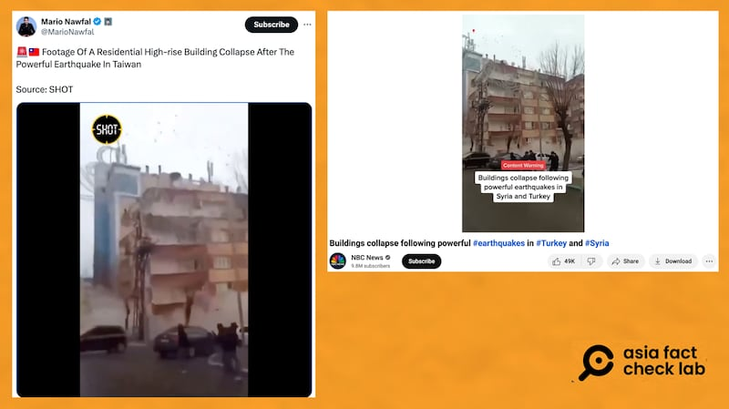
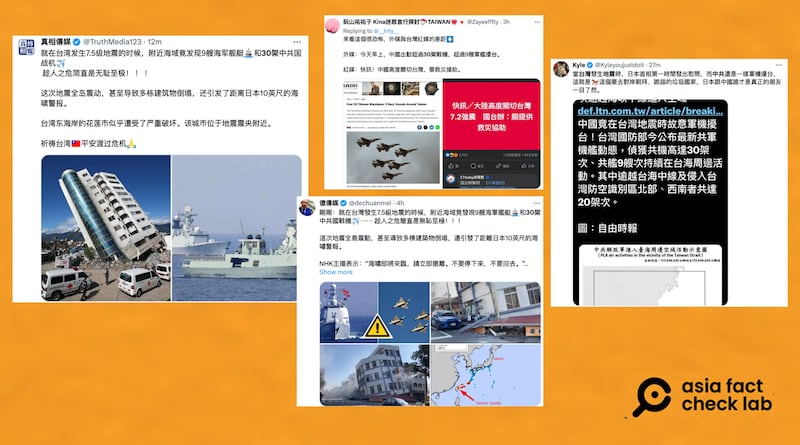

# 事實快查｜網傳畫面中臺灣民宅因地震倒塌？ 中國趁地震派30架軍機擾臺？

作者：莊敬

2024.04.03 18:53 EDT

當地時間4月3日上午7時58分，臺灣發生里氏7.4級強震（USGS美國地質調查局數據）。 網路上隨即流傳許多地震相關的影像與信息，但其中不少爲錯假資訊。 亞洲事實查覈實驗室查覈了以下兩則。

## 一，網傳民宅倒塌影像是臺灣地震畫面嗎？

## 標籤：錯誤

在X平臺(原推特)上擁有130多萬追蹤者,並有"藍勾勾"認證的帳號"Mario Nawfal",發佈多則與臺灣地震相關的影像與信息,其中一則是 ["臺灣強震後高樓住宅倒塌的畫面"](https://twitter.com/MarioNawfal/status/1775384458092277944),搭配的11秒短視頻顯示,一棟土黃色的建築物倒塌,附近人車趕緊閃躲。

經查，這則畫面與4月3日在臺灣發生的強震無關。

以"地震"、"民宅"、"倒塌"等英文關鍵字查詢後,找到 [NBC News](https://youtube.com/watch?v=H0WCD61JnfM)、 [CBS News](https://www.youtube.com/watch?v=BpwJeXrC5Kg)等媒體曾發佈相似的影像,是2023年2月發生在土耳其-敘利亞強震的新聞畫面。

X平臺帳號在4月3日發佈所謂臺灣強震造成住宅倒塌的影像（左圖）。 經查這是2023年2月土耳其-敘利亞強震的畫面（右圖）。（X、YouTube截圖）

此外,"Mario Nawfal"同天發佈的 [另一則帖文](https://twitter.com/MarioNawfal/status/1775364175801290826),談論在臺灣地震前,有中國軍機繞臺的事件,文中搭配一張大樓傾斜的照片,然而,該畫面也不是本次地震後的受災場面,而是2018年2月臺灣花蓮發生地震, [當地雲門翠堤大樓倒塌](https://news.ltn.com.tw/news/life/breakingnews/2335061)的畫面。 另一個認證帳號"真相傳媒"也使用了同一張雲門翠堤大樓倒塌的照片。

## 二，臺灣強震之際 30架中國軍機擾臺？

## 標籤：誤導

“真相傳媒”等多個X平臺帳號，在4月3日發文，聲稱“就在臺灣發生7.5級地震時，附近海域竟發現9艘海軍艦艇和30架中共國戰機。趁人之危簡直是無恥至極！”

部分網民在社媒上發文，指中國在臺灣地震之際派軍機擾臺。 不過，根據臺灣國防部公佈的資訊，這是在臺灣地震之前的解放軍動態。（X截圖）

這個說法是誤導受衆，以爲中國在臺灣強震當下或之後派軍機擾臺，部分網民藉此散佈這是“人造地震”的陰謀論。

不過,根據 [臺灣國防部](https://twitter.com/MoNDefense/status/1775342127184318906/photo/1)在4月3日上午9點公佈的資訊,上述中國軍隊在臺海周邊海、空域動態的時間爲4月2日上午6時至4月3日上午6時。 也就是說,這是發生在4月3日臺灣強震之前。

*亞洲事實查覈實驗室（Asia Fact Check Lab）針對當今複雜媒體環境以及新興傳播生態而成立。我們本於新聞專業主義，提供專業查覈報告及與信息環境相關的傳播觀察、深度報道，幫助讀者對公共議題獲得多元而全面的認識。讀者若對任何媒體及社交軟件傳播的信息有疑問，歡迎以電郵afcl@rfa.org寄給亞洲事實查覈實驗室，由我們爲您查證覈實。*

*亞洲事實查覈實驗室在X、臉書、IG開張了,歡迎讀者追蹤、分享、轉發。X這邊請進:中文*  [*@asiafactcheckcn*](https://twitter.com/asiafactcheckcn)  *;英文:*  [*@AFCL\_eng*](https://twitter.com/AFCL_eng)  *、*  [*FB在這裏*](https://www.facebook.com/asiafactchecklabcn)  *、*  [*IG也別忘了*](https://www.instagram.com/asiafactchecklab/)  *。*

[Original Source](https://www.rfa.org/mandarin/shishi-hecha/hc-04032024184543.html)