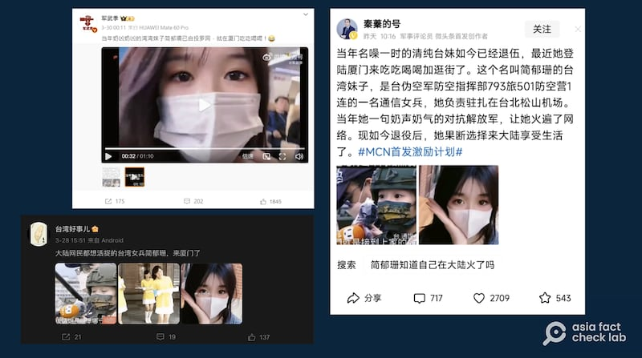
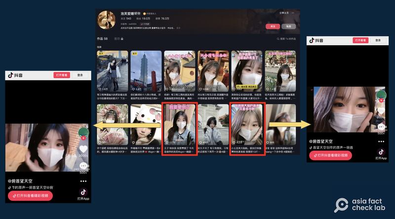

# 事實查覈｜中國網民想“活捉”的臺灣女兵“自投羅網”到廈門旅遊？

作者：董喆、艾倫

2024.04.04 15:05 EDT

## 標籤：錯誤

## 一分鐘完讀：

近期有微博傳言稱，臺灣一名女通信兵退伍後赴廈門旅遊並拍攝影片，被網民嘲諷“不用捉她，自己就來了”。幾年前，臺灣一名通信兵簡鬱珊曾因可愛的外貌和聲音成爲中國的網絡熱點，一些中國網民曾藉着反臺情緒聲稱要“活捉她”。亞洲事實查覈實驗室查證，微博廣傳的影片剪輯自抖音號“泡芙愛睡懶覺”，該賬號已公開否認自己是軍人。臺灣國防部空軍司令部也回應，當事女兵尚未退伍，近期也未出國，並已向本人求證，並非影片中人。

## 深度分析：

“當年奶兇奶兇的灣灣妹子簡鬱珊已自投羅網，就在廈門喫喫喝喝！”微博軍事“大V”軍武季發表一段影片，片中一名戴着口罩的女子說：“終於要從臺灣去大陸了”，傳言稱她是臺灣通信兵簡鬱珊，退伍後當起網紅，意在營造臺灣退役軍人愉快赴中國旅遊的形象。

不單是軍武季, [X](https://twitter.com/swyxy4484/status/1774028649504604369)、 [TikTok](https://www.tiktok.com/@q481395673/video/7352112243175165226)、 [微博](https://weibo.com/tv/show/1034:5017557611249673?from=old_pc_videoshow)等平臺都出現了"簡鬱珊自投羅網"的消息。今日頭條軍事評論員"秦蓁的號"更稱"當年她一句奶聲奶氣的對抗解放軍,讓她火遍了網絡。現如今退役後,她果斷選擇來大陸享受生活了。"

中國社羣平臺謠傳臺灣通信兵簡鬱珊退伍後當起網紅，營造臺灣退役軍人愉快赴中旅遊的形象。（圖截取自微博等平臺）

## 簡鬱珊是誰？

2022年1月,臺灣電視臺民視報道臺灣松山機場空軍防炮部隊演練,當時空軍防空第501營第一連通信上兵簡鬱珊 [接受採訪](https://www.ftvnews.com.tw/news/detail/2022131R13M1),並因外貌和聲音甜美可愛在中國互聯網成爲熱點。

同年8月,美國前衆議長佩洛西訪臺,中國以圍臺軍演反制,網絡民族主義情緒也再度高漲。有中國網友再次提起簡鬱珊,開始出現"這麼可愛的臺灣女兵,一定要捉活的"、"踏平阿里山,活捉簡鬱珊"的口號,此事亦有 [臺灣媒體報道](https://video.udn.com/news/1243892)。

2024年3月底，一名臺灣女子搭乘小三通赴廈門旅遊的影片，再度掀起對通信兵簡鬱珊的討論。

## “簡鬱珊赴廈門旅遊”的影片從何來？

亞洲事實查覈實驗室根據影片左上浮水印，發現這些微博使用的片段皆出自抖音號“俯首望天空”，該抖音號於2024年3月24日上傳“簡鬱珊赴中國旅遊”的影片，是目前可追溯的最早發佈者。

爲了尋找“俯首望天空”使用的影片素材出自於何處，我們以“臺灣人”“小三通”“旅遊”等關鍵字在抖音搜尋，找到了另一抖音號“泡芙愛睡懶覺”，其1月8日及1月26日發佈的兩支影片，影片的主角是賬號擁有者本人，正是所謂“簡鬱珊赴廈門旅遊”的原始素材來源。

中國社羣平臺謠傳臺灣通信兵簡鬱珊退伍後當起網紅，營造臺灣退役軍人愉快赴中旅遊的形象。（圖截取自微博等平臺）

由此可見，“女兵自投羅網”的傳言是由抖音號“俯首望天空”剪輯了抖音號“泡芙愛睡懶覺”的旅遊影片，再被轉傳至中國各大社羣平臺。

“泡芙愛睡懶覺”的抖音號是否由簡鬱珊經營？影片留言中也出現了中國網民提問“他們說你是簡鬱珊，到底是不是？”作者親自回應：“不是啦”。

## 臺灣國防部回應：簡鬱珊並未到訪中國

亞洲事實查覈實驗室亦向臺灣國防部空軍司令部求證，其公共事務處回應稱，簡鬱珊目前仍在軍中服役，所屬單位與2022年的報道相同，隸屬空軍防空第501營第一連。空軍司令部亦向簡鬱珊本人求證，她否認自己是影片中的女子，近期也未到訪中國。

*亞洲事實查覈實驗室（Asia Fact Check Lab）針對當今複雜媒體環境以及新興傳播生態而成立。我們本於新聞專業主義，提供專業查覈報告及與信息環境相關的傳播觀察、深度報道，幫助讀者對公共議題獲得多元而全面的認識。讀者若對任何媒體及社交軟件傳播的信息有疑問，歡迎以電郵afcl@rfa.org寄給亞洲事實查覈實驗室，由我們爲您查證覈實。*

*亞洲事實查覈實驗室在X、臉書、IG開張了,歡迎讀者追蹤、分享、轉發。X這邊請進:中文*  [*@asiafactcheckcn*](https://twitter.com/asiafactcheckcn)  *;英文:*  [*@AFCL\_eng*](https://twitter.com/AFCL_eng)  *、*  [*FB在這裏*](https://www.facebook.com/asiafactchecklabcn)  *、*  [*IG也別忘了*](https://www.instagram.com/asiafactchecklab/)  *。*

[Original Source](https://www.rfa.org/mandarin/shishi-hecha/hc-04042024150530.html)