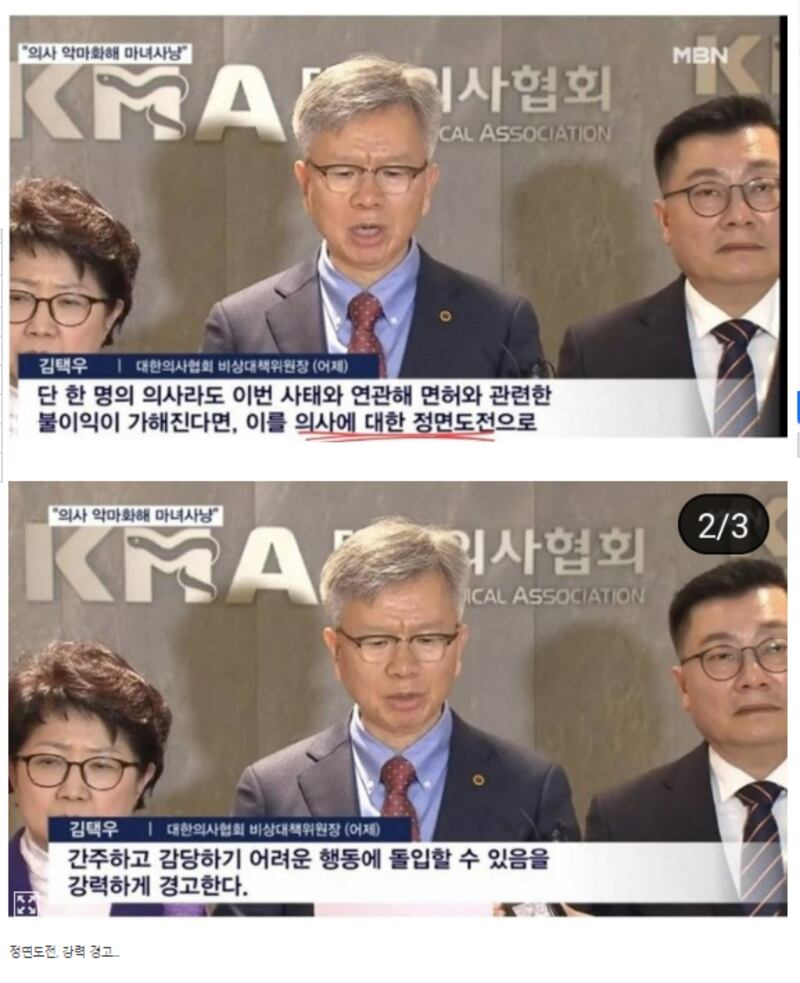
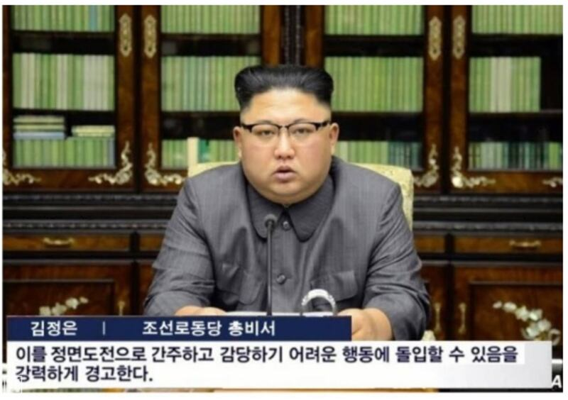

# 事實查覈｜韓國最大醫療協會主席“學舌”金正恩？

作者：Taejun Kang

2024.04.05 15:34 EDT

## 標籤：錯誤

## 一分鐘完讀

韓國社羣媒體近日流傳一則貼文，聲稱韓國最大醫學協會（大韓醫師協會緊急委員會，以下簡稱醫協）主席，模仿了朝鮮領導人金正恩的措辭。該貼文附有一張金正恩的圖片，上面疊加了虛假的引語，造成二人說了同樣的話的假象。這張金正恩的照片發佈於2017年9月，當時他批評了時任美國總統唐納德·特朗普。該醫學協會負責人講話內容與金正恩當時那段講話並沒有任何相似之處。

## 深度解析

爲了抗議政府增加醫學院學生名額，韓國醫協及執業醫師從二月中發起抗議，行動包括罷工及辭職。韓國政府此前向罷工醫師提出最後通牒，要求他們在2月29日前復工，但抗議醫師拒絕。接着在3月5日，韓國政府宣佈吊銷罷工人員的執照，雙方對抗至今仍在僵持。

醫界的抗議引發社會激烈爭論,就在此時, [一則貼文](https://www.ppomppu.co.kr/zboard/view.php?id=freeboard&no=8680264)在線上論壇Ppomppu上大量分享、轉貼。Ppomppu擁有超過260萬名會員,在韓國廣受歡迎。

這則貼文先以強烈的言詞寫道：“直接挑戰，強烈警告……以前經常看到類似的評論”，並附上3張圖片。其中兩張似乎是大韓醫師協會緊急委員會主席金澤宇在記者會時的畫面，圖片下方的說明，引述金澤宇的話：“即使只有1名醫生因這起事件而受到執照方面的處罰，我們也會將其視爲對醫生的直接挑戰，並強烈警告可能會採取難以應對的行動。”

在Ppomppu 上流傳的兩張圖片，上圖附帶的文字是“即使只有1名醫生因這起事件而受到執照方面的處罰，我們也會將其視爲對醫生的直接挑戰。”下圖爲“強烈警告可能會採取難以應對的行動。”（本圖截取自Ppomppu ，截取時間爲2024年3月19日。）

第3張圖片則是金正恩，下方附帶文字是：“我們認爲這是直接挑戰，並強烈警告可能會採取難以應對的行動。”

在Ppomppu 上流傳的圖片。（本圖截取自Ppomppu ，截取時間爲2024年3月19日。）

貼文將金澤宇的講話和金正恩對比，致使部分社羣媒體用戶認爲兩者言論相似，意味着金澤宇受到朝鮮的影響。有些社媒用戶直接以貶義詞稱金澤宇是朝鮮或共產主義的支持者，甚至指控金澤宇背後就是朝鮮在指導。

## 金正恩說了什麼？

透過谷歌反向圖像搜尋功能可知，上述提到的金正恩照片，與朝鮮官媒朝中社於2017年9月22日發佈的照片​​一致，路透社當天也發佈了一張相同的照片，說明打着：“朝鮮中央通訊社（KCNA）於2017年9月22日在平壤發佈了這張未註明日期的照片，朝鮮領導人金正恩針對美國總統特朗普在聯合國大會的講話發表了聲明。”

當時，特朗普威脅要“徹底摧毀朝鮮”，還將朝鮮的領導人稱爲“火箭人”。

亞洲事實查覈實驗室檢視了朝中社以英文、韓文發表的聲明後發現，沒有任何部分與社交媒體引用圖片中的字幕相符。

## 金澤宇說了什麼？

谷歌關鍵字搜尋則發現，金澤宇確實在2月17日的記者會發表了以上言論，用來回應韓國政府的警告，即抗議醫生若不重返工作崗位，政府可能會取消他們的醫療執照。

韓國YTN電視臺於2月17日發佈了 [記者會的片段](https://www.youtube.com/watch?v=fUz5nbyGhUA),對應部分則從影片的第22秒處開始。其他一些韓國 [新聞媒體](https://www.mk.co.kr/news/it/10945472)和 [醫療行業媒體](https://www.doctorsnews.co.kr/news/articleView.html?idxno=153457),也報道了他的聲明。

*亞洲事實查覈實驗室（Asia Fact Check Lab）針對當今複雜媒體環境以及新興傳播生態而成立。我們本於新聞專業主義，提供專業查覈報告及與信息環境相關的傳播觀察、深度報道，幫助讀者對公共議題獲得多元而全面的認識。讀者若對任何媒體及社交軟件傳播的信息有疑問，歡迎以電郵afcl@rfa.org寄給亞洲事實查覈實驗室，由我們爲您查證覈實。*

*亞洲事實查覈實驗室在X、臉書、IG開張了,歡迎讀者追蹤、分享、轉發。X這邊請進:中文*  [*@asiafactcheckcn*](https://twitter.com/asiafactcheckcn)  *;英文:*  [*@AFCL\_eng*](https://twitter.com/AFCL_eng)  *、*  [*FB在這裏*](https://www.facebook.com/asiafactchecklabcn)  *、*  [*IG也別忘了*](https://www.instagram.com/asiafactchecklab/)  *。*

[Original Source](https://www.rfa.org/mandarin/shishi-hecha/hc-04052024153409.html)