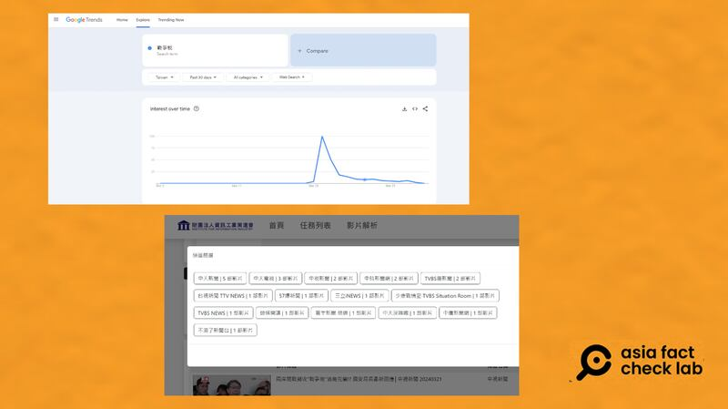
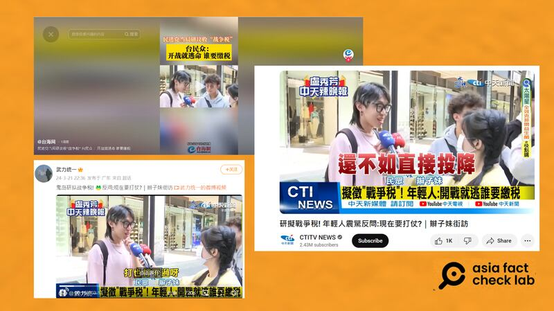
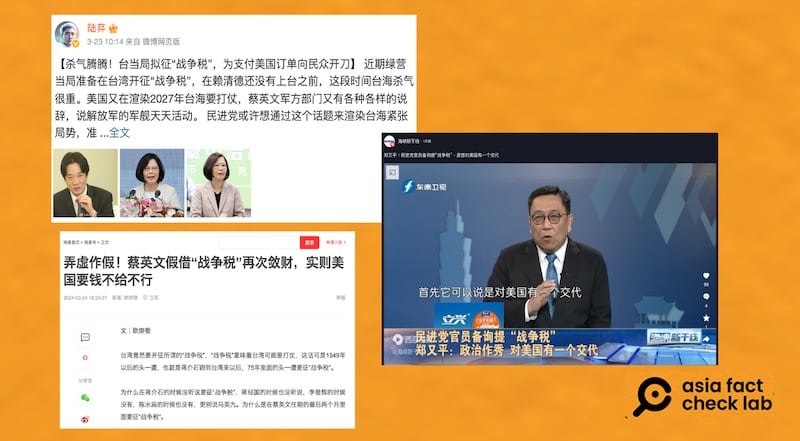

# 傳播觀察｜從"戰爭稅"走向"疑美論"的傳播路徑

作者：莊敬

2024.04.08 18:06 EDT

臺灣是否會開徵“戰爭稅”？這個問題在3月20日佔據了各大臺灣媒體版面，併成爲當地政論節目焦點，但在臺灣政府各單位相繼澄清、說明後，話題熱度逐漸下降。 然而，消息轉傳進中國輿論場後卻有升溫的趨勢，甚至延燒一週之久，中國國臺辦發言人27日在記者會上回應有關“戰爭稅”的問題時，批評民進黨蓄意製造緊張對抗。

亞洲事實查覈實驗室注意到，過去這段時間，有部分中國媒體與社媒用戶在傳播“戰爭稅”爭議時，以延伸解讀、錯誤鏈接等方式，無端將臺美關係捲入其中，藉着 “戰爭稅”擴大傳播“疑美論”。

## "戰爭稅"爭議

3月20日,臺灣立法委員賴士葆 [質詢](https://www.youtube.com/watch?v=ZPl0o5xjik0)財政部長莊翠雲,關切"金融兵推",也就是一旦兩岸開戰,政府是否有相應的財政政策。 賴士葆問:"有沒有討論到如果打仗,我們可能要加稅?"莊翠雲說:"也許,這部分可能是考慮的一個項目。這涉及到戰費的籌措。"賴士葆接着說:"戰費資金的籌措,那就可能加稅囉!"莊翠雲答覆:"稅或費,對。"

兩岸關係緊張之際,臺灣政府"可能考慮"徵收"戰爭稅"一說,引起高度關注。 臺灣 [行政院](https://www.ey.gov.tw/Page/AF73D471993DF350/c8d9104b-3182-4b15-87e1-e5f1cfb6dc5e)與 [財政部](https://www.mof.gov.tw/singlehtml/384fb3077bb349ea973e7fc6f13b6974?cntId=f3cd5cd717b04190b17b4b974dd95f34#a_C)21日隨即澄清,表示驗證財力等動員運作機制,是確保國家安全的例行性備案,"現階段並無報導所稱爲籌軍費,研議戰爭稅(費)的徵收問題 。"

幾乎在同一時間,有另一則引發關注的消息,是美國印太司令 [阿奎利諾](https://www.bloomberg.com/news/articles/2024-03-20/china-on-track-to-be-ready-for-taiwan-invasion-by-2027-us-says)(John Aquilino)20日在美國國會聽證會上提及,所有跡象表明,中國堅持達成在2027年之前,做好入侵臺灣準備的野心。 中國外交部發言人林劍21日回應,堅決反對美國國內一些人企圖渲染"中國威脅論"。

其實,早在2021年,時任美國印太司令戴維森(Philip Davidson)就提出 [如此預測](https://news.usni.org/2021/03/09/davidson-china-could-try-to-take-control-of-taiwan-in-next-six-years),也因此2027年中國攻臺的時間點,被外界稱爲"戴維森窗口"。 但是這次,美國再度示警2027年中國攻臺的新聞,恰巧遇上臺灣政府研擬徵收"戰爭稅"的消息,媒體將兩者同步報道、討論,更加深了臺海兵兇戰危的氛圍。

"戰爭稅"引發臺灣民衆擔憂,成了政治攻防戰,部分政治人物、評論人士批評民進黨政府"和平保臺破功"。 而中國的《 [環球網](https://taiwan.huanqiu.com/article/4H4HXhqI8Mx)》、 [《大公報](http://www.takungpao.com.hk/news/232110/2024/0322/954480.html)》等媒體,也在事件初期報道了"戰爭稅"爭議,並藉由引述臺灣媒體、民衆的說法,宣傳"臺灣當局應改善兩岸關係才能避免戰爭"。

## "戰爭稅"話題 兩岸熱度有差異

值得注意的是“戰爭稅”話題的後續傳播，無論是議題熱度或內容，在兩岸都有所差異。 根據亞洲事實查覈實驗室觀察，“戰爭稅”議題雖源自臺灣，但多數臺灣媒體與社媒僅在事件初期一兩天高度關注“戰爭稅”，之後討論愈來愈少，反而是中國方面持續討論。

[Google搜尋趨勢](https://trends.google.com/trends/explore?date=today%201-m&geo=TW&q=%E6%88%B0%E7%88%AD%E7%A8%85&hl=en)顯示,臺灣社會對於"戰爭稅"的關注,在3月20日至22日之間達到高峯,之後逐漸減弱。 臺灣資策會的影音解析系統中,在3月18日至4月2日之間,可查到24部與"戰爭稅"相關的影音,發佈時間多在3月21日。

觀測工具顯示，臺灣社會對“戰爭稅”的關注，在3月20日至22日達到高峯，之後逐漸減弱。 （上圖爲Google Trends、下圖爲資策會影音解析系統）

資策會系統找到的24部影音中,有13部出自臺灣的旺旺中時媒體集團旗下電視臺,內容大致爲相關新聞報道與政論節目片段。 其中,傳播較廣的是中天新聞 ["辮子妹街訪"](https://www.youtube.com/watch?v=MK1i2MKau4Y),受訪的年輕人聽到政府研擬"戰爭稅",直說:"反正也打不贏,還不如直接投降"。 這段街訪被中國官媒與社媒用戶廣爲轉發,包括在抖音擁有1800多萬粉絲的中國官媒 ["臺海網"](https://www.douyin.com/user/MS4wLjABAAAAYb2be9SpBWMEfwntO8dPI9xS2XaQ4FD5copjRY-_T4A?modal_id=7349003525952752915),在微博有百萬粉絲的博主" [武力統一](https://weibo.com/5333693607/O651S378c)",另在 [TikTok](https://www.tiktok.com/@lkcyedan/video/7349254608893594886) 、 [YouTube](https://www.youtube.com/watch?v=sGk2u-CQmNA)等平臺,也有以簡體字發文的用戶搬運。

臺灣中天新聞的"辮子妹街訪"內容，經中國官媒、具影響力的社媒用戶搬運，在多個平臺傳播。 （YouTube、抖音、微博截圖）

亞洲事實查覈實驗室注意到,在臺灣,"戰爭稅"的討論熱度自22日後降溫,27日左右,又出現一波討論,這包括部分媒體報道中國國臺辦發言人陳斌華在27日 [新聞發佈會](http://www.gwytb.gov.cn/xwdt/xwfb/xwfbh/202403/t20240327_12608821.htm)上,對於"戰爭稅"的回應,以及幾位臺灣評論員在節目上藉此批評民進黨政府。

例如,臺灣政論名嘴張友驊在3月29日在youtube發佈搭配簡體中文標題和字幕的 [視頻](https://www.youtube.com/watch?v=lWLRZyJxiJ4)談"戰爭稅";新黨議員侯漢廷在《臺海時刻》節目談" ' [戰爭稅'調電價到萬物漲民進黨'反核 ''臺獨'害臺不淺](https://www.youtube.com/watch?v=2Em73vBYRNg)";國民黨前立委蔡正元在網路節目談"戰爭稅"之外,3月31日又在 [臉書發文](https://www.facebook.com/tsaichengyuan/posts/pfbid02Lgo97RUhXFZPpRPLrdjzHhNxQGgivTatLd24Jm8GSEoKGBFS39BAir86SPUd6Eazl),批民進黨當局用盡各種話術騙臺灣人付錢繳納戰爭稅。

上述臺灣名嘴主要批判對象爲民進黨政府，甚至有些從“戰爭稅”談到調電價等臺灣內部民生問題。 另一項值得注意的是張友驊及侯漢廷的視頻，使用了中國境內傳播的體例要求，不但字幕和標題都使用簡體字，提到臺灣政府部門或官銜時，會加上引號，或是避開正式職稱，例如，以“財政部門”取代“財政部”。

之後“戰爭稅”的議題傳進中國官媒與社媒平臺，攻擊對象除了民進黨，討論中更直接點名美國，且有不少內容是在質疑美國渲染臺海要打仗，以及民進黨當局拋出開徵戰爭稅，這兩者之間的“因果關係”。

## 中國輿論藉機擴大散播"疑美論"

有臺灣名嘴在中國官媒 [《東南衛視》](https://www.youtube.com/watch?v=I9ZUE5t3dm8)"臺海時刻"節目上,宣稱臺灣總統蔡英文是按照美方指示,爲持久戰爭做準備,纔會有金融安定措施。 而該節目也將這一段剪成 [短視頻](https://www.youtube.com/shorts/C04Ou6uV9IY),獨立宣傳,主題爲"戰時加稅?美方與臺當局一唱一和渲染臺海戰爭氛圍"。

《東南衛視》 25日播出的 ["臺海新幹線"節目](https://www.youtube.com/watch?v=jEls3m1J7xM)中,臺灣評論員鄭又平表示,民進黨官員提"戰爭稅",是想對美國有一個交代,因爲美方不斷質疑臺灣方面對於戰爭的準備做得不夠。 他認爲,民進黨政府若要避戰,就應該改善兩岸關係。

近日，在中國微博、網易等平臺，關於臺灣的“戰爭稅”的討論熱烈，其中部分人士質疑臺灣徵收戰爭稅與美國有關。(微博、網易、YouTube截圖)

在微博上擁有超過200萬粉絲的大V用戶 ["陸棄"](https://m.weibo.cn/detail/5015031265101089)則發文稱臺灣當局擬徵"戰爭稅",是爲支付美國訂單向民衆開刀。 同樣的論述也出現在 [網易](https://c.m.163.com/news/a/IU09R92I0522VRM6.html?from=subscribe),另有文章直指" [蔡英文假借'戰爭稅'再次斂財,實則美國要錢不給不行"。](https://www.163.com/dy/article/IU2D96U205562A9V.html)

在西瓜視頻上擁有88萬粉絲的帳號" [非常點評"](https://www.ixigua.com/7349165641359688207?logTag=331a8ede0562aec041e6)發佈一則4分多鐘的視頻,主題爲"美炒作大陸2027年攻臺,臺當局欲收戰爭稅,大陸已把話挑明",其中提到阿奎利諾再次炒作中國將武力攻臺,其實與美國軍方向國會伸手要錢有關。

上述案例大致有幾個共通點，首先，他們其實是在臺灣行政部門3月21日澄清後發佈文章或視頻，內容卻忽略臺灣政府的說明。 其二，在缺乏證據的情況下，推論臺灣研擬徵收“戰爭稅”與美國有關，傳播誤導信息。 第三，內容基本上圍繞三大主軸：怪罪美國與民進黨斂財，可憐臺灣老百姓受害，倡導兩岸好好談纔是根本解決之道。

這些論述相當程度符合中國官方立場。 陳斌華在 [3月27日新聞發佈會](http://www.gwytb.gov.cn/xwdt/xwfb/xwfbh/202403/t20240327_12608821.htm)上回應"臺灣研議收戰爭稅"的提問時,批評民進黨當局正蓄意製造緊張對抗,借炒作和操弄"備戰"謀求其政黨私利,"廣大臺灣同胞將是最大的受害者"。

針對美國印太司令提出2027年中國攻臺時間表，陳斌華則說，美方炒作大陸“軍事威脅”，渲染臺海戰爭氛圍，不過是在爲干涉臺灣問題找藉口，爲美國軍工複合體斂財。 民進黨當局爲一黨私利，甚至不惜犧牲島內民衆生命福祉，極力迎合美方，只會把臺灣日益推向兵兇戰危的險境。

亞洲事實查覈實驗室曾發佈 [深度報道](2024-01-05_深度報道｜2024臺灣大選 看見哪些假訊息的新手法.md),分析中國對臺發動假訊息攻勢的手法,其一是散佈"疑美論",其二是塑造臺海兵兇戰危,讓臺灣民衆心理恐慌。 這次"戰爭稅"爭議正是一例,許多傳播者將美國示警2027年中國攻臺時間表,與臺灣是否研議徵收戰爭稅,兩個獨立的新聞事件綁在一起,綜合運用上述兩種手法, 加大操作力度。

*亞洲事實查覈實驗室（Asia Fact Check Lab）針對當今複雜媒體環境以及新興傳播生態而成立。我們本於新聞專業主義，提供專業查覈報告及與信息環境相關的傳播觀察、深度報道，幫助讀者對公共議題獲得多元而全面的認識。讀者若對任何媒體及社交軟件傳播的信息有疑問，歡迎以電郵afcl@rfa.org寄給亞洲事實查覈實驗室，由我們爲您查證覈實。*

*亞洲事實查覈實驗室在X、臉書、IG開張了,歡迎讀者追蹤、分享、轉發。X這邊請進:中文*  [*@asiafactcheckcn*](https://twitter.com/asiafactcheckcn)  *;英文:*  [*@AFCL\_eng*](https://twitter.com/AFCL_eng)  *、*  [*FB在這裏*](https://www.facebook.com/asiafactchecklabcn)  *、*  [*IG也別忘了*](https://www.instagram.com/asiafactchecklab/)  *。*

[Original Source](https://www.rfa.org/mandarin/shishi-hecha/hc-04082024175849.html)