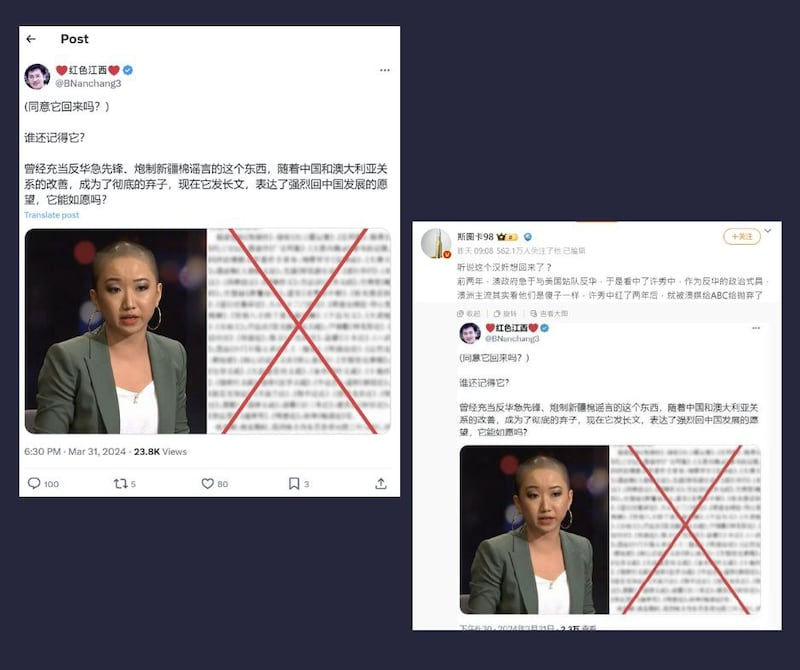

# 事實查覈｜"反華"記者許秀中成爲澳洲"棄子"，將回中國發展？

作者：艾倫

2024.04.09 14:47 EDT

## 標籤：缺乏證據

## 一分鐘完讀：

近日，社交媒體X和微博上流傳一則消息，稱澳籍“反華”記者許秀中（Vicky Xu）因中澳關係改善，成爲澳洲的棄子，因此發文稱要回中國發展。經查，發佈消息者並沒有提供任何證據證明許要回中國，而許秀中本人也已親自向亞洲事實查覈實驗室解釋她並無此計劃。

## 深度分析：

3月31日,X賬號 ["紅色江西"](https://twitter.com/BNanchang3/status/1774383638676705482) 發文,稱澳籍記者許秀中髮長文,希望能夠回中國發展。消息傳到微博上,擁有超500萬粉絲的用戶 ["斯圖卡98"](https://weibo.com/3279710155/5018275930965698)於4月1日轉發該帖,並附上文字"聽說這個漢奸想回來了",並稱許秀中是被澳大利亞廣播公司(Australian Broadcasting Corporation,ABC)拋棄的"棄子"。

三月底，X和微博上出現傳言，稱曾揭露新疆強迫勞動的澳洲華裔記者許秀中，在成爲澳洲的"棄子"後，即將返回中國。（X平臺及微博截圖）

許秀中曾爲ABC、《紐約時報》等媒體撰稿,並曾在澳洲戰略政策研究所(ASPI)擔任分析員,她因揭發新疆維吾爾人被強迫勞動的問題,在2021年被《環球時報》貼上"道德淪喪""反華"等標籤。自由亞洲電臺此前曾 [報道](https://www.rfa.org/cantonese/features/hottopic/reporters-03222023093342.html),許秀中在《環球時報》新聞刊發後,遭到中國全網網暴。因大量威脅訊息湧入她的社媒頁面,當時她一度關閉領英、IG和X賬號。

時隔三年,亞洲事實查覈實驗室發現,目前查得到許秀中正在運行的社媒賬號爲 [X](https://twitter.com/veryvickyxu)及 [領英](https://www.linkedin.com/in/veryvickyxu/),而兩個平臺上都沒有出現任何她即將返中的消息。

亞洲事實查覈實驗室詢問許秀中本人後，獲得回應如下：

“I can confirm that I don’t have plans to go back to China. I think if I do go back I’ll most definitely be detained or imprisoned - so the only career I’ll be having is probably going to be prison labor or something like that, which wouldn’t be ideal.”

參考翻譯：

“我可以確認，我沒有回中國的計劃。我認爲如果我真回去了，我幾乎肯定會被拘留或監禁，所以那樣我未來的職業道路只可能是監獄勞動之類的，不會很理想。”

此外，將上述許秀中講回國原帖中的附圖反搜，或是使用關鍵字查詢，都無法找到這篇所謂許秀中想回中國發展的原文。原帖本身所附的圖也已被上過馬賽克模糊，無從得知來源。

*亞洲事實查覈實驗室（Asia Fact Check Lab）針對當今複雜媒體環境以及新興傳播生態而成立。我們本於新聞專業主義，提供專業查覈報告及與信息環境相關的傳播觀察、深度報道，幫助讀者對公共議題獲得多元而全面的認識。讀者若對任何媒體及社交軟件傳播的信息有疑問，歡迎以電郵afcl@rfa.org寄給亞洲事實查覈實驗室，由我們爲您查證覈實。*

*亞洲事實查覈實驗室在X、臉書、IG開張了,歡迎讀者追蹤、分享、轉發。X這邊請進:中文*  [*@asiafactcheckcn*](https://twitter.com/asiafactcheckcn)  *;英文:*  [*@AFCL\_eng*](https://twitter.com/AFCL_eng)  *、*  [*FB在這裏*](https://www.facebook.com/asiafactchecklabcn)  *、*  [*IG也別忘了*](https://www.instagram.com/asiafactchecklab/)  *。*

[Original Source](https://www.rfa.org/mandarin/shishi-hecha/hc-04092024144312.html)