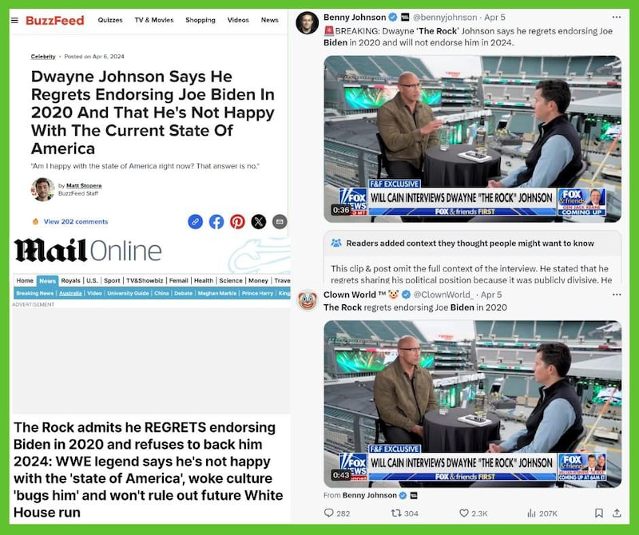

# 事實查覈｜巨石強森訪談中稱後悔四年前支持拜登？

作者：艾倫

2024.04.10 15:48 EDT

## 標籤：斷章取義

## 一分鐘完讀：

2024年美國總統大選即將在11月進行，一些娛樂名人支持哪位候選人也開始成爲輿論熱點。近期，X和微博上出現傳言，稱好萊塢影星道恩強森（Dwayn Johnson, ‘The Rock’）在福克斯新聞的訪談中，表示他後悔在2020年時支持拜登。

亞洲事實查覈實驗室檢視巨石強森受訪的原話，其中並沒有提及“後悔”支持拜登，他只是強調自己不再對政治表態，原因是不想看到美國社會因爲選舉政治進一步撕裂。

## 深度分析：

X上擁有超過50萬跟隨者的中文賬號"Inty熱點新聞"4月6日發了一則 [貼文](https://x.com/__Inty__/status/1776280462350262584),文內附上美國演員巨石強森接受福克斯新聞的專訪視頻,附文寫道:"好萊塢巨星,巨石強森,告訴福克斯新聞,他後悔在2020年支持拜登總統,並表示他不會在2024年犯同樣的錯誤。"該貼文發出兩日,已累積超過10萬人觀看,收穫100次分享。

類似消息在微博上也有流傳,名爲"周夢良Captain"的認證帳號也 [發文](https://weibo.com/u/3970333582?tabtype=home&layerid=5020242303256195)宣稱:巨石強森表示後悔2020年投票給拜登。

近期，社媒平臺X及微博上出現“巨石強森後悔支持拜登”的傳言。（X、微博截圖）

然而檢視“Inty熱點新聞”截取的這則影音，巨石強森並未提及“後悔”一詞，僅說今年將不再公開背書候選人。進一步查詢完整原始視頻，巨石強森在整個採訪中都只是解釋了今年不再公開背書任何政治人物的原因，但並沒有表示“後悔支持拜登”。

2020年9月,巨石強森曾在X上發佈 [影音](https://x.com/TheRock/status/1310198847835000834),表示他作爲兩個政黨都投過的中立選民,在那次選舉中支持拜登和哈里斯。而在2024年4月的採訪中,強森表示,在2024選舉中,他將不公開表態支持任何候選人。

亞洲事實查覈實驗室截取巨石強森回答福克斯新聞原文如下，並提供參考翻譯：

原文：“The takeaway after that months and months and months… I started to realize, like oh man, that caused an incredible amount of division in our country. So I realize now going into this election. I’m not going to do that because my goal is to bring our country together. I believe in that in my DNA. So in the spirit of that, there’s going to be no endorsement.”

參考翻譯：“在之後的幾個月裏，我開始意識到，天吶，這造成了我們國家難以置信的分裂，所以這次選舉，我認爲我不會再那樣做了，因爲我的目標是團結我們的國家，這是寫入我基因的信念。因此，本着這樣的精神，我不會做任何政治背書。”

從巨石強森發言的整體脈絡來看，他稱自己不再公開表態背書，以免引發社會的分裂，但並沒有提及對當時支持特定候選人感到後悔。因此“巨石強森稱後悔支持拜登”的描述屬於斷章取義。

然而,相關錯假消息並不只流傳於中文世界。多家英文媒體如 [Buzzfeed](https://www.buzzfeed.com/mjs538/dwayne-johnson-on-biden)、 [每日郵報](https://www.dailymail.co.uk/news/article-13275891/dwayne-rock-johnson-regrets-endorsing-joe-biden-2024-election.html)和 [Entertainment Weekly](https://ew.com/dwayne-johnson-regrets-endorsing-joe-biden-in-2020-8627973)也稱他"後悔在2020年支持拜登"(regrets endorsing Joe Biden in 2020),甚至將"regret"(中文可譯爲後悔)一詞以大寫強調。在英文社交媒體上,多個"藍勾勾"認證X賬號如 [Benny Johnson](https://x.com/bennyjohnson/status/1776230142404162011)、 [Citizen Free Press](https://x.com/CitizenFreePres/status/1776231879449993224)、 [Crown World](https://x.com/ClownWorld_/status/1776239334171308104)也發佈了同樣消息。

不少英文新聞、社交媒體也皆使用“後悔”一詞描述強森的談話內容。（Buzzfeed、每日郵報、X截圖）

其中，美國保守派政治評論員班尼約翰遜（Benny Johnson）的推文在本文截稿時，已達將近八百萬次瀏覽，隨後，該推文下方出現X官方功能“社羣筆記（community note）”提醒，告知讀者該文忽略了前後文，強森並非後悔力挺拜登，而是“所有”的政治表態。

保守派評論員X發文稱巨石“後悔支持拜登“獲得大量閱讀，隨即推文之下出現官方提醒，稱該說法斷章取義。

*亞洲事實查覈實驗室（Asia Fact Check Lab）針對當今複雜媒體環境以及新興傳播生態而成立。我們本於新聞專業主義，提供專業查覈報告及與信息環境相關的傳播觀察、深度報道，幫助讀者對公共議題獲得多元而全面的認識。讀者若對任何媒體及社交軟件傳播的信息有疑問，歡迎以電郵afcl@rfa.org寄給亞洲事實查覈實驗室，由我們爲您查證覈實。*

*亞洲事實查覈實驗室在X、臉書、IG開張了,歡迎讀者追蹤、分享、轉發。X這邊請進:中文*  [*@asiafactcheckcn*](https://twitter.com/asiafactcheckcn)  *;英文:*  [*@AFCL\_eng*](https://twitter.com/AFCL_eng)  *、*  [*FB在這裏*](https://www.facebook.com/asiafactchecklabcn)  *、*  [*IG也別忘了*](https://www.instagram.com/asiafactchecklab/)  *。*

[Original Source](https://www.rfa.org/mandarin/shishi-hecha/hc-04102024154106.html)