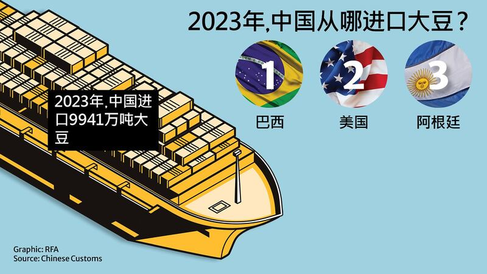
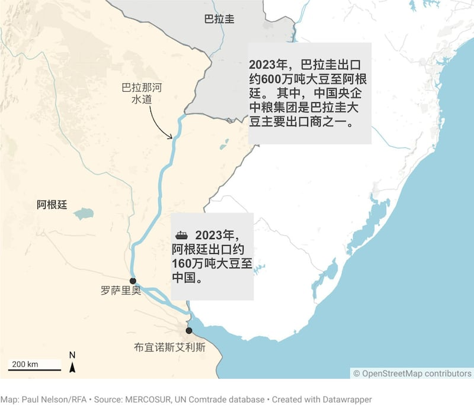

# 數據查覈｜和臺灣維持邦交的巴拉圭，到底有沒有把大豆賣到中國？

作者：鄭崇生，發自華盛頓

2024.04.11 16:16 EDT

## 一分鐘完讀：

巴拉圭總統培尼亞(Santiago Peña Palacios)三月下旬 [受訪時](https://x.com/PresidenciaPy/status/1771289178258448885?s=20)提及該國與臺灣的正式外交關係,稱其並沒有影響到巴拉圭與中國密切的商業聯繫,他表示,"巴拉圭的許多產品、例如大豆仍然出口到中國這一主要市場。"

針對培尼亞的說法,中國外交部新任發言人林劍3月25日 [回應](https://x.com/MFA_China/status/1772263335603671238?s=20),根據中國官方統計數據,近年來"中國自巴拉圭進口的大豆數量爲零。"

亞洲事實查覈實驗室查覈發現，中、巴兩方的說法看似衝突，但其實各有依據，都不能算錯。根據進出口數據，巴拉圭的大豆並不直接出口到中國，但有公開報道顯示，中國的中央直屬國有企業中糧集團是巴拉圭大豆主要買家之一，但並不直接進口中國。因此，中國從巴拉圭進口數量的官方數字雖然是零，但中國企業在巴拉圭並不缺席，開展了不少業務。巴拉圭賣到阿根廷或烏拉圭等第三國的大豆及大豆製品，都有可能轉口進入中國市場。

## 深度分析：

中國外交部發言人林劍的說法,從兩國的直接貿易數據上來看並沒有錯,交叉比對 [中國海關總署](http://www.customs.gov.cn/customs/302249/zfxxgk/2799825/302274/302277/302276/5637474/index.html)與 [南方共同市場](https://estadisticas.mercosur.int/?language=en)(MERCOSUR,由巴拉圭、巴西、阿根廷、烏拉圭四國組成)的統計數據顯示,儘管巴拉圭是 [世界第六大大豆和大豆油生產國](https://www.undp.org/facs/paraguay-sustainable-soy-and-beef#:~:text=With%20regards%20to%20soy%2C%20Paraguay,whopping%2018%25%20of%20its%20GDP.),中國是全球第一大豆進口國,巴拉圭直接出口中國的數據確實爲零。

根據 [中國海關統計](http://www.customs.gov.cn/customs/302249/zfxxgk/2799825/302274/302277/302276/5637474/index.html),中國去年大豆進口數量達9941萬噸,同比增長11.4%。 [統計顯示](http://www.news.cn/fortune/2023-07/04/c_1129730839.htm)主要前三大來源國依序爲巴西、美國、阿根廷。

事實上,在林劍回應培尼亞的說法後,中、巴之間就大豆買賣的問題持續有所爭辯。巴拉圭總統辦公室發言人卡洛(Paula Carro)於當地時間3月25日的 [記者會](https://youtu.be/txRbpWUn2Js?t=678)上重申培尼亞的說法。她並補充,中、巴兩國之間一直有貿易往來,"中國是我們主要的進口國之一,而巴拉圭的食品也通過他們的(中國)中間商出口到中國"。

## 貿易與政治全球化 中國剛需讓巴拉圭大豆有生意

阿根廷因爲地理與自然環境因素, [在南美洲的大豆出口市場扮演重要的中轉站角色](https://trase.earth/insights/argentina-the-overlooked-hub-of-south-american-soy)。巴拉圭因爲是內陸國家,農產品出口通常用 [船運送至阿根廷或烏拉圭的港口](https://web.archive.org/web/20220202145315/https:/www.reuters.com/article/paraguay-china-soybeans-idUKL1N1RW1Q9/)。

因此巴拉圭的大豆，是不是經由阿根廷或烏拉圭轉口銷往中國呢？經查覈後有以下發現：

中國在穀物產運路線上早有佈局,最受矚目的就是央企中糧集團2014年宣佈收購總部位於香港、新加坡上市的來寶集團(Noble Group)旗下農業部門, [曾引起廣泛關注](https://web.archive.org/web/20190918081444/https:/www.ft.com/content/459671b4-a37a-11e3-aa85-00144feab7de),而來寶農業部門在併入中糧前、就已經是巴拉圭大豆的主要採購商之一。 中國媒體 ["第一財經"](https://web.archive.org/web/20240402143133/https:/www.yicai.com/news/3666943.html)當時引述分析,中糧能借此打開原本難以進入的南美市場供應鏈,直接向巴西、阿根廷等南美國家進行農產品採購。

中國是世界第一大大豆進口國，進口量最多的國家是巴西、美國和阿根廷。（亞洲事實查覈實驗室製圖）

中糧國際 [官網指出](https://web.archive.org/web/20240119090541/https:/www.cofcointernational.com/products-services/grains-oilseeds/),該公司與巴西、阿根廷、烏拉圭和巴拉圭有長期合作關係,特別在內陸國巴拉圭設有船運裝載設施,通過巴拉那河(Panara river)水道運輸,在阿根廷羅薩里奧( Rosario)和巴西桑托斯(Santos)的主要港口設有出口設施, [通過中糧特有渠道,直接進入中國市場。](https://www.cofcointernational.com/media/wo3dtlwr/cof_factsheet_cn_052023.pdf)

專門研究大宗商品與農產品貿易數據的機構Trase曾在 [報告](https://trase.earth/insights/soy-deforestation-risk-in-paraguay-continues-despite-decline)指出,中糧集團在2019年就已成爲巴拉圭第四大大豆出口商,且將所採購超過7成的大豆出口到阿根廷。

此外, [綜合南方共同市場的數據庫](https://estadisticas.mercosur.int/?language=en)與 [聯合國大宗商品貿易數據庫](https://comtradeplus.un.org/),巴拉圭出口阿根廷的商品超過8成是大豆,2023年約達600萬噸;同一時間,阿根廷出口中國的大豆數量則爲160萬噸。

綜合前述的查覈結果，可以發現：

1. 中國國有企業中糧集團在巴拉圭採購大量大豆,並以自己擁有的交通路線運往阿根廷。
2. 中國進口大豆,相當數量來自阿根廷。

但至於從巴拉圭出口到阿根廷的大豆，每年最終有多少到了中國？ 至截稿，中糧國際沒有回覆亞洲事實查覈實驗室的查詢。

中國國企是巴拉圭大豆的最大買家之一，但並不直接進口中國。（亞洲事實查覈實驗室製圖）

## 巴拉圭力求"政治"和"大豆"分離

巴拉圭大豆通過第三地轉進中國,培尼亞也不是第一位這樣說的巴拉圭官員。 2018年,時任巴拉圭工商部長雷依德(Gustavo Leite) [受訪](https://web.archive.org/web/20220202145315/https:/www.reuters.com/article/paraguay-china-soybeans-idUKL1N1RW1Q9/)指出,中糧集團收購來寶集團的農業部門後,當時來寶採購約10%巴拉圭大豆產量的合約,後來由中糧承接,但這些大豆出口不算在中國與巴拉圭的直接貿易上,通過中糧,巴拉圭的大豆會先出口到阿根廷或烏拉圭,再到中國。

也因此，培尼亞說和臺灣維持邦交不影響巴拉圭與中國的經貿往來，中國仍在採購巴拉圭大豆的說法，有所依據。

巴拉圭是臺灣目前十二個邦交國中唯一的南美洲國家，面對鄰國和中國年年增長的貿易數字，究竟要不要爲經貿利益在外交上轉向中國，在每五年一次的巴拉圭總統選舉時都是熱門話題。

去年九月就任總統的培尼亞多次指出,巴拉圭會維持在外交上與臺灣的關係,但對於在經貿上與中國加強往來持開放態度,據阿根廷媒體"La Politica Online" [報道](https://web.archive.org/web/20240329214245/https:/www.lapoliticaonline.com/paraguay/economia-py/285801/),培尼亞今年二月訪問西班牙時,還與中國電信龍頭華爲的高管會面。

*亞洲事實查覈實驗室（Asia Fact Check Lab）針對當今複雜媒體環境以及新興傳播生態而成立。我們本於新聞專業主義，提供專業查覈報告及與信息環境相關的傳播觀察、深度報道，幫助讀者對公共議題獲得多元而全面的認識。讀者若對任何媒體及社交軟件傳播的信息有疑問，歡迎以電郵afcl@rfa.org寄給亞洲事實查覈實驗室，由我們爲您查證覈實。*

*亞洲事實查覈實驗室在X、臉書、IG開張了,歡迎讀者追蹤、分享、轉發。X這邊請進:中文*  [*@asiafactcheckcn*](https://twitter.com/asiafactcheckcn)  *;英文:*  [*@AFCL\_eng*](https://twitter.com/AFCL_eng)  *、*  [*FB在這裏*](https://www.facebook.com/asiafactchecklabcn)  *、*  [*IG也別忘了*](https://www.instagram.com/asiafactchecklab/)  *。*

[Original Source](https://www.rfa.org/mandarin/shishi-hecha/hc-04112024160416.html)