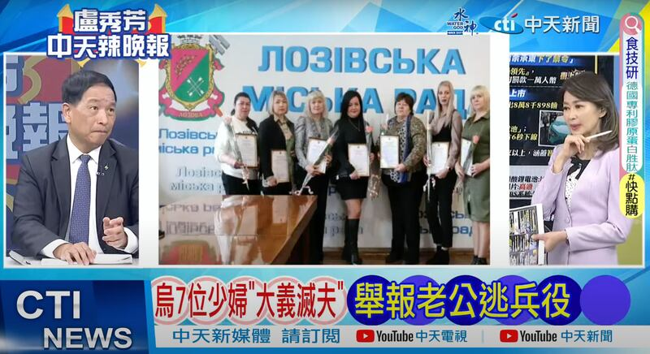
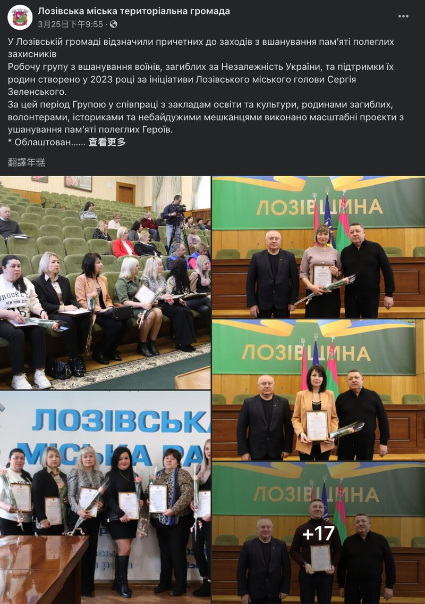
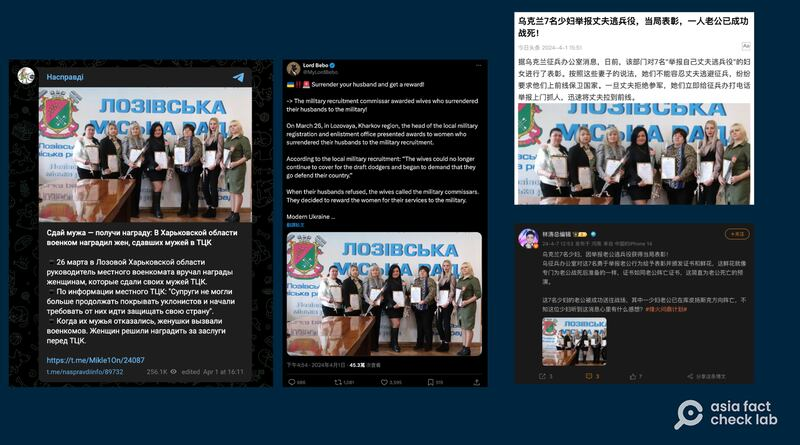

# 事實查覈｜烏克蘭少婦“大義滅夫”獲政府表彰？

作者：董喆

2024.04.12 14:34 EDT

## 標籤：錯誤

## 一分鐘完讀：

臺灣中天新聞4月2日的節目稱，烏克蘭有7位婦女“大義滅夫”舉報逃兵丈夫被表彰，並展示7名婦女手持獎狀的合照。該說法也在中國各視頻網站和社交媒體廣傳。亞洲事實查覈實驗室查證，這張合照出自烏克蘭洛佐瓦市政府網頁，活動內容是表彰紀念陣亡英雄活動的工作小組，中天新聞報道的是錯誤資訊。

## 深度分析：

4月2日，臺灣中天新聞“辣晚報”的節目中，主持人盧秀芳展示了一張照片，7名據稱是烏克蘭人的婦女手持鮮花與證書，被說成是因爲“大義滅夫”舉報丈夫逃避徵兵，獲政府公開表彰。節目中，臺灣空軍前副司令張延廷更評論，舉報者“都是大媽，他們的對象都是大叔”，意指烏克蘭年輕兵源不足。

中天新聞“辣晚報”節目稱烏克蘭7少婦舉報丈夫獲表彰（圖取自中天新聞YouTube頻道）

亞洲事實查覈實驗室以這張照片反搜,發現互聯網上已經有多個談論"烏克蘭少婦舉報丈夫獲表彰"的社羣貼文。進一步根據照片中左上角的徽章進行反搜,確定是洛佐瓦(Лозова)市的市徽。在洛佐瓦市政府網站以及 [臉書粉絲專頁](https://archive.ph/bND3P)找到了這張照片,確定這張照片出處來自烏克蘭公部門在3月25日舉辦的活動。

該原始圖片出自烏克蘭洛佐瓦市政府。（圖取自臉書）

根據洛佐瓦市政府的 [新聞稿](https://lozovagromada.gov.ua/news/u-lozivski-gromadi-vidznachili-prichetnih-do-zahodiv-z-vshanuvannya-pamyati-poleglih-zahisnikiv-2024-03-25),市長Serhiy Zelensky於2023年發起工作小組,旨在表彰爲烏克蘭犧牲的戰士並支持他們的家庭。這個工作小組過去與教育機構、陣亡官兵家屬、志工、歷史學者及熱心民衆合作,完成諸多紀念陣亡英雄的項目,因此,小組成員得到公開表彰,新聞稿中也附上了表彰名單。

在查覈過程中，亞洲事實查覈實驗室也分析了這則謠言的傳播路徑。根據烏克蘭媒體“24 Канал”的查證，“烏克蘭少婦舉報丈夫獲表彰”的圖文謠言最早出自俄羅斯Telegram賬號“Насправд”4月1日發出的消息。4月2日起，這則謠言開始轉傳到X（原推特）以及中國社羣平臺如微博、網易等。同日，臺灣中天新聞也以此作爲素材在談話性政論節目中討論，節目片段則又再次被搬運到中國bilibili、微博等社媒平臺。上述謠言在傳播過程中，“烏克蘭嚴重缺少兵源”的結論也被廣泛傳播。

“烏克蘭少婦舉報丈夫獲表彰”的圖文謠言在各大媒體平臺傳播 （圖取自X等平臺）

即使早在4月1日就有烏克蘭媒體查覈此消息，但跨語言的傳播讓闢謠資訊難以觸達中文媒體環境，加上社羣平臺未經查證的資訊透過主流媒體的二次加工傳播，也讓傳播鏈持續擴大。

(吳照中先生及陳韻聿女士對本則查證亦有所貢獻)

*亞洲事實查覈實驗室（Asia Fact Check Lab）針對當今複雜媒體環境以及新興傳播生態而成立。我們本於新聞專業主義，提供專業查覈報告及與信息環境相關的傳播觀察、深度報道，幫助讀者對公共議題獲得多元而全面的認識。讀者若對任何媒體及社交軟件傳播的信息有疑問，歡迎以電郵afcl@rfa.org寄給亞洲事實查覈實驗室，由我們爲您查證覈實。*

*亞洲事實查覈實驗室在X、臉書、IG開張了,歡迎讀者追蹤、分享、轉發。X這邊請進:中文*  [*@asiafactcheckcn*](https://twitter.com/asiafactcheckcn)  *;英文:*  [*@AFCL\_eng*](https://twitter.com/AFCL_eng)  *、*  [*FB在這裏*](https://www.facebook.com/asiafactchecklabcn)  *、*  [*IG也別忘了*](https://www.instagram.com/asiafactchecklab/)  *。*

[Original Source](https://www.rfa.org/mandarin/shishi-hecha/hc-04122024143348.html)