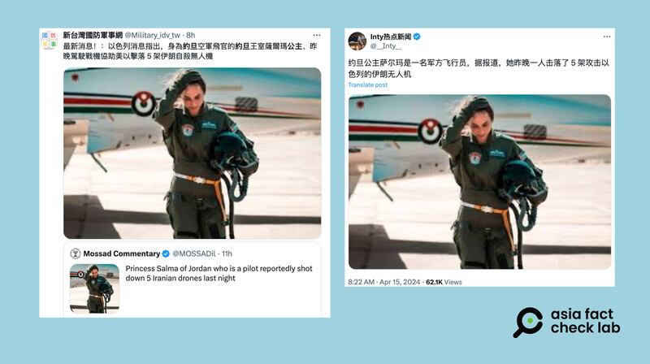
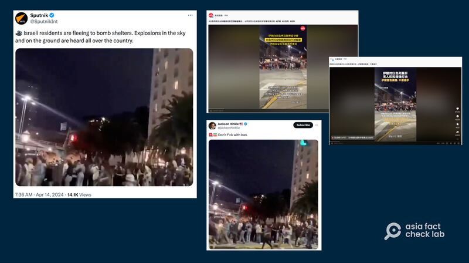
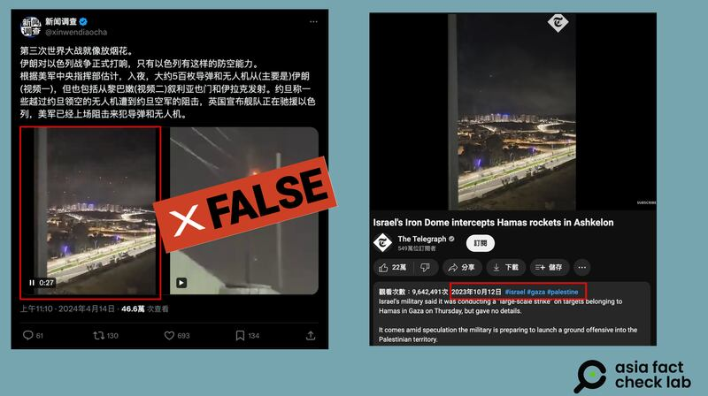
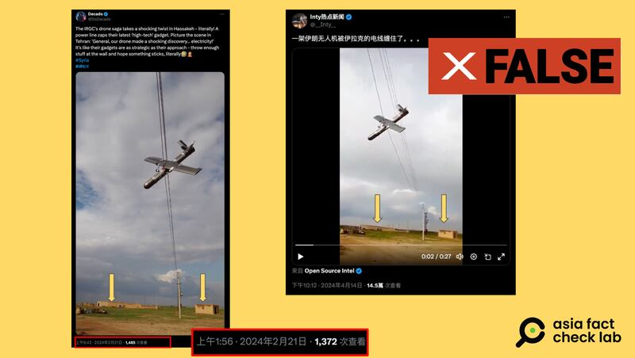
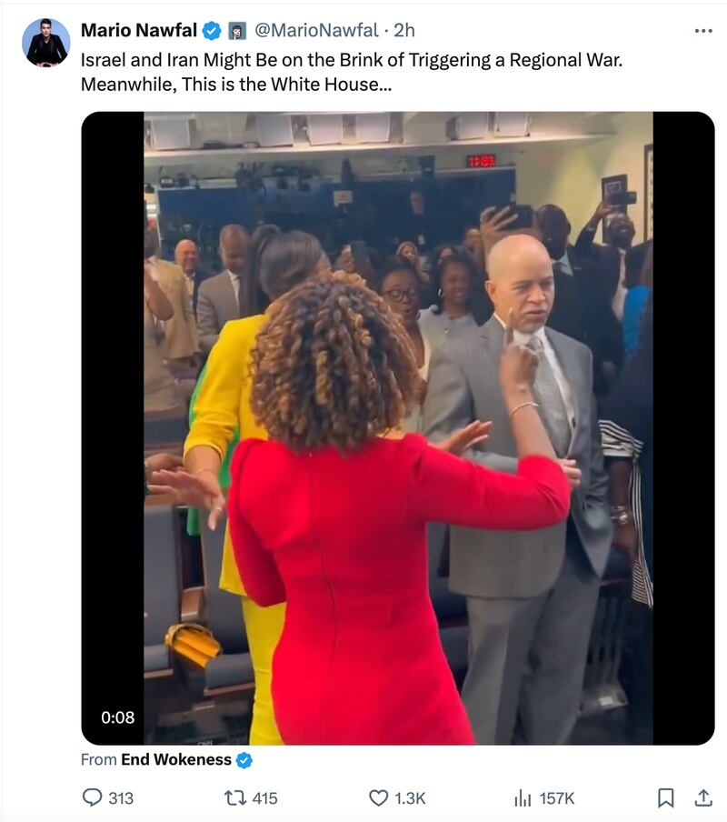

# 事實快查｜伊朗空襲以色列 網傳大量無關畫面

作者：莊敬、董喆

2024.04.16 14:54 EDT

4月1日，伊朗駐敘利亞大使館遭以色列襲擊，作爲報復，伊朗在13日晚間動用飛彈和無人機攻擊了以色列本土，中東區域緊張情勢再度升溫。 亞洲事實查覈實驗室注意到，多家媒體及社媒賬號發佈的相關信息都挪用了無關此事件的影像，並散佈了錯誤資訊。 以下是我們針對其中幾則內容的查覈。

## 一、約旦王室公主擊落 5 架伊朗無人機?

查覈結果：錯誤

4月15日，X上一些具有影響力的賬號發文稱，身爲約旦空軍飛官（飛行員）的約旦王室薩爾瑪公主，“昨晚駕駛戰機協助美以擊落5架攻擊以色列的伊朗自殺無人機”。

亞洲事實查覈實驗室以英文關鍵字查詢,並未找到主流媒體報道上述事件。 另以圖片反搜,發現這張照片曾出現在去年的 [新聞報道](https://today.line.me/tw/v2/article/zNYoRg7) 中,內容是薩爾瑪親自上陣、空投物資給加沙醫院。 目前並無證據顯示薩爾瑪公主協助美以擊落伊朗無人機,但確定的是,網傳的照片與此伊朗和以色列衝突事件無關。

一些具影響力的社媒賬號發文，稱身爲約旦空軍飛官的約旦王室薩爾瑪公主，協助美以擊落5架攻擊以色列的伊朗自殺無人機。 （圖取自X）

## 二、視頻顯示以色列民衆在遭伊朗襲擊後驚恐奔逃？

查覈結果：錯誤

中國《成都商報》旗下《 [紅星新聞](https://v.douyin.com/iYxhqeD6/) 》、上海都市媒體《 [新聞晨報](https://v.douyin.com/iYxk23XP/) 》在抖音發佈有關伊朗襲擊以色列的短視頻,開頭兩秒顯示人羣奔跑的畫面,疑似挪用與事件無關的影像。 這段畫面也在X(原推特)等平臺廣泛傳播,轉傳者包括 [俄羅斯衛星通訊社新聞(Sputnik)](https://twitter.com/SputnikInt/status/1779292526660166083) 、擁有260多萬追蹤者的"藍勾勾"用戶" [Jackson Hinkle](https://twitter.com/jacksonhinklle/status/1779404973576536486) "。

一些轉傳者聲稱這是以色列民衆正在逃往防空洞的畫面，但已有網民留言指出，奔跑的人羣應是英國歌手路易斯·湯姆林森（Louis Tomlinson）的粉絲，地點則是在阿根廷布宜諾斯艾利斯四季酒店附近。

在伊朗空襲以色列後，有媒體與網紅在社媒發佈視頻，聲稱以色列民衆驚恐躲避，卻是挪用無關的影像。 （圖取自微博、X）

亞洲事實查覈實驗室未能找到原始視頻,但比對 [Google地圖上](https://www.google.com/maps/@-34.589988,-58.382848,3a,74.6y,138.93h,107.41t/data=!3m6!1e1!3m4!1shlS_rlMZ7eUNZ8a_2VuImw!2e0!7i16384!8i8192?entry=ttu) "阿根廷布宜諾斯艾利斯四季酒店"的景象,發現附近建築物外觀、斑馬線位置,都與網傳視頻相符。 另根據湯姆林森團隊4月初的 [貼文](https://twitter.com/LTHQOfficial/status/1777104820895096895) ,他當時在阿根廷布宜諾斯艾利斯會見粉絲。  [法新社(AFP)](https://factcheck.afp.com/doc.afp.com.34PH3GK) 、 [《BOOM Live](https://www.boomlive.in/fact-check/viral-video-israel-iran-war-people-panicking-tel-aviv-claim-social-media-24898)  》等單位已針對此事發布查覈報告,四季酒店回覆法新社,確認網傳視頻中的建築物是四季酒店,畫面則是兩週前粉絲在酒店前等待明星 ,與以色列無關。

## 三、空中閃爆的煙花，是以色列鐵穹大量攔截伊朗無人機與飛彈？

查覈結果：錯誤

"第三次世界大戰就像放煙花!"X賬號" [新聞調查](https://twitter.com/xinwendiaocha/status/1779346476067664009) "在伊以衝突發生後轉推了一則視頻,稱讚以色列防空系統能攔截5百枚導彈和無人機。  [微博](https://archive.ph/LPcWE) 平臺也出現了多則類似的視頻貼文,皆在描述以色列如何防禦伊朗襲擊。

在伊朗空襲以色列後，X上有視頻稱是以色列鐵穹系統反擊伊朗無人機，但視頻早在伊以衝突前就存在。 （圖取自Youtube、X）

同樣一則視頻也被臺灣媒體引用在報道中,包含網絡媒體"新頭殼"以及聯合新聞網。  [新頭殼](https://archive.ph/47Cqp#selection-2883.16-2883.72) 與 [聯合新聞網](https://archive.ph/a8omp) 14日綜合外電資料,報道美國在中東的防空系統以及以色列的鐵穹防禦系統成功攔截來自伊朗的無人機與飛彈。 不過他們引用了X上未經查證的視頻。

亞洲事實查覈實驗室將影片反搜,發現這則視頻最早出現在2023年10月12日,英國《每日電訊報》 [引用](https://www.youtube.com/watch?v=D9fynbWJUOc&ab_channel=TheTelegraph) 了專門報道軍事衝突的自媒體X賬號" [Clash Report](https://twitter.com/clashreport/status/1712188024191160513) ",指出是以色列鐵穹防禦系統在阿什凱倫(Ashkelon)攔截了哈瑪斯的火箭。

由於影片中缺乏其他可以辨識的線索，我們無法確定該則影片是否就是以色列與哈瑪斯的衝突。 但單純以時間推論，這次被誤用的視頻早在2023年10月就存在，不可能是此次伊以衝突的畫面。

## 四、伊朗無人機被伊拉克電線纏住了？

查覈結果：錯誤

伊朗襲擊以色列後,X( [貼文1](https://twitter.com/__Inty__/status/1779513154504216727) , [貼文2](https://twitter.com/zhihui999/status/1779608752276066766) )以及 [微博](https://weibo.com/tv/show/1034:5023154821857313?from=old_pc_videoshow) 上有視頻稱伊朗的無人機被伊拉克的電線纏住。 俄國官媒今日俄羅斯也在微博轉發同一則視頻,稱"伊朗當天在對以色列實施軍事打擊過程中,一架無人機未能順利抵達以色列,而是在途中被伊拉克的電線困住"。 亞洲事實查覈實驗室以影片截圖反搜,發現這則視頻早在今年2月就已出現在社羣媒體上,與這一波伊朗襲擊以色列無關。

X上有賬號稱伊以衝突後有伊朗的無人機卡在電線上，但這則視頻其實早在今年2月就存在。 （圖取自X）

2024年2月21日X上有多則貼文( [貼文1](https://twitter.com/ItsDecado/status/1760072617220833339) , [貼文2](https://twitter.com/SteeleSyAA/status/1760191293245026552?ref_src=twsrc%5Etfw%7Ctwcamp%5Etweetembed%7Ctwterm%5E1760191293245026552%7Ctwgr%5Ecae8103ec4537559e5062e03f67092533d328c73%7Ctwcon%5Es1_&ref_url=https%3A%2F%2Fwww.thequint.com%2Fnews%2Fwebqoof%2Fdrone-stuck-in-power-line-is-not-from-irans-recent-attack-on-israel-fact-check) , [貼文3](https://twitter.com/ZanaAlali/status/1760000501024723011) )在討論一架無人機被電線卡住,地點是敘利亞東北部哈沙卡省(Hassakeh)的 一個小鎮Qamar Aldin,不過無人機歸屬有多種說法,有一說是伊斯蘭革命衛隊的無人機,亦有一說是身分不明。 以關鍵字搜尋相關報道,以色列地方網路媒體 ["Alsharqiya News"](https://twitter.com/alsharqia24news/status/1760036167775559733?ref_src=twsrc%5Etfw%7Ctwcamp%5Etweetembed%7Ctwterm%5E1760036167775559733%7Ctwgr%5Eb9979cba7ee71b65166dd4c54d49340cacb780dd%7Ctwcon%5Es1_&ref_url=https%3A%2F%2Fmisbar.com%2Fen%2Ffactcheck%2F2024%2F04%2F15%2Fthis-video-does-not-show-an-iranian-drone-stuck-in-electrical-power-lines-in-iraq) 曾以推文報道此消息,但未有官方實證。

雖未能確認這起事件的事發原因，但從社羣貼文出現的時間可以推論這則視早在伊以衝突前就存在，與這次事件無關。

## 五、白宮歌舞慶賀伊以衝突？

查覈結果：錯誤

X平臺上獲認證的"藍勾勾"用戶" [Mario Nawfal](https://twitter.com/MarioNawfal/status/1779712500436443457) "發文:"以色列與伊朗處於引發區域戰爭的邊緣。與此同時,這是白宮⋯⋯"。 這篇貼文附上一則短視頻,畫面看起來是白宮發言人皮埃爾(Karine Jean-Pierre)與多人在白宮新聞簡報室唱歌、跳舞。

X用戶發佈視頻，指責白宮在伊朗以色列情勢緊張之際，還在唱歌跳舞。 視頻爲真，但發生在伊朗空襲以色列之前，兩者無關聯。 （圖取自X）

經查,這是90年代美國電視劇《異世界》(A Different World)演員重聚的畫面。  [據報道](https://deadline.com/2024/04/a-different-world-cast-gets-white-house-singing-1235881343/) ,《異世界》演員進行全國巡迴演出到了美國華府,於4月10日在白宮會見了副總統與發言人。 視頻爲真,但發生在伊朗空襲以色列之前,兩者並無關聯。

*亞洲事實查覈實驗室(* *Asia Fact Check Lab* *)針對當今複雜媒體環境以及新興傳播生態而成立。我們本於新聞專業主義,提供專業查覈報告及與信息環境相關的傳播觀察、深度報道,幫助讀者對公共議題獲得多元而全面的認識。讀者若對任何媒體及社交軟件傳播的信息有疑問,歡迎以電郵* *afcl@rfa.org* *寄給亞洲事實查覈實驗室,由我們爲您查證覈實。*

*亞洲事實查覈實驗室在* *X* *、臉書、* *IG* *開張了,歡迎讀者追蹤、分享、轉發。* *X* *這邊請進:中文*  *[@asiafactcheckcn](https://twitter.com/asiafactcheckcn)*  *;英文:*  *[@AFCL\_eng](https://twitter.com/AFCL_eng)*  *、*  *[FB在這裏](https://www.facebook.com/asiafactchecklabcn)*  *、*  *[IG也別忘了](https://www.instagram.com/asiafactchecklab/)*  *。*

[Original Source](https://www.rfa.org/mandarin/shishi-hecha/hc-04162024144738.html)