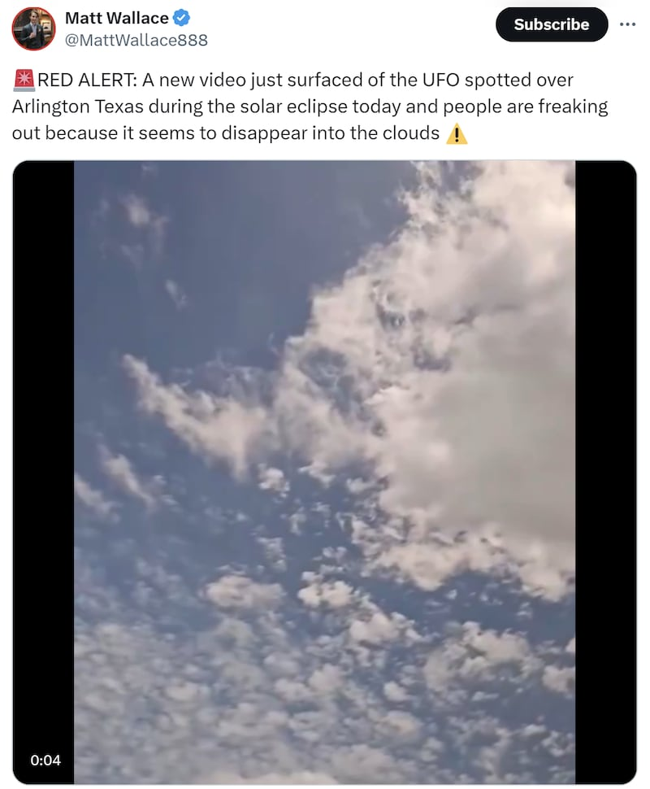
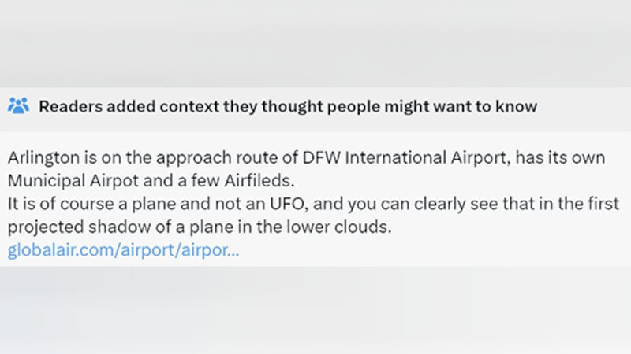
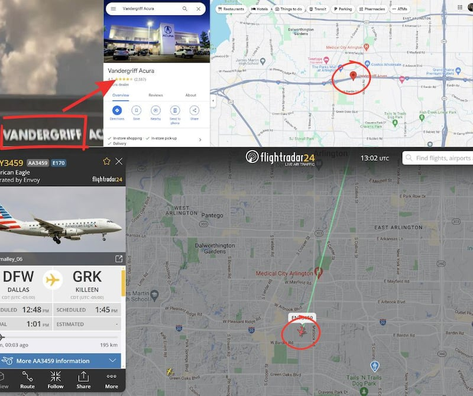

# 事實查覈｜日蝕發生時，德州驚現UFO？

作者：艾倫

2024.04.18 16:16 EDT

## 標籤：證據不足

## 一分鐘完讀：

4月8日發生的日全食引發全美關注，各地民衆紛紛帶著觀測鏡，到戶外一窺自然奧妙。與此同時，X上流傳一則影音，內容爲德州阿靈頓市居民在日食期間，拍下了不明飛行物體（UFO）從天空穿過的影像。

但非政府組織“美國國家UFO報告中心”向亞洲事實查覈實驗室表示並沒有接到相關通報，而當時正有一架飛機通過。因此，並無實際證據證明畫中出現的不明飛行物體。

## 深度分析：

X平臺認證的賬號 "唐靖遠·遠見快評"於4月9日轉發一則英文 [影音](https://x.com/KpYuanjian1871/status/1777544978190815489) ,標題爲"德州阿靈頓上空,一個UFO越過了觀看日食的現場",內容是4月8日民衆觀賞美國日蝕時拍攝的畫面,出現一高速不明飛行物體(UFO),視頻內更有人大喊"是外星人!"

微博認證用戶"蘭斌強"也在當天轉發 [相關消息](https://weibo.com/3966129175/O8WVxyiWO?refer_flag=1001030103_) ,除了標題指出德州上空發現UFO,還強調"人們非常恐慌"。

美國日全食當天（4月8日），網路上出現德州看到不明飛行物體（UFO）的傳言。（圖截取自X和微博）

經查, [原英文視頻](https://x.com/MattWallace888/status/1777516074600153339) 爲X賬號馬特華萊士(Matt Wallace)轉發,已超過兩千四百萬觀看。內容寫道:"紅色警戒:今天日全蝕期間,德州阿靈頓上空發現了一架不明飛行物,人們感到恐慌,因爲它似乎最後消失在雲中。"

UFO相關傳言由英文世界最先開始傳播，其中一篇由X賬號Matt Wallace發的文，截稿當日已收穫將近2500萬次觀看。（圖截取自X）

X目前已在推文下方附上社羣筆記（Community Note），說明阿靈頓位於達拉斯國際機場的進場路線(approach route)上，且視頻裏出現的物體是一架飛機，在低層雲中可以清楚地看到它的影子。

原英文推文下方出現社羣筆記，告知讀者視頻中出現的畫面爲飛機在飛行中投射至低雲層的影子。（圖截取自X）

進場路線指的是飛機下降時對準跑道飛行的路線，在進場階段，要使飛機調整高度，對準跑道，從而避開地面障礙物，因此該提醒強調的重點爲，德州阿靈頓市是飛機抵達達拉斯國際機場會經過的城市。

非政府組織“美國國家UFO報告中心”（National UFO Reporting Center）的技術長Christian Stepien回覆亞洲事實查覈實驗室時提到，目前中心沒有收到任何視頻內飛行物體的相關通報，且針對原英文推文下附註的提醒，也就是畫面裏的物體爲飛機的影子，他認爲這個說法“是可信的”（plausible）。

爲了確定地點,亞洲事實查覈實驗室找到原視頻內出現一家二手汽車行Vandergriff Acura的畫面,AFCL根據其位置在Google地圖上 [定位](https://maps.app.goo.gl/hDNZs6VqmpRoUKb86) ,並比對班機追蹤網站Flightradar24,發現當天下午1點6分時,一架特使航空(Envoy Air)3459班機經過汽車廠的上方。

經查,該班機於當地時間下午12點48分從達拉斯國際機場起飛,並於下午1:50抵達基林機場,而阿靈頓正好在兩個城市之間,爲此航班必經之地,且時間正好處於德州境內 [日食發生期間](https://www.fox4news.com/news/solar-eclipse-2024-peak-times-path-through-texas-how-to-watch-live) 。

根據原日蝕畫面中出現的汽車商定位Google地圖，輔以航班追蹤網站的資訊，可查到影音拍攝地點於日蝕期間，確實出現來自達拉斯機場的班機。（圖截取自Google）

根據X上的社羣筆記、UFO研究員的說法，以及Flightradar24提供的航班訊息，“美國德州上空出現UFO”的說法缺乏證據。

爲了確認視頻內的飛機機型及其航線，AFCL去信詢問美國聯邦航空管理局、德州運輸部門及達拉斯國際機場，至截稿前尚未得到回覆。

*亞洲事實查覈實驗室(* *Asia Fact Check Lab)針對當今複雜媒體環境以及新興傳播生態而成立。我們本於新聞專業主義,提供專業查覈報告及與信息環境相關的傳播觀察、深度報道,幫助讀者對公共議題獲得多元而全面的認識。讀者若對任何媒體及社交軟件傳播的信息有疑問,歡迎以電郵afcl@rfa.org寄給亞洲事實查覈實驗室,由我們爲您查證覈實。*

*亞洲事實查覈實驗室在* *X、臉書、IG開張了,歡迎讀者追蹤、分享、轉發。X這邊請進:中文*  *[@asiafactcheckcn](https://twitter.com/asiafactcheckcn)*  *;英文:*  *[@AFCL\_eng](https://twitter.com/AFCL_eng)*  *、*  *[FB在這裏](https://www.facebook.com/asiafactchecklabcn)*  *、*  *[IG也別忘了](https://www.instagram.com/asiafactchecklab/)*  *。*

[Original Source](https://www.rfa.org/mandarin/shishi-hecha/hc-04182024161014.html)