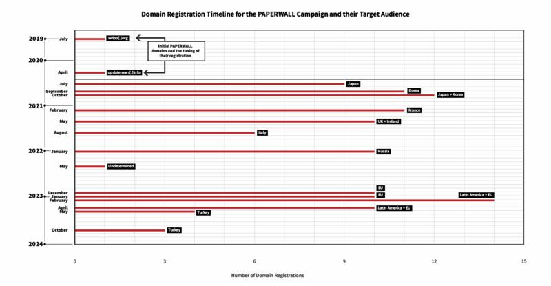

# 深度專題 | 中國公司營運的“紙牆”，遍佈30國（上）

編譯：伊芙蔡

2024.04.18 15:34 EDT

**前言:** *加拿大"公民實驗室"(Citizen Lab)在2月初發表的一份研究報告中,揭露了一項名爲"紙牆"(PAPERWALL)的行動。研究報告發現,包括歐洲、亞洲、拉丁美洲等,超過30個國家都發現了假冒該國新聞的媒體網站,總數達到123個。這些網站都在中華人民共和國境內營運,以全球受衆爲目標,頻繁發佈"親北京"的內容,然後又有技巧的將攻擊異議者的文章在發佈後不久刪除。*

而這項行動與中國深圳市一家公關公司“海脈雲享”（Shenzhen Haimaiyunxiang Media Co., Ltd.)高度關聯。

本篇專題報導根據報告原文編譯而成,亞洲事實查覈實驗室對翻譯內容負全部責任,小標題也爲本文編輯所加。 報告的英文原版鏈接 [在此](https://citizenlab.ca/2024/02/paperwall-chinese-websites-posing-as-local-news-outlets-with-pro-beijing-content/) 。另,亞洲事實查覈實驗室還對作者阿爾貝託·菲塔雷利進行了專訪 ,深度解讀中國信息戰技術沿革和未來趨勢。

## 在意大利、韓國出現的 " 地方媒體 "

2023年10月25日，意大利《頁報》（Il Foglio）發表了一篇文章，揭露了一個由6個網站組成的小型網絡，這個網絡向意大利受衆提供新聞內容，卻與意大利任何媒體都無關聯。《頁報》的調查證實，這些網站並未按照該國法律要求，註冊成能合法傳播資訊的新聞媒體。

這個小型網絡的網站有着特定的命名規則：先以意大利語拼寫意大利城市，羅馬（Roma）、米蘭（Milano），後面再接一些看似平凡的用語，如“時尚”、“金錢”、“日誌刊物”等。這些網站在結構、版面和內容上都十分相似，都是一些政治、犯罪、娛樂文章，但其中夾雜着大量與中國相關的新聞，有的甚至源自中國的新聞機構。

《頁報》聲稱，根據網頁內容以及6個網域解析出的IP位址，顯示該IP由中國騰訊公司擁有，主要在中國運作，而且背後可能就是中國政府。《頁報》暗示或許存在更廣泛的相關網絡，但沒有披露更多資訊。

2023年11月13日，韓國國家網路安全中心（NCSC）也發佈報告，揭露了18個冒充韓國本地媒體的韓語網站，實則與中國公關公司“海脈”有關。這間公司也利用發佈新聞的機會替客戶打廣告。韓國發現的這些虛假網站，無論是技術結構還是作案手法，都與上述《頁報》曝光的6個意大利語網站非常相似。“公民實驗室”因此着手研究整個網路，目的是發現更多相關網站，其策略、目標、影響，以及相關行動的背後藏鏡人。

## " 紙牆 " 的初始設定

基於DNS基礎架構的重疊，公民實驗室將《頁報》最初辨識出的網路擴展到74個網域，這些網域大多可以透過3個它們所解譯的IP位址識別出來。

這些IP位址上託管的網域數量相對較少，不到100個，但理論上每個IP可以代管上千個網域。 這可能表明這些IP僅連結到一個業者，而不是多個客戶端供應商。

“公民實驗室”從《頁報》原始文章中所確定的6個網域開始：

《頁報》所辨識出的6個代管意大利語網站的網域名稱。 （圖片來源：PAPERWALL報告）

根據軟體公司“RiskIQ”提供的DNS數據，“公民實驗室”發現上述網域在過去2年，至少能解譯到以下3個IP位址的其中1個：

自2021年以來6個網域解譯的IP位址列表。 （圖片來源：PAPERWALL報告）

自2018年4月以來，“公民實驗室”還發現其他至少與這3個IP位址其中1個相關的網域，並獲得以下74個網域的清單，這74個網域清單也與《頁報》提到網域一樣，能解譯到3個IP位址。

“公民實驗室”也驗證出這些網域在多個國家或地區，除了少數例外，都有代管冒充新聞媒體的網站，其中許多似乎用了前述“城市+通用字彙”的命名規定。

## " 紙牆 " 相似的結構和外觀

“公民實驗室”也透過在韓國NCSC報告裏所提到的網站，識別出其他網域，並確認它們與“紙牆”的特徵相符，包括：

1. 所有網站都是在WordPress上建立的,並使用外掛程式"WPBakery"進行設定。

1. 和《頁報》的發現相同,6個意大利語網域的代管設施,都與中國公司騰訊公司有關。事實上,相關服務還是透過騰訊雲使用的;"公民實驗室"可以驗證所有提到的活躍網域,都由騰訊雲端IP位址代管。

“公民實驗室”強調，只要滿足某些條件，任何私人客戶都可以提出服務要求。騰訊雲端服務的文件內容也顯示，該公司的要求門檻非常低。實際上，經營網站的任何個人或企業，都可以透過訂購其雲端服務，將網域指向騰訊的IP位址。

3.“公民實驗室”還透過一種稱爲“使用者姓名列舉”的技術，分析了在“紙牆”網站上，發佈內容的使用者名稱，顯示整個網路共享一些相同的作者姓名，例如有44個網站使用姓名叫”Tina”、28個”Chunqt”、26個”Sophia”等。

就外觀來看，所有識別出的網站主頁選單幾乎長得一樣，通常包括政治、經濟、文化、時事和體育。至於發佈的內容，則是由從當地媒體抓取及轉發的內容、新聞稿、中國官媒文章、匿名假資訊等等混合而成，通常還會同時在多個網站交叉發佈。

與GWM（長城汽車）相關的商業新聞稿範例組合，在6天內（2023年10月25日至31日）被髮到6個不同的“紙牆”網站。但“公民實驗室”強調尚未發現任何證據，表明長城汽車知道其內容被用在欺騙性活動。（圖片來源：PAPERWALL報告）

## " 紙牆 " 遍佈 30 多國

截至2023年12月21日，“公民實驗室”共識別出123個網域，幾乎每一個都有代管了冒充新聞媒體的網站。

再根據所使用的語言和轉發的本地新聞內容來源，“公民實驗室”觀察到這個冒充本地媒體的網絡，存在於30多個不同國家，如下圖所示。

“紙牆”目標受衆地圖，最深的紅色表示該國冒名網站超過10個，其次爲2到9個，最淺爲1個。（圖片來源：PAPERWALL報告）

爲了看起來與合法的本地新聞媒體相仿，“紙牆”通常會針對其網站名稱做局部引用。例如，法語網站就用“艾菲爾”或“普羅旺斯”；挪威語網站則使用“維京”；或是像意大利及西班牙語網站一般，經常使用城市命名。

![napolimoney[.]com（意大利）、eiffelpost[.]com（法國）、sevillatimes[.]com（西班牙）的命名模式範例。（圖片來源：PAPERWALL報告）](images/GQJYRAMLUKY3ZDWH7I4ECVHLPU.png)

napolimoney[.]com（意大利）、eiffelpost[.]com（法國）、sevillatimes[.]com（西班牙）的命名模式範例。（圖片來源：PAPERWALL報告）

針對網域註冊時間軸的更廣泛觀察，也顯示了這些網站是如何一次鎖定一個目標國家（或地區），被一波波建立起來。2019年7月，updatenews[.]info成爲“紙牆”第一個註冊的網域。然而，由於Wayback Machine上的註冊資料模式和存檔獲取等問題，我們只能從2020年5月開始將其與“紙牆”建立聯繫。該代管網站主要發佈與美國讀者相關的新聞。

與此同時，網域wdpp[.]org也在2020年4月被註冊了，該網站使用騰訊的IP位址，也能連結到updatenews[.]info和其他16個“紙牆”相關網域，這點對於歸因溯源非常重要。

2020年7月，有9個網域同時註冊，每個都負責代管一個針對日本受衆的網站，其中一個fujiyamatimes[.]com，就有頁腳顯示它與“Updatenews”的連結。

緊接着這波潮流又先後瞄準了韓國、日本的受衆；從2021年2月開始，焦點轉移到歐洲國家，然後在2023年初又轉到拉丁美洲國家。下圖顯示了相關注冊潮的概況。

“紙牆”網域註冊時間表，附有日期、目標國家/地區的相關注解。 （圖片來源：PAPERWALL報告）

## 誰在操控 " 紙牆 " ?

“公民實驗室”分析指出，“紙牆”雖然與2022年，美國資安公司麥迪安（Mandiant）揭露的“海能量”（HaiEnergy）行動相似，但兩者的操作者、技術、策略、伎倆並不同，屬於互相獨立的活動。

“公民實驗室”追查發現，“紙牆”大部分的內容，都可追蹤到一家名爲“Times Newswire”的新聞稿發佈服務公司，常將對北京有利的政治內容，隱藏在大量看似良性的商業報導裏；該公司先前曾被發現也爲“海能量”提供相關服務。 進一步探究後顯示，“紙牆”又與深圳市一家公關公司“海脈雲享”（Shenzhen Haimaiyunxiang Media Co., Ltd.）有關。種種發現都證實，民間企業在數位影響力領域所扮演的角色日益重要，以及中國政府如何利用這些民企，以這些假冒的網站，加深對在地媒體及目標受衆的風險。

之所以需要曝光中共這類活動，是因爲透過這些表面看似良性無害的新聞內容，可以增加攻擊的可信度、擴大攻擊範圍，這對北京的批評者來說可能更加致命，嚴重的話，或許 會導致他們於所在國家的合法性被剝奪、失去工作機會，甚至遭到騷擾和恐嚇。

延伸閱讀: ["紙牆"報告中文編譯下篇](2024-04-18_深度專題 ｜ 中國公司營運的“紙牆”，遍佈30國（下）.md); [亞洲事實查覈實驗室專訪"紙牆"作者](https://www.rfa.org/mandarin/shishi-hecha/hc-04172024162003.html)

*亞洲事實查覈實驗室（Asia Fact Check Lab）針對當今複雜媒體環境以及新興傳播生態而成立。我們本於新聞專業主義，提供專業查覈報告及與信息環境相關的傳播觀察、深度報道，幫助讀者對公共議題獲得多元而全面的認識。讀者若對任何媒體及社交軟件傳播的信息有疑問，歡迎以電郵afcl@rfa.org寄給亞洲事實查覈實驗室，由我們爲您查證覈實。*

*亞洲事實查覈實驗室在X、臉書、IG開張了,歡迎讀者追蹤、分享、轉發。X這邊請進:中文*  [*@asiafactcheckcn*](https://twitter.com/asiafactcheckcn)  *;英文:*  [*@AFCL\_eng*](https://twitter.com/AFCL_eng)  *、*  [*FB在這裏*](https://www.facebook.com/asiafactchecklabcn)  *、*  [*IG也別忘了*](https://www.instagram.com/asiafactchecklab/)  *。*

[Original Source](https://www.rfa.org/mandarin/shishi-hecha/paper-wall/hc-04172024170350.html)