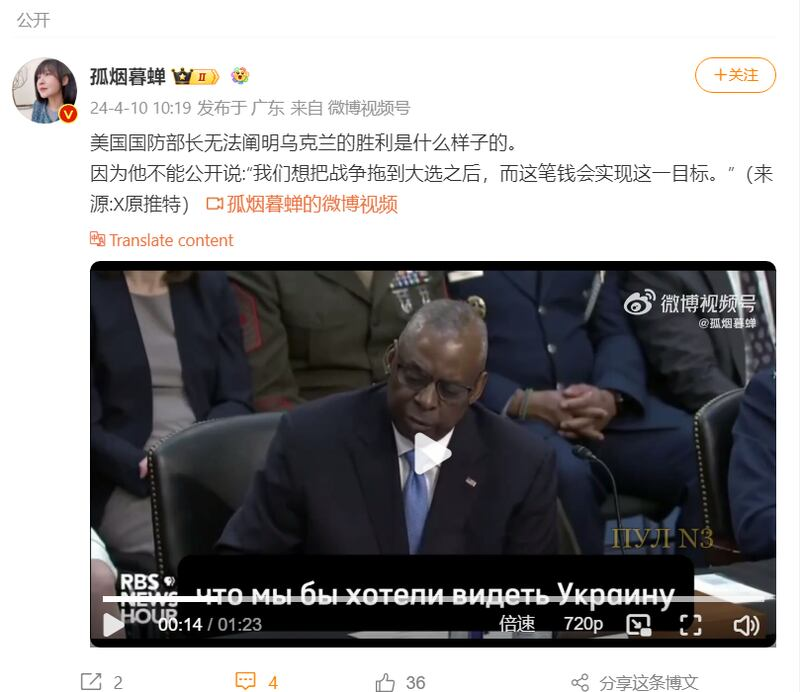
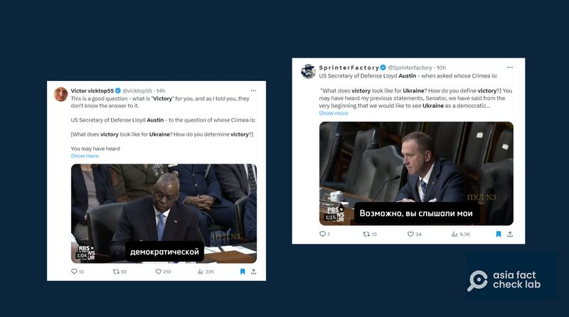

# 事實查覈｜美國防部長說不出來何謂"烏克蘭打勝仗"？

作者：鄭崇生，發自華盛頓

2024.04.19 17:06 EDT

## 標籤：錯誤

## 一分鐘完讀：

"美國國防部長無法闡明烏克蘭的勝利是什麼樣子的"。4月10日,中文博主" [孤煙暮蟬](https://weibo.com/2150758415/5021736648840986)"從X(前推特)搬運一則視頻至新浪微博,發文聲稱美國防長奧斯汀(Lloyd Austin)無法闡明烏克蘭的勝利,是因爲他不能公開說美國想把戰爭拖到大選後,而美國國會批准預算的過程會將戰爭拖下去。

然而,亞洲事實查覈實驗室發現,奧斯汀4月9日在 [聯邦參議院國防委員會的預算聽證會](https://www.armed-services.senate.gov/hearings/to-receive-testimony-on-the-department-of-defense-budget-request-for-fiscal-year-2025-and-the-future-years-defense-program)上,確實曾明確指出"烏克蘭能維持民主、獨立且能捍衛自身領土主權,抵抗侵略",這就是烏克蘭的勝利。

因此，孤煙暮蟬所稱美國國防部長無法定義勝利的說法，並不是事實。而美國是否要“將戰爭拖到大選後”則是孤煙暮蟬本人的揣測和意見，她沒有提供證據支持這一說法。

孤煙暮蟬發文質疑美國防部長 （圖截取自新浪微博）

## 深度分析：

追溯孤煙暮蟬視頻的來源,亞洲事實查覈實驗室發現和X上長期以來立場被視爲 [親俄羅斯的使用者](https://x.com/vicktop55/status/1777924967092441190)於 [偏右翼博主](https://x.com/Sprinterfactory/status/1777981505786069421)發佈的影片是同一個。這兩人都是在網上募集有償訂閱的博主,他們都將奧斯汀與聯邦參議員施米特(Eric Schmitt)部分詢答逐字稿列在X的發文內容中,儘管奧斯汀明確回答了美國認爲"烏克蘭勝利"的定義,其中自稱是"俄羅斯網絡通訊員"的博主"Victor Victop55"仍質疑美國對俄烏戰爭的退場機制沒有答案,經由孤煙暮蟬搬運到了新浪微博上,也將錯誤訊息轉至中文世界。

立場親俄羅斯（左）與親右翼X博主發佈美國防長奧斯汀在國會聽證的視頻是同一個，且都有俄文字幕。

這段詢答的原始內容,亞洲事實查覈實驗室根據 [視頻](https://www.armed-services.senate.gov/hearings/to-receive-testimony-on-the-department-of-defense-budget-request-for-fiscal-year-2025-and-the-future-years-defense-program)整理逐字稿如下:(約02'53"01開始)

施密特：所以，對烏克蘭來說，何謂勝利？你如何定義（烏克蘭）打勝仗？

奧斯汀：參議員，你可能聽過我之前講過多次的說法了，我們從一開始就說，我們希望看到烏克蘭是一個民主國家，她是獨立的、有能力保護與捍衛自己的領土主權，並且能抵抗侵略。

施密特：這表示克里米亞是烏克蘭的一部分嗎？

奧斯汀：克里米亞是烏克蘭的一部分。

施密特：好吧，是的，但爲了結束這場戰爭，烏克蘭必須控制克里米亞嗎？

奧斯汀：就事態會如何發展而言，我不想預測（烏克蘭）總統澤連斯基會有什麼說法。

施密特：我想，恕我直言，這就是問題所在之一，這屆（拜登）政府沒有闡明過我們的退場機制爲何，在我來看，這就是爲了場沒有明確目標的戰爭（向我們）要求一張空白支票，這是永無止盡的，這就是我們所質疑的，所以我纔沒有對補充提案投贊成票，因爲，我們對這筆錢要如何運用，我們沒有足夠的掌控，甚至何謂勝利的定義都沒有。

影片內容雖然到此結束，施密特事實上還接着講述他明白美國爲了自身利益必須堅持下去，支持烏克蘭。他也補充，一份預算書如果不能說明行政部門對這場戰爭會打多久有相關計劃與目標，國會當然有理有反對。

從問答脈絡來看,事實上,奧斯汀有給出烏克蘭打勝仗的定義,而議員詢問美國對克里米亞在俄烏戰爭中定位的看法,奧斯汀的說法則是重申美國的一貫立場,及應由烏克蘭政府決定戰事發展,這其實也 [並不是新說法](https://web.archive.org/web/20230818111219/https:/www.cnn.com/2023/08/18/politics/ukraine-crimea-focus-biden-administration/index.html)。

另外，亞洲事實查覈實驗室也通過谷歌系統翻譯視頻下方的俄文字幕，內容與上述問答一致，也在奧斯汀講述美國對烏克蘭勝利的定義時、有符合英文原文的俄文翻譯，也因此，所謂“何謂烏克蘭打勝仗，美國國防部長也沒想法”的陳述，不但是錯誤的，將美國國會議員的質疑，當成是行政部門對克里米亞在俄烏戰事中的立場，同時也是誤導。

*亞洲事實查覈實驗室(* *Asia Fact Check Lab)針對當今複雜媒體環境以及新興傳播生態而成立。我們本於新聞專業主義,提供專業查覈報告及與信息環境相關的傳播觀察、深度報道,幫助讀者對公共議題獲得多元而全面的認識。讀者若對任何媒體及社交軟件傳播的信息有疑問,歡迎以電郵afcl@rfa.org寄給亞洲事實查覈實驗室,由我們爲您查證覈實。*

*亞洲事實查覈實驗室在* *X、臉書、IG開張了,歡迎讀者追蹤、分享、轉發。X這邊請進:中文*  [*@asiafactcheckcn*](https://twitter.com/asiafactcheckcn)  *;英文:*  [*@AFCL\_eng*](https://twitter.com/AFCL_eng)  *、*  [*FB在這裏*](https://www.facebook.com/asiafactchecklabcn)  *、*  [*IG也別忘了*](https://www.instagram.com/asiafactchecklab/)  *。*

[Original Source](https://www.rfa.org/mandarin/shishi-hecha/hc-04192024163300.html)