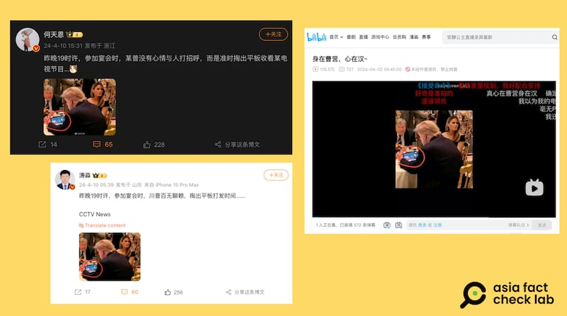
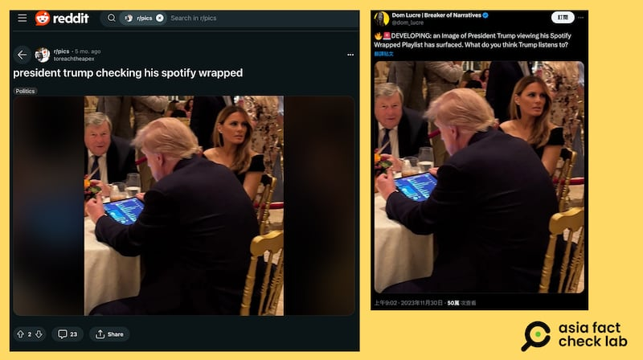
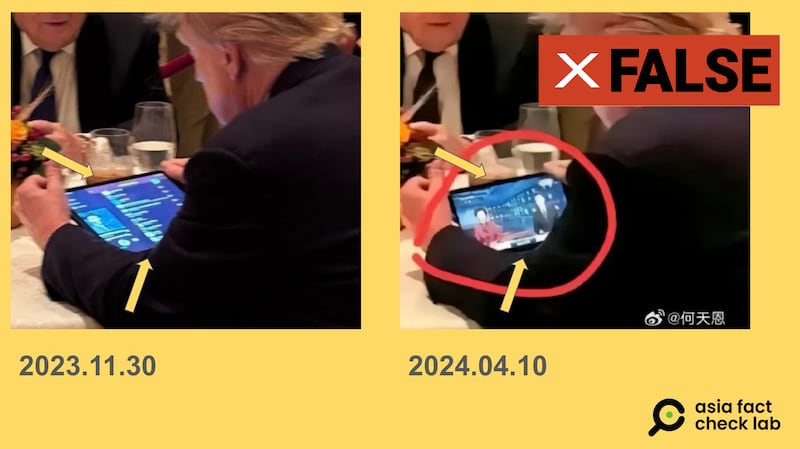
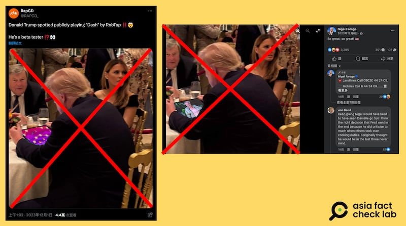

# 事實查覈｜特朗普在宴會間隙看央視新聞聯播？

作者：董喆

2024.04.23 13:08 EDT

## 標籤：錯誤

## 一分鐘完讀：

近期中國社羣平臺出現一張截圖，顯示特朗普在一場宴會的空檔時間，用平板電腦看央視新聞聯播。 亞洲事實查覈實驗室查證發現，此張照片最早出現在2023年11月，原始版本爲特朗普用平板電腦觀看某音樂串流平臺的播放清單，此事也曾獲得主流媒體報道。 根據時間序與照片修圖瑕疵，特朗普收看央視新聞聯播是錯誤訊息。

## 深度分析：

中國社羣平臺微博( [貼文1](https://archive.ph/3uTsq) , [貼文2](https://archive.ph/CaSLq) )和bilibili在4月10日前後出現一則傳言,內容是美國前總統特朗普在一場宴會中使用平板電腦,屏幕上是中國央視新聞聯播畫面。 網民發文稱,"昨晚19時許,參加宴會時,特朗普百無聊賴,掏出平板打發時間.....CCTV News",戲稱特朗普"身在曹營,心在漢"。

中國社羣平臺出現傳言，稱特朗普在宴會中用平板電腦觀看央視新聞聯播（微博、bilibili截圖）

亞洲事實查覈實驗室以圖反搜，發現這張特朗普在宴會使用平板電腦的照片最早出現在2023年11月，可以證明傳言稱“昨晚19時”的說法爲假。

2023年11月30日,X上出現一張模糊影像,畫面中特朗普與他的妻子梅蘭妮亞在一場宴會上,特朗普背對鏡頭正在使用平板電腦,畫面是知名音樂串流平臺的播放清單頁面 。 同一時期在X、reddit上都有諸多討論,網友好奇特朗普都在聽些什麼。 美國 [《新聞週刊》(Newsweek](https://www.newsweek.com/donald-trump-spotify-wrapped-playlist-1848375) )也針對此發表了報道。

2023年，特朗普在一次宴會中用平板電腦瀏覽音樂串流平臺播放清單的畫面引發社羣討論（X、reddit截圖）

我們進一步將畫面放大，可以看到原始版本圖片的平板電腦畫面四邊平整，但收看央視版本的圖片中，屏幕上方有不明曲線，屏幕四邊寬度並不一致。

特朗普觀看央視新聞聯播的照片中，平板電腦屏幕邊框不平整。 （X，微博截圖）

因此以時間順序與後製修圖瑕疵，特朗普收看央視新聞聯播爲假。

查覈過程中亦發現,此張特朗普使用平板電腦的照片早已多次被網友"惡搞"成不同版本,像是電玩或動漫畫面。 根據英國 [《每日郵報》報道](https://www.dailymail.co.uk/tvshowbiz/article-12833693/Nigel-Farages-team-edited-snap-Donald-Trump-Im-Celebrity.html) ,前英國脫歐黨黨魁奈傑爾法拉奇(Nigel Farage)也曾用這張照片,宣傳自己參加實境秀《我是名人,讓我離開這裏! 》。

特朗普使用平板電腦的照片多次被網友“惡搞”成不同版本。 （臉書、Ｘ截圖）

亞洲事實查覈實驗室同步聯繫這張照片的原始發佈者，以及特朗普的媒體團隊，希望能取得這張照片的確切拍攝時間、地點，但至截稿前未獲回應。

*亞洲事實查覈實驗室(* *Asia Fact Check Lab* *)針對當今複雜媒體環境以及新興傳播生態而成立。我們本於新聞專業主義,提供專業查覈報告及與信息環境相關的傳播觀察、深度報道,幫助讀者對公共議題獲得多元而全面的認識。讀者若對任何媒體及社交軟件傳播的信息有疑問,歡迎以電郵* *afcl@rfa.org* *寄給亞洲事實查覈實驗室,由我們爲您查證覈實。*

*亞洲事實查覈實驗室在* *X* *、臉書、* *IG* *開張了,歡迎讀者追蹤、分享、轉發。* *X* *這邊請進:中文 [@asiafactcheckcn](https://twitter.com/asiafactcheckcn)*  *;英文: [@AFCL\_eng](https://twitter.com/AFCL_eng)*  *、 [FB在這裏](https://www.facebook.com/asiafactchecklabcn)*  *、 [IG也別忘了](https://www.instagram.com/asiafactchecklab/)*  *。*

[Original Source](https://www.rfa.org/mandarin/shishi-hecha/hc-04232024130251.html)