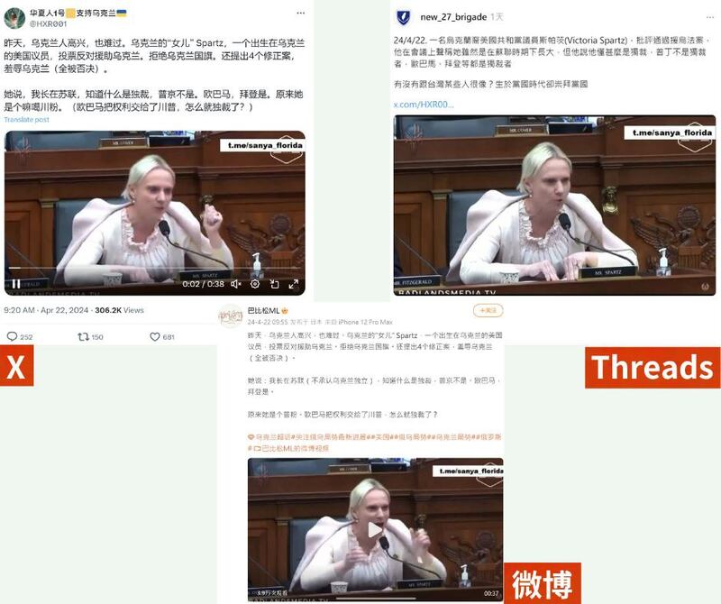
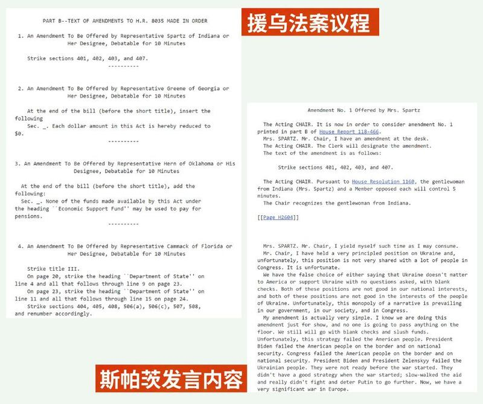
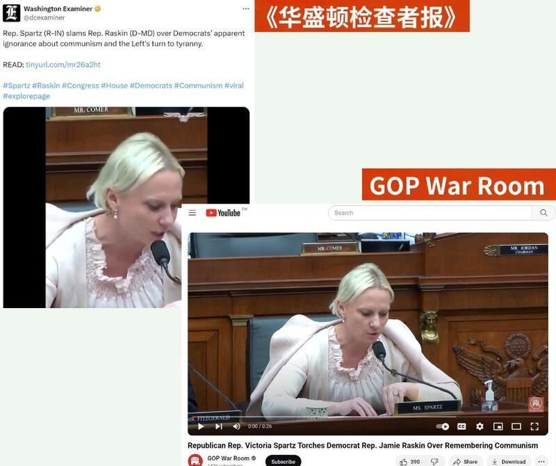

# 事實查覈｜烏克蘭裔美國議員反對援烏？ 說普京不是獨裁者？

作者：艾倫

2024.04.24 18:35 EDT

## 標籤：誤導

## 一分鐘完讀：

美國4月20日通過新的 [對外軍事援助法案](https://apnews.com/article/ukraine-aid-israel-tiktok-congress-a8910452e623413bf1da1e491d1d94ba),總計950億美元的補助款裏,有610億將用於支援正在抵抗俄羅斯入侵的烏克蘭。 法案通過後,中文社交媒體上出現傳言,稱f出生在烏克蘭的美國衆議員反對援助烏克蘭,還提出四個修正案羞辱自己的祖國,並發表言論,稱普京不是獨裁者,現任美國總統拜登纔是。

經查，相關說法有多處錯誤、誤導信息。 斯帕茨發起“羞辱烏克蘭”的“四個修正案”說法不正確，雖然她確實投票反對援助法案，但她同時澄清自己的觀點是支持援烏，但希望以不同方式。此外，在她當天和近期發言中，都沒有類似“普京不是獨裁者”的言論。

## 深度分析：

近期,X賬號" [華夏人一號](https://apnews.com/article/ukraine-aid-israel-tiktok-congress-a8910452e623413bf1da1e491d1d94ba)"發文稱,烏克蘭裔美國衆議員維多利亞·斯帕茨(Victoria Spartz)在4月20日時,於衆議院撥款委員會"投票反對援助烏克蘭",並提出四個修正案羞辱自己出生的國家。 文章還附上一段視頻截圖,稱斯帕茨說普京不是獨裁者,奧巴馬、拜登纔是。

相關信息也轉發到其他社媒平臺上,如微博賬號" [巴比松ML](https://weibo.com/1859508735/OaRIX947V?refer_flag=1001030103_)"及Threads平臺賬號" [新•二七部隊軍事雜談](https://www.threads.net/@new_27_brigade/post/C6DPMsDyxax/?xmt=AQGzxbjXqU9Et5YdHW37NrA7jz34M7RpcB-vtA1j0nF6tg)"都轉傳了相同截圖和類似文案。

多個社媒平臺（X、微博、Threads）上的中文帳號發佈有關烏裔衆議員維多利亞·斯帕茨的傳言

## 斯帕茨投票反對援烏？"提出了四個修正案"羞辱烏克蘭？

傳言中稱斯帕茨“投票反對援助烏克蘭”、並提出“羞辱烏克蘭”的四個修正案是否爲真？ 亞洲事實查覈實驗室細查當天美國國會的發言記錄，發現這樣的說法涉嫌誤導。

首先,斯帕茨確實在 [當天的議程](https://www.congress.gov/congressional-report/118th-congress/house-report/466)對援烏法案投下反對票。但她在 [發言中](https://www.congress.gov/congressional-record/volume-170/issue-70/house-section/article/H2593-1?s=3&r=2)特意補充,自己並不反對援助烏克蘭,而是對援助的額度和監督方式另有主張。

她表示，美國現在只剩下兩個“錯誤”的選擇，也就是要麼說烏克蘭對美國不重要，要麼就是無條件地開空白支票支持烏克蘭。 “這兩種立場都不符合我們的國家利益，也不符合烏克蘭人民的利益。不幸的是，這種敘述幾乎壟斷了整個輿論，包含我們的政府、社會和國會。”

此外，傳言中的斯帕茨提出四個“修正案”、“羞辱烏克蘭”的說法也有問題。

4月20日美國國會審議援烏法案議程中，有四位議員發言提出對該法案的修改建議。斯帕茨只是其中一個修改建議的提出者，她建議修改法案中的“401、402、403 和407項內容”，經檢視，這四項內容都涉及對烏援助的增款的數額變動。

另有兩個修正草案爲同黨其他議員提出，分別爲喬治亞州的瑪喬麗·泰勒·葛林（Marjorie Taylor Greene）及佛羅里達的凱特·侃麥克（Kat Cammack）發表，不過最後也都遭到否決。當天原定由奧克拉荷馬州的凱文·赫恩（Kevin Hern）提出的其中一個修正草案，最後並沒有被討論。

衆議院4月20日針對外國軍事援助法案所開的議程及發言記錄（美國國會網站截圖）

## 斯帕茨稱"普京不是獨裁者"？

針對援烏法案，斯帕茨有沒有說“普京不是（獨裁者），歐巴馬、拜登是”？

用傳言所附截圖在谷歌上反搜,我們找到3月13日《華盛頓檢查者報》(Washington Examiner)的 [X帖文](https://twitter.com/dcexaminer/status/1767668137460109536),內容爲斯帕茨抨擊馬里蘭州民主黨衆議員傑米·拉斯金(Jamie Raskin),她批評民主黨對共產主義以及左派的專制傾向感到無知。此外,YouTube頻道"GOP War Room"也曾發表 [相同影音](https://www.youtube.com/watch?v=iia7lACdqik),且明確標註斯帕茨的言論發表於3月12日,比國會審議援烏法案的日期早了一個多月。

油管頻道"GOP War Room"及《華盛頓檢查者報》在三月份發佈傳言中的視頻（YouTube截圖）

檢視這段發生在一個多月前的發言，斯帕茨批評了奧巴馬和拜登的執政期間的政府表現，並使用了“暴政化（tyrannical）”一詞，但她並沒有稱奧巴馬和拜登是獨裁者“autocrat”，也沒有提到普京。

檢視4月20日國會發言全文，斯帕茨也並沒有所謂“普京不是（獨裁者），歐巴馬、拜登是”的發言。她的發言中唯一一次提及普京的地方，是在批評了美國和烏克蘭在這次戰爭中沒能有效的壓制普京。

因此，傳言說斯帕茨稱“普京不是獨裁者”的說法，是錯誤信息。

亞洲事實查覈實驗室針對質疑斯帕茨的烏克蘭立場去信詢問本人，至截稿日尚未得到回應。

高達將近千億美元的軍事援外法案於20日通過衆議院表決後，也已在23日（週二）通過參議院表決，拜登在23日（週三）也已簽署該法案，以及時援助有迫切需求的烏克蘭戰場。

==========================================

*亞洲事實查覈實驗室（Asia Fact Check Lab）針對當今複雜媒體環境以及新興傳播生態而成立。我們本於新聞專業主義，提供專業查覈報告及與信息環境相關的傳播觀察、深度報道，幫助讀者對公共議題獲得多元而全面的認識。讀者若對任何媒體及社交軟件傳播的信息有疑問，歡迎以電郵afcl@rfa.org寄給亞洲事實查覈實驗室，由我們爲您查證覈實。*

*亞洲事實查覈實驗室在X、臉書、IG開張了,歡迎讀者追蹤、分享、轉發。X這邊請進:中文*  [*@asiafactcheckcn*](https://twitter.com/asiafactcheckcn)  *;英文:*  [*@AFCL\_eng*](https://twitter.com/AFCL_eng)  *、*  [*FB在這裏*](https://www.facebook.com/asiafactchecklabcn)  *、*  [*IG也別忘了*](https://www.instagram.com/asiafactchecklab/)  *。*

[Original Source](https://www.rfa.org/mandarin/shishi-hecha/hc-04242024182649.html)