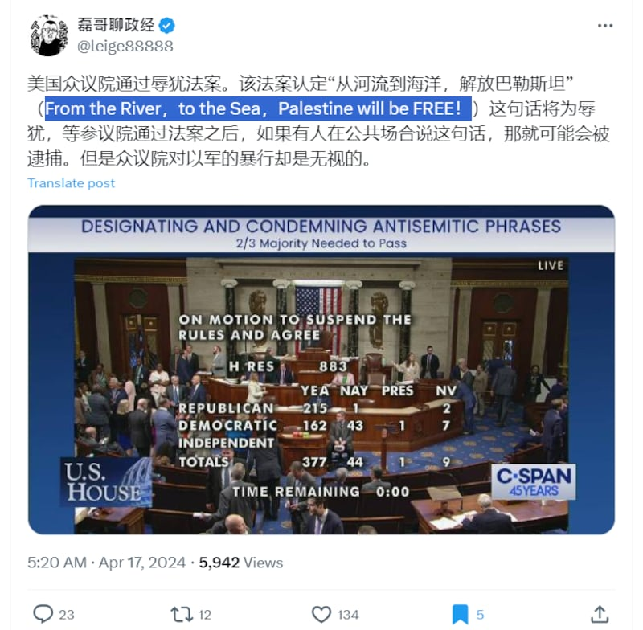
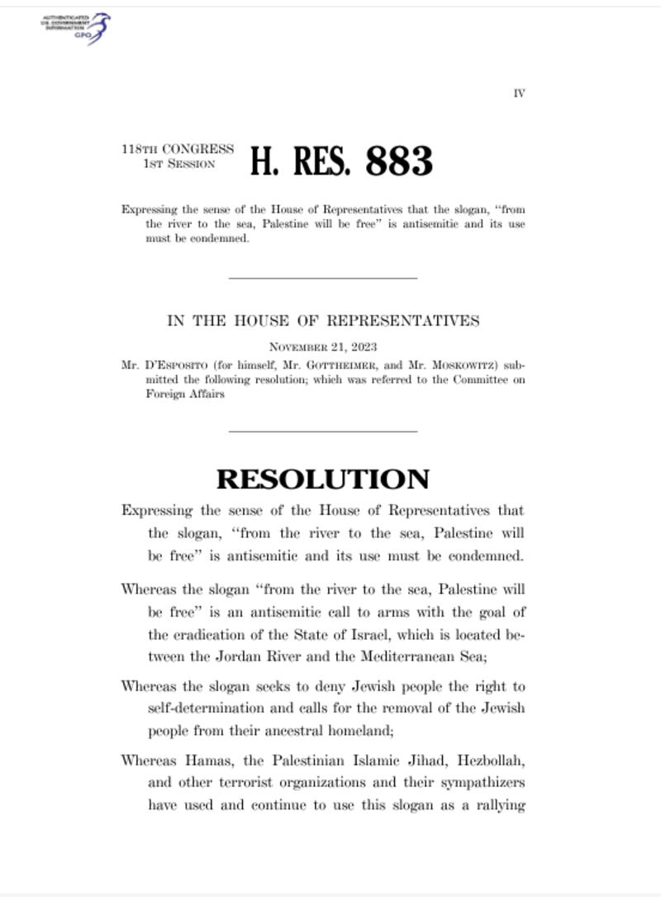

# 事實查覈 | 在美國喊支持巴勒斯坦的口號違法？

作者：鄭崇生，發自華盛頓

2024.04.25 15:28 EDT

## 標籤：錯誤

## 一分鐘完讀：

近日，有網絡傳言稱，美國衆議院“通過立法”認定一句常在支持巴勒斯坦集會中聽到的口號，“從河流到大海，巴勒斯坦終將自由”是反猶口號，並稱，“待等參議院通過法案之後，如果有人在公共場合說這句話，那就可能會被逮捕。”

經查覈，這個說法弄錯了這項決議的性質和法律效果。美國衆議院確實通過了一項決議案譴責這個口號，但這並不是立法，不會送交參議院，也並無法律效力。因此，該傳言含有錯誤信息。

## 深度分析：

美國數十間大學近來爆發聲援巴勒斯坦人的示威活動, [不完全統計顯示](https://www.cnn.com/business/live-news/columbia-usc-university-protests-04-25-24/index.html),全美有上百名學生遭逮捕,關於聲援巴勒斯坦和反猶主義之間界限的討論再次成爲熱點。

在此之前,X賬號"磊哥聊政經" [聲稱](https://perma.cc/X7VP-AZBX),美國聯邦衆議院通過立法,認定"從河流到大海,巴勒斯坦終將自由"(From the river to the sea, Palestine will be free)——這句常在支持巴勒斯坦的集會中聽到的口號是在侮辱猶太民族。他還稱,"待等參議院通過法案之後,如果有人在公共場合說這句話,那就可能會被逮捕。"

亞洲事實查覈實驗室則發現，這個說法弄錯了這項決議的性質和法律效果。

"磊哥聊政經"X推文稱美國立法限制言論 （X平臺截圖）

4月16日，美國衆議院確實以377比44的票數通過了一項決議案，譴責“從河流到大海，巴勒斯坦終將自由”這句口號帶有反猶主義。但國會通過決議案並不是立法程序。

首先，聯邦衆議院就本案通過的是“簡單決議案”（single resolution），不是“法案”（Bill）。決議譴責這句口號，表達的是國會立場，通過後不需送交聯邦參院即生效。另外，決議案也不需要送交美國總統籤屬，更不具備法律約束力。

第二，決議文里根本沒有提到喊這句口號可能面對的執法後果，並且，決議案是表達國會立場，具象徵性意義，不具法律約束力，更不可能有所謂“公共場合喊這句口號可能遭逮捕”的情況存在。

近一週來,美國多個大學校園 [爆發學生抗議,](https://apnews.com/article/columbia-yale-israel-palestinians-protests-56c3d9d0a278c15ed8e4132a75ea9599)部分校園出現美國警方驅散學生紮營抗議、逮捕學生和教職工的行動,但目前沒有證據表明,有人是因爲喊口號而被逮捕。

例如, [紐約大學請求紐約市警方進駐處理](https://www.cnn.com/2024/04/22/business/columbia-tensions-passover-virtual-classes/index.html),是因爲收到在抗議活動中有學生遭恐嚇的通報,而 [德州大學奧斯汀分校則是以維持校園秩序爲由,要求州警清場](https://www.statesman.com/story/news/education/2024/04/25/ut-austin-professors-students-pro-palestinian-protest-campus-live-updates/73450483007/),儘管警方的執法強度招致不少批評,但校長哈澤爾(Jay Hartzell)在 [聲明](https://president.utexas.edu/2024-messages-speeches/todays-events)中堅持,學生可以和平抗議表達立場,但校園不容學生非法佔領。至截稿,德州大學奧斯汀分校 [至少有46名遭逮捕學生已獲釋放。](https://www.cnn.com/business/live-news/columbia-usc-university-protests-04-25-24/h_8187cbfcb198935b8e09f68f43983ef8)

## 決議案內容

[有專家認爲](https://www.nytimes.com/2023/11/09/us/politics/river-to-the-sea-israel-gaza-palestinians.html),"從河流到大海,巴勒斯坦終將自由"這句口號,它的爭議處在於不同聽衆的感受大不相同之外,也和背後的大力倡議者身份有關。

[對許多以色列人及猶太裔民衆來說,這句話聽着是刺耳的](https://www.npr.org/2023/11/09/1211671117/how-interpretations-of-the-phrase-from-the-river-to-the-sea-made-it-so-divisive)。它隱含着要消滅在約旦河與地中海之間土地上建國的以色列——哈馬斯(Hamas)也是這句口號的倡導者,去年10月7日,哈馬斯突襲以色列後,美國唯一的巴勒斯坦裔衆議員塔伊布(Rashida Tlaib)也因爲這句口號受牽連。

密歇根州選出的民主黨籍議員伊布曾爲“從河流到大海”這一句子辯解，她還批評同黨籍的總統拜登（Joe Biden）力挺以色列，就是支持“對巴勒斯坦人的種族滅絕”。

去年11月,衆院以234票支持、188票反對的比數通過 [決議案](https://www.congress.gov/118/bills/hres845/BILLS-118hres845eh.pdf),譴責塔伊布在涉及以哈衝突上的"虛假陳述",其中,決議認爲,塔伊布認爲"從河流到大海"的這句口號是"對自由、人權與和平共處的渴望呼求",這一說法是錯誤的,也是強化暴力。決議文當時還寫到,這一口號"顯然意味着要毀滅以色列,剝奪猶太人的基本生存權。"

英國《衛報》當時 [指出](https://www.theguardian.com/us-news/2023/nov/07/house-vote-censure-rashida-tlaib-palestine-criticize-israel),衆院罕見地針對自家議員發表譴責決議案,共和黨在些微多數的脆弱主導下,還得到了民主黨人的支持,這是僅次於將她驅逐出衆議院的"懲罰措施"。

同樣也是決議案,衆院4月16日以377比44的票數通過譴責"從河流到大海,巴勒斯坦終將自由"的這句口號,是帶有反猶主義性質的。在5頁的 [決議文](https://www.congress.gov/118/bills/hres883/BILLS-118hres883ih.pdf)中,除了羅列哈馬斯對以色列發動攻擊外,還列出哈馬斯於2017年將這句話寫入組織章程後,更明白宣示"拒絕接受任何替代方案,從河流到海洋要全面徹底解放巴勒斯坦",且"不承認猶太復國主義實體"的合法性。

另外，決議文還細數包括基地組織（al-Qaeda）首領本拉登（Osama bin Laden）在內的人士都曾用此句口號支持完全消滅以色列。也因此，國會纔要通過這一決議案強烈譴責這一反猶太口號。

然而，美國衆議院通過的決議案譴責這句口號，表達的是國會立場，既不需要送交美國總統籤屬生效，也不具備法律約束力。

關於美國國會的立法程序,亞洲事實查覈實驗室曾有 [相關報道](2023-03-29_事實查覈 ｜ 美國通過系列“排華”措施，禁止買房、沒收資產？.md)。至於 [立法類別](https://www.house.gov/the-house-explained/the-legislative-process/bills-resolutions),簡單來說,除了法案(Bill),國會還有權通過聯合決議案(Joint Resolution)、共同決議案(Concurrent Resolution)和簡單決議案(Simple Resolution)。共同決議案須由兩院都通過,但和簡單決議案一樣,兩者都不需要送交總統籤屬。

4月16日聯邦衆議院通過的決議原文截圖 （美國國會官網截圖）

因此，這項決議案並非如傳言所說，可以作爲警察實施逮捕的依據，“磊哥聊財經”關於這項決議案的說法，含有錯誤信息。

## 口號的背景

該句口號的意義，並非事實查覈的範疇，但我們試圖整理其複雜背景，供讀者參考。

以色列在約旦河到地中海之間的這塊土地上建立中東唯一的非伊斯蘭國家後，和周邊穆斯林爲主的國家之間起衝突，一直以來是當地動盪的根源之一。

"從河流到大海,巴勒斯坦終將自由"的這句口號,最早可追自1960年代巴勒斯坦民族主義運動的創立初期。《紐約時報》曾 [報道](https://www.nytimes.com/2023/11/09/us/politics/river-to-the-sea-israel-gaza-palestinians.html),已故阿拉法特(Yasser Arafat)所領導的巴勒斯坦解放組織(The Palestine Liberation Organization)推動建國運動時就使用這句廣受歡迎。

阿拉法特早年率領巴解組織也是推動要將以色列趕出中東，1990年代才走向談判桌，在奧斯陸協定簽署後，他成爲巴勒斯坦自治政府的首位領袖。但巴勒斯坦的建立完整且獨立國家的道路仍然崎嶇，也讓這句口號至今仍是許多巴勒斯坦人重要的精神嚮往。

儘管巴勒斯坦已於1988年發表獨立宣言,獲得逾百個國家承認,但領土仍受到以色列不同程度的控制。而包括美國與中國都支持的兩國方案,後來也因以色列前總理拉賓(Yitzhak Rabin)遇刺身亡後, [在以、巴兩國境內都無法獲得支持](https://apnews.com/article/river-sea-israel-gaza-hamas-protests-d7abbd756f481fe50b6fa5c0b907cd49),至今仍難落實,地區和平遙遙無期。

至於在巴勒斯坦內部,哈馬斯武裝組織近年來通過選舉掌控加沙地區的執政權,而在2017年更將這句口號與不承認以色列一同寫入組織章程,《紐約時報》 [指出](https://www.nytimes.com/2023/11/09/us/politics/river-to-the-sea-israel-gaza-palestinians.html),也是因爲哈馬斯要消滅以色列的主張,賦予了這句口號更加黑暗的意義。

*亞洲事實查覈實驗室（Asia Fact Check Lab）針對當今複雜媒體環境以及新興傳播生態而成立。我們本於新聞專業主義，提供專業查覈報告及與信息環境相關的傳播觀察、深度報道，幫助讀者對公共議題獲得多元而全面的認識。讀者若對任何媒體及社交軟件傳播的信息有疑問，歡迎以電郵afcl@rfa.org寄給亞洲事實查覈實驗室，由我們爲您查證覈實。*

*亞洲事實查覈實驗室在X、臉書、IG開張了,歡迎讀者追蹤、分享、轉發。X這邊請進:中文*  [*@asiafactcheckcn*](https://twitter.com/asiafactcheckcn)  *;英文:*  [*@AFCL\_eng*](https://twitter.com/AFCL_eng)  *、*  [*FB在這裏*](https://www.facebook.com/asiafactchecklabcn)  *、*  [*IG也別忘了*](https://www.instagram.com/asiafactchecklab/)  *。*

[Original Source](https://www.rfa.org/mandarin/shishi-hecha/hc-04252024152251.html)