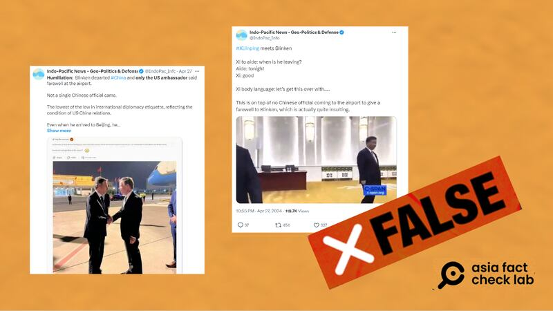
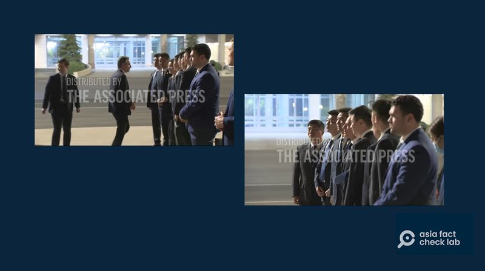
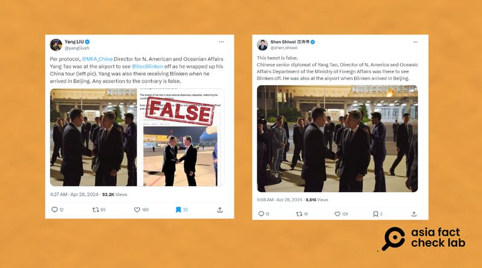
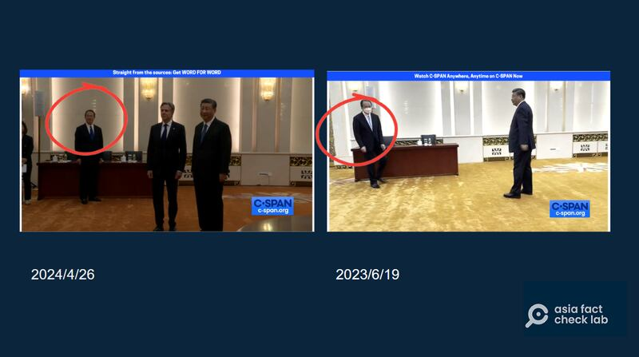
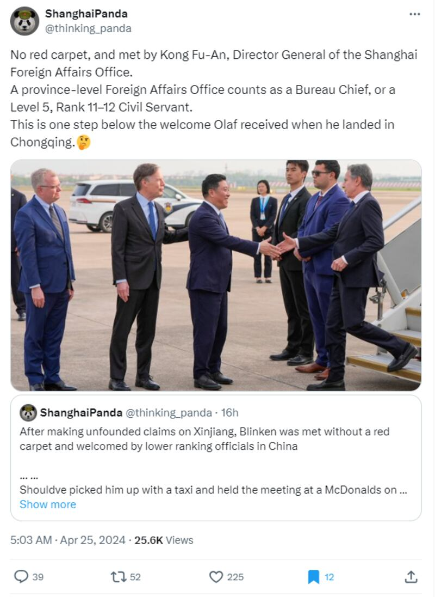
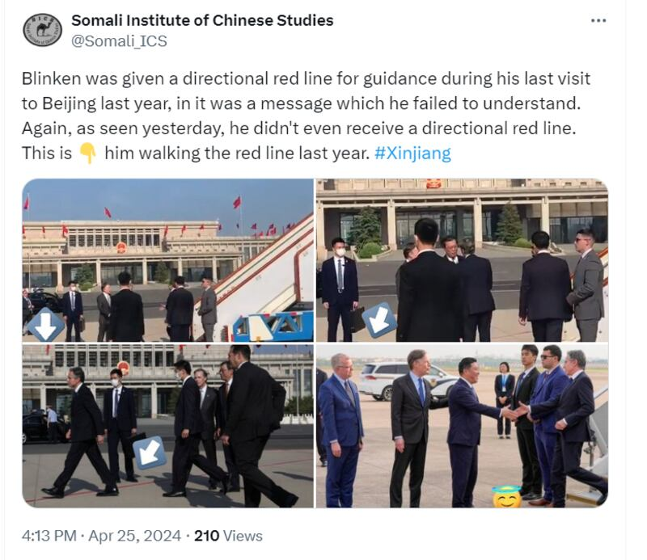
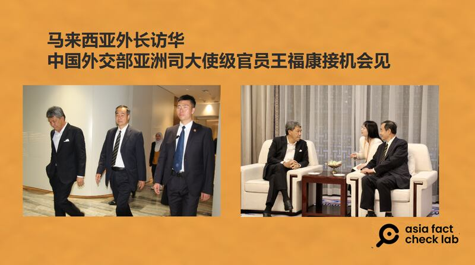
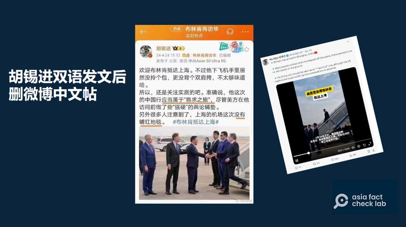

# 事實快查 | 布林肯訪華遭"降級"接待？

作者：鄭崇生，發自華盛頓

2024.04.29 19:01 EDT

美國國務卿安東尼·布林肯在其任內（Antony Blinken）二度訪華，於4月26日在北京會見中國國家主席習近平，後離開北京。在中美關係複雜背景下，布林肯此行再次受到輿論關注，媒體、社交網絡討論熱烈，關於此行的一些虛假、誤導信息也在中、英文社交媒體平臺上流傳。亞洲事實查覈實驗室整理了其中一些信息並查覈如下：

## 1. 習近平不待見布林肯，中國官方無人送機？

X賬號"Indo-Pacific News-Geo Politics&Defense"27日接連發布兩則推文( [1](https://perma.cc/XV6G-SD2M)、 [2](https://perma.cc/XHQ2-FYQ5)),聲稱沒有中國官員爲布林肯送機,習近平在與他會見前肢體語言與表達也顯得不耐煩,但這樣的論調是片面解讀新聞現場,並錯用視頻張冠李戴。

沒有中國官員爲布林肯送機？習近平聽到布林肯今晚走贊好？經查，上述兩則貼文都不是事實。（X截圖）

首先, [上圖左邊的照片](https://perma.cc/NWW4-VTTJ?type=image)是真實存在的場景,美國駐華大使伯恩斯(Nicholas Burns)確實有爲布林肯送機,但不是"只有他送機",中國官方也有派人來。亞洲事實查覈實驗室在路透社與美聯社的資料庫中發現,布林肯上專機前、還照慣例與這次接待他的中方人員合影留念。

布林肯上機離開前，與北京接待人員合影。（視頻截圖/美聯社）

另外,包括中國官方媒體 [新華社前駐華盛頓記者劉陽](https://perma.cc/7YE8-EQNA)及 [央視記者沈詩偉](https://perma.cc/Z9X3-2E25?type=image)也都在這則發文下標註說明,並附上中國外交部美大司長楊濤送機時與布林肯握手的照片,所謂"沒有一箇中國官員到場送機"的說法,是錯誤的。

劉陽及沈詩偉X賬號上貼出的中國官員爲布林肯機場送行時的照片 （X平臺截圖）

亞洲事實查覈實驗室還發現,這一自稱"印太新聞(Indo-Pacific News-Geo Politics&Defense)"的賬號,事實上是從中國新浪微博上搬運賬號名稱 ["唐哲同學"](https://weibo.com/u/3163693955?refer_flag=1005050010_)的照片與文字、改寫成英文。 目前,在新浪微博上已經查不到這則發文,但至截稿,在X上的這則錯誤訊息,已經有180萬人次的點閱。

至於"印太新聞"賬號發佈的 [視頻](https://perma.cc/XHQ2-FYQ5)則是張冠李戴,有兩大錯誤:1. 查找美國非營利的公共事務衛星有線電視網(C-SPAN),確認這則視頻是中國國家主席習近平2023年6月19日見布林肯的 [舊視頻](https://www.c-span.org/video/?528849-1/secretary-blinken-meets-chinese-president-xi-jinping),並非 [本次見面](https://www.c-span.org/video/?535227-1/secretary-blinken-meets-chinese-president-xi-jinping)。 2. 英文翻譯也是錯誤的,視頻中,習近平並未說"好",而是當他詢問陪同會見的官員"他(布林肯)是什麼時候走?",中國外交部禮賓司長洪磊回答"今天晚上"後,習近平重述了一次"今天晚上走"。

對照今年與去年兩人的會面場景，雖然現場佈置幾乎相同，但不少細節可明顯區分，在去年會見時，習近平打淺藍色領帶，今年會見則是深藍色領帶；去年陪同會見的洪磊戴着口罩、打淺色領帶，今年則沒帶口罩，打深色領帶，這些都顯示，這則網絡帖文將去年的影片充當此次習近平、布林肯見面的素材，且翻譯也有錯誤。

兩次會面現場細節對比 （C-SPAN官網截圖）

## 2. 布林肯接機規格不如德國總理朔爾茨？

X上經常與中國外交官員互動、名爲"上海熊貓"(ShanghaiPanda)的用戶 [聲稱](https://perma.cc/BH8X-ADU8?type=image),布林肯這次首站抵達上海,中方連紅地毯都沒鋪,且是由上海外事辦主任孔福安接機,相較於4月中才訪華的德國總理朔爾茨(Olaf Scholz)首站抵達重慶,中方給布林肯的"接待規格降了一級"。

"上海熊貓"稱中方"降級接待"布林肯 （X平臺截圖）

布林肯與朔爾茨在政治上的位階本就不同，訪問性質也不一樣，用朔爾茨的接待規格比較布林肯，稱“降級接待”，是有誤導性的。

首先，內閣制的德國，總統是虛位元首，總理掌行政實權，是國家領導人層級，而布林肯的國務卿職務只是內閣官員級別。

其次,和去年一樣,布林肯這次對華進行 [一般性的訪問(Visit)](https://www.fmprc.gov.cn/wjdt_674879/wsrc_674883/202404/t20240422_11285856.shtml), [而朔爾茲則是國家首腦級的正式訪問(Official visit)](https://www.fmprc.gov.cn/wjdt_674879/wsrc_674883/202404/t20240412_11280713.shtml)。

按照 [中國外交部的《禮賓指南》](https://www.mfa.gov.cn/web/lbfw_673061/lbzn_673063/202201/t20220114_10495537.shtml)及《 [維也納外交公約》的精神](https://legal.un.org/ilc/texts/instruments/english/conventions/9_1_1961.pdf),中國在布林肯這次訪華行抵達首站上海時、派出孔福安接機,沒有鋪紅地毯,這樣的安排是一般正常規格。

另根據 [路透社](https://www.reutersconnect.com/all?id=tag%3Areuters.com%2C2024%3Anewsml_RC2067AWFS0D&share=true),朔爾茨不久前訪華抵達首站重慶時,由中國駐德國大使吳懇及重慶市副市長張國智接機,中方爲國家領導人層級的正式訪問提供紅地毯與相應層級的地方官員接機安排,也符合慣例。

所謂對布林肯"降級接待"的誤導說法,這並不是第一次。去年布林肯任內第一次訪華時,輿論就所謂中方在接機規格上羞辱對待他的討論,詳見亞洲事實查覈實驗室當時發佈的 [查覈報告](https://www.rfa.org/cantonese/news/factcheck/visit-06202023143808.html/ampRFA)。

## 3. 中國這次沒安排"指引紅線"？

同樣在X上,名爲"索馬里中國研究院"(Somali Institute of Chinese Studies) [發圖文稱](https://x.com/Somali_ICS/status/1783590211353530826),布林肯去年6月訪問北京時,"中方還劃設引導方向的紅線,當時中國就是藉此給他信號,但布林肯卻沒能理解,這次,中國乾脆連紅線都不畫了。"

"索馬里中國研究院"稱中方這次連"指引紅線"都不給布林肯畫了（X平臺截圖）

首先,布林肯此次訪華首先抵達上海機場,並非上次的北京機場。去年他訪問時北京機場標註的"紅線",曾引發不少網絡議論,但不是用來"引導方向"的,上述亞洲事實查覈實驗室曾發佈 [查覈報告](2023-06-20_事實查覈｜"紅線"取代紅毯 布林肯遭中國羞辱？.md)介紹,那是機位安全線(Equipment restriction area marking)。

對照這次隨行採訪的美國有線電視新聞網(CNN)記者韓思樂(Jennifer Hansler)在個人X賬號上發出的 [短視頻](https://x.com/jmhansler/status/1783424884737208781),可清楚看到布林肯走下舷梯後,中方與美方的接待人員背後的北京機場地面上,仍可看到畫設有顏色不明的線條,應該就是機位安全線。

和去年6月相同，布林肯抵達北京是由中國外交部美大司長楊濤接機，北京機場同樣掛有中國五星旗。

值得注意的是,和布林肯同時在北京訪問的還有馬來西亞外長穆罕默德(Mohamad Haji Hasan)。 [根據中國外交部](https://www.fmprc.gov.cn/eng/xwfw_665399/s2510_665401/202404/t20240422_11286243.html),他對中國進行的是正式訪問(Official Visit),穆罕默德在 [個人X賬號上](https://x.com/MalaysiaMFA/status/1782605460526579782)公佈他23日抵達北京,亞洲事實查覈實驗室整理他公佈的照片 [搜索比對](https://iiccc.bfsu.edu.cn/info/1013/1755.htm)發現,接機除馬來西亞駐華大使諾曼(Norman Bin Muhamad),中國派出外交部亞洲司的大使級官員王福康,兩人隨後還舉行會談,但正式訪問中國的穆罕默德,沒有與習近平會見。王福康曾任中國駐馬爾代夫大使, [中國大使級外交官回到國內,級別由高到低爲副部,司或副司級](https://www.chinaqw.com/hdfw/2017/08-28/159279.shtml)。

馬來西亞外長穆罕默德（髮色灰者）抵達北京，由亞洲司的大使級官員王福康接機（左圖中與右圖右），雙方並舉行會談。（照片取自穆罕默德X賬號）

中國外交部負責亞洲事務、和楊濤同層級的官員是亞洲司司長劉勁松,根據 [中國外交部網站](https://www.mfa.gov.cn/wjbzhd/202404/t20240425_11289127.shtm),他25日陪同中國外長王毅與穆罕默德舉行會談。

## 4. 布林肯這次是"懇求之旅"？

中國《環球時報》前總編輯胡錫進在布林肯抵達前在個人微博上 [發文](https://xijin.news.blog/2024/04/24/%e6%ac%a2%e8%bf%8e%e5%b8%83%e6%9e%97%e8%82%af%e6%8a%b5%e8%be%be%e4%b8%8a%e6%b5%b7%e3%80%82%e4%b8%8d%e8%bf%87%e4%bb%96%e4%b8%8b%e9%a3%9e%e6%9c%ba%e6%89%8b%e9%87%8c%e5%b1%85%e7%84%b6%e6%b2%a1%e6%8b%8e/),除了也提到前述的上海機場沒有鋪紅地毯的質疑之外,他還稱:準確說,他這次的中國行應當屬於"懇求之旅",儘管美方在他訪問前做了些"強硬"的輿論鋪墊。

《環球時報》前總編輯胡錫進在內網微博上發文嘲諷美國國務卿布林肯訪華“懇求之旅”的帖子（左），已經刪除。（微博、X平臺截圖）

關於美中雙方官員在布林肯此行訪問前的"輿論鋪墊"是否"強硬",不屬於事實查覈範圍,但"懇求之旅"一說,則沒有事實依據。布林肯這次訪華, [中國外交部公佈](https://www.fmprc.gov.cn/wjdt_674879/wsrc_674883/202404/t20240422_11285856.shtml)是"應王毅邀請",並不是美方主動要求。

去年布林肯6月中訪華, [中國外交部的說明是](https://www.fmprc.gov.cn/wjdt_674879/wsrc_674883/202306/t20230614_11096559.shtml) "經中美雙方商定的安排"。

雖然胡錫進在微博上的發文已經刪除, [有網民已截圖在X上傳播](https://x.com/torontobigface/status/1783384781356482587),引發討論,而他在X上以英文發推文的相同內容,發稿前仍然存在,亞洲事實查覈實驗室無法得知胡錫進刪掉微博上的中文內容、卻保留英文內容的原因爲何。

*亞洲事實查覈實驗室(* *Asia Fact Check Lab* *)針對當今複雜媒體環境以及新興傳播生態而成立。我們本於新聞專業主義,提供專業查覈報告及與信息環境相關的傳播觀察、深度報道,幫助讀者對公共議題獲得多元而全面的認識。讀者若對任何媒體及社交軟件傳播的信息有疑問,歡迎以電郵* *afcl@rfa.org* *寄給亞洲事實查覈實驗室,由我們爲您查證覈實。*

*亞洲事實查覈實驗室在* *X* *、臉書、* *IG* *開張了,歡迎讀者追蹤、分享、轉發。* *X* *這邊請進:中文*  [*@asiafactcheckcn*](https://twitter.com/asiafactcheckcn)  *;英文:*  [*@AFCL\_eng*](https://twitter.com/AFCL_eng)  *、*  [*FB* *在這裏*](https://www.facebook.com/asiafactchecklabcn)  *、*  [*IG* *也別忘了*](https://www.instagram.com/asiafactchecklab/)  *。*

[Original Source](https://www.rfa.org/mandarin/shishi-hecha/hc-04292024183833.html)