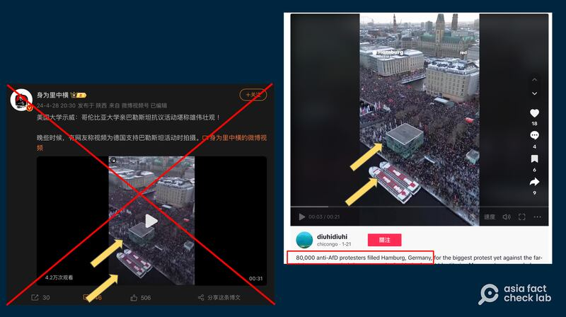
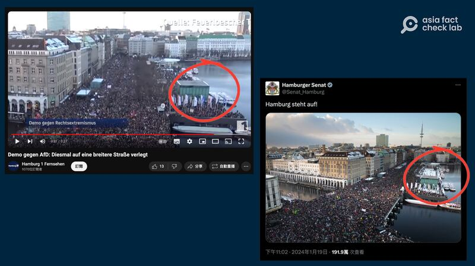
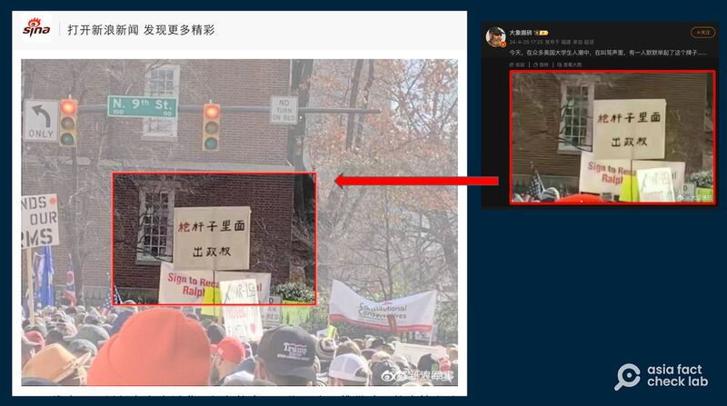
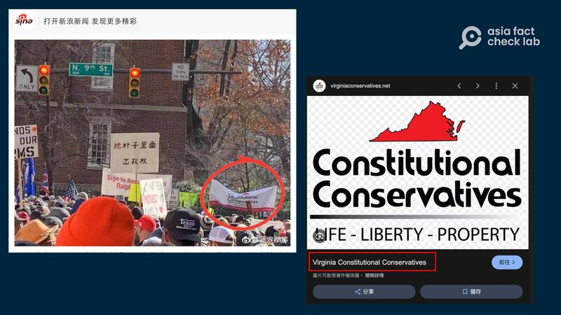
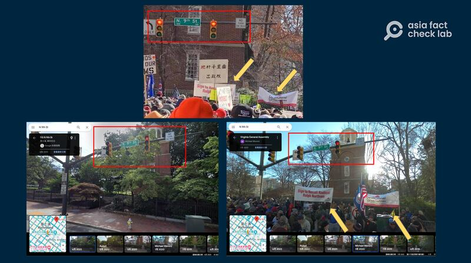

# 事實快查｜美國大學校園反戰示威，這些畫面是否屬實？

作者：董喆

2024.04.30 19:12 EDT

以哈衝突爆發近七個月，美國各大學校園反戰示威延燒，中文社羣上出現大量與此事件相關的資訊，亞洲事實查覈實驗室對其中傳播甚廣的一些文圖進行了查覈，發現至少有兩條不實信息：

## 美國哥倫比亞大學"雄偉壯觀"的示威畫面是否屬實？

4月18日，在哥倫比亞大學紮營的一百多名挺巴勒斯坦示威者被捕，示威活動隨即升溫，並蔓延到其他大學校園。

微博大V"身爲裏中橫"28日 [發佈影片](https://archive.ph/FlVma),稱美國哥大親巴勒斯坦遊行雄偉壯觀。不過他隨後遭到網友指正,改口稱這是德國支持巴勒斯坦活動。

微博轉貼的視頻與美國或是德國挺巴勒斯坦遊行無關，是今年一月發生在漢堡的反對AfD驅逐政策的示威活動。（微博、TikTok截圖）

我們將微博視頻進行截圖反搜,在X(原推特)與TikTok上都找到了相同視角的畫面( [貼文1](https://twitter.com/yasminalombaert/status/1753836101255549141), [貼文2](https://www.tiktok.com/@diuhidiuhi/video/7326221805868338462)),視頻發佈時間集中在今年1月,根據這些賬號的視頻說明,這則視頻是德國漢堡的示威遊行,目的是抗議德國極右翼"另類選擇黨"(AfD),因爲他們主張將所有"非德國背景"的人逐出德國,包含已經取得居留權的移民。

我們以關鍵字搜尋,找到了德國媒體"Hamburg 1 Fernsehen"針對漢堡反AfD的 [報道](https://www.youtube.com/watch?v=9R-zC2dg2I8&ab_channel=Hamburg1Fernsehen),視頻畫面與微博流傳影像一致。此外,漢堡參議院的X賬號亦在1月19日貼出這次示威的 [視頻](https://twitter.com/Senat_Hamburg/status/1748360331812892708?ref_src=twsrc%5Etfw%7Ctwcamp%5Etweetembed%7Ctwterm%5E1748360331812892708%7Ctwgr%5Eca0b686378e01ec354f81b8bb27c666aca05125c%7Ctwcon%5Es1_&ref_url=https%3A%2F%2Ffactcheck.afp.com%2Fdoc.afp.com.34JJ92A),畫面也相符。

德國媒體與政府機關轉貼的視頻也與微博轉傳的相符（YouTube、Ｘ平臺截圖）

因此微博轉貼的視頻與美國或是德國挺巴勒斯坦遊行均無關,是今年1月漢堡反對AfD驅逐政策的示威活動。經查,這則視頻早在今年2月就在英文社羣平臺遭誤傳,法新社亦曾對此發佈 [查覈報告](https://factcheck.afp.com/doc.afp.com.34JJ92A)。

## 美國大學示威中，有人舉起"槍桿子裏面出政權"的標語？

微博多個軍事大V( [貼文1](https://archive.ph/lVnCD), [貼文2](https://archive.ph/XkIdY))以及X賬號近日廣傳,"在衆多美國大學生人潮中、在叫罵聲裏,有一人默默舉起了這個牌子",並附上帶有"槍桿子裏面出政權"標語的照片。

槍桿子裏面出政權的說法，出自於中共第一代領導人毛澤東，他在1927年國共合作破裂後提出這句口號，意指政權是要靠軍事手段奪取和鞏固的。

亞洲事實查覈實驗室以圖反搜,發現這張照片2020年就曾出現在 [新浪軍事](https://k.sina.cn/article_1499104401_p595a849102700nbe9.html?from=mil),而新浪軍事刊登的這張照片相較微博版本更爲完整。

微博上流傳的照片2020年就已出現在網上（新浪軍事、新浪微博截圖）

我們從照片中其他布條找到關鍵字" constitutional conservatives",發現是 [維吉尼亞憲法保守黨](https://virginiaconservatives.net/)的旗幟。

照片中找到維吉尼亞憲法保守黨的旗幟（取自新浪軍事，Google搜尋）

近一步以VA、pro gun、rally等關鍵字搜尋,找到2020年 [美聯社](https://apnews.com/article/ap-top-news-richmond-virginia-charlottesville-us-news-2c997c92fa7acd394f7cbb89882d9b5b)與 [《紐約時報》](https://www.nytimes.com/2020/01/20/us/virginia-gun-rally.html)的相關報道,由於該州民主黨通過槍支管制立法的計劃,全美各地的擁槍人士在維吉尼亞州國會大廈和平集會。

我們從報道中確定,集會發生在維吉尼亞州的裏蒙奇(Richmond),我們將此地與畫面中的N 9th St.合併搜尋,確定槍桿子出政權的時間地點確實在維吉尼亞州,且根據Google地圖的地景回溯功能,2020年1月正好有民衆上傳了集會當時的照片。標語背後的紅磚白窗建築是一個鐘樓,地址是: [101 N 9th St, Richmond, VA 23219](https://www.google.com/maps/@37.5390517,-77.4355036,3a,75y,119.1h,90t/data=!3m6!1e1!3m4!1sdpUP7u6EC7IZgoDsgkcOhw!2e0!7i16384!8i8192?entry=ttu)。

根據Google地圖的地景回溯功能，2020年1月正好有民衆上傳了集會當時的照片。（取自Google地圖）

因此，“槍桿子出政權”的標語照片與挺巴示威無關，是2020年維吉尼亞州擁槍團體的集會照片。

*亞洲事實查覈實驗室（Asia Fact Check Lab）針對當今複雜媒體環境以及新興傳播生態而成立。我們本於新聞專業主義，提供專業查覈報告及與信息環境相關的傳播觀察、深度報道，幫助讀者對公共議題獲得多元而全面的認識。讀者若對任何媒體及社交軟件傳播的信息有疑問，歡迎以電郵afcl@rfa.org寄給亞洲事實查覈實驗室，由我們爲您查證覈實。*

*亞洲事實查覈實驗室在X、臉書、IG開張了,歡迎讀者追蹤、分享、轉發。X這邊請進:中文*  [*@asiafactcheckcn*](https://twitter.com/asiafactcheckcn)  *;英文:*  [*@AFCL\_eng*](https://twitter.com/AFCL_eng)  *、*  [*FB在這裏*](https://www.facebook.com/asiafactchecklabcn)  *、*  [*IG也別忘了*](https://www.instagram.com/asiafactchecklab/)  *。*

[Original Source](https://www.rfa.org/mandarin/shishi-hecha/hc-04302024190253.html)