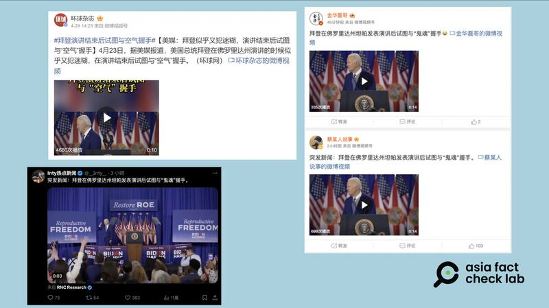
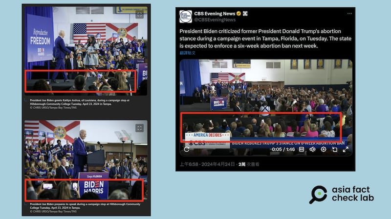

# 事實查覈 | 拜登競選演講後再次試圖"與鬼魂握手"？

作者：董喆

2024.05.01 15:20 EDT

## 標籤：錯誤

## 一分鐘完讀：

近期，社羣平臺再度流傳美國總統拜登“公開失態”的傳言，稱他在競選演講結束時試圖與“鬼魂”握手，中國官方媒體《環球雜誌》等亦跟進，進一步在社媒上傳播這個說法。經查，在活動現場，拜登所謂“握手”互動的方向確實有觀衆參與，美國白宮的現場逐字記錄也顯示，拜登當時在與側臺民衆互動，但鏡頭並未拍到，因此“與鬼握手”之說是錯誤訊息。

## 深度分析：

美國將於11月舉行總統大選，尋求連任的拜登23日在佛羅里達州舉行造勢活動，會後社羣平臺出現傳言，稱拜登在演講後試圖與“鬼魂”、“空氣”握手，意指他精神狀態不佳。傳言所附視頻顯示，拜登在演講結束時，展開雙手小跑向右方舞臺邁進，隨後又倒退幾步露出微笑，視頻中並未顯示他的前方有觀衆，因此看上去像是他一個人的獨自表演。

此傳言最早是由X(原推特)賬號RNC Research發起,該帳號簡介中自稱此賬號揭露拜登和民主黨的"謊言、虛僞和失敗的極左政策",由共和黨全國委員會管理。拜登"與鬼握手"的傳言和視頻除了在英語社羣備受討論,X平臺的不少中文帳號也進行了轉傳。中國社交媒體微博平臺上也有不少關於此事的議論,並且官方媒體新華社旗下的《環球雜誌》微博號亦 [跟進傳播](https://m.weibo.cn/detail/5026690143093068)。

社羣平臺以及中國官媒轉傳拜登與"鬼魂握手"的視頻。 （微博、X平臺截圖）

亞洲事實查覈實驗室檢視拜登佛州演講的各種角度畫面,發現,網傳視頻只展示了部分角度,沒將拜登當時面對的觀衆拍進去。從美國哥倫比亞廣播公司(CBS)的報道當天的 [新聞畫面](https://twitter.com/CBSEveningNews/status/1782907012201771474/video/1)可見,拜登右方舞臺設有座位;另外,佛州地方媒體Tampa Bay Times也釋出 [當天的側拍](https://www.msn.com/en-us/news/politics/see-photos-of-president-joe-biden-s-visit-to-tampa/ar-AA1nxmMt?ocid=socialshare),亦可看到拜登右方舞臺確實有觀衆。

對照拜登佛州演講的新聞畫面，其右方有觀衆席。 （取自X、Tampa Bay Times）

此外,白宮照慣例會在活動後發佈總統的 [發言逐字稿](https://www.whitehouse.gov/briefing-room/statements-releases/2024/04/23/remarks-by-president-biden-at-a-campaign-event-tampa-fl/),影片時間以及逐字稿內容,對照視頻,當時拜登演講結束後,臺下高呼"再四年!(Four more years! )"爲他打氣。 但拜登開玩笑裝作未聽清楚,反問"十美元?(10 bucks? )"隨後對臺下觀衆說:"嘿,孩子們,記得我告訴過你們的嗎?記得我們的約定嗎?(All right. Okay. Hey, kids, remember what I told you now? (Laughter.) Remember our deal?)"。

由此可知，拜登向右方舞臺的動作是在與觀衆互動，而非傳言所指，是“與鬼魂握手”的失智表現。

拜登今年將滿82歲，身爲美國史上最高齡總統，他的身心健康一直是外界關注焦點。其多次意外摔倒、口誤都引發討論，因此其疑似失智以及舉止怪異的傳言，時常招致美國國內政黨批評，而這些傳言也進一步成爲中國、俄羅斯媒體攻擊拜登和美國政局的材料。

2023年,俄羅斯官方媒體"今日俄羅斯"與中國媒體"四川觀察"稱拜登在北愛爾蘭大學演講時轉身向 ["向隱形人道歉"](https://www.rfa.org/cantonese/news/factcheck/biden-04202023074358.html),事實上拜登轉身是與看臺上的人羣互動。同年,拜登在白宮接見超級盃冠軍,他轉身與工作人員對話時, [被曲解爲舉止怪異](https://www.rfa.org/cantonese/news/factcheck/biden-07282023145245.html),也被中國外交官與官媒轉發。

有鑑於錯假資訊一再試圖引帶風向,傳播拜登心智能力有問題的敘事,亞洲事實查覈實驗室曾發表傳播觀察《 ["拜登露紙尿褲"假照片幾經闢謠仍在傳播](https://www.rfa.org/cantonese/news/factcheck/biden-11142023085820.html)》深入深討這一現象。而本篇查覈報告,則爲類似的媒體亂象再添一例。

*亞洲事實查覈實驗室（Asia Fact Check Lab）針對當今複雜媒體環境以及新興傳播生態而成立。我們本於新聞專業主義，提供專業查覈報告及與信息環境相關的傳播觀察、深度報道，幫助讀者對公共議題獲得多元而全面的認識。讀者若對任何媒體及社交軟件傳播的信息有疑問，歡迎以電郵afcl@rfa.org寄給亞洲事實查覈實驗室，由我們爲您查證覈實。*

*亞洲事實查覈實驗室在X、臉書、IG開張了,歡迎讀者追蹤、分享、轉發。X這邊請進:中文*  [*@asiafactcheckcn*](https://twitter.com/asiafactcheckcn)  *;英文:*  [*@AFCL\_eng*](https://twitter.com/AFCL_eng)  *、*  [*FB在這裏*](https://www.facebook.com/asiafactchecklabcn)  *、*  [*IG也別忘了*](https://www.instagram.com/asiafactchecklab/)  *。*

[Original Source](https://www.rfa.org/mandarin/shishi-hecha/hc-05012024151530.html)