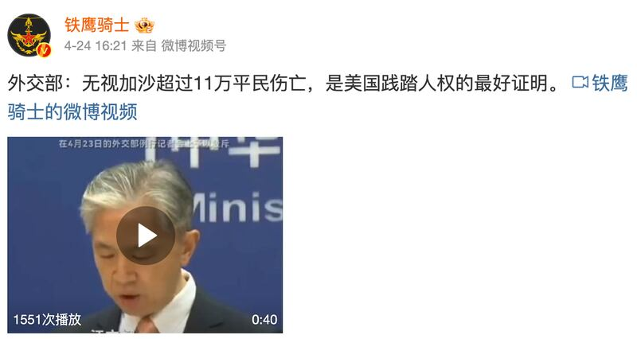

# 事實查覈｜美國無視平民傷亡，否決安理會停火努力？

作者：莊敬

2024.05.02 18:09 EDT

## 標籤：誤導

## 一分鐘完讀：

中國外交部發言人汪文斌近日表示，“美國無視加沙超過十一萬平民傷亡，連續四次否決聯合國安理會推動加沙立即停火的行動努力。這是美國漠視人權、踐踏人權的最好證明。”

汪文斌的說法缺乏背景脈絡。事實上，美國已多次說明立場，支持停火，但否決安理會有關加沙立即停火的決議，是因爲這類草案未將停火與釋放人質連結。此外，美國有向聯合國安理會提交一項替代的決議草案，要求在加沙地帶“立即停火併釋放人質”，但遭到中俄否決。

## 深度分析：

中國外交部發言人汪文斌在4月23日 [例行記者會上](https://www.fmprc.gov.cn/fyrbt_673021/202404/t20240423_11287839.shtml),回應有關美國國務院發佈"各國人權報告"的提問時,批評美國虛僞雙標,並說:"美國無視加沙超過十一萬平民傷亡,連續四次否決聯合國安理會推動加沙立即停火的行動努力。這是美國漠視人權、踐踏人權的最好證明。"

亞洲事實查覈實驗室認爲，汪文斌的說法忽略重要背景脈絡，以片面資訊誤導視聽。

微博"大V"博主轉發中國外交部發言人汪文斌在記者會的發言，稱美國無視加沙超過十一萬平民傷亡，是美國踐踏人權的最好證明。（微博截圖）

## 美國爲何否決加沙停火決議草案？

2023年10月7日，巴勒斯坦武裝組織“哈馬斯”（Hamas）跨越加沙邊境突襲以色列，引爆以哈衝突，雙方大量人員傷亡。

根據 [聯合國資料](https://news.un.org/zh/story/2024/03/1127561),以哈衝突以來,安理會多次表決有關決議草案,但因成員理事國意見分歧而陷入僵局。美國曾否決有關決議草案,並說明立場,因爲美國正和其它國家努力達成以哈之間的人質協議,然而俄羅斯等國提出的有關決議草案,可能對談判產生負面影響。

"在未達成協議要求哈馬斯釋放人質的情況之下,就要求立即無條件停火,並不會帶來持久和平。相反地,這可能會讓以哈之間的戰火延燒。" [美國駐聯合國代表琳達·托馬斯-格林菲爾德(Linda Thomas-Greenfield)說](https://usun.usmission.gov/remarks-by-ambassador-linda-thomas-greenfield-before-the-vote-on-a-un-security-council-draft-resolution-on-the-situation-in-the-middle-east/)。

而自去年10月7日以來，美國已二度向安理會提出有關以哈衝突的決議草案，呼籲加沙實現立即和持續停火，以及達成釋放人質的協議。上次的提案在去年十月下旬表決，遭中國和俄羅斯否決；第二次則是在今年三月表決，草案獲得十一票贊成、三票反對、一票棄權，因常任理事國中國和俄羅斯行使否決權，草案未獲通過。

## 中國的態度

對於美國否決安理會有關以哈衝突停火的決議草案,中方的態度多是"遺憾與失望",包括外交部發言人毛寧去年12月在 [記者會](https://www.fmprc.gov.cn/fyrbt_673021/jzhsl_673025/202312/t20231211_11199542.shtml)表示,"我們對美國獨家否決要求立即實施人道主義停火的安理會決議草案感到遺憾和失望。"今年 [2月](https://www.fmprc.gov.cn/fyrbt_673021/jzhsl_673025/202402/t20240221_11248010.shtml),毛寧又說:"美國再次獨家否決把加沙局勢推到了更加危險的境地,包括中方在內有關各方均對此表示強烈失望和不滿。"

今年三月,中國常駐聯合國副代表 [耿爽](http://usa.people.com.cn/BIG5/n1/2024/0306/c241376-40189997.html)表示,"加沙衝突爆發近五個月以來,安理會要求停火的行動被美國第四次強行阻撓,中方對此深表失望。"

在4月23日例行記者會上，汪文斌並沒有被問到聯合國安理會表決加沙決議草案的問題，而是在回應央視記者提問有關美國國務院發佈“各國人權報告”時，說出“美國無視加沙超過11萬平民傷亡，連續四次否決聯合國安理會推動加沙立即停火的行動努力。這是美國漠視人權、踐踏人權的最好證明。”

*亞洲事實查覈實驗室（Asia Fact Check Lab）針對當今複雜媒體環境以及新興傳播生態而成立。我們本於新聞專業主義，提供專業查覈報告及與信息環境相關的傳播觀察、深度報道，幫助讀者對公共議題獲得多元而全面的認識。讀者若對任何媒體及社交軟件傳播的信息有疑問，歡迎以電郵afcl@rfa.org寄給亞洲事實查覈實驗室，由我們爲您查證覈實。*

*亞洲事實查覈實驗室在X、臉書、IG開張了,歡迎讀者追蹤、分享、轉發。X這邊請進:中文*  [*@asiafactcheckcn*](https://twitter.com/asiafactcheckcn)  *;英文:*  [*@AFCL\_eng*](https://twitter.com/AFCL_eng)  *、*  [*FB在這裏*](https://www.facebook.com/asiafactchecklabcn)  *、*  [*IG也別忘了*](https://www.instagram.com/asiafactchecklab/)  *。*

[Original Source](https://www.rfa.org/mandarin/shishi-hecha/hc-05022024180231.html)