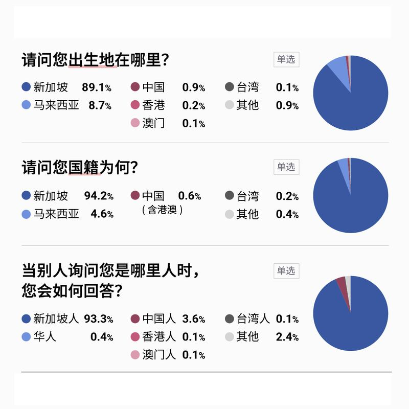
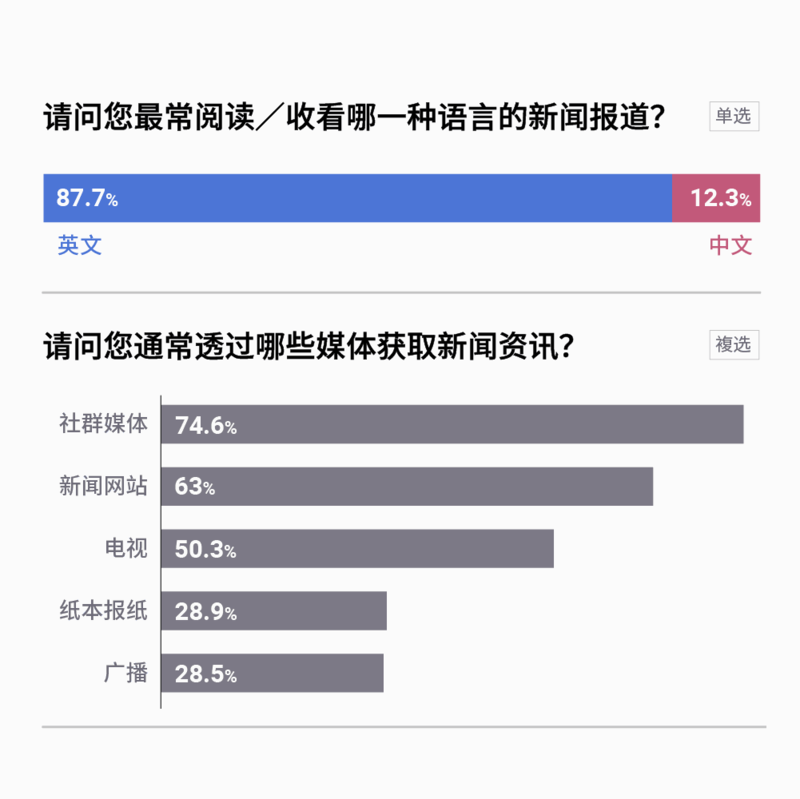
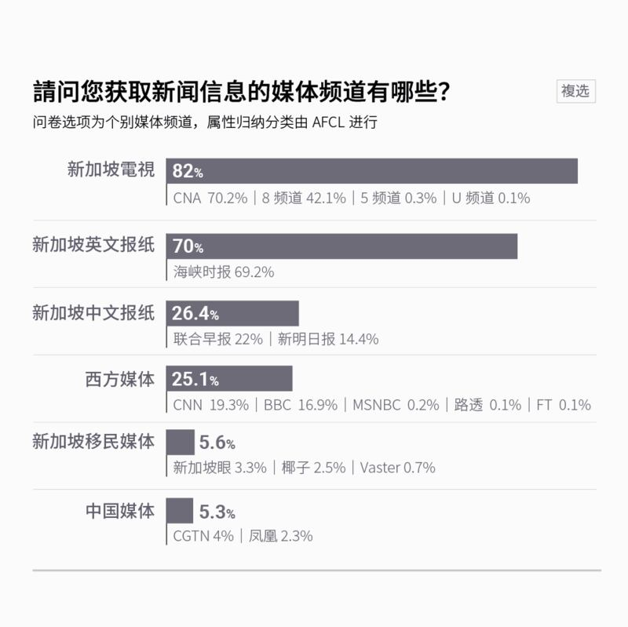
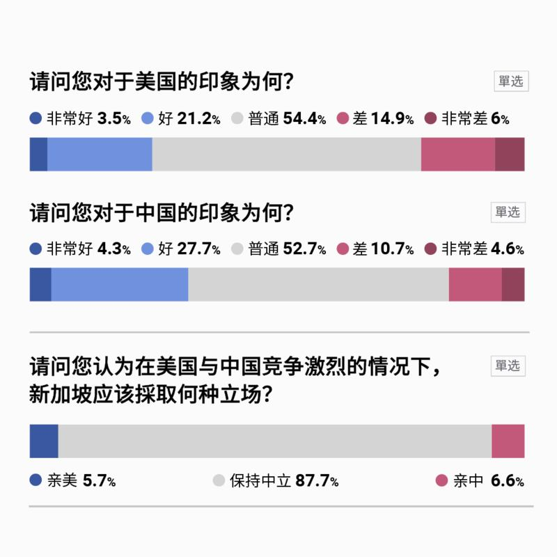
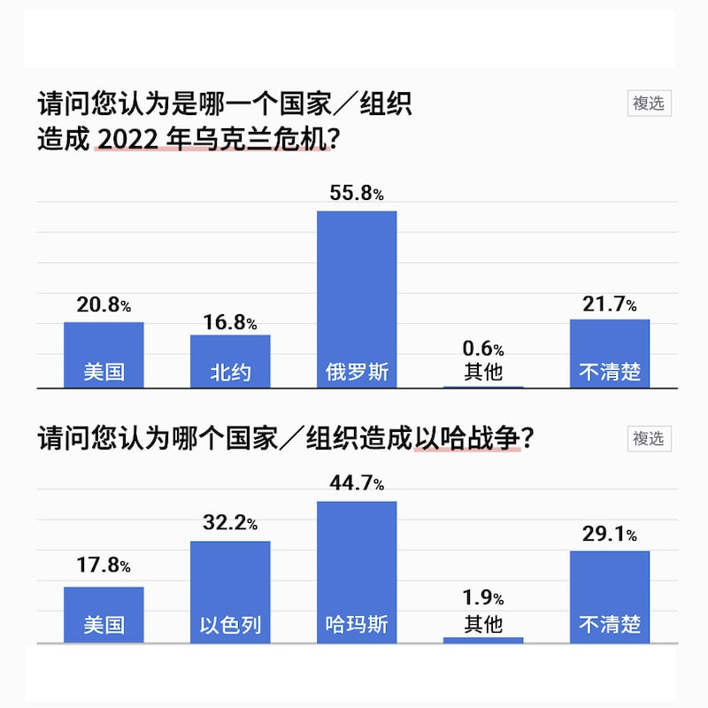
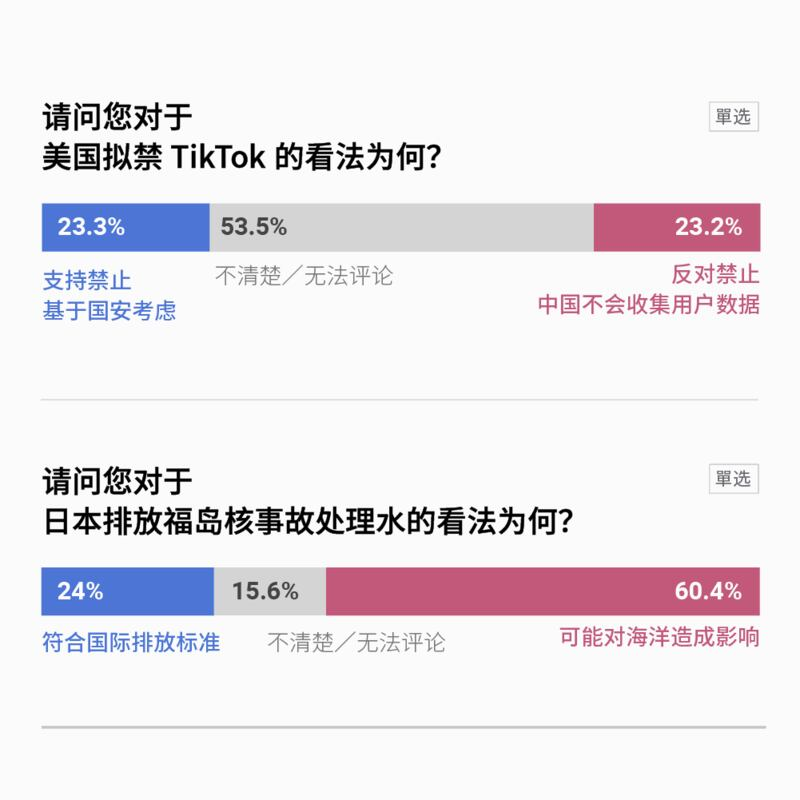

# 中國外宣在異鄉 | 新加坡篇：以問卷調查看華人的媒體觀 國際觀

2024.05.03 18:18 EDT

自由亞洲電臺亞洲事實查覈實驗室（Asia Fact Check Lab, AFCL）執行《中國外宣在異鄉：海外華人的平行時空》系列專題之“新加坡篇”，委託益普索（Ipsos）公司執行網路問卷調查，以瞭解新加坡華人觀看的媒體頻道、使用的社羣媒體、族羣身分認同三者與政治傾向之關係。

這份問卷調查時間爲2023年12月21日至2024年1月1日，對象爲18至65歲居住於新加坡的華人，共回收1000份有效樣本。問卷題目包括身份認同、媒體使用習慣、對特定議題的立場等，以下列出部分重要結果。

## 一、關於身份認同

## 二、使用傳統媒體的習慣

注：問卷選項爲個別媒體頻道，屬性歸納分類由AFCL進行。

## 三、使用社交、通信軟件的習慣

## 四、遭遇假新聞的經驗

## 五、對與美國、中國關係的取向

## 六、對部分敏感國際議題的判斷和取向

## 研究設計：

研究方法：量化網路調查

回捲訪問時長：9分鐘

研究地區：新加坡

抽樣方法：本專案採配額抽樣（非機率抽樣），就地區、性別、年齡等以市場的結構來控制樣本組成。

資料收集：由益普索合作之線上固定樣本執行

資料蒐集期間：2023/12/21~2024/1/1

樣本數：本次共回收1000份有效樣本，在95信心水準下， 抽樣誤差±3.1%。

受訪者條件：18~65歲居住於新加坡之華人

配額設定：

男：女 = 50%：50%

18-29歲：30-39 歲：40-49 歲：50-59 歲：60-65 歲 = 20%：22%：23%：23%：11%

[Original Source](https://www.rfa.org/mandarin/shishi-hecha/singapore/hc-05032024181700.html)