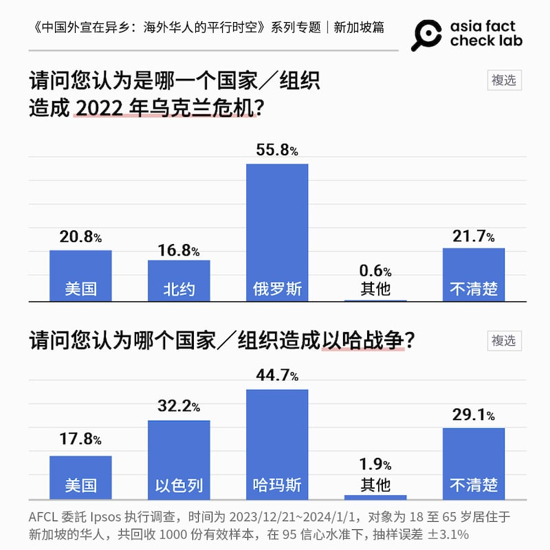
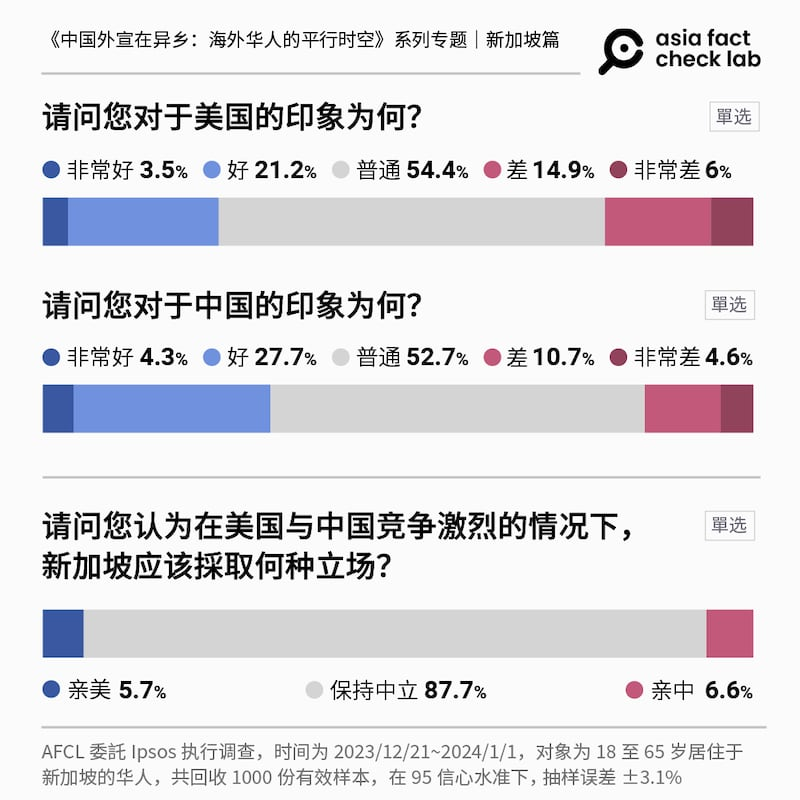
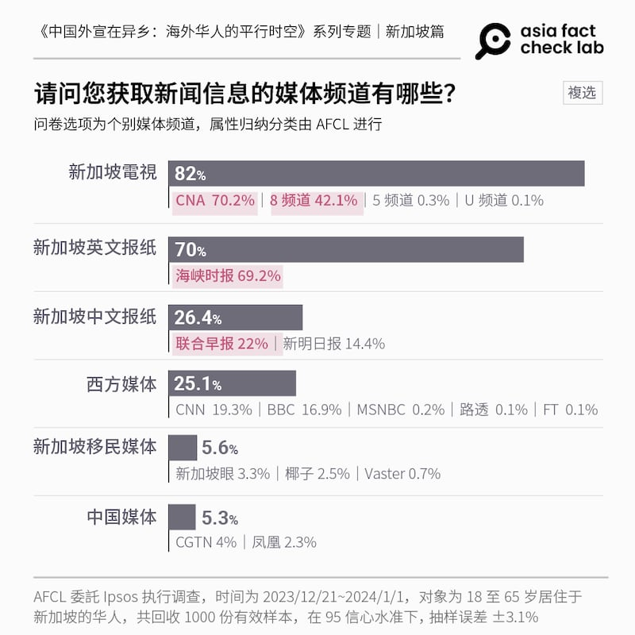
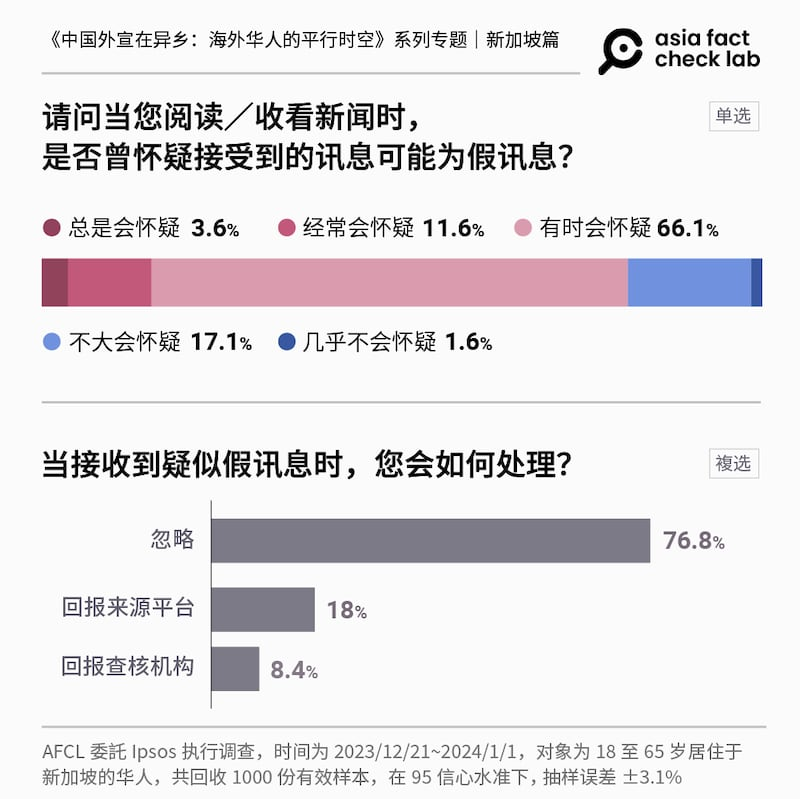
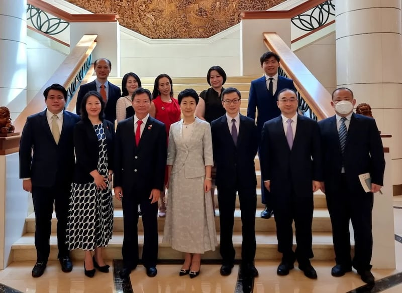
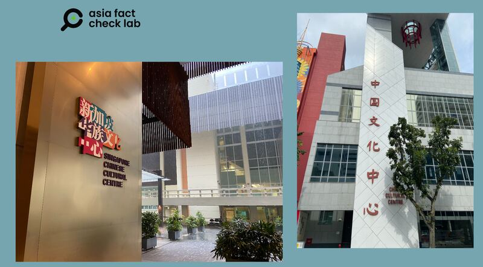
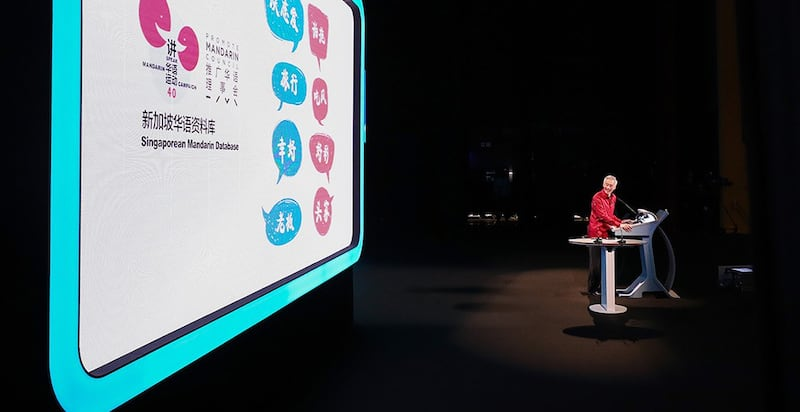

# 中國外宣在異鄉 | 新加坡篇: 走在鋼索上的政府

作者：莊敬、董喆

2024.05.04 11:03 EDT

*前言:華人人口接近四分之三的新加坡,在東南亞一直以強大的經濟實力和中立的國際政治著稱。新加坡政府對媒體嚴格控管,全國人民對政府對外關係政策高度認同。但這個情況近年來隨着大量中國新移民移入,以及中國政府鋪天蓋地的對外宣傳而開始動搖。不僅傳統華文媒體有時在不經意間出現中國觀點;訴求新移民的新媒體也緊跟習近平"說好中國故事"的號召;社交媒體、通訊軟件上的"中國敘事"更是暗潮洶湧。* *亞洲事實查覈實驗室延續2023年"中國外宣在異鄉"專題,2024年將關注視野移往新加坡,以問卷調查加上實地採訪的方式,揭露中國外宣如何影響新加坡媒體和新加坡人,而新加坡政府又如何應對。全系列分三篇刊發,本文爲第一篇。*

“在烏克蘭的問題上，人們在手機上接收到的信息，有不少顯然是要激起一種強烈的反美情緒。……另一些信息，目的是要抹黑俄羅斯和中國，他們也是想要影響我們的立場，要我們和西方站在一起。……我們必須防範不良外國勢力的干預，不論它來自哪一方，這樣我們才能夠保障國家的主權和獨立。”

新加坡2022年國慶,總理李顯龍的 [華語演說](https://youtu.be/KlFA5qxz4iA?t=426)以三分之一的篇幅談"地緣政治的挑戰",重申新加坡政府譴責俄羅斯。李顯龍更意有所指地說:"感謝大多數國人都支持政府對烏克蘭戰爭的立場,包括常用華文社交媒體的華社人士。"

## 作爲試金石的烏克蘭戰爭

2022年2月爆發的烏克蘭戰爭，對新加坡如同一塊試金石，測試出政府與華人主流輿論圈的立場差異有多大。因爲在中國官媒影響覆蓋範圍裏，輿論一面倒地支持俄羅斯，反對美國和西歐。李顯龍的發言顯示，新加坡政府可能意識到俄烏戰爭的議題在華人社羣之間的“風向”與政府的立場並不一致，而且嚴重到需要以國慶演說的規格，以總理之尊對國人進行“媒體識讀教育”。

儘管新加坡由政府最高層出面，明確譴責俄羅斯入侵烏克蘭。然而亞洲事實查覈實驗室（AFCL）委託益普索（Ipsos）執行的民調（注1）結果顯示，新加坡華人對於俄烏戰“責任歸屬”的意見仍分歧：55.8%受訪者認爲是俄羅斯造成烏克蘭危機，認爲是美國或北約的加總達37.6%。另有21.7%的受訪者“不清楚”是哪個國家或組織造成烏克蘭危機。

爲什麼在大多數情況下都與政府立場一致的華裔新加坡人，對烏克蘭戰爭的立場卻顯得分歧？

新加坡國立大學政治學副教授莊嘉穎（Ja Ian Chong）認爲因爲血統關係，華人更容易對中國產生“共感”，甚至支持中國的立場。同時中國在宣傳時也會繞開“共產主義”的宣傳，轉而強調“美國是挑起戰爭的亂源”等。這樣既不觸及新加坡華人內心殘留的“反共”意識，也更容易傳播、爲人接受。

“俄烏戰爭的時候，一有中國立場滲入民間，這個時候新加坡政府就會跳出來重新釐清，(對民衆)說要抱持新加坡的立場。”任職“新報業媒體”的記者李嘉銘(化名)告訴亞洲事實查覈實驗室，“中國影響一定會有的，中國每個地方都想要影響，可是如果這立場跟新加坡立場有衝突，這就沒有辦法work（產生效果）了”。

新加坡市場研究公司“Black Dot Research”總經理方國威（Nicholas Fang）則發現，戰事開打之初，新加坡的華語羣體收到大量中文內容，強調戰爭根源並非俄羅斯，而是西方、是北約。這些內容的來源難以追溯，但從使用的語言、宣傳的內容和所持的立場看來，都讓他們懷疑信息來自中國。

## 新加坡原則：國家利益先行

新加坡華人怎麼看待美中對峙下的國際政治？AFCL在民調中拋出了這個問題：“請問您認爲在美國與中國競爭激烈的情況下，新加坡應採取何種立場？”結果顯示，87.7%的人選擇“保持中立”，“親中”6.6 %，“親美”5.7%。

接近九成的民衆在美中對抗之間選擇了"保持中立"。莊嘉穎在一篇 [專文](https://carnegieendowment.org/2023/11/08/amid-contending-narratives-read-on-u.s.-and-prc-messaging-in-singapore-pub-90942)中比較了美中敘事對新加坡的影響,他分析,美國敘事的傳播可以透過不同媒體來源進行過濾;例如,《紐約時報》和《華盛頓郵報》的重點可能與《福斯新聞》、《英國廣播公司》和《經濟學人》的重點不同。

相反的，中國的敘事集中在官媒，他們出現在有線電視、中央電視臺和CGTN等中國官方頻道以及香港鳳凰衛視、TVB，甚至是臺灣的親中媒體中天新聞。敘事內容強調中國的經濟、政治甚至軍事崛起是不可阻擋的，並把美國描繪成邪惡的霸權角色。

莊嘉穎分析，與中國相比，美國的立場則更傾向強調民主價值與國際秩序，並輔以多元化的觀點。

進一步詢問莊嘉穎，中美之間，誰的敘事更爲成功？他回答中國敘事訴諸情感，更能調動民衆的情緒回應，由於新加坡的華人人口佔多數，中國對民族和文化的親和訴求對社會的某些階層具有吸引力，短期內中國敘事的效應會大於美國敘事。

## “選美國就押錯寶了”

回到國家立場，面對兩大強權的全球影響力之爭，新加坡要維持“軍事靠美國，經濟靠中國”的中立立場已經不容易。 |

方國威分享，前總理李光耀2015年逝世後，他從各種管道聽到中國人的抱怨，認爲新加坡領導階層不懂如何與中國打交道，太近美國、太近西方。他參加幾場由政府官員與民間人士共同參與的“1.5軌對話”，與會的中國人都說，“東南亞不可能保持中立，你們離中國很近，和中國有連結⋯⋯選擇美國就押錯寶了，特朗普將會放棄亞洲。”

等到美國時任總統特朗普對中國發動貿易戰等全方位打擊後，在同樣的“1.5軌對話”，與會的中國人語氣大變，他們說，“我們是老朋友了，你能幫忙向世界解釋中國的真正立場嗎？我們不是壞人。”

方國威說，幾年內，中國對新加坡的態度從“你最好聽我的”，變成“你能幫我們嗎”，在他看來，中星關係根據不同因素與狀況“忽冷忽熱”。

一位不具名的受訪者則分享，他曾在兩週內分別會見美國、中國官員。見美國官員時，他們問：“你（新加坡）爲何要和中國走這麼近？爲什麼不多支持我們一點呢？”兩週後會見中國官員的場合，中國官員則問：“你爲何要和美國走這麼近？”

“這不是關於你對誰較友好的問題，而是他們希望你只對他好。美國和中國，都是如此。”但這位不具名受訪者坦言，相較之下，來自中國的壓力可能比較大。

他還曾從新加坡的一些商業協會、宗鄉會館聽到類似的中國官方論點，他們試圖向新加坡人傳達某種信息，如此一來，人民可向政府施加壓力，要求政府做出對中國更友善的舉措；“這不是在傳播假信息，這是種認知戰（influence operation）。”

莊嘉穎分析，中國之所以借宣傳促進新加坡社會疑美、反美，是希望未來如果美中在亞洲爆發衝突，也許可以藉由新加坡民衆一定程度的反彈而癱瘓政府決策過程，或至少讓政府延遲反應。

但中國這一套宣傳戰略是不是奏效？方國威認爲，有沒有效的標指在於華裔公民“是否站出來做出重大表態，向新加坡政府施加壓力，進而改變政策。”但方國威認爲“到目前爲止，並沒有發生。”

## 政府嚴控下的主流 媒體

新加坡在1974年頒行《報業與印刷法》，業者沒有政府執照不能辦報，政府亦會審查媒體的股權結構，外媒也不能任意在新加坡發行刊物。

新加坡國內媒體現今由兩大集團壟斷:新報業媒體(SPH Media)自2021年轉型後接受新加坡政府每年1.8億的資助,掌握平面新聞,旗下擁有2份華文報紙,包括《聯合早報》和《新明日報》。新傳媒(MediaCorp)集團唯一股東是新加坡政府操控的淡馬錫控股,擁有6個電視頻道和11個電臺頻道。根據 [政府統計](https://www.zaobao.com.sg/realtime/singapore/story20220304-1248748),兩大媒體集團覆蓋96%的新加坡人。

根據AFCL的調查，新加坡華人獲取新聞信息的媒體頻道，前四名都是與新加坡政府關係密切的主流媒體，依序爲英語頻道“亞洲新聞臺（CNA）”（70.2%）、英文報紙《海峽時報》（69.2%）、華語的“8頻道”（42.1%）、華文報紙《聯合早報》（22%）。

兩大集團由新加坡政府嚴格控管，言論立場自然與國家利益一致。對新加坡媒體從業人員來說，走在報導前面的仍是“符合新加坡立場”。

## 假信息的控管

新加坡政府也在2019年頒行《防止網絡假信息和網絡操縱法案》（POFMA），但即使如此，假新聞或不實信息仍然藉着社交媒體進入新加坡社會。這次民調顯示，當接收到疑似假信息時，高達76.8%的受訪者會忽略，僅18%選擇回報來源平臺，8.4%回報查覈機構。新加坡華人似乎不特別關心李顯龍提醒的“警惕社媒信息”。

方國威任職的研究公司，約在2018年注意到新加坡社會流傳許多假信息，很多人未經思考便轉傳，影響到新加坡國安、人民健康等問題，因此他們決定在2019年初開始做事實查覈，目標是希望人們在接收到任何信息時，不要立即相信，也不要分享，而是著手研究與查證。

其它機構也對假訊息有所警惕，例如社福組織蒙福關愛協會（Montfort Care）在新冠疫情期間啓動“樂齡和時代”計畫，鼓勵長者使用社交平臺加強與親友的連結，也提醒他們留意金融詐騙和錯假信息。記者以視訊採訪參與該計畫的兩位中國長者，都表示若接收到疑似假信息，會請協會協助辨識。

其實新加坡政府也有建立事實查覈網站 ["事實上"](https://www.gov.sg/factually),但方國威表示,這個網站僅查覈與政府政策、部會、政治人物相關的事務,並未引起民衆關注。

對於政府祭出的法律工具，莊嘉穎與媒體工作者韓俐穎（Kirsten Han）的評價是“沒什麼幫助”、“不是很有效”。他們認爲新加坡政府雖意識到境外影響力的威脅，但反應力道不足，尤其無法解決來自中國的假信息攻擊。

## 中國影響力

另一項防止外國政府染指星國輿論場的行動,是2021年頒行的《防止外來干預(對應措施)法令》(FICA)。2024年2月,新加坡政府將親中的新加坡籍港商陳文平列爲 ["具政治影響力者"](https://www.mha.gov.sg/mediaroom/press-releases/designation-of-chan-man-ping-philip-as-a-politically-significant-person-under-the-foreign-interference-countermeasures-act-2021),這部法律第一次開鍘。

根據《華人頭條》 [的專訪](https://www.52hrtt.com/za/n/w/info/F1677472117274),陳文平已入籍新加坡超過30年,是香港商會及九龍會會長,並在2023年列席中國人民政治協商會議,他在專訪中提到西方媒體大量抹黑中國,"在海外,講好中國故事、傳播傳承中華傳統優秀文化,是我們海外僑胞義不容辭的責任",親中色彩濃厚。

香港迴歸中國25週年紀念日，中國駐星大使孫海燕會見新加坡九龍會、新加坡香港商會會長陳文平（前排左3）。 （取自新加坡九龍會）

不過莊嘉穎分析,"(新加坡政府)可能希望傳達幫中國做宣傳工作,他不贊同,可是他(陳文平)到底是哪一部分的這個行動不被許可,我們不曉得"。就莊嘉穎瞭解,以及新加坡針對此事發布的 [新聞稿](https://www.mha.gov.sg/mediaroom/press-releases/intended-designation-of-chan-man-ping-philip-as-politically-significant-person-under-the-foreign-interference-countermeasures-act/),皆沒有提及陳文平是受到"哪一國"影響。他認爲"FICA缺乏透明度"。

AFCL去信新加坡政府,詢問陳文平案的進一步說明,以及如何回應專家學者對FICA、POFMA的評價與疑慮。十天後收到回信,新加坡政府提供了數個連結,內容包括先前發佈的陳文平案聲明、政府官員過往對FICA、 [聚四氟乙烯](https://www.mlaw.gov.sg/news/parliamentary-speeches/second-reading-speech-by-minister-for-law-k-shanmugam-on-the-protection-from-online-falsehoods-and-manipulation-bill/)、 [對抗假信息](https://www.mci.gov.sg/media-centre/speeches/legislation-and-the-fight-against-disinformation-in-sea-conference/)的說明,以及 [介紹POFMA](https://www.pofmaoffice.gov.sg/resources/)的網頁等。但並沒有直接回覆問題。

**"華族"或"中國文化"?下一個世代說哪種故事**?

中國政府在2010年前後啓動"中國對外宣傳大布局"計畫,投入大量資金執行國際宣傳。 2017年中國國家主席習近平再以 ["中國夢"](http://www.xinhuanet.com/politics/2017-02/17/c_1120486778.htm)對海外華人進行親情號召,華人佔比7成的新加坡亦成爲標的。中國影響力能夠有效突破"新加坡原則",成功滲透華文媒體嗎?

新加坡華族文化中心(左邊)、新加坡中國文化中心。莊敬攝

中國政府2015年設立的“新加坡中國文化中心”，承擔着“講述中國故事，傳播中國聲音”的使命。中國政府的宣傳除了以“講好中國故事”積極搶佔在星國主流媒體的話語權，也透過社交媒體在華裔和新移民間流傳開來。希望由中國帶領的“講好亞洲故事”，能夠抗衡西方敘事。顯見在新加坡嚴管媒體的縫隙間，中國仍不放棄找尋宣傳空間。

另一方面，新加坡政府在2017年也設立了“新加坡華族文化中心”，目的是“推廣本土華族文化”、“培養對國家的歸屬感”。

“新加坡的華族不再是落葉歸根，而是落地生根。我們有自己的故事可以說，而且一定要把它說得精彩。”2022年李顯龍國慶演說，向華族喊話“講好自己的故事”，且多次強調“這片土地”、“本地特色”。李顯龍提到了新加坡華族文化中心，“展現我國獨特的文化面貌”。

李顯龍念茲載茲的“我國”，自然是新加坡。

2022年李顯龍國慶演說，向華族喊話“講好自己的故事”（取自新加坡總理辦公室）

回看李顯龍針對俄烏戰爭發表的談話，莊嘉穎認爲新加坡政府可能有意識到中國在操作某些議題，但不敢挑明，“李顯龍這些講話裏面，沒有直接講到中國，他會避開直接講中國。 ”但整段演講以華文呈現，受衆很明顯是華人社羣。 “我認爲就是展現了新加坡官方對中國的一種恐懼。”

一位熟悉新加坡對外政策的受訪者告訴我們：“在中國崛起與新加坡對中國的經濟相互依存之間，新加坡感到非常害怕，他們不知道該如何應對一個強大而自信的中國。”他認爲新加坡政府追求中立地位，但也非常渴望在貿易、多邊主義和全球多極化方面開放。然而，他們也意識到中國控制敘述的強大力量，這讓他們在許多方面都不敢大聲表態，也不知道該如何在這樣的環境中找到定位。

現今的新加坡政府， 一方面力抗中國外宣對本國華人社羣的滲透力道，以“新加坡華族”敘事力抗“說好中國故事”。另一方面在美中新冷戰中保持平衡，亦步亦趨，如同行走在鋼索上。

注1.亞洲事實查覈實驗室委託益普索（Ipsos）公司，針對18歲至65歲居住於新加坡之華人進行網路問卷調查，以瞭解新加坡華人獲取新聞資訊的媒體頻道、使用的社羣媒體、族羣身分認同三者與政治傾向之關係。調查期間爲2023年12月21日到2024年1月1日。共計回收1000份有效樣本，在95信心水準下，抽樣誤差±3.1%。本文後續所稱的“民調”或“民意調查”，若無另外說明，均指這次民調。

這次民調的詳細結果,請見本文" [民調篇](2024-05-03_中國外宣在異鄉 ｜ 新加坡篇：以問卷調查看華人的媒體觀 國際觀.md)"。

[Original Source](https://www.rfa.org/mandarin/shishi-hecha/singapore/hc-05042024110032.html)