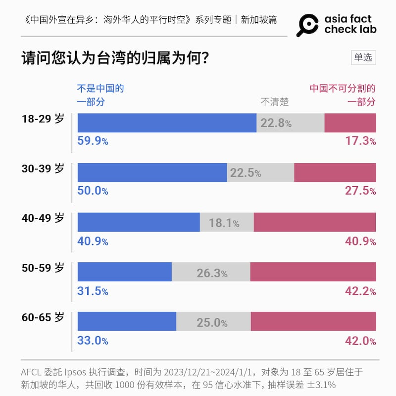

# 中國外宣在異鄉 | 新加坡篇：主旋律背後，私訊暗流滲透

作者：莊敬、董喆

2024.05.06 14:56 EDT

*前言:華人人口接近四分之三的新加坡,在東南亞一直以強大的經濟實力和中立的國際政治著稱。新加坡政府對媒體嚴格控管,全國人民對政府對外關係政策高度認同。但這個情況近年來隨着大量中國新移民移入,以及中國政府鋪天蓋地的對外宣傳而開始動搖。不僅傳統華文媒體有時在不經意間出現中國觀點;訴求新移民的新媒體也緊跟習近平"說好中國故事"的號召;社交媒體、通訊軟件上的"中國敘事"更是暗潮洶湧。*   *亞洲事實查覈實驗室延續2023年"中國外宣在異鄉"專題,2024年將關注視野移往新加坡,以問卷調查加上實地採訪的方式,揭露中國外宣如何影響新加坡媒體和新加坡人,而新加坡政府又如何應對。全系列分三篇刊發,本文爲第三篇。*

牛車水，是新加坡這座城市國家裏中國和華人聚居的社區。2023年年12月初的早晨，在一個掛滿大紅燈籠的棚下，聚集數十位長者下棋、聊天。70歲的藍大同（注1）靜靜坐在一旁，讀着手上的《海峽時報》。

得知記者來訪，藍大同原以“懂得不多、華語說得不好”爲由婉拒，但一聽話題有關兩岸情勢、美中關係，他突然打開話匣子，中英夾雜道出觀點。談到2024年年臺灣總統大選，他說：

“民進黨贏對臺灣不好。臺灣要看中國喫飯，我們新加坡也是靠中國喫飯。”

“臺灣呀，就是美國的走狗。看看烏克蘭多慘，要學到教訓。”

“你以爲美國會幫你（臺灣），他們只是賣你老舊的武器。”

藍大同在新加坡出生，英校畢業，第一語言爲英語，第二纔是華語。他說自己很喜歡新加坡，但若問他是哪裏人，他會說“Singaporean-Chinese（新加坡華人）”，因爲父親來自海南，中國是他的根。問道對中國、美國的印象，以及俄烏戰爭、新疆等議題，他這麼說：

“國際組織都預測中國會是第一大經濟體，你怎麼贏中國？我告訴你，美國都怕中國。”

“美國政府不好，人民整天吵架。白皮膚人不喜歡黃皮膚人，他們會打你、吐你口水。”

“以哈、俄烏衝突，都是美國造成的。”

“新疆？新疆沒有事情呀。那都是西方政治宣傳。”

“您這些資訊都來自《海峽時報》嗎？”一聽記者的問題，藍大同突然折起手中的報紙，放到一旁，有些激動地說，“新加坡報紙都是政府的宣傳工具，我纔不信。我是看YouTube上獨立媒體的報道。 ”

藍大同不願透露他看哪些獨立媒體，但補充一句，“YouTube、WhatsApp都看，不能靠單一來源。 ”

從臺灣移民新加坡數十年的陳燕婷也常看YouTube，她說，在YT上看到的新疆很美、人們過得很好。之前她和海外友人鬧不愉快，原因是友人批評中國國家主席習近平沒爲已逝前總理李克強辦告別式，“但我在CCTV（中國央視）上看到，明明就有。 ”

她還在電視、網路視頻看到令她印象深刻的“零元購”行搶事件、校園槍擊案等，認爲美國內部不平靜，還唯恐天下不亂，造成烏克蘭、以色列戰爭。

## 你喜歡中國嗎？覺得美國怎麼樣？

陳燕婷、藍大同談話間，流露對中國的好感，對美國的負面印象。這是新加坡華人的普遍態度嗎？

亞洲事實查覈實驗室（AFCL）委託益普索（Ipsos）執行的民調（注2），調查了新加坡華人對美國、中國的印象，結果顯示，逾五成受訪者對美、中印象“普通”，但相較美中“好感度”，32%對中國印象“好”或“非常好”，超過對美國的24.7％。

進一步交叉分析發現，收看中國環球電視網英語頻道（CGTN）的觀衆，對中國的印象“好”和“非常好”的共有57.5%；《聯合早報》讀者則有40.5%，都超過整體受訪者的32%。而收看CGTN的受訪者之中，40%對美國持負面印象，幾乎是非中國國際電視臺觀衆的受訪者（20.1%）的兩倍。

研究中國效應、東亞政經等領域的臺灣政治大學國家發展研究所副教授黃兆年指出，民調呈現新加坡華人對中國觀感較好，可從政治價值和文化層面解讀。政治價值方面，新加坡提倡的“亞洲價值”與中國提倡的“中國模式”之間有所互通與親近性，因此部分新加坡華人潛意識將中國視爲“自己人”，將美國、西方視爲他者；文化層面上，年長華人與新加坡的新移民，有所謂的中國情意結，容易受到血緣、文化感召。

## 務實的新加坡人

即使是以中國爲根、立場明顯“傾中”的藍大同，在受訪期間，冷不防問了一句：“你問這麼多，不會向新加坡政府報告吧？”記者還來不及解釋，藍大同便自顧自地讚揚新加坡，並說：“我喜歡我的國家。新加坡多交朋友是對的，打仗絕對不好。”

在記者再度說明來意，重獲藍大同的信任後，他推薦了坐在隔壁一位講華語的先生受訪，堅信這位老友更能道出中國的美好。

“我姓鄧，鄧小平的鄧。”聽到鄧先生的自我介紹，藍大同笑了，但接下來的對話，卻讓他笑不出來。

“臺灣應該靠美國，靠中國就完了。新加坡也不用靠中國。”鄧先生直說，共產中國當前面臨太多問題，香港、澳門都管不好，鄧先生接着批評中國沒有自由，表明他比較喜歡開放的臺灣和美國，更希望中國能向臺灣學習。但鄧先生也認爲，雖然中國不一定適合臺灣，雙方思想不同、很難統一，不可否認的是“臺灣屬於中國土地”。

77歲的鄧先生在新加坡出生，受華校教育，退休前從事大樓保全。雖然祖父是中國人，但他從未去過中國，也沒造訪過臺灣。他對於美中臺的認識，大多來自每天閱讀的華文報紙《聯合早報》與《新明日報》。

對於新加坡，鄧先生覺得中立最好，並且要與中國維持友好關係，“因爲中國武器很強，要你完蛋都可以。美國人怕死，但中國人不怕。”

親中還是親美？藍大同和鄧先生各有選擇。但對新加坡的生存戰略，兩人主張相同。民調中也看得到相同趨勢，問道受訪者：“請問您認爲在美國與中國競爭激烈的情況下，新加坡應採取何種立場？”近九成的受訪者選擇“保持中立”，選擇“親中”和“親美”的各只佔百分之6.6和5.7。

對於這個結果，新加坡國立大學政治學副教授莊嘉穎（Ja Ian Chong）分析，多數人“保持中立”的原因可能有三：第一，新加坡政府不選邊站；第二，很多新加坡人較務實，覺得在美中之間可以獲益；第三，有些人害怕表態會遭受中國懲罰。

記者在當地採訪時，也深深感受到新加坡人的務實，以及新加坡政府對民衆的影響力。無論訪問對象是新加坡學者專家、媒體工作者，當問及新加坡政府的立場，常被對方反問“你爲什麼認爲新加坡親中（親美）？”接着他們會說明新加坡不選邊，與美中都保持友好關係。街訪民衆時，亦有多人表達自己不親中、不反中、不親美、不反美，他們甚至能完整闡述新加坡的外交政策。

## “不清楚／無法評論”的新加坡華人

新加坡華人的另一個特色是，面對敏感政治在議程中，他們傾向不表態。

這次民調列舉了新疆、香港以及美國擬禁Tiktok等國際重大事件的想法，但多數受訪的新加坡華人選擇了“不清楚”、“無法評論”。例如，53.5%的受訪者“不清楚／無法評論”維吾爾人在新疆所受的待遇，或者要不要禁止TikTok；“不清楚／無法評論”香港反修例運動的人也有44.1%。

例如說自己每天閱讀兩份華文報紙的鄧先生，被問道維吾爾人在新疆受到何種待遇時，他僅回答：“不太清楚，報紙沒有寫出來。”

黃兆年認爲，解釋這個現象的關鍵問題在於“新加坡民衆關心什麼”。他說新加坡人較爲重視中國是否干預星國內政，其軍事武力是否威脅到新加坡、南海，以及兩國的經濟合作，民衆很大程度從國家利益角度來關注國際事務，相對較不關心普世人權價值等議題。

## 中國宣傳的“私訊暗流”

新加坡便利商店販售《聯合早報》、《海峽時報》等傳統紙本報刊，一些報攤則販售聚焦社會新聞的《新明日報》和馬來西亞的《中國報》。在牛車水聚集的長者，很多都是華文報的忠實讀者，一位報攤老闆每天下午4點左右，就會揹着一袋《新明日報》到處兜售，一份報紙新幣一元。

政治立場不同的鄧先生和藍大同，每天分別閱讀的《聯合早報》、《新明日報》、《海峽時報》，其實出自同個集團－新報業媒體（前稱新加坡報業控股）。另一家主要新聞傳播集團“新傳媒”，旗下有英語亞洲新聞頻道“亞洲新聞臺”(CNA）、華語新聞綜合頻道“8頻道”等多個電視、電臺頻道。

新加坡政府嚴控新聞傳播集團，壟斷言論市場。表面看來打造了一個嚴密的媒體環境，然而近年傳統媒體式微、社媒興起，卻讓國外的華文信息，有了滲透新加坡社會的機會。

這次民調發現，新加坡華人通常使用社羣媒體（74.6%）獲取新聞資訊，後依序爲新聞網站、電視、廣播，紙本報紙（28.5%）；常用的社媒前三名則是臉書、YouTube、WhatsApp。雖然就民調數據，較少新加坡華人直接使用中國社媒獲取資訊，但中國宣傳如同暗流，從每個大平臺流進新加坡人的生活圈。

莊嘉穎就曾在臉書上看到中國官方發佈的誤導內容。2022年年8月,時任美國聯邦衆議院議長佩洛西(南希·佩洛西)訪問臺灣後不久,中國駐新加坡大使館在臉書發佈一則13秒的 [短視頻](https://fb.watch/prJu3zV6KR/?mibextid=v7YzmG),簡體中文字幕寫着:"美國前總統卡特1978年年宣佈與中國建交,承認臺灣是中國的一部分",但視頻剪掉了關鍵詞,扭曲了 [卡特的原話](2024-01-12_事實查覈｜美中建交時卡特"承認"臺灣是中國的一部分？.md)。 (注3)

“中國駐新加坡大使館臉書本身沒有很多人看，但厲害的就是人們會截圖，在私訊裏轉傳，那就很多人看。”莊嘉穎說。

新加坡市場研究公司“Black Dot Research”總經理方國威（Nicholas Fang）表示，華語的視頻或信息，較多借助微信等中國平臺傳播，通常一開始出現在私聊羣組，再經羣組成員分享，可以傳播非常快、非常遠。

在新加坡創立政治顧問公司“AutoPolitic”的杜元甫看到了信息“轉傳”的另一條途徑。他說，新加坡政府因國安考量，嚴格管控媒體，且對網路影響力很敏感，因此中國要直接影響新加坡媒體並不容易，比較常見的是透過馬來西亞媒體間接影響，因爲星馬關係密切，每天上萬人進出往來，所以信息只要能傳進馬來西亞媒體，就容易“感染到”新加坡。

杜元甫曾在WhatsApp等通訊軟體上收到一些華語的陌生信息，內容包括宣傳臺灣是中國的一部分，他收到後會回傳“天安門”等敏感詞測試，若遭封鎖，判斷對方極可能使用中國號碼，若沒有反應，就可能是登記在馬來西亞或菲律賓的號碼。

多位受訪者也不約而同提到俄烏戰爭。方國威說，戰事開打之初，新加坡的華語羣體收到大量中文內容，強調戰爭根源並非俄羅斯，而是西方、是北約。沒有確切證據，也難以追溯來源，但從使用的語言、宣傳的內容和所持的立場判斷，都讓他們懷疑信息來自中國。

“什麼問題都是美國的錯、西方的錯。”這是新加坡獨立媒體工作者許淵臣（徐特里）觀察到的中國宣傳話術。他說，不只俄烏戰爭，香港反修例運動時，在WhatsApp、Tiktok等社媒上流傳的視頻，都聲稱活動背後有西方資助。

## 新加坡人的國家認同和世代差異

這次民調呈現出新加坡華人的兩項“一致性”：國族認同一致，對國際關係的判斷也很一致。

受訪華人被問到出生地、國籍、自我認同時，89.1%的受訪者在新加坡出生，94.2%爲新加坡國籍。但被問及“當別人詢問您是哪裏人時，您如何回答”這一題，93.3%回答“新加坡人”，只有3.6％回答“中國人”。

第二，面對美中競爭，多數受訪者支持新加坡保持中立，18至29歲受訪者僅少數選擇“親美”（6.4%）、“大野丘”（5.9%）；特別的是，原本一般印象是愈年輕的一代愈“親美反中”，但調查結果並非如此，18至29歲受訪者，超過五成對美中印象“普通”，而對美中印象差的佔比分別爲15.3%、10.9%，是所有年齡層中最低的。

對此現象，莊嘉穎分析，40至49歲的華人，應該是在中國經濟起飛時，獲益最多的族羣，年輕一代則沒有相同的機會，而且年輕人相對較關心其它議題，包括性別、分配、族羣等。

新加坡華人國家認同和外交政策上沒有世代差異，但政治價值取向的世代差異卻比較明顯。

例如被問道臺灣的政治地位，18到29歲的受訪者中有59.9%認爲臺灣不是中國的一部分，爲所有年齡層最高；反之，主張“臺灣是中國不可分割的一部分”的人，則隨年齡有所增長，最高爲50至59歲的42.2%。

對於新疆維吾爾人遭受的待遇，18至29歲族羣中41.1%認爲受到政治壓迫，而在60至65歲族羣，僅21.4%認爲維吾爾人受到政治壓迫，22.3%相信維吾爾人在新疆接受教育和職業訓練。

但是，對於美國擬禁Tiktok的看法，18至29歲的受訪者對禁令的支持力最低，爲19.3%，26.7%反對禁令，佔比次高。最支持禁令的反而是30至39歲族羣，達到28.4%。

莊嘉穎分析容易受中國宣傳影響的族羣，其一是曾接觸華語教育、接受“大中華敘事”的中老年人，另一族羣則是現在的大學生，因爲中國的流行歌曲等文化產品，進而接觸微博、TikTok等平臺。

慣於"大中華敘事"的上一代對下一代造成的影響,記者在採訪過程多有體會。不只一位受訪者向記者抱怨,他們經常接收到來自父母的私訊,很多都是中國宣傳內容,但他們不想和父母爭執,只能繼續接收、自行刪除。另有一位自稱不親中也不親美的受訪者提到,住在新加坡的父母常看臺灣的中天電視臺,同住時他也跟着看,儘管現在已離開家鄉,他仍然常看中天。在臺灣,中天電視及所屬的旺旺中時集團,一般被認爲是極其親中的傳媒機構,亞洲事實查覈實驗室曾有 [相關報道](https://www.rfa.org/mandarin/shishi-hecha/hc-04082024175849.html?encoding=traditional)。

至於年輕世代，莊嘉穎評估，他們受中國宣傳影響的程度不及中老年人，但民調結果讓人看見TikTok的影響力，包括在獲取新聞資訊的中國社媒之中，也是最多人使用TikTok（19.7 %），其次爲微信（7.7%）、小紅書（4.2%）、微博（2%） 。

黃兆年也指出，北京原希望借“孔子學院”影響世界各地的年輕族羣，但孔子學院遭受質疑，影響力逐漸失效。反而是在新冠疫情期間，發展出“宅經濟”，帶動一些中資社媒的市佔率，讓海外年輕族羣從TikTok、小紅書接觸到更多中國相關資訊，“這是一個新興的影響管道，值得後續觀察”。

*注1.文中受訪者藍大同、陳燕婷均爲化名。*

*注2.亞洲事實查覈實驗室委託益普索（益普索）公司，針對18歲至65歲居住於新加坡之華人進行網路問卷調查，以瞭解新加坡華人獲取新聞資訊的媒體頻道、使用的社羣媒體、族羣身分認同三者與政治傾向之關係。調查期間爲2023年年12月21日到2024年年1月1日。共計回收1000份有效樣本，在95信心水準下，抽樣誤差±3.1%。本文後續所稱的“民調”或“民意調查”，若無另外說明，均指這次民調。*

這次民調的詳細結果,請見 [本文](2024-05-03_中國外宣在異鄉 ｜ 新加坡篇：以問卷調查看華人的媒體觀 國際觀.md)。

*注3.亞洲事實查覈實驗室也曾經針對這個議題進行查覈，詳見 [全文](2024-01-12_事實查覈｜美中建交時卡特"承認"臺灣是中國的一部分？.md)。*

[Original Source](https://www.rfa.org/mandarin/shishi-hecha/singapore/hc-05062024144422.html)