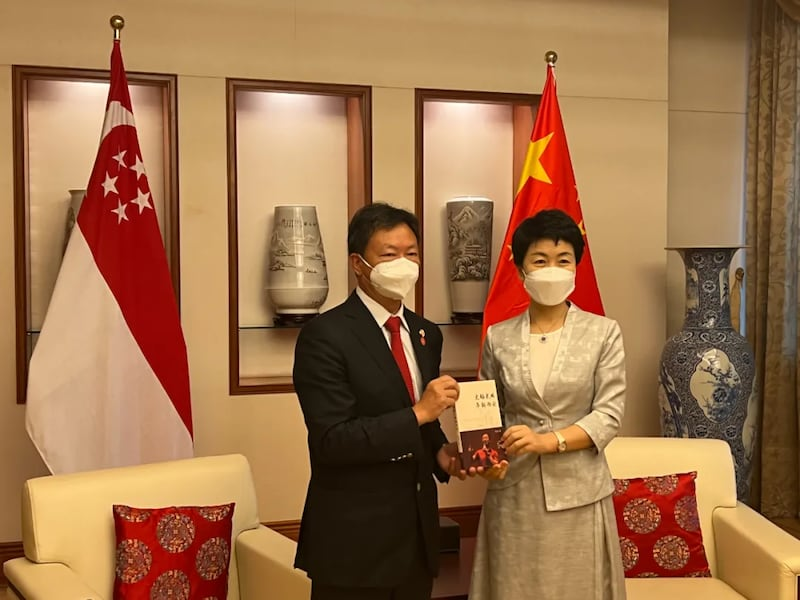

# 中國外宣在異鄉｜新舊媒體平臺，中國影響兩路並進

2024.05.06 12:23 EDT

*前言：華人人口接近四分之三的新加坡，在東南亞一直以強大的經濟實力和中立的國際政治著稱。新加坡政府對媒體嚴格控管，全國人民對政府對外關係政策高度認同。但這個情況近年來隨着大量中國新移民移入，以及中國政府鋪天蓋地的對外宣傳而開始動搖。不僅傳統華文媒體有時在不經意間出現中國觀點；訴求新移民的新媒體也緊跟習近平“說好中國故事”的號召；社交媒體、通訊軟件上的“中國敘事”更是暗潮洶湧。*

*亞洲事實查覈實驗室延續2023年“中國外宣在異鄉”專題，2024年將關注視野移往新加坡，以問卷調查加上實地採訪的方式，揭露中國外宣如何影響新加坡媒體和新加坡人，而新加坡政府又如何應對。全系列分三篇刊發，本文爲第一篇。*

* **[I.鋼索上的新加坡政府](https://www.rfa.org/mandarin/shishi-hecha/singapore/media.html)**
* **[II.新加坡民調結果](2024-05-03_中國外宣在異鄉 ｜ 新加坡篇：以問卷調查看華人的媒體觀 國際觀.md)**

*作者：莊敬、董喆*

“詭異的是，從2月17號開始，烏克蘭軍隊一直在瘋狂地摸老虎屁股，不斷武裝進攻頓內次克和盧甘斯克，接二連三踩普京紅線。毛熊不發威，你當我是hello kitty 。”新加坡中文電視臺“8頻道”主播張海潔在鏡頭前生動描繪俄烏開戰始末。

這支5分鐘的影片下標烏克蘭“愛上不該愛的人”，以兩點定調俄烏戰爭：

一、北約要東擴，因此曖昧地向烏克蘭招手，俄羅斯調兵在烏東集結是正常的應對行爲。

二、烏克蘭武裝進攻頓內次克和盧甘斯克，是向普京挑釁。

2022年俄烏戰爭開打，歐美各國譴責俄羅斯，新加坡政府迅速表態將經濟制裁俄羅斯。 8頻道這則新聞評論貼近中俄主旋律，明顯和本國政府立場不同調，讓星國民衆議論：“8視界什麼時候姓中共了？”

隨後，這部影片悄然下架。

“8頻道說是因爲版權問題，但那是他們的藉口。”新加坡國立大學政治系副教授莊嘉穎告訴亞洲事實查覈實驗室（AFCL），影片發佈之後，有一羣從事“大翻譯運動”(注1)的民衆將這支影片翻譯成不同語言，在社交媒體傳播，8頻道母公司新傳媒因此感受到不小壓力。

新傳媒隨後以“違反智慧財產權”爲由，迫使翻譯的影片下架，不久之後也主動將原始影片移除。莊嘉穎推測，“可能(新加坡)官方是很不希望那個片段被播出來”。

從“8頻道事件”看到，一股幽微的官方影響力巧妙壓制了“中俄敘事”在新加坡社會發酵。反應新加坡自建國以來，致力在複雜的種族組成與國際地緣政治之間維持中立，與美中強權保持等距。

不過隨着中國崛起，2017年中國國家主席習近平以“中國夢”對海外華人進行親情號召，華人佔比7成的新加坡亦成爲標的。中國影響力是不是滲透了華文媒體？甚或在新加坡建立了大外宣網絡？

*δ 主流華文媒體脫不開的“親中”標籤？*

“8頻道”屬於“新傳媒集團”，屬於新加坡兩大傳媒集團之一。根據AFCL委託益普索（Ipsos）執行的民調（注2），“8頻道”是收看佔比最高的華語電視。另一個媒體集團是新報業媒體（SPH Media），旗下擁有知名的平面華文媒體《聯合早報》。

“《聯合早報》在新加坡同等於官媒，甚至說人民行動黨的黨媒。 ”莊嘉穎分析，《聯合早報》在華文輿論場上有主導性的地位，“讀者會認爲它立場是更有權威性，所以更願意去相信。 ”從文化層面來看，莊嘉穎提到新加坡華文媒體讀者對《聯合早報》的期望也會更高，“（早報）維護他們所認爲華文文化，所以會更注重《聯合早報》在說什麼。 ”

AFCL的民調描繪了《聯合早報》讀者的認同傾向，被問道對美國、中國的印象時。總體受訪者對中國印象“好”及“非常好”的總計32%。但交叉分析之後發現《聯合早報》的讀者爲40.5%，展現了平均值以上的好感。

臺灣民主實驗室2022年發佈的“中國影響力指數”中，新加坡在82個國家中排名第三，受中國影響僅次於巴基斯坦及柬埔寨。報告中特別點名中國借《聯合早報》等當地媒體提升海外地位。 2023年《華盛頓郵報》在報導中更直接點名《聯合早報》經常爲中共謊言背書。

《聯合早報》親中嗎？我們向多位學者與媒體工作者提出這個問題。不只一位受訪者提及《海峽時報》與《聯合早報》都曾接受中國接待赴新疆採訪後，發出否認新疆有種族滅絕的報道。莊嘉穎記得《聯合早報》在2019年由其北京特派員受中共政府邀約參訪新疆，“就是傳達中國的那一套”。

AFCL以“新疆”作爲關鍵字搜索《聯合早報》，查找到2019年刊登的報導，開篇便寫道這則報導源於中國國務院新聞辦安排。

同一系列在“觀點”欄目中以“新疆——千萬人社會工程項目”爲題發表記者個人評論，當中提到“有記者質疑學員可能是由公安或基層幹部安排在外媒面前作秀的，如果真是這樣，那這一大組臨時演員可以拿奧斯卡獎了。”這句話被特別擷取，在中國社羣平臺上廣傳。

中國觀察者網論壇“風聞社區”就曾轉載《聯合早報》的新疆考察報道，討論區網民對這篇報道讚譽有加，稱“西方媒體長期雙重標準，負面解讀，見怪不怪，難得有那麼幾篇稍微客觀點的文章”、“此文好，別人明目張膽鼓吹邪教，我們何必縮手縮腳？”

華文媒體閱聽人對新疆維族處境的認識如何呢？

當AFCL將新加坡華人媒體使用習慣與“您如何描述新疆維吾爾族⼈的待遇？”進行交叉分析，《聯合早報》的受衆認爲維吾爾族人接受教育和職業訓練的比例爲23.2%，是所有新加坡媒體使用者中最高。中國環球電視網(CGTN)的觀衆則有高達47.5%認爲維族人正在接受教育和職業培訓，這與整體的14.4%形成鮮明對⽐。

另一個例子是香港政府近期推動的《基本法》23條立法期間，《聯合早報》旗下“早報網”發佈一則新聞：“一項民調顯示，近60%受訪香港市民傾向支持23條立法。”

原始報導是轉載自香港《大公報》和《星島日報》。這兩家媒體普遍被視爲親中共媒體。根據報導，這則民調是由“香港民意觀察研究中心”執行、發佈。

《聯合早報》在文末引述不具名的學者評論稱：“目前香港的政治氛圍和2003年不同，相信這次23條立法會比21年前首次嘗試立法時順利。”

AFCL進一步調查了“香港民意觀察研究中心”，卻發現這一機構並沒有官方網站。但透過一份活動新聞稿以及港府新聞公報，可以查出2021年香港智庫和北京大學合辦研討會，“民意觀察研究中心”主席“鄧詠駿”名列與會嘉賓。 2023年6月，港府增補設創基金委員，鄧詠駿再次列名，職銜是民意觀察研究中心負責人。

根據香港觀塘區議會資料顯示，鄧詠駿是觀塘區議會議員，職業爲“民意調查機構負責人”。鄧詠駿所屬的新世紀論壇，屬於建制派政黨。

*δ 爲什麼華文媒體向中國傾斜？*

中國政府2010年啓動“對外宣傳大布局”，通稱“大外宣”的計畫。此後中共利用華文媒體影響新加坡華人的風聲不斷。早在2019年美國華府智庫“詹姆士頓基金會”的研究報告就指出，《聯合早報》網站在中國每天吸引超過500萬閱讀量。星國華文媒體依賴中國市場，引發了是否對內容審查的疑慮。

新加坡獨立媒體工作者許淵臣指出，“（《聯合早報》）尤其是他的opinion（言論版），你可以看到他的趨勢會比較親中，也是因爲說它的市場基本上就是中國市場。如果是親美的話，他的那個報紙基本上可以不用在中國賣。”

研究中國媒體效應的臺灣政治大學國家發展研究所副教授黃兆年也指出，新加坡政府間接持股《聯合早報》，中國無法伸手所有權市場 。但發行與廣告市場是中國可以發揮的管道。 “《聯合早報》嘗試在中國進行有限的發行，比如特定大城市或者大飯店。他的網站也希望可以在中國露出，不要被屏蔽。” 他指出，“中港臺的分類現在就叫做中國，這某種程度上是迎合一箇中國的發行市場”。

不過針對新聞分類問題，《聯合早報》高層曾經發文說明，強調早在2003年配合80週年的改版，就已經把大中華地區的新聞版塊改成“中國”，如今只是讓網路版的分類與紙本齊一。

黃兆年另指出在文化層面上，《聯合早報》在內的海外華文媒體，常態受邀參加每兩年一次的“世界華文傳媒論壇”，這場會議由北京國務院僑務辦公室與中國新聞社共同舉辦。 “這當然涉及華文媒體的國際話語權，（中國）認爲華文媒體要共同承擔大中華民族主義的責任。”黃兆年說道。

對於《聯合早報》就“中國版、新加坡版、國際版是否有不同的編輯策略”，以及“新疆、香港抗爭報導是否曾受到中方直接或間接施壓”等問題，AFCL曾發信向《聯合早報》總編輯吳新迪聯繫，但至截稿時並未收到回覆。

雖無法獲得《聯合早報》的回應，不過去年《華郵》點名《聯合早報》親中的報導刊出後，《聯合早報》刊文強調自己兼容中西方的觀點，網路版也曾在中國遭多次長期屏蔽。

*δ 華文媒體“親中”嗎？媒體人自己怎麼看？*

新加坡媒體工作者認同《華郵》所說，《聯合早報》是中共的傳聲筒嗎？甚至是否新加坡的華文媒體有親中傾向？ AFCL訪問了6位現任與離任的媒體工作者，立場各半，他們提及更多自我審查與媒體結構性問題。

李嘉銘(注3)在新報業媒體（前稱新加坡報業控股）當記者，談到《聯合早報》的親中色彩，他並不認同，但也不諱言“早報畢竟要在中國，多少會有一點影響”，但這樣的影響並非中共直接伸手，更多時候是記者的自我審查，例如“寫到臺灣的時候，即便只是一個旅遊新聞，記得不可以把臺灣當國家來寫”。

關係到中國的報導，哪些不能碰？AFCL向多位新加坡新聞工作者請問這個問題。多數的回答是報社或電視臺等機構並沒有制訂類似的守則或準則，更多是靠媒體工作者用經驗以及對中國國情的瞭解做出判斷。AFCL再追問這些判斷依據什麼標準？雖然多數受訪者沒有具體回應，但其中有人提到，維持自家內容在中國境內可見，有時是判斷標準之一。

除了自我審查，曾在華語電視臺服務的王筱惠提及了另一種可能：中國移民。新加坡的雙語政策導致能夠用中文報導的記者、主播並不多，因此電視臺除了本地人，也聘請馬來西亞、臺灣、香港、中國人。 “我們有一些同事是來自中國的，所以他們有一些是中國的畢業生。他們從小是在中國長大的，或多或少因爲他們的出身背景，可能想法會比較傾向於中國。”但她也強調，編輯守則一定要符合新加坡利益。

王筱惠認爲，有時候報導立場傾向中國，還有可能是因爲記者時間緊迫，“趕電視稿，我們六點半一趟，十點一趟，你直接拿央視的稿來用，很方便對吧？ ”

至於是否曾收到中方對於報導內容的“關切”，王筱惠跟李嘉銘皆否認，不過王筱惠也補充，“可能我職位不夠高，不知道上司有沒有收到”。王筱惠另外坦言不止一次參加中國的飯局及旅遊團。 “我真的也是有去喫過飯，他們不是要跟我們施壓，其實是問我們怎麼經營facebook，以及與媒體保持聯繫”。

王筱惠也曾參加中國環球電視網舉辦的論壇，“他們有提到他們的新聞方針，有強調他們的Cable Team有派很多記者在全球各地，有很多的B-roll（編按：指補充性的影像素材）可以讓我們新聞電視臺用。”

中方學習社羣經營，目的是否爲了將論述打入新加坡市場？不得而知。但當中國刻意示好，提供現成的新聞素材，遇上新聞從業人員爲了趕時效性，將中國角度作爲唯一素材，就成了華文媒體被貼上親中標籤的第三種可能。

新加坡媒體在特定議題上有時與中共立場雷同，另一個因素是基於新加坡文化背景，例如“示威”。談論六四議題一直是中國禁忌，新加坡媒體可以報導嗎？王筱惠坦言能報，但篇幅少，“六四算是示威的一種，這是非法的啊”。新加坡法律嚴格限制集會遊行，根據《公共秩序法》(Public Order Act,POA)，舉凡關係到理念宣傳的集會，都要向警方申請許可，違反者可能面臨刑事追訴。知名異議人士如範國瀚、韓俐穎，都有遭《公共秩序法》處罰的紀錄。

*δ 主打中國新移民媒體，更接近中共宣傳*

自2023年新冠疫情結束之後，新加坡成爲中國富人移民的主要國家之一。因此在主流媒體之外，有另一羣“新媒體”隨着中國移民的增加而成長，成爲新加坡潛在的一股影響力。莊嘉穎觀察到，“新移民的那些獨立媒體，一般就是講一些就是你平常住房、哪裏好喫的訊息。可是在某一些時段，像佩洛西訪臺，他們就會開始宣傳這是美國在造勢”，他尤其提到中國駐新加坡前大使孫海燕與這些移民媒體關係密切。

《新加坡眼》是著名的新媒體之一，它在網頁上自稱“中文自媒體平臺”，性質類似“資訊生活平臺”，提供中國移民簽證、購房、教育等資訊。 《新加坡萬事通》的性質也類似。

不過在時任美國衆議院議長佩洛西（Nancy Pelosi）訪問臺灣時，包含《新加坡眼》、《新加坡萬事通》、《隨筆南洋》、《新加坡獅城椰子》等新媒體，都一反平日調性地發表相關報導、評論、影音，內容譴責佩洛西“竄訪”臺灣，破壞區域穩定。

數日後，時任中國駐新大使孫海燕在使館“接待”了《新加坡眼》、《新加坡萬事通》、《隨筆南洋》、《新加坡獅城椰孩子》、《華人頭條》、《Nestia》等新媒體負責人。

時任中國駐星大使孫海燕與新加坡新媒體負責人就臺灣問題進行座談。 （取自中國駐新加坡大使館）

這場孫海燕口中“愉快的交流”，實際上是一場“臺灣問題座談”，孫海燕舉出《臺灣問題與新時代中國統一事業》白皮書，強調“和平統一、一國兩制”是中國解決臺灣問題的基本方針。

在當時的使館新聞稿中提及，與會新媒體負責人稱“佩洛西竄訪臺灣是一次危險的政治挑釁，中國政府冷靜應對、反制得力，得到新加坡各界民衆的理解和支持。新加坡政府和社會各界都堅持一箇中國原則，反對臺獨活動”。

這次接待很快地就有了成效，座談隔日，《新加坡眼》和《新加坡獅城椰子》便轉發孫的視頻，宣傳孫海燕對佩洛西訪臺的立場。

爲何新加坡移民媒體要爲臺灣問題置評？與會新媒體負責人是否有中國色彩？AFCL去信5間規模較大的中國新移民媒體，無人回應。

《新加坡眼》和《新加坡獅城椰子》宣傳孫海燕對佩洛西訪臺的立場。 （取自tiktok、臉書）

熟悉中國事務的學者匿名向我們表示，“新加坡眼那些媒體目標是新移民，影響力沒有《早報》高。大部分是爲了內宣，做給國內看的，在乎表態，不在乎點擊數。 ”

我們企圖從新移民的報導中找尋更多中國想發揮影響力的線索。

2023年5月，《新加坡眼》發表一則報導，宣佈《新加坡眼》及其他10家海外華文媒體簽約入駐“津雲·雲上海外”平臺。簽約地點是天津市委統戰部、中國新聞社、中新社天津分社共同舉辦的媒體論壇。

雲上海外平臺於2017年成立，目標是“記錄華僑華人成長和奮鬥歷程，講述新中國的偉大成就和新時代的精彩天津。”

同年11月，當代中國與世界研究院、中國公共外交協會、北京對話在新加坡舉辦“思想亞洲媒體智庫論壇”，中國外交部前副部長孔鉉佑、中國駐新加坡使館臨時代辦朱憬、中國互聯網新聞中心總編輯王曉輝，新加坡眼董事經理許振義、《聯合早報》前副總編成漢通皆是座上賓。

思想亞洲媒體智庫論壇主打講好亞洲故事。 （取自中國外文局）

中國公共外交協會副會長鬍正躍更在會中表示，“亞洲媒體要講好亞洲故事，多爲亞洲事務發聲”。與習近平“講好中國故事”的口號雷同。

雖然這場論壇將架構至於“亞洲”之下，但以中國爲中心的意圖明確，新加坡眼在微信公衆號的活動新聞稿就明確指出，思想亞洲媒體智庫論壇旨在加強中國同亞洲國家媒體、智庫間聯繫，深化亞洲文明互鑑。

*δ 傳統平臺、新媒體，都可見中國影響力*

回到最初的問題：中國影響力是不是滲透了華文媒體？甚或在新加坡建立了大外宣網絡？

8頻道和《聯合早報》都是受制於政府的主流媒體，但這兩年也都發生了個別評論內容被貼上“親中”標籤的事件，甚而需要政府出手導正或澄清。

在《聯合早報》被《華郵》質疑幫助中國推動大外宣時，不只早報本身，甚至新加坡駐美大使呂德耀也致信《華郵》，表達新加坡媒體不會在中美選邊。 2個月後，總理李顯龍更親自發聲。他在《聯合早報》百年報慶晚宴上指出，各國試圖利用言論影響彼此的人民，甚至設法左右境外媒體的立場，他喊話早報“絕對不能被其他人利用，來散播一些對新加坡不利或不符合國情的言論。”

李顯龍出席聯合早報百年報慶晚宴。 （取自新加坡總理辦公室）

“有些人說早報的報道支持中國的立場。也有人說早報的分析傾向美國。作爲一個負責任的新加坡媒體，早報必須竭盡所能，避免被他人左右，以維護自己的公信力。”

曾公開支持國安法和 23 條的新加坡的親共港商陳文平，2023年被新加坡政府列爲“具政治影響力者”，等同外國勢力代理人。裁決後，8頻道發佈視頻“應對外來干預的他是是怎麼一回事？ ”，這一次，他們的敘事回到了官方口徑。 “誰是背後那隻操弄民意的黑手，政府是知道的。有時不點破，是留顏面，好相見。這是外交處理上的高來高去，也是生存法則。”

香港迴歸中國25週年紀念日，中國駐星大使孫海燕會見新加坡九龍會、新加坡香港商會會長陳文平。 （取自新加坡九龍會）

李顯龍的談話，展現了新加坡政府對傳統主流媒體一直以來的主導性。但一席高度政策性的談話，無法對日常報導中所見的過度親中言論一一釋疑。更加上網路新媒體的發展，已經超越新加坡政府的管制框架，中國介入“指導”的痕跡，在華文新媒體上幾近毫不遮掩。

莊嘉穎認爲，新加坡社會缺乏媒體識讀教育，說白了，因爲新加坡長期由行動黨執政，它控制媒體，也是希望有能力主導民意；但若媒體教育很成功，那麼任何一方主導民意的能力就會被削弱。但可能正是因爲新加坡政府較不強調媒體識讀，反而使社會更容易受到來自其他地方的影響。

中國外宣的影響力，在傳統和新媒體平臺上兩路並進，這是新加坡未來的巨大挑戰。

*注1: “大翻譯運動” 這個名詞大約在2022年俄烏戰爭後出現，主要行動是將中國或者中文網絡上極端親俄，或者仇視西方的發言翻譯成英文發佈出來。一般相信參與者的目的在於突顯部分中國官員和網民反對普世價值的印象。這項行動沒有明顯的組織者，更接近一場去中心化的運動。*

*注2: 亞洲事實查覈實驗室委託益普索（Ipsos）公司，針對18歲至65歲居住於新加坡之華人進行網路問卷調查，以瞭解新加坡華人獲取新聞資訊的媒體頻道、使用的社羣媒體、族羣身分認同三者與政治傾向之關係。調查期間爲2023年12月21日到2024年1月1日。共計回收1000份有效樣本，在95信心水準下，抽樣誤差±3.1%。本文後續所稱的“民調”或“民意調查”，若無另外說明，均指這次民調。這次民調的詳細結果，請見 [《中國外宣在異鄉：新加坡篇民調結果》。](2024-05-03_中國外宣在異鄉 ｜ 新加坡篇：以問卷調查看華人的媒體觀 國際觀.md)*

*注3: 文中受訪者李嘉銘、王筱惠，均爲化名。*

[Facebook](http://127.0.0.1:5500/#facebook) [X](http://127.0.0.1:5500/#x) [Telegram](http://127.0.0.1:5500/#telegram) [WhatsApp](http://127.0.0.1:5500/#whatsapp) [Share](https://www.addtoany.com/share#url=http%3A%2F%2F127.0.0.1%3A5500%2Fpress.html&title=%E4%B8%AD%E5%9B%BD%E5%A4%96%E5%AE%A3%E5%9C%A8%E5%BC%82%E4%B9%A1%EF%BD%9C%E6%96%B0%E6%97%A7%E5%AA%92%E4%BD%93%E5%B9%B3%E5%8F%B0%EF%BC%8C%E4%B8%AD%E5%9B%BD%E5%BD%B1%E5%93%8D%E4%B8%A4%E8%B7%AF%E5%B9%B6%E8%BF%9B)

作者：莊敬、董喆

-------------

責編：林濤、李潼

-------------

網頁製作：伍檫愙

-------------

亞洲事實查覈實驗室主任: 李志德

-------------

[ [自由亞洲電臺出品Opens in new window](https://www.google.com/url?q=https://www.rfa.org/mandarin/&source=gmail-html&ust=1712886727977000&usg=AOvVaw3M_QknDM06UKQkaHEPxmei) ]

-------------

© 2024 RFA Asia Fact Check Lab

-------------

[ [FacebookOpens in new window](https://www.google.com/url?q=https://www.facebook.com/RFAChinese&source=gmail-html&ust=1712886727977000&usg=AOvVaw1b0xbGIL0xKshQd6yjxgtE) ]

-

[ [YoutubeOpens in new window](https://www.google.com/url?q=https://www.youtube.com/user/RFACHINESE&source=gmail-html&ust=1712886727977000&usg=AOvVaw0MlWN3dRjq-7LTqt3w0qhJ) ]

-

[ [TwitterOpens in new window](https://www.google.com/url?q=https://twitter.com/RFA_Chinese&source=gmail-html&ust=1712886727977000&usg=AOvVaw1nQYFfumAwKou7-n0qzDW5) ]

[  [上一篇 Opens in new window](https://www.rfa.org/mandarin/shishi-hecha/singapore/media.html) ]

## ## 中國外宣在異鄉｜鋼索上的新加坡政府

[Original Source](https://www.rfa.org/mandarin/shishi-hecha/singapore/hc-05062024121747.html)