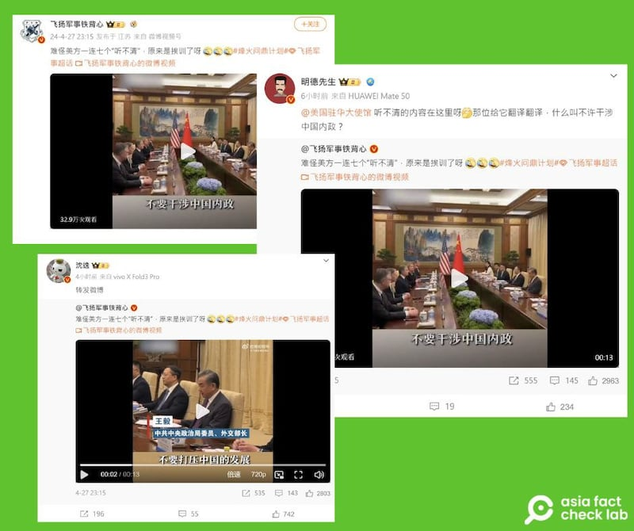
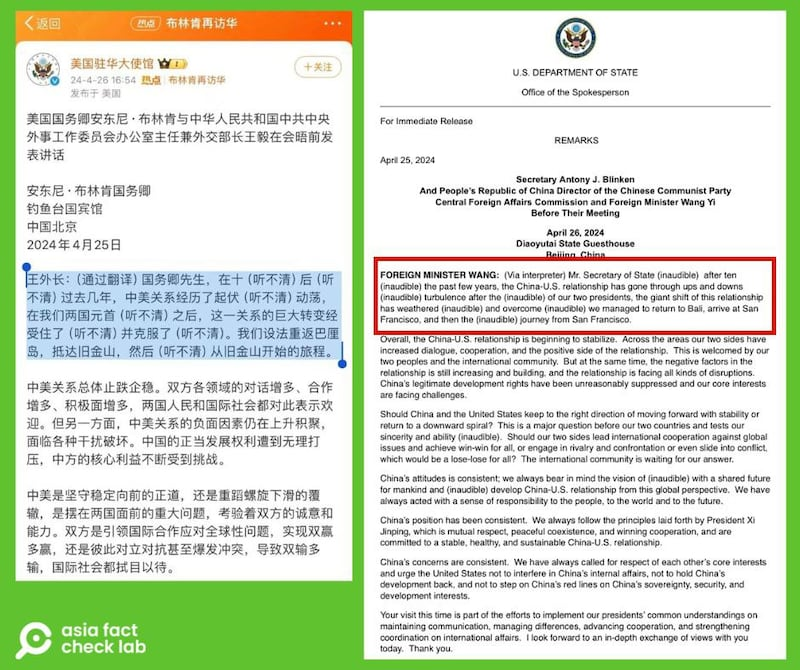
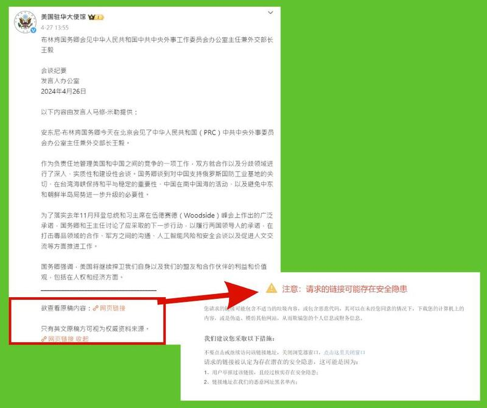
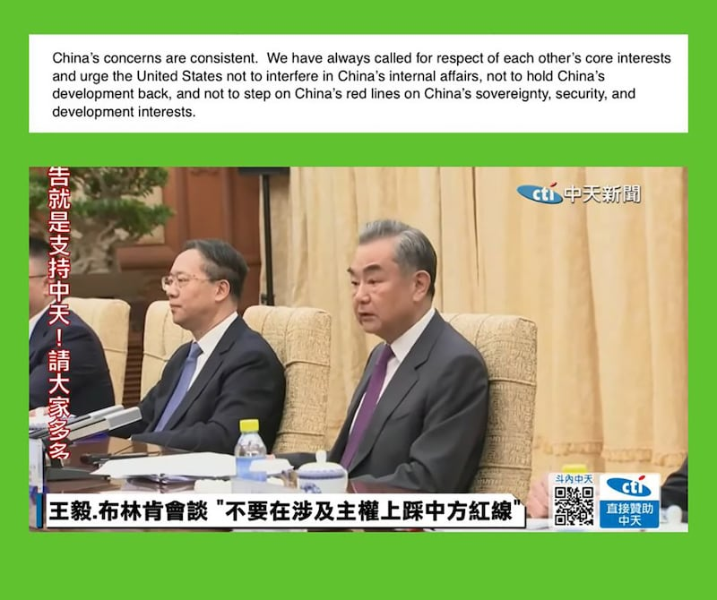
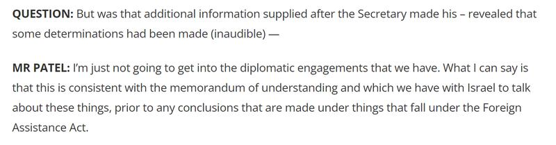

# 事實查覈 | 美國發布王毅講話時一連七個"聽不清"，是因爲"挨訓"了？

作者：艾倫

2024.05.08 14:12 EDT

## 查覈結果：誤導

## 一分鐘完讀：

美國務卿布林肯日前訪問中國，4月26日和中國外交部長王毅見面。雙方會談剛結束時美國方面第一時間發佈的逐字稿出現多個對王毅發言“聽不清”（inaudible）的註解。在中國社交媒體上，微博帳號“飛揚軍事鐵背心”發佈了當天王毅談話的視頻，並附文稱：“難怪美方一連七個‘聽不清’，原來是挨訓了呀”。意指中國在談話時強烈指責布林肯或美國，因此美國發布的逐字稿故意隱去王毅的談話。

經查覈，所謂連續七個“聽不清”的段落爲王毅的開場發言，言談中並無出現任何“訓斥”的內容。在會談結束一段時間後，美方再次更新逐字稿，幾處一開始“聽不清”的地方，都做了補充。

## 深度分析：

中國政治軍事博主"飛揚軍事鐵背心"於4月27日發佈的 [帖文](https://weibo.com/2139949234/ObI6eFU92),獲數千點贊、數百轉發,將近200萬追蹤的賬號"沈逸"及74萬粉絲的"明德先生"等有影響力的用戶也將此帖文進一步轉傳。

中國大V博主近期轉傳一則視頻，稱美方在布林肯王毅會談後發佈的逐字稿中使用七個"聽不清"，是因爲"挨訓"了。（微博截圖）

檢視美國駐華大使館於4月26日在微博上發佈的布林肯與王毅對話逐字稿，第一段爲王毅的談話開頭，整段逐字稿確實出現多達七次“聽不清”的註解，和美國國務院第一版英文新聞稿用“inaudible”（無法聽清）標示的位置相同。

美國駐華大使館發佈的中文逐字稿及國務院的英文逐字稿中，出現連續七次"聽不清"標註的爲王毅開場時的第一段。（美國駐華大使館微博、美國國務院新聞稿截圖）

但5月3日,亞洲事實查覈實驗室重新查看美國駐華使館微博時,前述標註「聽不清」的逐字稿已經刪除,僅剩這場會議的 [會談紀要](https://weibo.com/1743951792/ObEqTq2dP)。結尾並附上提醒:"只有英文原稿方可視爲權威資料來源"。

美國駐華使館微博目前僅找得到當天的會談紀要，原稿內容的鏈接皆已失效。（美國駐華使館微博截圖）

## 王毅談話的原文是什麼？

在會談結束後一段時間,美國務院已經在網站上更新了翻譯後的 [逐字稿](https://www.state.gov/secretary-antony-j-blinken-and-peoples-republic-of-china-director-of-the-chinese-communist-party-central-foreign-affairs-commission-and-foreign-minister-wang-yi-before-their-meeting/)。亞洲事實查覈實驗室將國務院的逐字稿和臺灣中天電視 [現場轉播](https://www.youtube.com/watch?v=SZvgby7D2T4)中方英文口譯的內容相比對,確認中方現場口譯內容和國務院的英文逐字稿相吻合。

檢視更新後的完整逐字稿中可以發現，原本被標註“聽不清”的七個地方，都已經修正。一一對照修正後的逐字稿會發現，王毅當時談的歡迎布林肯來訪，以及回顧過去一段時間內的中美關係，並沒有出現如傳言所說“訓話”的部分。

更新的英文逐字稿如下，（加黑、下劃線的詞組爲原逐字稿七個“聽不清”的部分）：

"Mr. Secretary of State, **welcome back to China**after ten months. **In the past period of time**, the China-U.S. relationship has gone through ups and downs **and twists and turns**. **After the guidance and leadership**of our two presidents, the giant ship of this relationship has weathered **winds and rains**and **overcome dangerous shoals**. We managed to return to Bali, arrive at San Francisco, and then **embark on a new**journey from San Francisco."

對於這段文字，美國大使館發佈的參考中文翻譯如下。（加粗、下劃線的部分爲原本“聽不清”的內容的翻譯）

"**歡迎**國務卿先生時隔10個月**再次訪問中國**。**過去這段時間,**中美關係歷經**曲折起伏**。在兩國元首**的掌舵領航下**,中美關係這艘巨輪穿過**風雨險灘**,實現了重返巴厘島,抵達舊金山,又從舊金山**再出發**。"

美國國務院發佈的原始逐字稿和中天新聞現場轉播的英文口譯內容吻合（臺灣中天新聞截圖）

## 逐字稿備註"聽不清"是慣例

查看過往美國務院釋出的逐字稿,可以發現美方在第一時間釋出的逐字稿裏備註"聽不清"(inaudible)是慣例。例如4月29日國務院的 [例行記者會](https://www.state.gov/briefings/department-press-briefing-april-29-2024/)上,首席副發言人韋丹特·帕特爾(Vedant Patel)在回答媒體問題時,就曾有記者的發問因不清楚而被標註"inaudible"。

美國國務院4月29日的例行記者會逐字稿裏也出現"聽不清"（inaudible）的標註（美國國務院網站截圖）

亞洲事實查覈實驗室也致信美國國務院詢問標註“聽不清”的理由，國務院回覆稱，國務院會根據直播錄音如實記錄所有發言內容，其中也包括將無法確定的詞語加上“聽不清”的備註，而非冒風險給出錯誤內容。

信件也強調，標註“聽不清”是第一時間的做法。之後“如果我們能夠獲得澄清，或能夠驗證聽不清楚的詞語和短語，我們可能會刪除“聽不清”並進行更新。”

因此，聲稱美國官方在逐字稿中加入“聽不清”三字是爲了掩蓋“挨訓”這個說法，沒有根據。

*亞洲事實查覈實驗室(Asia Fact Check Lab)針對當今複雜媒體環境以及新興傳播生態而成立。我們本於新聞專業主義,提供專業查覈報告及與信息環境相關的傳播觀察、深度報道,幫助讀者對公共議題獲得多元而全面的認識。讀者若對任何媒體及社交軟件傳播的信息有疑問,歡迎以電郵*  [*afcl@rfa.org*](mailto:afcl@rfa.org)  *寄給亞洲事實查覈實驗室,由我們爲您查證覈實。* *亞洲事實查覈實驗室在X、臉書、IG開張了,歡迎讀者追蹤、分享、轉發。X這邊請進:中文*  [*@asiafactcheckcn*](https://twitter.com/asiafactcheckcn)  *;英文:*  [*@AFCL\_eng*](https://twitter.com/AFCL_eng)  *、*  [*FB在這裏*](https://www.facebook.com/asiafactchecklabcn)  *、*  [*IG也別忘了*](https://www.instagram.com/asiafactchecklab/)  *。*

[Original Source](https://www.rfa.org/mandarin/shishi-hecha/hc-05082024140130.html)