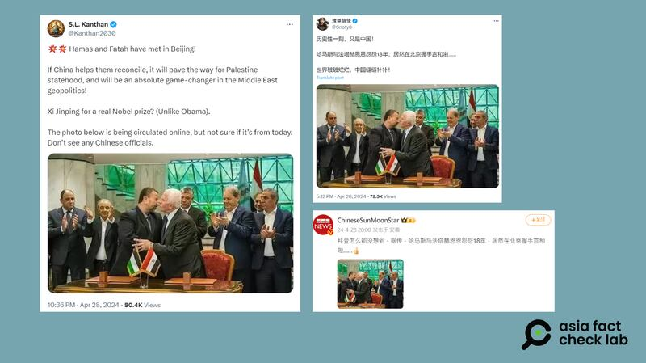

# 事實查覈｜網傳照片顯示哈馬斯與法塔赫在北京握手言和？

作者：莊敬

2024.05.09 14:41 EDT

## 標籤：錯誤

## 一分鐘完讀：

近日在中英文社媒上，流傳巴勒斯坦解放組織哈馬斯（Hamas）與競爭對手法塔赫（Fatah）在北京握手言和的信息，並附上一張雙方代表友好互動的照片，發佈者稱這是“歷史性一刻”，還有人據此發問：習近平是否能得諾貝爾和平獎。

雖然哈馬斯與法塔赫在北京會談一事已經被路透社等媒體披露，併爲中國外交部證實，但網傳照片並非雙方近期在北京會談的場景，而是2017年哈馬斯與法塔赫在開羅簽署協議的畫面。“北京會談”並無現場照片發佈，也沒有公開會談的結果。

## 深度分析：

"歷史性一刻,又是中國!哈馬斯與法塔赫恩恩怨怨18年,居然在北京握手言和啦......世界破破爛爛,中國縫縫補補!"這是X(原推特)用戶 ["豫章信使"](https://twitter.com/Snofy8/status/1784511052656599519)4月28日發佈的帖子,他還附上了一張哈馬斯與法塔赫代表親密互動的照片爲證。

哈馬斯與法塔赫在北京握手言和的消息與照片,在X、 [微博](https://weibo.com/3138941747/ObQfzdwby?from=page_1005053138941747_profile&wvr=6&mod=weibotime)等中英文社媒流傳。其中,在X上獲認證的"藍勾勾"用戶 ["S.L. Kanthan"](https://twitter.com/Kanthan2030/status/1784592521873547644)也轉傳這張照片,他並提出疑問:"照片在網上流傳,但不確定是否爲今天。沒有看到任何中國官員。"

網傳哈馬斯與法塔赫在北京“握手言和”，並附有雙方代表友好互動的照片。（圖取自Ｘ、微博）

亞洲事實查覈實驗室以圖反搜,在 ["Gettyimag](https://www.gettyimages.ca/detail/news-photo/fatahs-azzam-al-ahmad-and-saleh-al-aruri-of-hamas-kiss-news-photo/860641812?adppopup=true)es"圖庫找到這張照片。根據圖庫的圖片說明,這張照片是2017年10月,哈馬斯與法塔赫的代表在埃及開羅簽署和解協議時的情景。

至於哈馬斯與法塔赫是否在北京握手言和,根據 [路透社4月26日報道](https://www.reuters.com/world/china-host-hamas-fatah-palestinian-unity-talks-2024-04-26/),雙方代表被證實在中國會談。中國外交部發言人 [汪文斌](https://www.fmprc.gov.cn/fyrbt_673021/202404/t20240426_11289913.shtml)在4月26日記者會上被問到是否有報道所說的會談時,則以"沒有可以提供的信息"回應。4月30日,外交部發言人 [林劍](https://www.fmprc.gov.cn/fyrbt_673021/202404/t20240430_11291705.shtml)證實哈馬斯與法塔赫代表日前到北京磋商,就推進巴勒斯坦內部和解深入坦誠對話。

至本文截稿，尚未見到任何相關方發佈哈馬斯與法塔赫代表在北京會談的照片，也沒有任何關於會談結果的信息披露。

*亞洲事實查覈實驗室(Asia Fact Check Lab)針對當今複雜媒體環境以及新興傳播生態而成立。我們本於新聞專業主義,提供專業查覈報告及與信息環境相關的傳播觀察、深度報道,幫助讀者對公共議題獲得多元而全面的認識。讀者若對任何媒體及社交軟件傳播的信息有疑問,歡迎以電郵*  [*afcl@rfa.org*](mailto:afcl@rfa.org)  *寄給亞洲事實查覈實驗室,由我們爲您查證覈實。* *亞洲事實查覈實驗室在X、臉書、IG開張了,歡迎讀者追蹤、分享、轉發。X這邊請進:中文*  [*@asiafactcheckcn*](https://twitter.com/asiafactcheckcn)  *;英文:*  [*@AFCL\_eng*](https://twitter.com/AFCL_eng)  *、*  [*FB在這裏*](https://www.facebook.com/asiafactchecklabcn)  *、*  [*IG也別忘了*](https://www.instagram.com/asiafactchecklab/)  *。*

[Original Source](https://www.rfa.org/mandarin/shishi-hecha/hc-05092024144143.html)