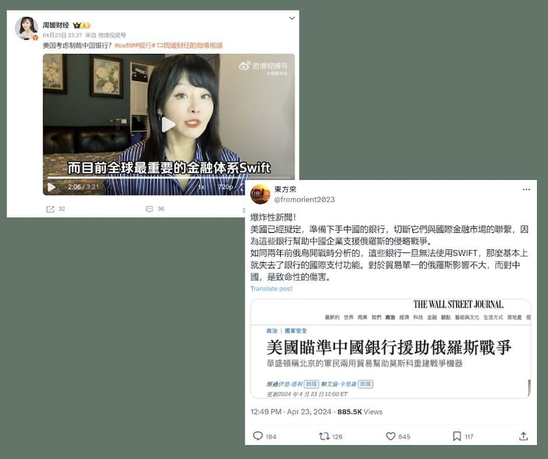

# 事實查覈｜《華爾街日報》稱美國要把中國踢出SWIFT？

作者：艾倫

2024.05.10 13:53 EDT

## 標籤：缺乏證據

## 一分鐘完讀：

備受矚目的美國國務卿布林肯（Antony Blinken)二次訪華前後，兩國經濟關係再成輿論熱點。 布林肯行前有中文網絡傳言稱，美國即將把中國從SWIFT（全球銀行金融電信協會）體系中除名，如同俄羅斯在俄烏戰爭爆發後被制裁一樣，發文者還稱，該消息來自《華爾街日報》的報道。

經查，這個說法並無證據。 《華爾街日報》確實提到知情人士透露美國有官員希望以切斷一些中國銀行與國際金融體系的聯繫作爲威脅，制約中國對俄羅斯的軍工產業的支持，但並未提及將中國“踢出SWIFT”的說法。此外，國際商務專家也表示，美國並無法單方做出將某一個國家從SWIFT除名的決定。

## 深度分析：

4月23日,華爾街日報刊出中英文 [報道](https://archive.ph/MiTw0#selection-1571.12-1571.26),提到從俄烏戰爭以來,雖然中國明面上沒有直接出售武器給俄羅斯,但出口給俄羅斯的兼具軍事用途的商品數量持續攀升,例如電路、飛機零部件、機器和機牀等。 報道指出,華盛頓正在擬定製裁援俄的中國銀行,希望能夠作爲布林肯訪中時的籌碼。

在X平臺上,擁有將近六萬追蹤的帳號"東方來" [在4月23日發文](https://x.com/fromorient2023/status/1782632895389311125)評論此事時表示,中國受制裁的銀行一旦遭踢出SWIFT,將會是致命性的傷害。 該貼文在傳播一週後,總觸及人數已達到130萬。

中國社交媒體平臺微博用戶"周媛財經"也拍視頻 [發表類似說法](https://weibo.com/7184850811/Ob6t8gtvl?refer_flag=1001030103_),稱目前全球最重要的金融體系SWIFT"是由美國主導的",且一旦中國被"踢出羣聊的話,那可是實打實的利空了"。

布林肯訪華前夕，X及微博上有博主引用華爾街日報報導，稱美國可能強迫中國退出SWIFT（全球銀行金融電信協會）。（微博、X截圖）

SWIFT的全名爲Society for Worldwide Interbank Financial Telecommunication(全球銀行金融電信協會),爲全球最大的 [金融報文傳送服務機構](https://www.swift.com/node/16751),其業務包括爲社羣內成員提供報文傳送平臺和通訊標準。 SWIFT的總部位於比利時,由英美加等十個國家進行監管,這些成員國具有共同商議制裁個別銀行的權力。

亞洲事實查覈實驗室查閱《華爾街日報》的原文，標題爲“美國起草針對援俄中資銀行的制裁措施”。 報道提到，華盛頓官員希望藉由威脅“切斷中資銀行獲取美元的渠道”，以及“中歐貿易關係可能受到影響”作爲籌碼，來說服中國政府做出改變，但全文並未提及要直接把中國從SWIFT體系中除名。

但“切斷中資銀行獲取美元的渠道”是否會包括從SWIFT體系除名？

對於美國對中國進行金融制裁的可能性及手段，位於美國華盛頓的智庫戰略暨國際研究中心（CSIS）斯科爾國際商務學院的副研究員蒂博·德納米爾（Thibault Denamiel）回應亞洲事實查覈實驗室，美國無法單獨決定將中國從SWIFT體系剔除，而其他成員國目前也不願加劇與中國的緊張關係， 因此這個說法可能性不高。

無論檢視《華爾街日報》原文或美國智庫專家，都沒有出現“把中國銀行從SWIFT除名”的說法，因此該傳言缺乏證據。

*亞洲事實查覈實驗室（Asia Fact Check Lab）針對當今複雜媒體環境以及新興傳播生態而成立。我們本於新聞專業主義，提供專業查覈報告及與信息環境相關的傳播觀察、深度報道，幫助讀者對公共議題獲得多元而全面的認識。讀者若對任何媒體及社交軟件傳播的信息有疑問，歡迎以電郵afcl@rfa.org寄給亞洲事實查覈實驗室，由我們爲您查證覈實。*

*亞洲事實查覈實驗室在X、臉書、IG開張了,歡迎讀者追蹤、分享、轉發。X這邊請進:中文*  [*@asiafactcheckcn*](https://twitter.com/asiafactcheckcn)  *;英文:*  [*@AFCL\_eng*](https://twitter.com/AFCL_eng)  *、*  [*FB在這裏*](https://www.facebook.com/asiafactchecklabcn)  *、*  [*IG也別忘了*](https://www.instagram.com/asiafactchecklab/)  *。*

[Original Source](https://www.rfa.org/mandarin/shishi-hecha/hc-05102024135317.html)