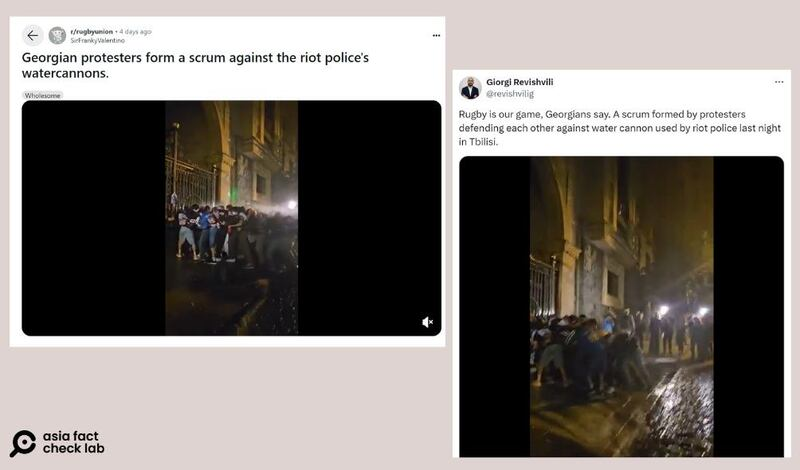
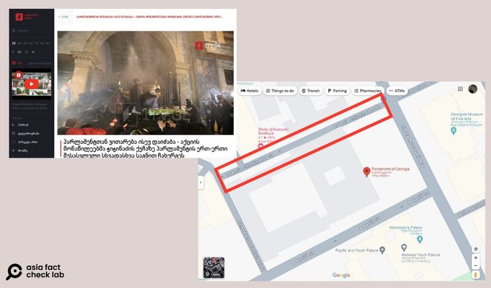
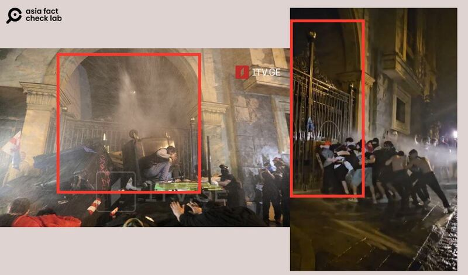

# 事實查覈｜網傳視頻中美國抗議學生組人牆抵擋警察水炮攻擊？

作者：艾倫

2024.05.13 10:30 EDT

## 查覈結果：錯誤

## 一分鐘完讀

在美國多個大學校園爆發的反以哈戰爭抗議還在持續。 中國社媒平臺微博近日流傳一則所謂美國校園抗議遭警察水炮鎮壓的視頻，其內容爲一羣民衆疊成人牆對抗鎮暴水槍。

經查覈，這是錯誤信息。 視頻中的事件發生在黑海沿岸國家格魯吉亞（Georgia，臺灣譯爲喬治亞）的首都第比利斯（Tbilisi），是當地民衆在議國會二讀通過“境外影響力”法案後聚集抗議的場景。

## 深度分析

5月5日,微博大V"濤淼"發佈一則 [視頻](https://weibo.com/1256692472/OcReemUJw?refer_flag=1001030103_),稱美國抗議以哈衝突的學生組成人牆對抗使用水槍的警察,消息在發佈一天後,已累積超過4000個贊及300多次轉發。

同樣視頻當天也在Bilibili上被 [轉發](https://www.bilibili.com/video/BV1xH4y137F7/?spm_id_from=333.788.recommend_more_video.15),並附上文字:"美國潑水節?美學生用身體抗水炮!"目前該視頻在平臺上也已收穫超過一萬個贊及一百多次分享。

微博和Bilibili近日出現傳言，稱美國學生在抗議以哈衝突中，爲抵擋警方的鎮暴水槍，合力組成人牆，並附上視頻佐證。（微博、Bilibili網站截圖）

將該視頻截圖在谷歌圖片進行反搜,發現這段視頻也正在英文網絡中流傳,但轉傳者並沒有稱這是美國的校園抗議。 亞洲事實查覈實驗室通過美國社交平臺Reddit上一則 [帖文](https://www.reddit.com/r/rugbyunion/comments/1cib0sl/georgian_protesters_form_a_scrum_against_the_riot/?utm_source=embedv2&utm_medium=post_embed&utm_content=whitespace&embed_host_url=https://www.ruck.co.uk/the-incredible-moment-georgian-protesters-form-a-scrum-against-the-riot-polices-watercannons/),找到該視頻其中一位轉發者——Giorgi Revishvili,其X平臺的自我介紹爲前格魯吉亞國家安全委員會資深顧問,關注領域爲俄羅斯國家安全及外交政策。 他的 [X貼文](https://x.com/revishvilig/status/1785909616594829701)寫道:"格魯吉亞人說,橄欖球是我們的運動。昨晚在第比利斯,抗議者組成了一個爭球隊形(scrum),抵抗了防暴警察使用的水炮。"

相關消息在社媒平臺Reddit及X上也能找到，其中，前格魯吉亞國安會資深顧問Giorgi Revishvili轉發視頻（右圖）指出，此爲格魯吉亞國會前的抗議畫面。（Reddit、X平臺截圖）

關鍵字搜尋結果顯示,多家格魯吉亞媒體皆報導了首都第比利斯的抗議活動,如《 [今日格魯吉亞](https://georgiatoday.ge/police-give-up-roads-attack-protesters-from-within-parliament-building/)》等。 其中,格魯吉亞公共廣播公司發佈的 [新聞圖片](https://1tv.ge/news/parlamenttan-vitareba-isev-daidzaba-aqciis-monawileebma-chichinadzis-quchaze-parlamentis-ert-erti-shesasvleli-skhvadaskhva-sagnebit-chakherges/)中的場景,和網傳視頻裏中的場景特徵一致。 報道提到,示威者使用各種物品堵住國會旁奇奇納澤街(Zakaria Chichinadze Street)的入口,並於同條路另個出口"豎起了人工屏障",而警方則以鎮暴水槍試圖驅離抗議人潮。

格魯吉亞公共廣播公司發佈的新聞首圖比對谷歌地圖，可以找到新聞內提及的奇奇納澤街（Zakaria Chichinadze Street），爲該國國會旁的一條道路。（格魯吉亞公共廣播公司、谷歌地圖截圖）

經查，奇奇納澤街確實爲格魯吉亞國會建築旁的一條街道，且新聞畫面裏該入口的場景和網傳視頻吻合。因此可判斷，該視頻中場景確實發生在格魯吉亞，所謂“美國抗議學生組人牆”的說法是錯誤的。

格魯吉亞當地新聞裏出現的入口畫面，和網傳抗議視頻的入口畫面一致。（圖/格魯吉亞公共廣播公司截圖、網傳視頻截圖）

據臺灣中央社 [報道](https://www.cna.com.tw/news/aopl/202405030126.aspx),格魯吉亞國會在上週三通過極具爭議的"外國代理人"法案二讀,該法案可賦權政府將特定媒體掛上"外國利益"的標籤,引發外界抨擊,認爲此法案將仿效俄羅斯打壓異議人士,因此激起了大規模的抗議。

*亞洲事實查覈實驗室（Asia Fact Check Lab）針對當今複雜媒體環境以及新興傳播生態而成立。我們本於新聞專業主義，提供專業查覈報告及與信息環境相關的傳播觀察、深度報道，幫助讀者對公共議題獲得多元而全面的認識。讀者若對任何媒體及社交軟件傳播的信息有疑問，歡迎以電郵afcl@rfa.org寄給亞洲事實查覈實驗室，由我們爲您查證覈實。*

*亞洲事實查覈實驗室在X、臉書、IG開張了,歡迎讀者追蹤、分享、轉發。X這邊請進:中文*  [*@asiafactcheckcn*](https://twitter.com/asiafactcheckcn)  *;英文:*  [*@AFCL\_eng*](https://twitter.com/AFCL_eng)  *、*  [*FB在這裏*](https://www.facebook.com/asiafactchecklabcn)  *、*  [*IG也別忘了*](https://www.instagram.com/asiafactchecklab/)  *。*

[Original Source](https://www.rfa.org/mandarin/shishi-hecha/hc-05132024103049.html)