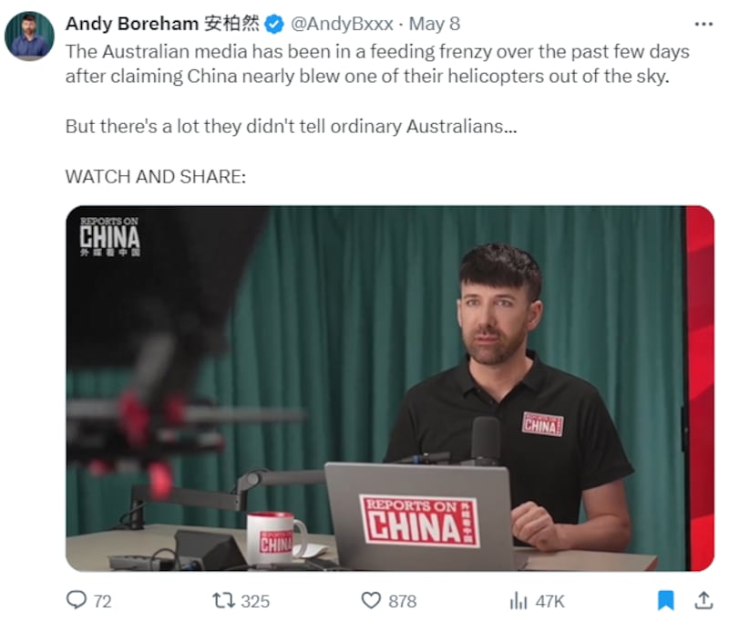
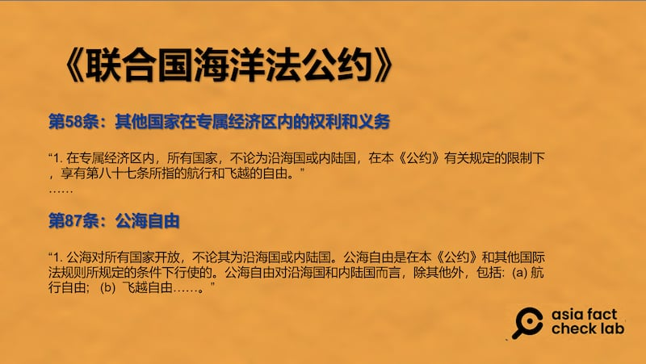
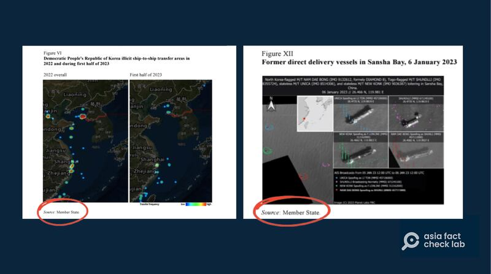

# 事實查覈｜中國軍機在黃海上空驅離澳軍機有國際法依據嗎？

作者：鄭崇生

2024.05.14 15:29 EDT

## 查覈結果：錯誤

## 一分鐘完讀：

5月4日,一架中國解放軍軍機 [以發射熱焰彈的方式](https://apnews.com/article/australia-china-yellow-helicopter-flares-af603b59b165f3b5c9d2971979815c5c),驅離在黃海上空執行聯合國制裁朝鮮任務的澳大利亞軍用直升機,引發外交爭端。

在中國英文報刊《上海日報》任職的一位新西蘭籍博主安柏然(Andy Boreham) [聲稱](https://twitter.com/i/bookmarks?post_id=1787673356373991547),"雖然根據《聯合國海洋法公約》,外國(機艦)在他國專屬經濟區(EEZ)有'無害通過權'(innocent passage),但衆所皆知,中國和其他17個國家不歡迎外國軍機在未經許可的情況下,進入中國的專屬經濟區。"他更指出,"中方發射熱焰彈驅離,是包括美國官方也認證的常見作法"。

然而經查，安柏然的論述錯誤解釋了《聯合國海洋法公約》（下簡稱：公約），根據公約，各國在專屬經濟區可享有的權利與義務，跟在公海是一樣的。

安柏然爲中國在其黃海專屬經濟區內驅離澳大利亞軍機的行爲辯護 （X平臺截圖）

## 深度分析：

澳大利亞國防部於當地時間6日晚上以 [新聞稿](https://www.defence.gov.au/news-events/releases/2024-05-06/statement-unsafe-and-unprofessional-interaction-pla-air-force)主動公開了這期衝突事件。根據澳方說法,一架由驅逐艦霍巴特號(HMAS Hobart DDG-39)搭載的MH-60R"海鷹"(Seahawk)直升機,4日晚間在黃海"國際水域"執行聯合國制裁朝鮮的例行任務時,遭解放軍軍機施放熱焰攔截。澳方批評,解放軍的行爲"不安全且不專業"。

中國外交部發言人林劍在5月7日的例行記者會上 [反駁](https://www.fmprc.gov.cn/fyrbt_673021/202405/t20240507_11300630.shtml),是澳方軍艦機"打着執行聯合國安理會決議的旗號,蓄意抵近中國領空滋事挑釁";中國國防部則 [表示](http://www.mod.gov.cn/gfbw/qwfb/16306361.html),中國海軍3日至4日在中國黃海相關海域訓練期間,"霍巴特"號導彈驅逐艦3次派艦載直升機對中方抵近偵察滋擾,更指控澳方"散播虛假敘事"。

針對這起糾紛,在X平臺上自稱"講述事實的媒體人"的安柏然發出 [推文](https://perma.cc/FCF5-S7NP)與視頻指責堪培拉。他說"根據《聯合國海洋法公約》,外籍機艦在他國專屬經濟區(EEZ)有'無害通過權'",然而"中國和其他17個國家不歡迎外國軍機在未經許可的情況下,進入中國的專屬經濟區。"

美國海軍戰爭學院斯托克頓國際法中心(Stockton Center for International Law)主席 [克拉斯卡](https://usnwc.edu/Faculty-and-Departments/Directory/James-Kraska)(James Kraska)、新加坡南洋理工大學國際研究院(RSIS)資深研究員 [許瑞麟](https://www.rsis.edu.sg/profile/collin-koh-swee-lean/)(Collin Koh)與澳大利亞國立大學教授 [羅斯維爾](https://researchers.anu.edu.au/researchers/rothwell-dr)(Donald Rothwell)都是國際法領域中專研 [《聯合國海洋法公約》](https://www.un.org/depts/los/convention_agreements/texts/unclos/unclos_c.pdf)(下簡稱《公約》)多年的學者,三人都告訴亞洲事實查覈實驗室,安柏然的說法"完全不正確"。

## 無害通過VS過境通行

克拉斯卡告訴記者，根據《公約》第17條到19條，所謂的“無害通過權”僅適用於所有船隻在通過他國“領海”時，無害通過與專屬經濟區內通行時的權利及義務毫無關聯。

簡言之，在公約中，只有討論各國在“領海區域”的權利與義務主張時纔會使用“無害通過”，非領海區域的航行與飛越則在公約中都叫做“過境通行”（transit Passage）。也就是說，事發地點並不是中國領海，安柏然所引述的“無害通過權”，不適用這場衝突情景。

許瑞麟和羅斯維爾均指出,儘管安柏然說的"國際水域"並不是一個法律用語是正確的,國際水域一詞也確實沒有出現在《公約》中,但在國際法領域,慣例將12海里**領海以外的區域稱爲國際水域**。《公約》中提到的海域劃分、離海岸由近到遠的有關定義是:內水、領海、毗連區、專屬經濟區和公海(High Seas),而根據《公約》第58條和87條,各國在專屬經濟區可享有的權利與義務,跟在公海是一樣的。

聯合國海洋法公約相關條款（亞洲事實覈查實驗室製圖）

羅斯維爾解釋，根據《公約》，上述規定也適用於軍事船舶，也就是說，在各國專屬經濟區，各國軍艦和民用、商用船隻一樣，同樣享有航行自由，澳大利亞這次的行動，也就是基於第58條。

根據 [澳大利亞國防部](https://www.defence.gov.au/news-events/releases/2023-02-17/defence-continues-support-operation-argos),澳方配合聯合國安理會決議,執行鍼對朝鮮制裁的 [亞果斯任務](https://www.defence.gov.au/defence-activities/operations/argos)(Operation Argos),始自2018年,而在聯合國的 [《最新年度報告》](https://undocs.org/en/S/2023/656)中就引述"成員國"的監視資料,介紹了在中國沿海有關船隻違反聯合國決議,協助朝鮮運輸、停靠及裝卸禁運物品的詳細情況。

中國沿海有關船隻違反聯合國決議，協助朝鮮運輸、停靠及裝卸禁運物品的衛星照片。（聯合國報告截圖）

至於安柏然聲稱“中國不歡迎外國軍機在未經許可的情況下進入中國的專屬經濟區，這是衆所皆知的事”，在羅斯維爾看來，這種表態落實到行動，是“不符合《聯合國海洋法公約》”，克拉斯卡更指出，“這是違反國際法”。

克拉斯卡舉例，“一個國家不能簡單粗暴地宣佈一部分的公海或專屬經濟區禁止其他國家進入，這就像美國不能宣佈月球禁止中國進入一樣。”

*亞洲事實查覈實驗室(Asia Fact Check Lab)針對當今複雜媒體環境以及新興傳播生態而成立。我們本於新聞專業主義,提供專業查覈報告及與信息環境相關的傳播觀察、深度報道,幫助讀者對公共議題獲得多元而全面的認識。讀者若對任何媒體及社交軟件傳播的信息有疑問,歡迎以電郵* *afcl@rfa.org* *寄給亞洲事實查覈實驗室,由我們爲您查證覈實。*  *亞洲事實查覈實驗室在X、臉書、IG開張了,歡迎讀者追蹤、分享、轉發。X這邊請進:中文*  [*@asiafactcheckcn*](https://twitter.com/asiafactcheckcn)  *;英文:*  [*@AFCL\_eng*](https://twitter.com/AFCL_eng)  *、*  [*FB在這裏*](https://www.facebook.com/asiafactchecklabcn)  *、*  [*IG也別忘了*](https://www.instagram.com/asiafactchecklab/)  *。*

[Original Source](https://www.rfa.org/mandarin/shishi-hecha/hc-05142024152215.html)