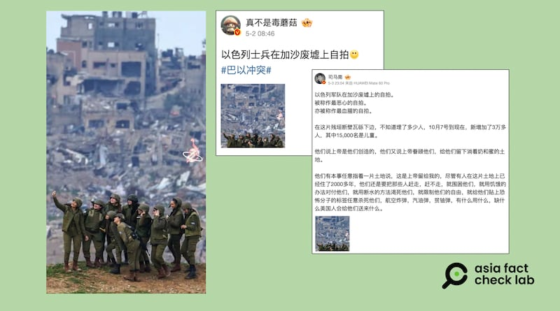
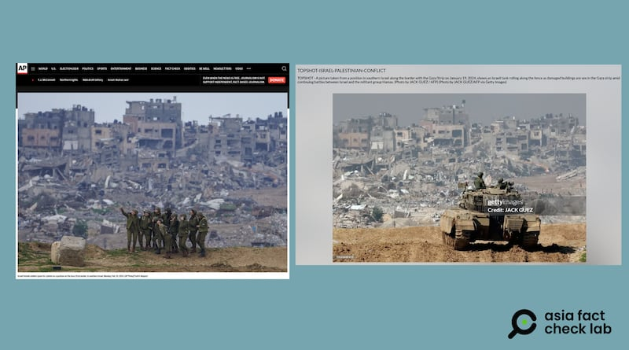

# 事實查覈｜網傳照片中以色列士兵“在加沙廢墟上”自拍？

作者：莊敬

2024.05.15 13:21 EDT

## 查覈結果：誤導

## 一分鐘完讀：

伊朗駐華大使館微博賬號5月1日發文：“伊朗駐黎巴嫩大使館在推特上發佈了一張以色列士兵在加沙廢墟中的照片，稱：世界上最噁心的自拍。”這則帖文附上一羣士兵在廢墟前自拍的照片。 部分中文社媒帳號轉傳照片，將文字敘述改爲“以色列軍隊在加沙廢墟上自拍，在這片殘垣斷壁瓦礫下邊，不知道埋了多少人。”

經查，這是美聯社記者今年2月拍攝的照片，照片中士兵所在地點爲以色列領土而不是網傳“在加沙廢墟上”。 至於看起來很像士兵直接站在廢墟上，是攝影角度的關係，攝影記者本人就此曾做出說明。

## 深度分析：

伊朗駐華大使館5月1日在 [微博發文](https://weibo.com/2312751365/OcfPNEPtV#repost):"伊朗駐黎巴嫩大使館在推特上發佈了一張以色列士兵在加沙廢墟中的照片,稱:世界上最噁心的自拍。"這篇 帖文附上照片和伊朗駐黎巴嫩大使館在4月底發佈的 [推文截圖](https://twitter.com/IranEmbassyLB/status/1782731910965289232),其推文"世界上最噁心的自拍"。 而照片看起來是一羣士兵在廢墟前自拍。

這張照片隨即在微博、X等平臺上轉傳,包括粉絲上千萬的博主 ["真不是毒蘑菇"](https://m.weibo.cn/detail/5029504445842196)分享照片,配文寫着"以色列士兵在加沙廢墟上自拍"。 中國著名電視主持人、評論員 [司馬南](https://m.weibo.cn/detail/5030082884405727)也在微博上發了這張照片,配文"以色列軍隊在加沙廢墟上的自拍。被稱作最噁心的自拍。亦被稱作最血腥的自拍。在這片殘垣斷壁瓦礫下邊,不知道埋了多少人⋯⋯"。 司馬南並以這張自拍照爲題製作一則6分鐘的 [視頻](https://weibo.com/tv/show/1034:5031083339612216?from=old_pc_videoshow),經多位"大V"博主轉傳。

近日在社媒平臺上，有用戶轉傳一張士兵正在自拍的照片，宣稱是以色列士兵在加沙廢墟上自拍。 （圖取自微博）

## 網傳照片並非合成

亞洲事實查覈實驗室注意到，在部分轉傳照片的帖子下，有網民留言懷疑照片是“P的”（合成照片）。

經查，這是美聯社記者Tsafrir Abayov今年2月中拍攝的照片，在美聯社圖庫中可以看到原圖，並非合成。

該照片今年2月發佈後,即在網上廣傳,引起討論,與有不少人批評照片中以色列士兵的自拍行爲。因此,拍攝者也曾發表 [文章](https://apnews.com/article/2024/israeli-female-soldiers-selfie-gaza-border-photo)說明如何捕捉到這個畫面。 根據他的說明,拍攝地點是在以色列一側、距離加沙邊境約50公尺處,從這個位置可以看到加沙遭破壞的區域,人員和坦克車通常不會在此處停留很久。

由此可知，照片是記者所拍攝，並非部分網民所懷疑的合成照片。

## 照片中的自拍行爲並非站在“加沙廢墟上”

根據美聯社記者的說明，照片中士兵位置在以色列南部、靠近加沙邊境處。

上述照片拍攝者、美聯社記者在發文中強調：“雖然畫面看起來像是在加沙，但其實他和照片中的士兵都位於以色列。”

亞洲事實查覈實驗室以美聯社的照片搜尋,在Getty Images圖庫找到類似背景的照片,是 [法新社](https://www.gettyimages.hk/detail/%E6%96%B0%E8%81%9E%E7%85%A7%E7%89%87/picture-taken-from-a-position-in-southern-israel-along-the-border-%E6%96%B0%E8%81%9E%E7%85%A7%E7%89%87/1936848921?adppopup=true)記者今年1月所拍攝,照片中有一輛以色列坦克車,其背景的建築物、 遭破壞的區域,都與美聯社照片的背景高度相似。 根據法新社圖說,其拍攝地點位於以色列南部、加沙邊境處。

以色列士兵自拍、背景爲加沙廢墟的照片，是由美聯社記者所拍攝（左圖）。 法新社記者曾在相似的背景前拍攝坦克車（右圖）。 兩張照片的拍攝地點都在以色列一側、靠近加沙邊境處。 （圖取自美聯社網站、Getty Images網站）

綜合美聯社的照片圖說與記者專文說明，以及法新社照片圖說，可知拍攝處位於以色列一側。

回顧伊朗駐華大使館的貼文，原文寫的是“在加沙廢墟中”。 部分中文社羣帳戶轉傳時，將配文描述改爲“在加沙廢墟上”，甚至加入“在這片殘垣斷壁瓦礫下邊，不知道埋了多少人”等文字，讓受衆以爲這些士兵腳踩加沙廢墟上自拍，傳播誤導信息。

*亞洲事實查覈實驗室(Asia Fact Check Lab)針對當今複雜媒體環境以及新興傳播生態而成立。我們本於新聞專業主義,提供專業查覈報告及與信息環境相關的傳播觀察、深度報道,幫助讀者對公共議題獲得多元而全面的認識。讀者若對任何媒體及社交軟件傳播的信息有疑問,歡迎以電郵*  [*afcl@rfa.org*](mailto:afcl@rfa.org)  *寄給亞洲事實查覈實驗室,由我們爲您查證覈實。* *亞洲事實查覈實驗室在X、臉書、IG開張了,歡迎讀者追蹤、分享、轉發。X這邊請進:中文*  [*@asiafactcheckcn*](https://twitter.com/asiafactcheckcn)  *;英文:*  [*@AFCL\_eng*](https://twitter.com/AFCL_eng)  *、*  [*FB在這裏*](https://www.facebook.com/asiafactchecklabcn)  *、*  [*IG也別忘了*](https://www.instagram.com/asiafactchecklab/)  *。*

[Original Source](https://www.rfa.org/mandarin/shishi-hecha/hc-05152024131718.html)