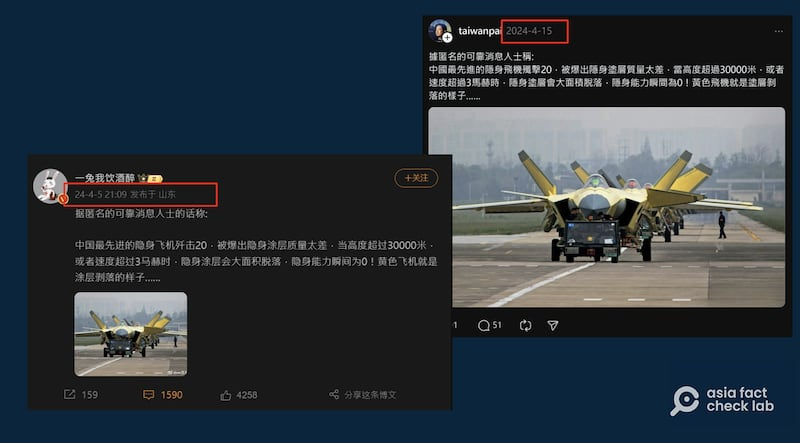

# 事實查覈｜中國戰機"殲20"的隱身塗裝掉漆了?

作者：董喆

2024.05.16 19:25 EDT

## 覈查結果：錯誤

## 一分鐘完讀：

Meta旗下社羣平臺Threads近期有網民宣稱：中國戰機殲20的隱身塗層剝落，失去“隱身”能力，並附上照片以爲“證據”。這則貼文被中國微博大V孤煙暮蟬轉發，嘲諷臺灣掌握殲20錯誤情報。

亞洲事實查覈實驗室採訪多位航空科技專家和軍事專家，認定貼文中的黃色塗裝是保護漆，並非塗層剝落，且根據中國官方公開的信息，殲20的速度無法達到3馬赫。此貼文是錯誤訊息。

## 深度分析：

社媒平臺Threads近期有網友稱據匿名可靠消息來源指出,中國殲20戰機被爆出隱身塗層質量太差,在高度超過三萬米或是速度超過3馬赫時,隱身塗層會大面積脫落,並附上一張照片,宣稱是殲20塗層剝落的樣貌。微博大V孤煙暮蟬 [轉發這則貼文的截圖](https://weibo.com/2150758415/5033574812092615),嘲諷"哇塞!J20的祕密竟然全被灣灣掌握了?!"

微博大V孤煙暮蟬轉發Threads上的貼文，嘲諷臺灣掌握殲20的錯誤資訊。（取自Threads、微博）

## 殲20的黃色塗裝是隱身塗層剝落?

對此，亞洲事實查覈實驗室採訪了臺灣國防安全研究院“中共政軍與作戰概念研究所”副研究員舒孝煌，經緯航太科技董事長、前漢翔公司總經理羅正方，以及“中國人民解放軍基地及設施”互動地圖創建人、臺灣戰略模擬學會兼任研究員溫約瑟。

溫約瑟指出，該照片拍攝地點爲殲20製造廠“成都飛機工業集團”的試飛機場“溫江機場”，此地正是殲20的主要測試和生產線。

照片拍攝地點爲殲20製造商"中國航空工業集團"旗下"成都飛機工業集團"的的溫江機場（溫約瑟提供）

舒孝煌和羅正方則確認，照片中的黃色塗裝爲保護漆，而非隱身塗層剝落，這樣的“黃皮機”並非特例，臺灣的F-16構改出廠前亦有塗上黃色底漆。

羅正方說明，這類黃色塗料是環氧富鋅塗料底漆，目的是爲了在飛機測試期間防鏽，並不是正式塗裝漆料。飛機完成試飛後纔會塗上低可視度隱形塗裝，正式交付部隊。

臺軍F16構改出廠前，也曾以黃色塗裝進行試飛。（軍事攝影粉專"G4的亂攝天地"提供）

## 殲20速度超過3馬赫時，隱身塗層會剝落?

舒孝煌指出,隱身塗層的確不好保養,但針對社羣貼文陳述的"3馬赫",舒孝煌表示殲20並沒有那麼快的飛行速度。根據人民日報2018年發佈的 [視頻"軍人一分鐘"](http://v.people.com.cn/n1/2018/0802/c67816-30195503.html),殲20一分鐘可戰鬥巡航52公里,相當於每小時3120公里,約爲2.55馬赫。

羅正方表示,隱身塗裝在高速或溫度極劇變化時的確有可能剝落,以F-35爲例,在飛行幾個架次後就需要補裝、補漆,影響妥善率甚大。溫約瑟也提及,美軍F22先前就曾 [被報道](https://www.twz.com/29218/these-images-of-an-f-22-raptors-crumbling-radar-absorbent-skin-are-fascinating?fbclid=IwZXh0bgNhZW0CMTAAAR3yeasB7P4-xIcoI-CELrQwpMEbl19rNWw8bDocUTwstxDgnzqEKPUi-Q0_aem_AWBXkvhqVRw_upWCzXnIZuJPILOk26kWYU6yYx1lQU4n8YejhHKtmNg1FjnOxqI3lC8RmRVyv1iI3A9B7deBgOG5)有塗料剝落的問題,但主要發生在氣流高速通過的部位,例如機鼻上方。

羅正方估計，若殲-20後續交軍，隱身匿蹤塗裝也會面臨類似的情況。但是否出現如社羣貼文所稱“大面積脫落”？羅正方認爲應該不會，根據過往報道，該塗層驗證階段曾製成踏墊，故意置於出入口供人踩踏，驗證耐磨及耐折度。

## 中國謠言被轉手成中國愛國大V素材

亞州事實查覈實驗室發現，Threads流傳的這則謠言，其實早在四月初就出現在中國社羣平臺，4月15日被簡轉繁轉發到臺灣熱門的社羣平臺。 5月，這則貼文被中國微博知名的愛國大V孤煙暮蟬轉發，嘲諷臺灣掌握殲20錯誤情報。

殲20塗料脫落的謠言先由中國微博賬號發起（取自Threads、微博）

*亞洲事實查覈實驗室(Asia Fact Check Lab)針對當今複雜媒體環境以及新興傳播生態而成立。我們本於新聞專業主義,提供專業查覈報告及與信息環境相關的傳播觀察、深度報道,幫助讀者對公共議題獲得多元而全面的認識。讀者若對任何媒體及社交軟件傳播的信息有疑問,歡迎以電郵*  [*afcl@rfa.org*](mailto:afcl@rfa.org)  *寄給亞洲事實查覈實驗室,由我們爲您查證覈實。* *亞洲事實查覈實驗室在X、臉書、IG開張了,歡迎讀者追蹤、分享、轉發。X這邊請進:中文*  [*@asiafactcheckcn*](https://twitter.com/asiafactcheckcn)  *;英文:*  [*@AFCL\_eng*](https://twitter.com/AFCL_eng)  *、*  [*FB在這裏*](https://www.facebook.com/asiafactchecklabcn)  *、*  [*IG也別忘了*](https://www.instagram.com/asiafactchecklab/)  *。*

[Original Source](https://www.rfa.org/mandarin/shishi-hecha/hc-05162024191818.html)