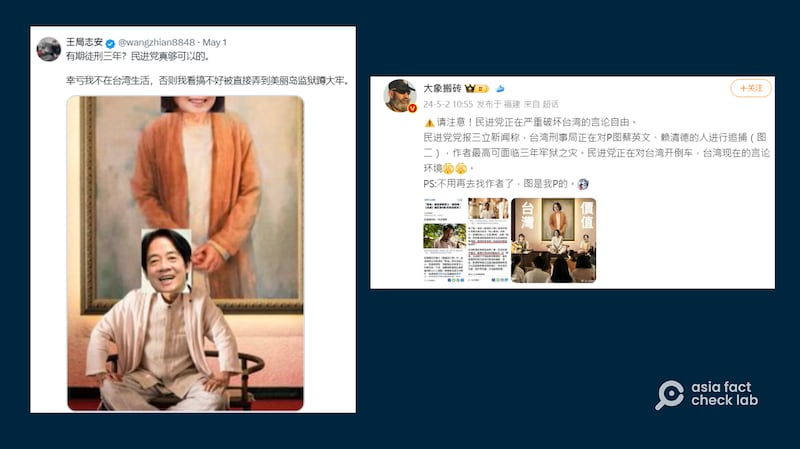

# 事實查覈｜圖片惡搞蔡英文、賴清德會判三年？臺灣言論自由被民進黨破壞？

作者：莊敬

2024.05.17 15:24 EDT

## 查覈結果：誤導

## 一分鐘完讀：

臺灣電影《周處除三害》在中國大受歡迎後，部分片中人物、場景被製作成網絡迷因（Meme，亦稱作網絡梗），更有人“惡搞”，將影片截圖中邪教領袖“尊者”和其“護法”們的頭像換成臺灣總統蔡英文和即將就任總統、副總統的賴清德、蕭美琴。接到相關檢舉後，臺灣警方對媒體稱會展開調查，並提示更改影視作品劇照恐違反《著作權法》，另外，宣揚該電影中的暴力血腥意涵也可能涉及臺灣刑法中的煽惑罪，但隨後，警方已宣佈調查結果，認定該事件不涉犯罪，並已結案。

此消息在X（前推特）、微博等平臺上卻被一再誤傳。包括知名意見領袖王志安等稱變造政治人物肖像在臺灣會獲罪“有期徒刑三年”，並以此批評民進黨壓制言論自由。

## 深度分析

曾任中國中央電視臺記者、現旅居日本的王志安5月1日在 [X(前推特)發文](https://twitter.com/wangzhian8848/status/1785658882523877629):"有期徒刑三年?民進黨真夠可以的。"搭配一張明顯經修改的圖片,把電影《周處除三害》劇照中的"尊者",換成臺灣總統蔡英文、即將就任的下屆總統賴清德的頭像。

在微博擁有近百萬粉絲的軍事博主" [大象搬磚](https://weibo.com/1944375784/Ocoob1aR6?type=repost)"5月2日也發佈一張用《周處除三害》劇照修改的圖片,原圖中的"尊者"與兩名"護法",換成蔡英文、賴清德,以及副總統當選人蕭美琴。 配文聲稱"民進黨正在嚴重破壞臺灣的言論自由"、"臺灣刑事局正在對P圖蔡英文、賴清德的人進行追捕,作者最高可面臨三年牢獄之災"。

多個社媒帳號稱將《周處除三害》電影截圖中邪教人物頭像改換爲蔡英文、賴清德等可能會在臺灣獲罪，並指民進黨讓臺灣言論自由倒退。 （X平臺、微博截圖）

## 梗圖來源爲含有暴力場面的電影

上述社媒傳言與近日熱議的《周處除三害》網絡梗有關。臺灣媒體《自由時報》4月28日 [刊出報道](https://news.ltn.com.tw/news/society/paper/1643186),有網民將《周處除三害》中邪教領袖"尊者"和"護法"坐在"新心靈舍"講堂弘法的畫面,改換成蔡英文、賴清德等政治人物,並將修改後的圖放上網,被民衆檢舉"煽惑罪"。

臺灣電影《周處除三害》於2023年出品，在被臺灣評級爲“未滿十五歲不得觀賞”。影片中邪教人物“尊者”及其跟隨者被處決等場面因充滿暴力、血腥的元素引起不少討論。2024年3月，該電影經審查剪裁後於中國大陸上映，並大獲票房成功，

臺灣警方談論民衆對該圖的檢舉時表示，電影本身具有殺戮和暴力意涵，民衆無論是有意或是無意的製作KUSO(惡搞)迷因圖，可能涉及刑法中煽惑罪，另也違反著作權法六十五條第二項有關合理使用的規定，該篇報道稱，警方已根據檢舉循線追查中。

該話題經《 [中時新聞網](https://www.chinatimes.com/realtimenews/20240430000949-260402?chdtv)》、 [《鏡新聞](https://www.mnews.tw/story/20240430nm006)》等多家媒體跟進報道,掀起討論。《自由時報》同天刊出的 [另則相關報道](https://news.ltn.com.tw/news/society/paper/1643187)解讀警方說法,受訪法律專家說明,煽惑犯罪的構成要件爲"明白而立即的危險",若法官認定該篇改作成罪,最重可處兩年徒刑,如認定已逾越合法使用範圍,依著作權法可判刑三年。但受訪專家同時表示,惡搞網絡圖"可能讓人聯想到殺害",也可以理解爲是正常表達政治訴求,是否構成煽惑罪還有待法官審酌。對於涉嫌侵犯著作權,該律師分析,該案中並且沒有商業營利,公衆人物的肖像權容忍度也比較寬鬆,因此不一定成罪。

## 臺灣警方已宣佈該圖不涉犯罪

5月1日,《自由時報》等媒體發佈 [後續報道](https://news.ltn.com.tw/news/society/breakingnews/4659060),臺灣刑事局調查後認定,該案無具體犯罪事實及其他可追查的具體情資,已籤辦結案,臺灣警方目前也未接獲著作權人提出告訴。

此前臺灣媒體對該惡搞換圖事件報道中提及的"(最高)有期徒刑三年",是在討論篡改原作侵犯 [《著作權法》](https://law.moj.gov.tw/LawClass/LawSingle.aspx?Pcode=J0070017&FLNO=91)的可能後果;關於"煽惑罪"的討論,則是基於電影中的暴力意涵,討論將影片中被血腥處決的角色形象替換爲現實政治人物,是否有仇恨性言論、暗示暴力等含義,而並不是因爲改換成的肖像是民進黨領導人。

並且，王志安、“大象搬磚”等發文前，臺灣媒體已經報道警方認定該行爲不涉犯罪、已結案的消息，因此“P圖蔡英文、賴清德”會被判刑、“民進黨壓制言論自由”的說法，屬誤導內容。

*亞洲事實查覈實驗室(Asia Fact Check Lab)針對當今複雜媒體環境以及新興傳播生態而成立。我們本於新聞專業主義,提供專業查覈報告及與信息環境相關的傳播觀察、深度報道,幫助讀者對公共議題獲得多元而全面的認識。讀者若對任何媒體及社交軟件傳播的信息有疑問,歡迎以電郵*  [*afcl@rfa.org*](mailto:afcl@rfa.org)  *寄給亞洲事實查覈實驗室,由我們爲您查證覈實。* *亞洲事實查覈實驗室在X、臉書、IG開張了,歡迎讀者追蹤、分享、轉發。X這邊請進:中文*  [*@asiafactcheckcn*](https://twitter.com/asiafactcheckcn)  *;英文:*  [*@AFCL\_eng*](https://twitter.com/AFCL_eng)  *、*  [*FB在這裏*](https://www.facebook.com/asiafactchecklabcn)  *、*  [*IG也別忘了*](https://www.instagram.com/asiafactchecklab/)  *。*

[Original Source](https://www.rfa.org/mandarin/shishi-hecha/hc-05172024151822.html)