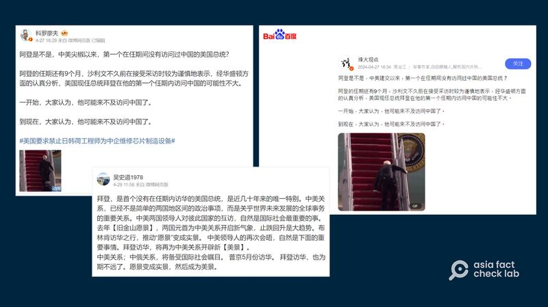

# 事實查覈｜拜登是第一個任內沒訪問過中國的美國總統？

作者：莊敬

2024.05.20 14:47 EDT

## 查覈結果：錯誤

## 一分鐘完讀：

美國國務卿布林肯日前訪問中國，外傳可能是爲總統拜登訪問中國鋪路，相關話題也在中文社交媒體上引起討論。 一些社媒用戶近日發文聲稱，拜登是中美建交以來，第一個沒在任期內訪過中國的美國總統。 但這個說法有誤，並不是每位美國總統都曾在任內訪華，與北京完成建交的前總統卡特，在任時就沒有訪問過中國。

## 深度分析：

美國國務卿布林肯(Antony Blinken)4月24日至26日訪問中國,香港 [《星島日報》](https://std.stheadline.com/realtime/article/1994856/%E5%8D%B3%E6%99%82-%E4%B8%AD%E5%9C%8B-%E4%B8%AD%E5%9C%8B%E8%A7%80%E5%AF%9F-%E7%BF%92%E8%BF%91%E5%B9%B3%E6%96%99%E6%99%A4%E5%B8%83%E6%9E%97%E8%82%AF)報道指出,這次布林肯正式應邀訪華,可能是爲美國總統拜登(Joe Biden)訪華鋪路。 話題在微博、百度等平臺上引起討論,其中有些微博用戶發文,指拜登是中美建交近幾十年以來,第一個沒有在任期內訪問過中國的美國總統。

社媒用戶發文，稱美國總統拜登是美中建交幾十年以來，第一位沒在任內訪問中國的總統。 （微博、百度截圖）

這個說法並不正確。 根據美國國務院歷史文獻辦公室(Office of the Historian)的 [整理資料](https://history.state.gov/departmenthistory/travels/president/china),以及英國廣播公司(BBC)的 [報道](https://www.bbc.com/zhongwen/simp/chinese-news-41896847),自1972年美國前總統尼克松(Richard M. Nixon)訪問中國後,並不是每位總統都在任內訪問中國。 在1977年至1981年期間擔任總統的卡特(Jimmy Carter)在任時就沒有訪問過中國,但在他任內,美國和中華人民共和國於1979年完成建交。

根據上述資料，尼克松在1972年2月、福特（Gerald R. Ford）在1975年12月訪問中國；里根（Ronald Reagan）則在1984年4月訪華，他也是美中建交後第一位訪問中國的美國總統。

布什（George Herbert Walker Bush）在1989年2月訪問中國；克林頓（William Jefferson Clinton）於1998年6月；小布什（George W. Bush）則在任內多次到訪中國。

同樣，奧巴馬（Barack Obama）於2009年11月、2014年11月、2016年9月多次訪問中國；特朗普（Donald Trump）則是在2017年11月訪中。 拜登2021年就任總統後，至今尚未訪問中國。

*亞洲事實查覈實驗室(Asia Fact Check Lab)針對當今複雜媒體環境以及新興傳播生態而成立。我們本於新聞專業主義,提供專業查覈報告及與信息環境相關的傳播觀察、深度報道,幫助讀者對公共議題獲得多元而全面的認識。讀者若對任何媒體及社交軟件傳播的信息有疑問,歡迎以電郵*  [*afcl@rfa.org*](mailto:afcl@rfa.org)  *寄給亞洲事實查覈實驗室,由我們爲您查證覈實。* *亞洲事實查覈實驗室在X、臉書、IG開張了,歡迎讀者追蹤、分享、轉發。X這邊請進:中文*  [*@asiafactcheckcn*](https://twitter.com/asiafactcheckcn)  *;英文:*  [*@AFCL\_eng*](https://twitter.com/AFCL_eng)  *、*  [*FB在這裏*](https://www.facebook.com/asiafactchecklabcn)  *、*  [*IG也別忘了*](https://www.instagram.com/asiafactchecklab/)  *。*

[Original Source](https://www.rfa.org/mandarin/shishi-hecha/hc-05202024144208.html)