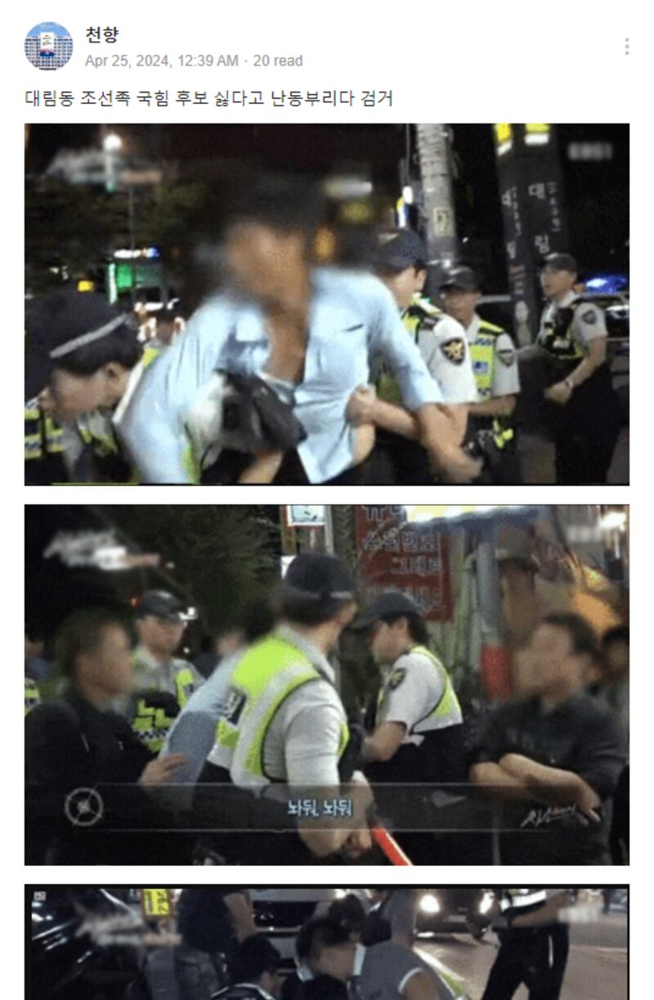

# 事實查覈｜韓國大選期間，有在韓中國人因干擾候選人被捕？

作者：Taejun Kang

2024.05.21 15:01 EDT

## 查覈結果：錯誤

## 一分鐘完讀

2024年4月,韓國舉行國會選舉。 選舉期間韓文社交媒體上有 [帖文聲稱](https://archive.ph/f7VhJ):一名中國男子在首爾大林洞地區因干擾一位保守派候選人而被捕,帖文還附上了抓捕時的"照片"。

亞洲事實查覈實驗室並沒有發現任何有公信力的媒體報道此事，經覈查，該文所附的照片來自一部2016年拍攝的紀錄片。 這則帖文爲假消息。

## 深度分析

“一位Joseonjok（注：韓國對朝鮮族中國人的稱呼）男子在大林洞因干擾國民力量黨（注：韓國目前執政黨，被認爲持保守主義政綱）的候選人而被捕。”今年4月24日，這則帖文在韓國流行的社交媒體平臺“Band ”上的多個羣組流傳。 文中還附三張照片，內容爲韓國警察逮捕一名男子的場景，但男子的臉部被模糊處理。

2024年5月14日截取的Band帖子截圖

社媒帖文提及的"大林洞"是首爾永登浦區的一個街區,這裏聚居了大量旅居韓國的朝鮮族中國人。 這一族羣國籍屬中國,但血緣族裔屬於朝鮮族,是中國少數民族之一。 根據 [多家當地媒體報道](https://www.hani.co.kr/arti/society/society_general/925990.html),朝鮮族中國人在韓國經常遭本地人歧視,並且經常與暴力犯罪聯繫在一起。

曾有 [報道](https://www.yna.co.kr/view/AKR20220602180900502)稱,居住在韓國的朝鮮族居民傾向於支持"親中反美"立場的政黨,這使得親美立場的執政黨"國民力量黨"在這裏並不受歡迎。

## 所謂"抓捕照片"來自2016年的紀錄片

但經過查覈，帖文的敘述和照片是假的。

AFCL以關鍵詞和圖像搜索後發現,這些截圖照片來自韓國教育廣播公司(EBS)在2016年播出的紀錄片《 [火線上的守護者](https://home.ebs.co.kr/inthelineoffire/main)》(In the Line of Fire)系列其中一集《 巡警隊:夜晚的守護者》(Police Patrol Unit: Guardians of the Night)。 這集節目在EBS官方 [YouTube頻道](https://www.youtube.com/watch?v=zDtyXwlpTUQ)上仍然能看到。

這一集紀錄片描寫了2016年9月大林洞一個機動警察單位夜間的行動。 檢視紀錄片可以發現，不實帖文所附的照片是從這一集的11分35秒、11分30秒和21分35秒處截取的。 前兩張照片顯示警察在制伏和逮捕參與打鬥的男子，而第三張照片顯示警察以攜帶刀具爲由，拘留了一名男子。

但整部紀錄片中沒有提到此事與選舉或候選人相關。 通過關鍵詞搜索，四月選舉期間，並沒有任何可信的報導顯示大林洞地區有中國公民因干擾候選人被捕。

*亞洲事實查覈實驗室(Asia Fact Check Lab)針對當今複雜媒體環境以及新興傳播生態而成立。我們本於新聞專業主義,提供專業查覈報告及與信息環境相關的傳播觀察、深度報道,幫助讀者對公共議題獲得多元而全面的認識。讀者若對任何媒體及社交軟件傳播的信息有疑問,歡迎以電郵*  [*afcl@rfa.org*](mailto:afcl@rfa.org)  *寄給亞洲事實查覈實驗室,由我們爲您查證覈實。* *亞洲事實查覈實驗室在X、臉書、IG開張了,歡迎讀者追蹤、分享、轉發。X這邊請進:中文*  [*@asiafactcheckcn*](https://twitter.com/asiafactcheckcn)  *;英文:*  [*@AFCL\_eng*](https://twitter.com/AFCL_eng)  *、*  [*FB在這裏*](https://www.facebook.com/asiafactchecklabcn)  *、*  [*IG也別忘了*](https://www.instagram.com/asiafactchecklab/)  *。*

[Original Source](https://www.rfa.org/mandarin/shishi-hecha/hc-05212024145725.html)