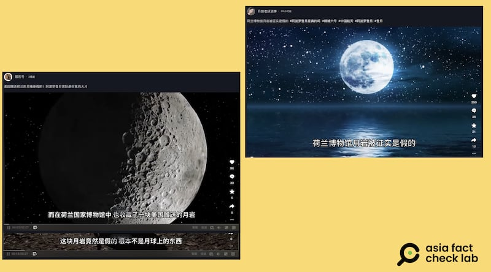
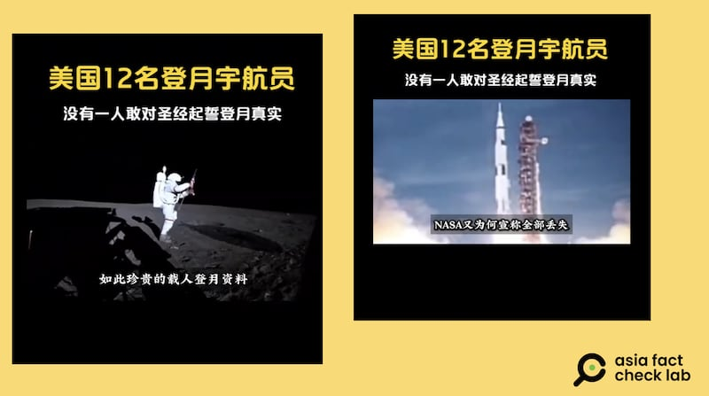

# 事實快查｜美國登月是否造假再成熱點，這五則傳言有問題

作者：董喆

2024.05.22 16:14 EDT

中國“嫦娥六號”月球探測器在5月3日發射成功，讓月球探索話題再獲大衆關注。然而，五月以來，中國社交媒體上頻傳關於美國登月行動“存在造假”的各式說法。

有人錯誤詮釋嫦娥計劃總設計師錄製直播節目時的一句話，“沒有找到阿波羅盆地，用以背書美國登月造假的說法；有人生造白宮發言人說美國和中國“去的不是一個月球”；還有人再次提出流傳於英文互聯網多年、早已被證僞的一些說法。

美國登月造假相關的陰謀論持續數十年，已被主流科學界反覆闢謠、並提供大量相關證據，但仍有不實信息反覆出現。在此次中國社交媒體對“登月造假”的熱議中， 亞洲事實查覈實驗室選擇了廣泛傳播的的五則傳言進行查覈。

## 傳言之一：嫦娥計劃負責人暗指美國登月造假？

## 查覈結果：錯誤

中國嫦娥六號探測器5月3日發射,央視特別節目《 [嫦娥攬月:嫦娥六號發射](https://tv.cctv.com/2024/05/03/VIDEqMHYQyWsGgOhCnRGvVcu240503.shtml?spm=C28340.Pu9TN9YUsfNZ.S93183.5)》邀請嫦娥計劃總設計師裴照宇在節目現場解析。 節目中裴照宇的一句不太連貫的發言"沒有找到那個阿波羅盆地的那個...",被一些社交媒體賬號錯誤解讀,說成是稱裴照宇用委婉的方式質疑美國登月的真實性,稱他想說的是中國探測器沒有發現美國阿波羅號宇宙飛船登陸的地點。

中國社交媒體錯誤詮釋嫦娥計劃總設計師的一句話，稱美國登月計劃不真實。（微博截圖）

對此說法，亞洲事實查覈實驗室還原裴照宇在央視特別節目中的發言，以下這段對話發生在視頻1:40:02處。

*主持人：請教一下裴總，我們知道嫦娥四號也是落在（月球）南極的艾特肯盆地，這一次嫦娥六號也是從大的範圍來講的話，也是南極艾特肯盆地，但是其實位置還是不一樣的。*

*裴照宇：沒有找到那個阿波羅盆地的那個...*

*主持人：從嫦娥六號落區來看，着陸難度要比嫦娥四號更高？*

根據美國太空總署(NASA)的 [公開資料](https://nssdc.gsfc.nasa.gov/planetary/lunar/lunar_sites.html),阿波羅11號的着陸點是靜海基地,月面座標0.67408°N 23.47297°E。 阿波羅盆地則是月球南面的隕石撞擊坑,根據美國地質調查局(USGS) [資料](https://planetarynames.wr.usgs.gov/Feature/326),其座標爲35.69°S 151.48°W。

另外，裴照宇已經在節目中（00:24:27處）指出，“嫦娥六號這次是要去月球的背面，是在南半球，也是中緯度地區，也就是叫艾特肯盆地那個區域。”，阿波羅計劃登陸的靜海基地則是在北半球。

因此，此次嫦娥六號探月的目標地區與當年阿波羅登陸的地區距離甚遠，裴照宇在節目中提及的“阿波羅盆地”並非是說“阿波羅計劃降落的盆地”。

## 傳言之二：美國登月宇航員承認“沒有去過月球”？

## 查覈結果：錯誤

微博傳言稱,阿波羅11號宇航員 [巴茲·奧爾德林](https://zh.wikipedia.org/wiki/%E5%B7%B4%E5%85%B9%C2%B7%E5%A5%A5%E5%B0%94%E5%BE%B7%E6%9E%97)(Buzz Aldrin)被問"爲什麼這麼長時間沒有人去月球"時,他曾回答:"因爲我們沒有去過那裏 ,事實就是這樣"。

微博流傳視頻，稱登月宇航員自承"沒有去那裏"。該說法斷章取義，已經被美國媒體澄清。（微博截圖）

這段對話確有發生,2015年9月5日,一名叫做Zoey的女孩於在美國華盛頓特區國家書展上提問 [奧爾德林](https://zh.wikipedia.org/wiki/%E5%B7%B4%E5%85%B9%C2%B7%E5%A5%A5%E5%B0%94%E5%BE%B7%E6%9E%97)。

[原始影片](https://www.youtube.com/watch?app=desktop&v=Y4UP6nRMuGs&mark_id=999_reallog_mark_ad%3A999%7CWeiboADNatural)07:10處,Zoey問:"爲何這麼長時間以來沒有人去月球?"(Why has nobody been to the moon in such a long time?)

[奧爾德林](https://zh.wikipedia.org/wiki/%E5%B7%B4%E5%85%B9%C2%B7%E5%A5%A5%E5%B0%94%E5%BE%B7%E6%9E%97)的確回答了"我們沒有去那裏"。 在沒有上下文的情況下,只引用這一句確實會引起誤解。

但影片顯示， 奧爾德林接下來提到“我們需要知道爲什麼過去某件事會停止”，他當時所指的是美國自1972年登月以來，再沒有重返月球。

亞洲事實查覈實驗室在此提供奧爾德林回答原文和參考翻譯如下

*原文：Because we didn't go there. That's the way it happened. And if it didn't happen it's nice to know why it didn't happen so in the future if we want to keep doing something we need to know why something stopped in the past if we want to keep it going.*

*參考翻譯：因爲我們沒有去。事情就是這樣。如果它沒發生，瞭解原因是很有用的。這樣將來如果我們想繼續做某件事，我們需要知道爲什麼過去某件事會停止，這樣才能繼續下去。*

影片08:05處，奧爾德林繼續談論美國停止探月的原因其實是因爲經費，隨後，他還提到自己當時完成了總統交付的任務（原話：“So having achieved what the president wanted us to do...”）,並且很開心全世界可以分享他所做到的事情（原話：“Not just us. But we, the world. They felt like they were part of what we were able to do. And that made us feel very good.”）。

因此,奧爾德林並沒有承認"未到過月球",他當時的話被社交媒體賬號斷章取義,一度引發爭議,但隨後被澄清。美國事實查覈機構Snopes就曾對此發表 [查覈報告](https://www.snopes.com/fact-check/buzz-aldrin-moon-admission/)。

## 傳言之三：白宮發言人說美國和中國造訪的是不同的月球？

## 查覈結果：缺乏證據

X（原推特）和Tiktok上有帳號貼出照片稱美國白宮發言人尚皮耶說：“美國登月和中國探測器探測的月球並非同一個月球”。

網傳圖片稱白宮發言人說美國和中國去的"並非一個月球"（X、Tiktok截圖）

以圖反搜，發現這張尚皮耶的照片屬於路透社，是2022年11月18日白宮例行記者會的側拍照，並非近期所攝。

網傳白宮發言人圖片來自2022年的一場發佈會（路透社圖庫、X截圖）

以關鍵字，“"Jean-Pierre" "moon" "China" 等在白宮網站內搜尋新聞稿，也未曾看到這段發言的記錄。

亞洲事實查覈實驗室致信白宮，並未取得回應。

## 傳言之四：美國送荷蘭的月球石被檢測出是假的

## 查覈結果：部分正確

多個抖音帳號還指出，美國贈送荷蘭的月岩是假的，因此美國登月計劃是造假。

一些質疑美國登月真實性的傳言稱，美國送給了荷蘭一塊"假月岩"。（抖音截圖）

2009年8月，多家國際媒體包含BBC、NBC報道，荷蘭阿姆斯特丹國家博物館展示的月球岩石其實是一塊硅化木，是遠古化石的一種。

報道稱，這塊石頭是1988年，該博物館從已故的荷蘭首相威廉·德雷斯遺產中獲得，據稱是阿波羅11號帶回的頁岩，而德雷斯是在1969年10月從時任美國駐荷蘭大使米登道夫手中得到這塊石頭。

在荷蘭館藏"月岩"爲假的消息爆發時, [NBC的報道](https://www.nbcnews.com/id/wbna32581790)就指出了當時所謂"月岩"饋贈過程中的不少疑點。例如,當年送禮的美國大使稱自己記不清石頭的來歷細節;有航天專家表示,贈送"月岩"給荷蘭發生在登月行動僅三個月後幾乎不可能,美國當時確實給各國贈送了一些登月相關的禮物,但基本都在幾年之後的1970年代;另外,1969年的贈送發生之時,德雷斯執政已經結束了11年,並非當時該國的政要人物。

據報道，當年美國駐荷蘭使館對此進行調查，不過我們未能在網路上找到調查後續。 我們致信給美國駐海牙使館以及阿姆斯特丹國家博物館，至截稿前無法取得回應。

不過，即使荷蘭國家博物館藏的這一塊“月岩”爲假，亦不代表美國登月造假。

根據 [NASA資料](https://historycollection.jsc.nasa.gov/JSCHistoryPortal/history/flag/flag.htm),阿波羅11號登月時攜帶了一批小旗子,包含聯合國旗幟、聯合國會員國旗幟以及美國各州州旗。 時任美國總統尼克森在登月任務成功後,將採集的月岩及旗幟封裝致贈美國50個州、美屬領地、聯合國總部及所會員國,象徵全人類一起上月球。

​臺灣亦有獲得這份禮物,當時登月的中華民國國旗和月岩樣本目前在臺灣 [國立自然科學博物館](https://www.facebook.com/nmnsTaiwan/posts/pfbid02wNUTerGsfJF6q2M3bQenuzxFpSwFnUgMhL87bTBsAmso5fw6Wbmpu4oYeFhTpBPRl)保管。

美國採集的其他月岩樣本至今仍在包括位於美國休斯頓 [肯尼迪航天中心](https://www.kennedyspacecenter.com/explore-attractions/race-to-the-moon/exploring-the-moon)和世界多地向公衆展覽,並未被質疑其真實性。

## 傳言之五：NASA有關阿波羅11號登月資料已全數遺失

## 查覈結果：錯誤

微博傳言稱，NASA有關阿波羅11號登月的資料已全數遺失，並指不可能喪失如此重要的資料，推論登月計劃爲假。

有傳言稱，NASA丟失了全部的登月資料。（微博截圖）

事實上,有關阿波羅11號登月計劃的資料皆可在 [NASA官方網站](https://nssdc.gsfc.nasa.gov/nmc/spacecraft/display.action?id=1969-059C)中找到,除了計劃概述,也包含阿波羅11號登月艙的發射、實驗訊息等。

此外,登月50週年時,NASA工程師 Ben Feist蒐集了阿波羅11號登月時的畫面與音訊, [製作成網站](https://apolloinrealtime.org/11/),讓民衆可以模擬體驗當時的登月過程。

## 登月謠言成熱點，中國科協出面闢謠

"登月造假"傳言廣爲散佈,中國官方則立場明確。在質疑美國登月真實性的討論成爲熱門話題之時,5月14日,中國科學技術協會微信公衆號"科學闢謠"針對這些不實信息 [進行了反駁](https://m.thepaper.cn/newsDetail_forward_27389559)。

此前中國央視 [曾報道](https://news.cntv.cn/20120209/111191.shtml),嫦娥二號的全月圖可見阿波羅11號登月遺蹟,並讚揚其探測技術。 2017年中國國家航天局時任祕書長田玉龍也曾 [會見](https://www.cnsa.gov.cn/n6758823/n6758838/c6770009/content.html)阿波羅11號登月任務的宇航員。中國國家航天局的網站上也對阿波羅登月行動有多篇專文 [介紹](https://www.cnsa.gov.cn/n6758823/n6759010/c6777110/content.html)。

然而，截止本文發稿之時，微博、抖音等中國社交媒體上，仍不斷有質疑美國登月真實性的討論出現。

[Original Source](https://www.rfa.org/mandarin/shishi-hecha/hc-05222024160306.html)