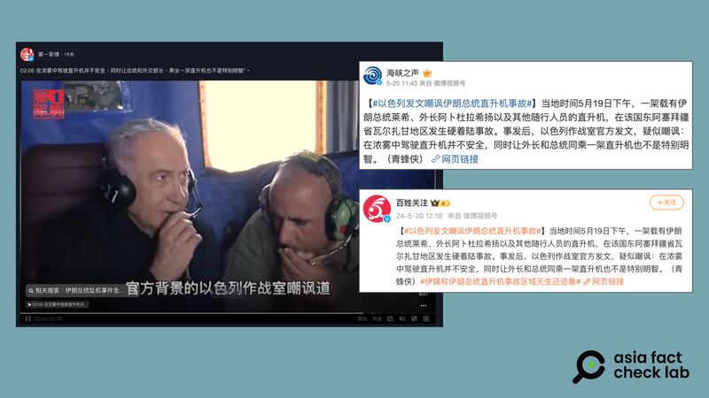
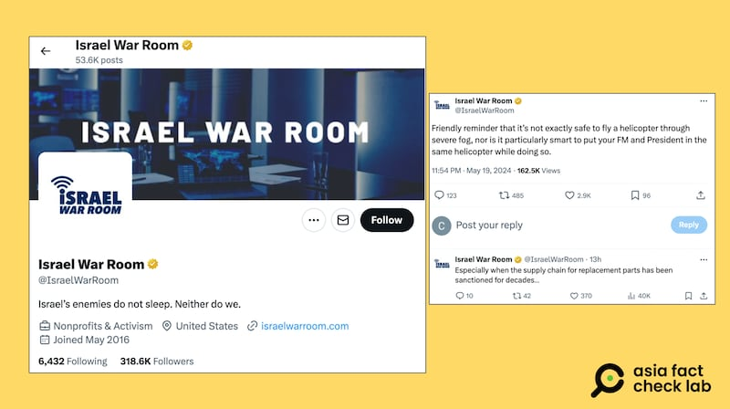

# 事實查覈｜以色列官方發文嘲諷伊朗總統直升機事故？

作者：莊敬

2024.05.23 14:27 EDT

## 查覈結果：錯誤

## 一分鐘完讀：

伊朗總統易卜拉欣·萊希（Ebrahim Raisi）直升機事故遇難後，中國社媒平臺微博熱搜榜上一度出現“以色列發文嘲諷伊朗總統直升機事故”話題，不少網絡帖文稱，以色列作戰室官方發文以嘲諷的口氣評述該空難事件。不少新聞媒體也跟進轉發報道。

經查覈，中國媒體與網民引用的是“以色列作戰室（Israel War Room）”是社交媒體X帳號，該機構自介爲非營利運動組織，沒有證據顯示它能代表以色列官方發言。

## 深度分析：

5月20日,國際媒體證實伊朗總統萊希(Ebrahim Raisi)搭乘的直升機墜毀,萊希與外交部長等機上9人全數罹難。 消息傳出後,各界猜測墜機原因,陰謀論四起。 中國 [微博](https://m.weibo.cn/detail/5036072154957109)、抖音、網易等平臺,出現"以色列發文嘲諷伊朗總統直升機事故"的說法,話題一度登上微博熱搜。

5月20日下午1時30分左右，"以色列發文嘲諷伊朗總統直升機事故"登上微博熱搜（左圖）。 部分轉發此話題的網民，附上"Israel War Room"在X上的原文截圖。（微博、網易截圖）

## 多家媒體賬號稱以色列嘲諷伊朗空難

參與該話題討論的除了大量普通賬號,還包括" [海峽之聲廣播電臺官方微博](https://m.weibo.cn/detail/5036072154957109)"、貴州廣播電視臺公共頻道" [百姓關注](https://weibo.com/1647210043/Of8zHwnTQ?type=repost)"等多個認證媒體用戶,他們寫道:"事發後,以色列作戰室官方發文,疑似嘲諷: 在濃霧中駕駛直升機並不安全,同時讓外長和總統同乘一架直升機也不是特別明智。"他們並未附上"以色列作戰室"的原文,僅有一個已失效的導向新浪軍事視頻的網頁鏈結。

四川日報旗下新媒體賬號" [第一軍情](https://v.douyin.com/i2cJo6Vf/)"則在抖音上發佈視頻,指伊朗總統事故發生後,"以色列方面的態度則令人頗爲不齒,官方背景的以色列作戰室嘲諷道,友情提示,在濃霧中駕駛直升機並不安全,同時讓外長和總統同乘一架直升機也不是特別明智。"

一些中國媒體社媒帳號近日在網上發文章和視頻，傳播"以色列發文嘲諷伊朗總統直升機事故"。（抖音、微博截圖）

亞洲事實查覈實驗室在其它談論此話題的 [微博](https://m.weibo.cn/detail/5036099126953042)、 [網易](https://m.163.com/dy/article/J2KE305I0514R9OM.html)文章上,發現一張截圖,顯示這句話來自X平臺上的"Israel War Room(@IsraelWarRoom)"帳號。 一些轉發的博主評論:"這個事件,以色列從始至終一直幸災樂禍"、"如果是人爲是否很大概率是以色列?"、"如果真是謀殺,那以色列手段太厲害了。"

目前，尚未有證據表明伊朗直升機事件有人爲因素，或者與以色列有關。據紐約時報報道，伊朗官方媒體將直升機失事歸咎於“技術故障”。 路透社報道，一名以色列官員表示，伊朗總統直升機事故與以色列無關。

"**以色列作戰室"具官方背景?**

將X平臺上的帳號“Israel War Room”翻譯爲“以色列作戰室”並無不妥，該賬號也確實發佈了上述內容。 問題在於，它是否如部分中國媒體、網民所說，有以色列“官方”背景。

"Israel War Room"在X上自介爲非營利運動組織,地點位於美國。 其 [網站](https://www.israelwarroom.com/)內容顯示,它關注網路、社媒上的反以色列言論與宣傳,並查覈、揭露有關以色列的誤導性敘事。 另據"Israel War Room"的臉書粉絲專頁資訊透明度,其管理員所在的主要國家爲美國。

"Israel War Room"社媒帳號在X上的資料顯示，這是個非營利運動組織。（X平臺截圖）

亞洲事實查覈實驗室搜尋"Israel War Room"近期相關報道,發現美國查覈組織《PolitiFact》近期發佈的 [查覈報告](https://www.politifact.com/factchecks/2024/may/20/instagram-posts/x-account-posted-helicopter-emoji-after-news-of-th/)中,稱"Israel War Room"爲親以色列社媒帳號;《Jewish Journal》的 [文章](https://jewishjournal.com/community/371459/israel-war-room-discovers-how-to-riot-guide-and-pro-terror-propaganda-for-college-students/)則指 "Israel War Room"是一個在X和Instagram上追蹤以色列新聞的社媒帳號。 上述兩則文章,都未提到"Israel War Room"是否具官方背景。

查詢以色列 [政府網站](https://www.gov.il/en/departments/govil-landing-page),也並沒有單位以"以色列作戰室"爲名稱。

亞洲事實查覈實驗室分別發信詢問以色列外交部、以色列駐美大使館、和“Israel War Room”，截至發稿尚未獲得回覆。

從目前所知的資訊來看，沒有證據顯示“以色列作戰室”可以代表以色列官方發言。 部分中國媒體、網民僅引述一個非營利組織的社媒帳號發文，即傳播“以色列發文嘲諷伊朗總統直升機事故”，爲錯誤指控。

*亞洲事實查覈實驗室(Asia Fact Check Lab)針對當今複雜媒體環境以及新興傳播生態而成立。我們本於新聞專業主義,提供專業查覈報告及與信息環境相關的傳播觀察、深度報道,幫助讀者對公共議題獲得多元而全面的認識。讀者若對任何媒體及社交軟件傳播的信息有疑問,歡迎以電郵*  [*afcl@rfa.org*](mailto:afcl@rfa.org)  *寄給亞洲事實查覈實驗室,由我們爲您查證覈實。* *亞洲事實查覈實驗室在X、臉書、IG開張了,歡迎讀者追蹤、分享、轉發。X這邊請進:中文*  [*@asiafactcheckcn*](https://twitter.com/asiafactcheckcn)  *;英文:*  [*@AFCL\_eng*](https://twitter.com/AFCL_eng)  *、*  [*FB在這裏*](https://www.facebook.com/asiafactchecklabcn)  *、*  [*IG也別忘了*](https://www.instagram.com/asiafactchecklab/)  *。*

[Original Source](https://www.rfa.org/mandarin/shishi-hecha/hc-05232024141950.html)