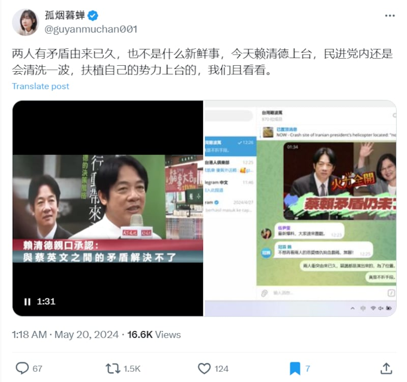
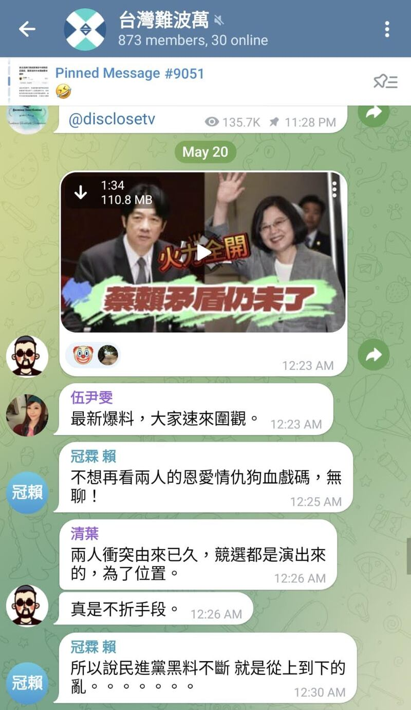
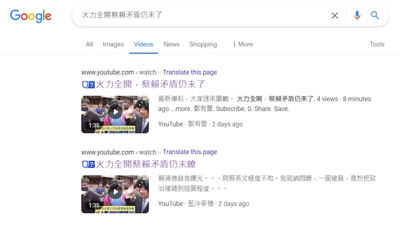
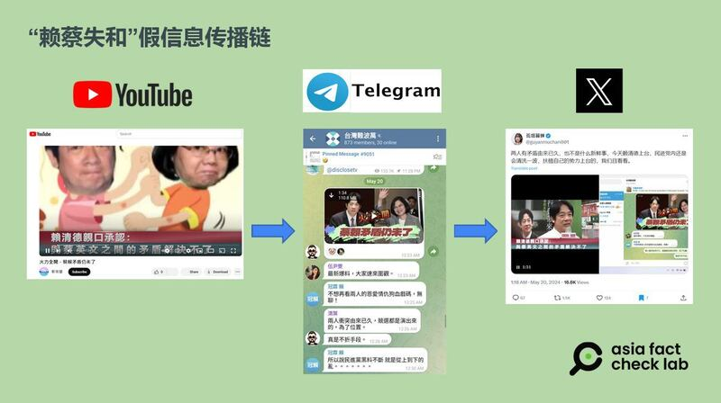
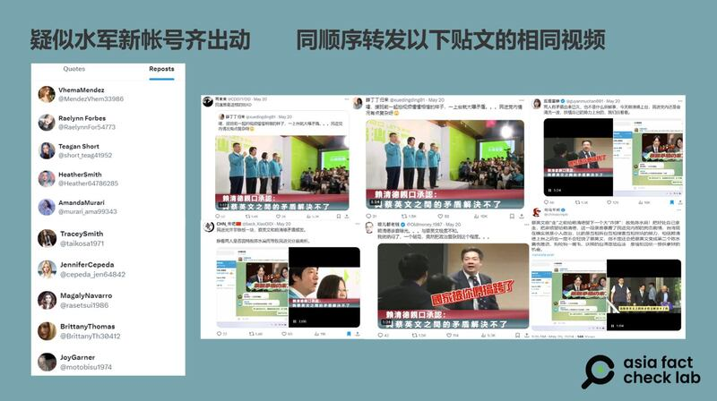
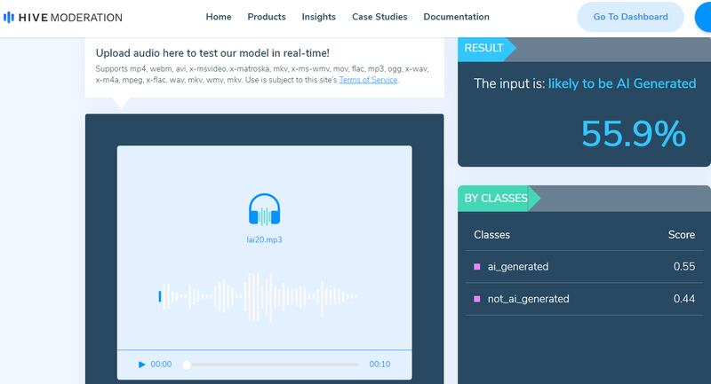

# 傳播觀察｜賴清德抱怨蔡英文音頻外泄？可疑信息如何跨平臺流傳

作者：鄭崇生、莊敬

2024.05.24 13:34 EDT

“賴清德錄音曝光…與蔡英文極度不和”“兩人有矛盾由來已久，也不是什麼新鮮事”。就在5月20日臺灣總統賴清德宣誓就任的同一天，社交媒體X上流傳一則賴清德與前任總統蔡英文不和的可疑信息，甚至有賴清德本人的“錄音”爲證。

傳播這則可疑信息的主要推手之一是網絡大V"孤煙暮蟬",她的賬號 [經常](2022-11-15_事實查覈  ｜ 北約捐給烏克蘭帶病毒血液？烏衛生部駁斥微博大V謠言.md)被亞洲事實查覈實驗室發現傳播不實信息。

“孤煙暮蟬”發佈“蔡賴不合”的帖子 圖截取自X

這則可疑信息是一段1分35秒的短視頻,由一個臺灣口音的男聲主述,先宣稱蔡英文和賴清德早就不合,甚至"曾差點大打出手",但這段是早經查覈過的 [虛假信息](https://tfc-taiwan.org.tw/articles/8147)。

接着出現一段錄音，稱是“外泄的賴清德談話”，音檔中，賴清德抱怨蔡英文卸任前談特赦另一位前總統陳水扁，“是在給我出難題”“我沒有答應用她的人，她馬上就提出來要特赦陳水扁”。這段“賴清德錄音”持續了45秒。

## 原創者是誰？通過哪些路徑流傳？

這則視頻是從哪裏來的？根據孤煙暮蟬的發文，她是從通訊軟件電報（Telegram）上擷取影片，搬上X。亞洲事實查覈實驗室覈查後證實，在電報上一個名爲“臺灣難波萬”的羣組中，名叫“清葉”的用戶於5月20日賴清德上任當天在羣內發出了這則視頻，並描述“兩人衝突由來已久”。

“清葉”在電報組“臺灣難波萬”上發佈的視頻 圖截取自 Telegram

進一步追溯源頭,亞洲事實查覈實驗室發現,再早一天的5月19日,YouTube平臺上兩個分名叫" [藍洋麥穗](https://www.youtube.com/@user-fk2hv7wf8n)"與" [鄭宥蕾](https://www.youtube.com/@HildaDahlgren)"的賬號都上傳了該視頻,而這兩個賬號都是在註冊當天就上傳這則視頻。

值得注意的是，鄭宥蕾的賬號只上傳了這段視頻一次， 藍洋麥穗則是同一天上傳了兩次，兩次標題不同，但內容都是這則視頻。

“藍洋麥穗”與“鄭宥蕾”在YouTube上傳了這段視頻 圖截取自Google

此外,5月20日纔開設的油管賬號" [YenTrinh ThienThu](https://www.youtube.com/@YeTrinh)"也發佈了同一視頻,且是該賬號唯一一支影片。

另外，在TikTok平臺上，賬號“環臺熱點news”與“薑雨珊”都在20日上傳這部影片，其中“薑雨珊”沒有個人簡介、粉絲或關注對象，其目前爲止發佈了五段影片，都是針對賴清德和民進黨。

綜合在YouTube和TikTok觀察到的情況，臺灣資安專家劉彥伯告訴亞洲事實查覈實驗室：“這是很典型的散播假訊息的方法”。他指出，這些賬號有幾個特徵，包括影片上傳日期相近、很明顯針對某人攻擊、明確是會中文的人。

劉彥伯分析，這些YouTube賬號不像機器爲了改變觸及結果而一直上傳影片，而是發佈單則或幾則後就沒下文，應是人爲操作；雖然目前看來點閱率並不好，傳播效果不佳，但仍要持續觀察，“他們很可能只是先上傳，等到半年、一年後視時機再炒作話題。”

“賴蔡”失和信息傳播鏈 AFCL製圖

## X上的搬運工大隊的集體行動

在X平臺上，孤煙暮蟬作爲主力發動該信息傳播時，亞洲事實查覈實驗室還注意到集體行動的現象。

至截稿爲止，孤煙暮蟬的發文有超過1萬8000人次的點閱，但轉發數量卻高達1500次，與她平時發文相較，這一則信息的轉發率明顯較她的其他貼文高出許多。

除此之外，亞洲事實查覈實驗室還發現了其它疑似協同轉發的跡象。

有一批轉發賬號（下圖左）有以下共同特色：第一、這十個賬號很可能都是以AI生成頭像開設的。第二、他們全都是今年5月纔在X上設立賬戶。第三、 至截稿，這批賬號都僅有六則轉發的貼文（下圖右），沒有自己的原創內容，而且轉發包括孤煙暮蟬在內，共6個的親中用戶的發文，而這6個親中賬號發佈是同一個講述賴蔡不合的視頻。第四、他們轉發貼文的順序也完全一樣，按發文時間由近到遠整理發現，這十個賬號依序轉發貼文是來自X用戶“耳東東”“CHN\_帝吧”“薛丁丁歸來”“哏兒都老錢”“孤煙暮蟬”“司馬平邦”。

亞洲事實查覈實驗室觀察到的協同轉發現象 AFCL製圖

這類操作會改變X上的中文信息生態體系，可能影響閱聽大衆在這一平臺上更能看見特定信息。臺灣資訊環境研究中心（IORG）共同主持人遊知澔告訴亞洲事實查覈實驗室，IORG 初步分析結果顯示，若社交平臺上短時間內出現內容相似的大量文本，包含相似內容的文本在後續一定時間區間內的觸及就會增加，也就是說，“羣聚發文”（極短時間內發佈相同或高度相似內容）這種資訊操弄的行爲，可以增加相近內容後續出現在使用者動態之中的機率。

## 這段“錄音”真的出自賴清德？

該視頻本身可以分成兩部分：男子旁白的前半段，以及宣稱是“賴清德錄音”的後半段。

首先,對於所謂" [外泄賴清德錄音](https://drive.google.com/file/d/1B_5ZmeoTFklBmgmlLMItIh6aD5zokcqr/view?usp=sharing)"的45秒內容,亞洲事實查覈實驗室將它它分成四段,並用

開源AI偵測工具 [The Hive](https://hivemoderation.com/ai-generated-content-detection)檢測,其中三段被判定有9成以上的可能性是AI生成的;11秒至20秒處的一段,The Hive判定AI生成的可能性是55.9%。

AI偵測工具對四段錄音進行檢測的截圖

亞洲事實查覈實驗室請另一個臺灣資安研究室判讀該音頻是否有剪接，結果發現並沒有明顯剪輯痕跡，而且聲紋比對的模型和賴清德高度相似。

劉彥伯對上述結果以及自己直接聆聽後綜合判讀認爲，這則錄音可疑之處不少：

他說，第一，如果音頻是祕密錄製，不應該出現爆音；有爆音代表發言者離麥克風很近，但他很懷疑，發言者會在有麥克風的情況下談論這類議題。

第二，在音頻中，極似賴清德的發言者講話連續，沒有斷氣，但正常人說話應會停頓、喘氣，而這名發言者講話連續，他懷疑是輸入文字後，運用AI深僞技術所製成 。

第三，音頻裏的聲音缺乏情緒，依照談話內容，疑似賴清德的發言者講到生氣處時，應該會出現情緒高音，但音頻中只有中等頻率。第四，該信息傳播時並沒有能提供“賴清德”發言的時間、地點和場合等重要資訊，不夠有說服力。

劉彥伯指出，在AI技術益發成熟，以AI生成式音檔做法有兩種：一種是真人先錄音，再以被模仿對象的聲紋特色變造原本的錄音。如此一來，包括爆音等特點都會留下來。另一種是輸入文字再以AI工具朗讀製成。此外，也有可能AI訓練模型本身含有爆音。

專長影像處理、深度學習等領域的臺灣成功大學統計系副教授許志仲提供了第二種意見。他以成大數據所開發的影音檢測系統量測，網傳音頻的聲音與真實賴清德的聲音具有0.674的相似度（相似度介於0-1之間，越高越相似）。以他的經驗，通常對於真實的高品質的影片，本人的錄音與本人的聲音相似度檢測結果應該會是0.85以上。不過許志仲指出，雖然系統量測的分數較低，音頻可能是合成或生成的，但網傳影片的聲音品質較差，也可能影響量測工具的可信度。

至於旁白的男子聲音,則被判斷很可能是來自字節跳動(ByteDance)開發的剪接軟件 [剪映](https://www.capcut.cn/)(CapCut)中的AI朗讀功能。

## 臺總統府：國安單位分析網傳錄音檔爲假

亞洲事實查覈實驗室將網傳影片提供給臺灣的總統府與法務部調查局，臺灣總統府回應，近日網路散播的錄音檔，經國安單位分析聲音後，確認爲假，影片則是將公開影片拼湊而成，也確認是假的。

至於影片中所說“蔡英文和賴清德大打出手”一事，總統府發言人郭雅慧表示，這早在兩年前就被臺灣事實查覈中心認證是烏龍爆料的假訊息，總統府早已否認，蔡英文既無所謂的“生日宴”，更無謠言中所述造假情事。調查局則回應，“相關問題調查局都會持續關注”。

*亞洲事實查覈實驗室(Asia Fact Check Lab)針對當今複雜媒體環境以及新興傳播生態而成立。我們本於新聞專業主義,提供專業查覈報告及與信息環境相關的傳播觀察、深度報道,幫助讀者對公共議題獲得多元而全面的認識。讀者若對任何媒體及社交軟件傳播的信息有疑問,歡迎以電郵* *afcl@rfa.org* *寄給亞洲事實查覈實驗室,由我們爲您查證覈實。*  *亞洲事實查覈實驗室在X、臉書、IG開張了,歡迎讀者追蹤、分享、轉發。X這邊請進:中文*  [*@asiafactcheckcn*](https://twitter.com/asiafactcheckcn)  *;英文:*  [*@AFCL\_eng*](https://twitter.com/AFCL_eng)  *、*  [*FB在這裏*](https://www.facebook.com/asiafactchecklabcn)  *、*  [*IG也別忘了*](https://www.instagram.com/asiafactchecklab/)  *。*

[Original Source](https://www.rfa.org/mandarin/shishi-hecha/hc-05242024131942.html)