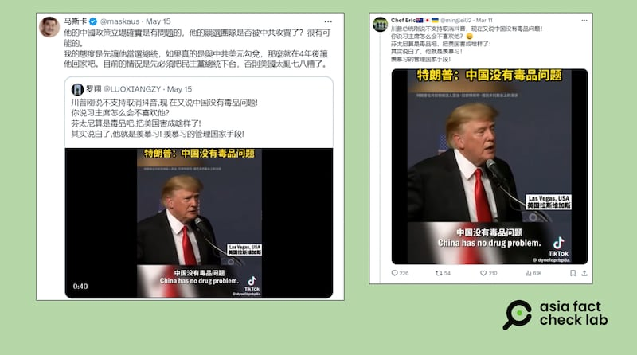

# 事實查覈｜美國前總統特朗普說"中國沒有毒品問題"？

作者：莊敬

2024.05.28 18:14 EDT

## 查覈結果：斷章取義

## 一分鐘完讀：

社媒平臺近日流傳一段美國前總統特朗普的演講短視頻，簡體字幕寫着“特朗普：中國沒有毒品問題！”經查，這是特朗普2022年7月在一次活動中的發言，他確實說出了“中國沒有毒品問題”這句話，但他也有說明，這是之前和中國國家主席習近平對話時，習近平告訴他的。也就是說，他是在引述習近平的話，而不是表達自己的論斷。

網傳視頻剪掉了特朗普說明這一信息是來源於習近平的部分，屬於斷章取義。

## 深度分析：

近日在社媒平臺X上,有 [中文賬號](https://twitter.com/LUOXIANGZY/status/1790535917419004269)發佈了一段美國前總統特朗普(Donald Trump)的演講短視頻,標題寫着:"特朗普:中國沒有毒品問題!"且配文寫道:"川普剛說不支持取消抖音,現在又說中國沒有毒品問題!你說習主席怎麼會不喜歡他?"

該視頻右下角還有TikTok的圖標,以及賬號"@dyoefdprbp8a"的來源標識,顯示可能是從TikTok平臺轉發而來。經查,TikTok 賬號 ["@dyoefdprbp8a"](https://www.tiktok.com/@dyoefdprbp8a/video/7342938676713753861)的確於三月發佈過這則視頻。亞洲事實查覈實驗室無法得知上述賬號爲何在今年五月傳播這則舊視頻,但從發文內容推測,可能與特朗普最近對美國的TikTok法案表態有關。

社媒平臺近日流傳一段美國前總統特朗普的演講短視頻，簡體中文字幕寫着"特朗普：中國沒有毒品問題"。（X平臺截圖）

網傳的這則短視頻將特朗普當時的講話剪至約一分鐘，併爲他的這段發言配上了簡體中文字幕：

“如果你縱觀全世界所有的國家，無論你走到哪，唯一沒有毒品問題的國家，都是那些對毒販子實施死刑的國家。他們是唯一的，他們沒有任何問題，他們沒有毒品問題。中國沒有毒品問題，因爲他們有所謂的快速審判，是法庭對毒販子的快速審判，如果有罪就立即執行死刑。

許多年前，中國飽受毒品困擾，陷入孱弱頹靡的狀態，大片領土被其他國家輕易瓜分，他們有嚴重的鴉片問題，你們應該在歷史書上學過，這樣的情況持續了數十年，直到他們的的領導者意識到必須要禁止，且必須立即禁止。”

## 特朗普曾問習近平：中國是否有毒品問題？

亞洲事實查覈實驗室以英文關鍵字查詢,確認網傳視頻出自特朗普2022年7月在拉斯維加斯一場競選活動上的 [發言](https://www.c-span.org/video/?521523-1/president-trump-remarks-las-vegas-campaign-event)。

在這場活動上，特朗普確實有說“中國沒有毒品問題”，但在此之前，他提及曾與中國國家主席習近平討論打擊毒品。事實上，就在網傳視頻最後一段“（中國）領導人意識到必須立即禁止”之後，特朗普緊接着說出，他與習近平的對話內容，包括他曾詢問習近平，中國是否有毒品問題，對方回應，“我們沒有毒品問題”。

而《新聞週刊》(Newsweek)當時的 [報道](https://www.newsweek.com/trump-urges-death-penalty-drug-dealers-china-has-no-drug-problem-1723134)標題是"特朗普敦促對毒販判處死刑:'中國沒有毒品問題'",內文指出,特朗普在演講中回憶他和習近平的對話,對方告訴他,中國沒有毒品問題,毒販會被判死刑。

亞洲事實查覈實驗室查詢特朗普有關打擊毒品的發言,發現這並非特朗普第一次提及他和習近平談論毒品問題。據《華盛頓郵報》刊出的 [文字記錄](https://www.washingtonpost.com/politics/2019/02/15/trumps-bewildering-national-emergency-press-conference-annotated/),特朗普在2019年總統任內一場談話中說,他曾問習近平,是否有毒品問題?對方回說,沒有毒品問題。特朗普再問,爲何沒有毒品問題?習說,"我們對毒販處以死刑,問題解決。"

## 中國尚未解決毒品問題

特朗普讚揚中國以死刑解決毒品問題的發言曾引起過爭議。部分美國媒體在報道時,曾引用中國官方數據指出,中國事實上並未解決毒品問題。例如,《新聞週刊》 [的報道引用新華社2017年的報道](http://www.xinhuanet.com/english/2017-03/27/c_136161743.htm)稱,中國官方報告顯示,吸毒人數仍呈現緩慢成長趨勢。

亞洲事實查覈實驗室查詢了近期的資訊,根據 [中國官方](https://www.gov.cn/lianbo/bumen/202306/content_6887706.htm)2023年發佈的《2022年中國毒情形勢報告》,毒品違法犯罪活動下降,毒品供應、毒品消費和毒品濫用規模持續減少。據報告,截至2022年底,現有吸毒人員112.4萬名。雖然報告的數據顯示,中國在打擊毒品方面有成效,但也面臨 [非接觸式販毒模式突出、毒價飆升](https://m.thepaper.cn/newsDetail_forward_23566209)等問題。

*亞洲事實查覈實驗室（Asia Fact Check Lab）針對當今複雜媒體環境以及新興傳播生態而成立。我們本於新聞專業主義，提供專業查覈報告及與信息環境相關的傳播觀察、深度報道，幫助讀者對公共議題獲得多元而全面的認識。讀者若對任何媒體及社交軟件傳播的信息有疑問，歡迎以電郵afcl@rfa.org寄給亞洲事實查覈實驗室，由我們爲您查證覈實。*

*亞洲事實查覈實驗室在X、臉書、IG開張了,歡迎讀者追蹤、分享、轉發。X這邊請進:中文*  [*@asiafactcheckcn*](https://twitter.com/asiafactcheckcn)  *;英文:*  [*@AFCL\_eng*](https://twitter.com/AFCL_eng)  *、*  [*FB在這裏*](https://www.facebook.com/asiafactchecklabcn)  *、*  [*IG也別忘了*](https://www.instagram.com/asiafactchecklab/)  *。*

[Original Source](https://www.rfa.org/mandarin/shishi-hecha/hc-05282024180835.html)