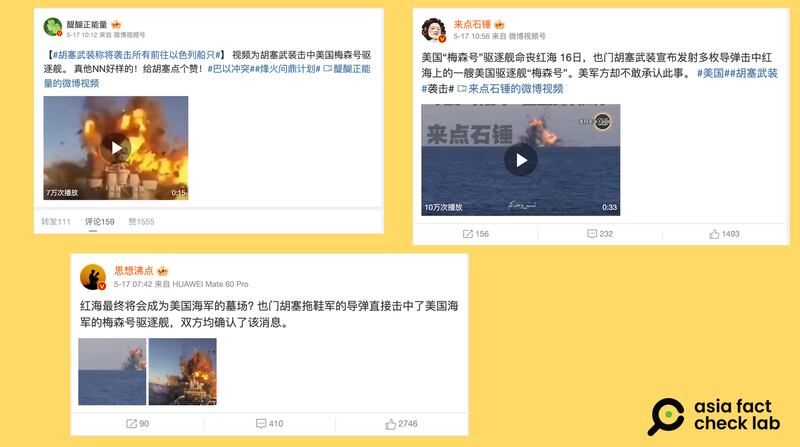
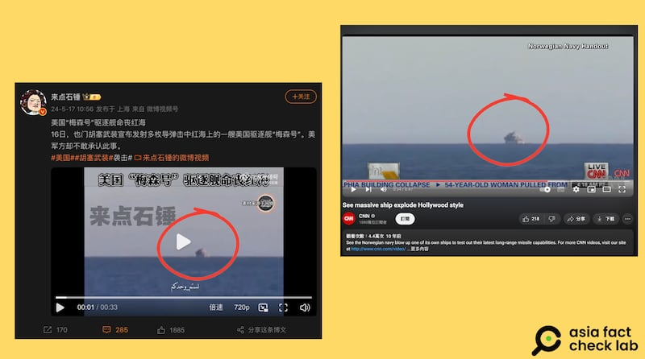
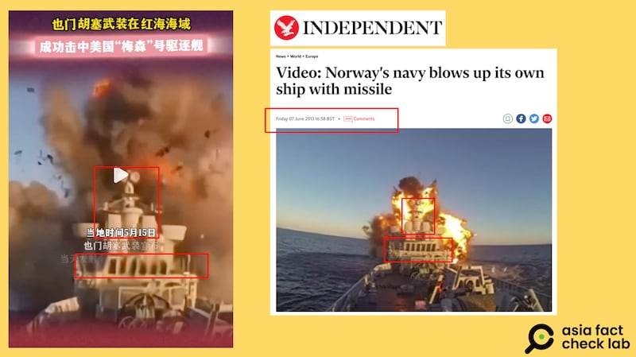
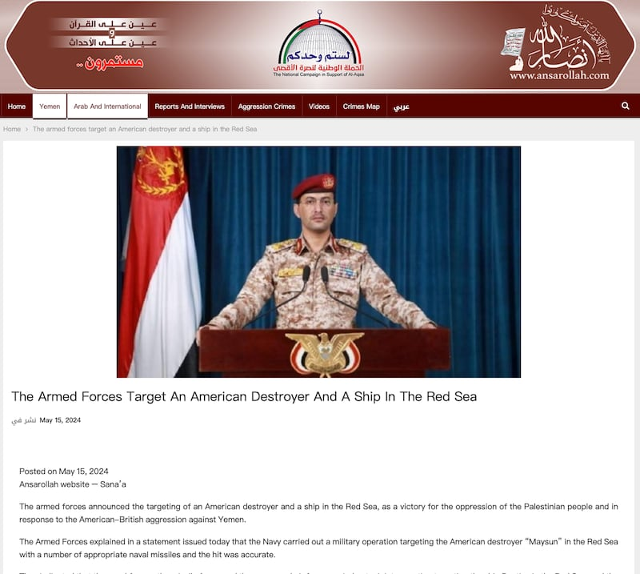

# 事實查覈｜網傳視頻顯示胡塞武裝擊沉美軍梅森號驅逐艦？

作者：董喆

2024.05.29 15:01 EDT

## 查覈結果：錯誤

## 一分鐘完讀：

近日，微博傳出胡塞武裝"成功打擊"美軍、美國海軍梅森號驅逐艦"命喪紅海"等消息。但這些帖文隨附的視頻實爲2013年挪威海軍測試新型反艦導彈的影片，與近日發生的紅海衝突無關。這段視頻已被反覆誤傳，曾被稱是胡塞武裝"成功打擊"以色列海軍，此次又被說成是"擊沉梅森號"的場景。

## 深度分析：

近日,微博熱門軍事大V" [醍醐正能量](https://weibo.com/6997603360/OeFwk2hzN)"以及" [思想沸點](https://archive.ph/dufoe)"等 [帳號](https://archive.ph/yzfO1),在微博上傳播所謂也門反叛組織胡塞武裝"擊沉美國海軍梅森號驅逐艦(USS Mason,DDG-87)"的影片,部分帖文稱資料來源爲中國中央電視臺。

微博熱門軍事大V傳播也門反叛組織"胡塞武裝"擊沉美國海軍梅森號驅逐艦的影片 （微博截圖）

亞洲事實查覈實驗室將微博視頻中的畫面以圖反搜,發現這些內容與近日的紅海衝突並無關聯,而是2013年挪威海軍測試遠程反艦導彈的影片。根據 [媒體報道](https://www.seaforces.org/wpnsys/SURFACE/KDS-Naval-Strike-Missile.htm),挪威海軍在2013年1月5日以退役的Trondheim號巡防艦爲靶,測試新型反艦導彈"Naval Strike Missile"。美國軍事網站Military.com2013年6月5日也發佈報道,其中配文影片就是這次測試。

微博大V轉傳的影片與2013年挪威海軍測試遠程反艦導彈的影片相符 （微博、Youtube截圖）

對比Military.com的影片00:36起至00:56的畫面,遠景與近景分別與微博上傳播的影片一致,同樣的影片也可在美國有線電視(CNN)的 [Youtube平臺](https://www.youtube.com/watch?v=Pz5Jb8EGqPg&ab_channel=CNN)上找到,影片00:34起也與微博上流傳的畫面相同。另外包含英國《 [獨立報](https://www.independent.co.uk/news/world/europe/video-norway-s-navy-blows-up-its-own-ship-with-missile-8649276.html)》、《 [每日郵報](https://www.dailymail.co.uk/news/article-2336822/Caught-camera-The-explosive-moment-Norwegian-navy-blows-OWN-ship-test-latest-long-range-missile.html)》甚至是中國官媒 [環球網](https://mil.huanqiu.com/gallery/9CaKrnQgTR5)都有針對挪威此次測試的的報道。

英國《獨立報》2013年報道挪威海軍測試遠程反艦導彈的照片，與微博大V轉傳的影片內容相符。 （微博、英國獨立報網站截圖）

這系列視頻已不是首次被誤用,亞洲事實查覈實驗室曾發佈的查覈報告:" [胡塞武裝在紅海擊沉以色列船隻?](https://www.rfa.org/cantonese/news/factcheck/isreal-12272023144337.html)"當時,有微博用戶亦誤用了同一批影像,作爲胡塞武裝攻擊以色列船隻的配圖。

至於胡塞武裝是否擊沉美國梅森號驅逐艦？目前雙方說法不一。

胡塞武裝的官網5月15日宣佈，該武裝部隊在紅海瞄準一艘美國驅逐艦和另一艘船隻，以回應美英對也門的侵略，並稱在紅海對美國驅逐艦梅森號進行了軍事行動，使用了多枚導彈“準確命中”。該聲明並未提及此次軍事行動的確切日期。

胡塞武裝5月15日宣佈導彈精準命中梅森號驅逐艦，但並未提及確切日期。 （胡塞武裝網站截圖）

美軍中央司令部13日曾發佈 [新聞稿](https://www.centcom.mil/MEDIA/PRESS-RELEASES/Press-Release-View/Article/3773882/may-13-red-sea-update/),表示在也門沙那時間下午5點51分至下午6點02分之間,美國海軍梅森號驅逐艦成功攔截並摧毀了一枚由胡塞武裝從也門發射的反艦彈道導彈,該導彈在紅海上空被摧毀,並未造成任何人員傷亡。

亞洲事實查覈實驗室去信梅森號公共事務處，至截稿前未獲回應。

*亞洲事實查覈實驗室(Asia Fact Check Lab)針對當今複雜媒體環境以及新興傳播生態而成立。我們本於新聞專業主義,提供專業查覈報告及與信息環境相關的傳播觀察、深度報道,幫助讀者對公共議題獲得多元而全面的認識。讀者若對任何媒體及社交軟件傳播的信息有疑問,歡迎以電郵*  [*afcl@rfa.org*](mailto:afcl@rfa.org)  *寄給亞洲事實查覈實驗室,由我們爲您查證覈實。* *亞洲事實查覈實驗室在X、臉書、IG開張了,歡迎讀者追蹤、分享、轉發。X這邊請進:中文*  [*@asiafactcheckcn*](https://twitter.com/asiafactcheckcn)  *;英文:*  [*@AFCL\_eng*](https://twitter.com/AFCL_eng)  *、*  [*FB在這裏*](https://www.facebook.com/asiafactchecklabcn)  *、*  [*IG也別忘了*](https://www.instagram.com/asiafactchecklab/)  *。*

[Original Source](https://www.rfa.org/mandarin/shishi-hecha/hc-05292024145257.html)