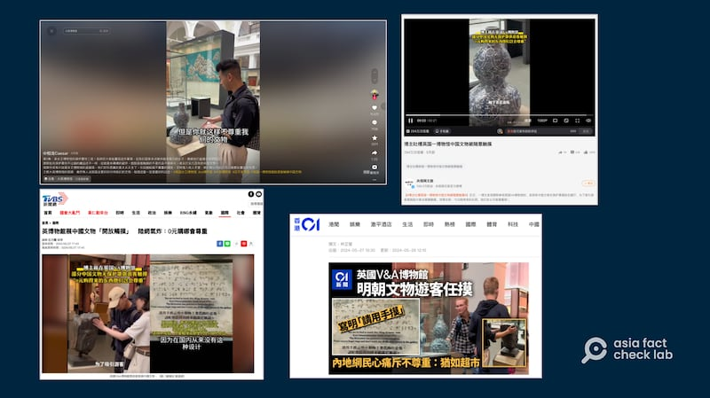

# 事實查覈｜英國博物館展品供遊客觸摸 不尊重中國文物？

作者：莊敬

2024.05.30 13:38 EDT

## 查覈結果：誤導

## 一分鐘完讀：

一名中國抖音用戶近日上傳一則短視頻，批評英國“V&A博物館”爲了吸引遊客，部分中國展品沒有保護罩、供遊客觸摸，不尊重且破壞中國文物。這則視頻獲中國的央視網、香港01、臺灣的TVBS等多家媒體轉發、報道。

亞洲事實查覈實驗室詢問英國V&A博物館，對方說明，該博物館內許多展廳都提供可觸摸的展品，讓視覺障礙人士可以體驗，而這些展品都經過專人評估、處理，並監控展出狀況。中國博主在視頻中聲稱“他不會放自己的文物去摸”“破壞我們的文物”屬誤導內容。

## 深度分析：

中國抖音用戶"相瀧Caesar"5日22日上傳 [視頻](https://v.douyin.com/ijFuxkBS/)指出,英國V&A博物館爲了吸引遊客,沒有給部分中國文物設置保護罩,還允許遊客觸摸。涉及的文物包括明朝時期的青花瓷瓶和佛頭。視頻中的男子與未露面的女聲對話稱"實際上他(英國V&A博物館)不會放他們自己的文物去摸""你說英國會好好對待你的文物,這就是自欺欺人""你就這樣不尊重我們的文物、破壞我們的文物"。

這則視頻引起熱議,包括 [央視網文旅](https://weibo.com/tv/show/1034:5037234177638460?from=old_pc_videoshow)、 [中國歷史研究院](https://weibo.com/7060281712/Ogcx1cpog)都在微博轉發。 [香港01](https://www.hk01.com/%E5%A4%A7%E5%9C%8B%E5%B0%8F%E4%BA%8B/1023281/%E8%8B%B1%E5%8D%9A%E7%89%A9%E9%A4%A8%E5%B1%95%E6%98%8E%E6%9C%9D%E6%96%87%E7%89%A9%E4%BE%9B%E9%81%8A%E5%AE%A2%E8%A7%B8%E6%91%B8-%E7%B6%B2%E6%B0%91%E6%84%9F%E5%BF%83%E7%97%9B-%E7%8C%B6%E5%A6%82%E8%B6%85%E5%B8%82%E5%95%86%E5%93%81%E9%9A%A8%E6%84%8F%E6%91%B8)、 [臺灣的TVBS](https://news.tvbs.com.tw/world/2499093)、 [聯合新聞網](https://udn.com/news/story/7332/7990993?from=udn-catehotnews_ch2)等媒體報道,然而這些媒體的報道都只引用視頻內容和網民看法,例如"網民感心痛:猶如超市商品隨意摸""陸網氣炸:0元購哪會尊重",並沒有V&A博物館的說法。

一名中國抖音用戶近日上傳一則視頻，稱英國V&A博物館爲了吸引遊客，部分中國展品供遊客觸摸，不尊重中國文物，內容獲多家媒體轉發、報道。圖取自抖音、微博、香港01、TVBS新聞網

亞洲事實查覈實驗室詢問V&A博物館，其新聞室回覆表示，該博物館許多展廳都提供可觸摸的物品與樣品，包括英國展廳、中世紀和文藝復興時期、歐洲1600-1815等。這些物品讓視覺障礙人士透過觸摸來體驗，許多物品都附有點字標籤和語音介紹，而且底座的高度經過特別設計，以便使用。館方認爲，觸摸展品也爲所有遊客提供了一般博物館內不太可能有的體驗機會。

新聞室並說明，V&A博物館非常重視保管與保存展品的責任，以及確保博物館對物品的任何處理方式不會對文物的長期保管造成風險。“我們中國展廳以及其它展廳中的文物，都經過經驗豐富的修復人員評估，確保其狀況與材質適合用作觸摸展品，而且雕塑品也經過特殊處理。我們博物館展出的所有物品，無論是否有保護罩，都由我們的專家團隊持續監控。”

事實上,在V&A博物館網站上的無障礙服務,就有介紹該博物館的許多展廳都有可觸摸展品和樣品,並且 [列出](https://www.vam.ac.uk/info/disability-access)部分可觸摸物品以及其所在的展廳位置,除了中國博主在視頻中提到的青花瓷瓶和佛頭,還有來自其它國家、區域,不同材質的工藝品,例如大理石貓頭鷹鵰像、玻璃欄杆、金屬加工長凳等。

英國V&A博物館網站上的無障礙服務，列出該館部分可觸摸物品及所在展廳。圖取自V&A博物館網站

綜合網上公開資訊與V&A博物館針對此事件的說明，該博物館的其它展品也有提供觸摸服務。而且博物館爲可觸摸的展品做了評估、特殊處理、監控等措施，並非中國博主所指控的“不尊重、破壞中國文物”。

*亞洲事實查覈實驗室（Asia Fact Check Lab）針對當今複雜媒體環境以及新興傳播生態而成立。我們本於新聞專業主義，提供專業查覈報告及與信息環境相關的傳播觀察、深度報道，幫助讀者對公共議題獲得多元而全面的認識。讀者若對任何媒體及社交軟件傳播的信息有疑問，歡迎以電郵afcl@rfa.org寄給亞洲事實查覈實驗室，由我們爲您查證覈實。*

*亞洲事實查覈實驗室在X、臉書、IG開張了,歡迎讀者追蹤、分享、轉發。X這邊請進:中文*  [*@asiafactcheckcn*](https://twitter.com/asiafactcheckcn)  *;英文:*  [*@AFCL\_eng*](https://twitter.com/AFCL_eng)  *、*  [*FB在這裏*](https://www.facebook.com/asiafactchecklabcn)  *、*  [*IG也別忘了*](https://www.instagram.com/asiafactchecklab/)  *。*

[Original Source](https://www.rfa.org/mandarin/shishi-hecha/hc-05302024133541.html)