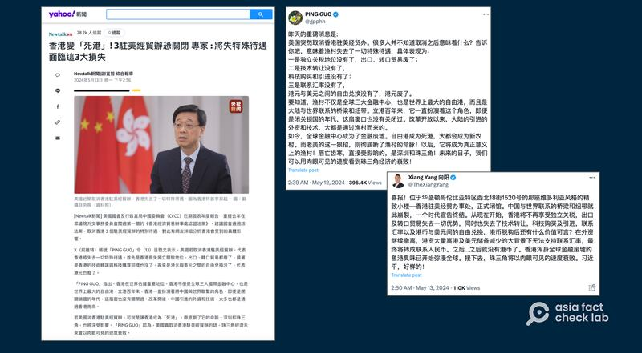
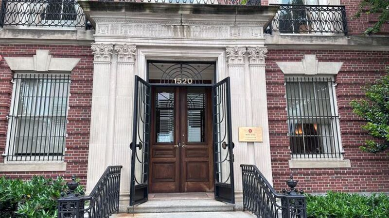

# 事實查覈｜美國突然取消香港駐美經貿辦？

作者：莊敬、鄭崇生

2024.05.31 15:30 EDT

## 查覈結果：錯誤

## 一分鐘完讀：

X、YouTube等平臺上近日出現帖文，稱美國突然取消香港駐美經貿辦公室，傳播者包括數個獲認證的“藍勾勾”用戶、自媒體帳號。臺灣《Newtalk新聞》也引用社媒用戶發文，該消息還登上《Yahoo!新聞》。

但亞洲事實查覈實驗室以中、英文關鍵字查詢，未見近期有任何官方聲明或主流媒體報道。並且，亞洲事實查覈實驗室記者在5月中到訪位於美國華盛頓的香港經貿辦，該辦公室仍有人員辦公，並未閉館。

## 深度分析：

"喜報!位於華盛頓哥倫比亞特區西北18街1520號的那座維多利亞風格的精緻小樓-香港駐美經貿辦事處,正式閉館。"這是在社媒平臺X上自介爲作家、獨立時評人的" [向陽](https://twitter.com/TheXiangYang/status/1789729998544515512)"最近發佈的內容。

另一位X"藍勾勾"用戶" [PING GUO](https://twitter.com/gpphh/status/1789364665891570103)"也發文寫道:"昨天的重磅消息是:美國突然取消香港駐美經貿辦。"這篇帖文不僅獲其它社媒用戶轉發,還有媒體引述。

臺灣的《Newtalk新聞》5月13日發佈報道:《 [香港變"死港"! 3駐美經貿辦恐關閉 專家:將失特殊待遇 面臨這3大損失](https://archive.ph/snKhB)》,標題有"專家",內文卻只引用"PING GUO"等網絡賬號的傳言。而報道雖然使用"若取消"、"恐關閉"等不確定的詞語。並且,文中搭配香港特首李家超的資料照片,圖說寫着:"美國近期取消香港駐美經貿辦,香港失去了一切特殊待遇。"這則報道登上臺灣常用的新聞資訊平臺《 [Yahoo!新聞](https://tw.news.yahoo.com/%E9%A6%99%E6%B8%AF%E8%AE%8A-%E6%AD%BB%E6%B8%AF-3%E9%A7%90%E7%BE%8E%E7%B6%93%E8%B2%BF%E8%BE%A6%E6%81%90%E9%97%9C%E9%96%89-%E5%B0%88%E5%AE%B6-%E5%B0%87%E5%A4%B1%E7%89%B9%E6%AE%8A%E5%BE%85%E9%81%87-065610675.html?guccounter=1)》。

此外,YouTube上的自媒體" [升旗易日報](https://www.youtube.com/watch?v=jYpiDySSaT0)"最近發佈視頻,聲稱"香港駐美經貿辦隨時被關閉"、"特權相繼被取消"。

近日在社媒上傳出美國取消香港駐美經貿辦的消息，有臺灣媒體引述網民說法併發布報道。（Yahoo!新聞、X平臺截圖）

## "駐美經貿辦關閉"源起何處？

亞洲事實查覈實驗室以中、英文關鍵字查詢，未見近期有任何官方聲明或主流媒體報道。確實有部分港媒對此發表相關評論文章，評論中以近期美國議員提出的《香港經濟貿易辦事處認證法案》，推測經貿辦可能會面臨關閉，但這些文章只是發表見解和推測，並非新聞報道。

《東方日報》5月9日刊登 [評論文章](https://orientaldaily.on.cc/content/%E8%A6%81%E8%81%9E%E6%B8%AF%E8%81%9E/odn-20240509-0509_00184_007/%E8%87%AA%E6%88%90%E4%B8%80%E5%AE%B6%EF%BC%9A%E5%87%BA%E6%8B%9B%E5%8F%8D%E5%88%B6%E7%B6%93%E8%B2%BF%E8%BE%A6%E8%A2%AB%E9%97%9C%E9%96%89),指"美國衆議院外交事務委員會去年底已通過法案,要求取消香港在美國3個經貿辦的特權和豁免待遇,甚至關閉辦事處。該法案今年將提交衆議院全體會議審議,之後再交由白宮拍板決定。香港3個駐美經貿辦很大機會凶多吉少。"

《信報》5月12日刊出 [評論文章](https://www1.hkej.com/dailynews/commentary/article/3766272/%E9%A7%90%E7%BE%8E%E7%B6%93%E8%B2%BF%E8%BE%A6%E7%80%95%E9%97%9C%E9%96%89+%E8%91%89%E5%8A%89%E6%96%99%E3%80%8C%E5%9C%8B%E5%AE%B6%E7%B4%9A%E3%80%8D%E5%8F%8D%E5%88%B6)則寫道:"美國國會及行政當局中國委員會(CECC)前天發表年度報告,重提去年在衆議院外交事務委員會闖過第一關的《香港經濟貿易辦事處認證法案》,建議國會通過該法案,取消香港3個駐美經貿辦的特別待遇。"

經查,《香港經濟貿易辦事處認證法案》(Hong Kong Economic and Trade Office Certification Act)草案中要求美國總統確認若香港不再享有高度自治,應取消對香港駐美經濟貿易辦事處享有的特權和豁免。目前 [衆院版](https://www.congress.gov/bill/118th-congress/house-bill/1103/text)和 [參院版](https://www.congress.gov/bill/118th-congress/senate-bill/490)都尚未送全院。 [CECC年度報吿](https://www.cecc.gov/sites/chinacommission.house.gov/files/2023CECC%20Executive%20Summary%20FINAL_5124.pdf)只是建議國會通過該法案。美國所有立法都須經參、衆兩院通過,並由總統簽字纔可生效。

## 香港駐美經貿辦事處工作如常

亞洲事實查覈實驗室（AFCL）記者5月15日到訪華府的香港駐美經貿辦事處，大門開着，辦事處內有人辦公，但內部人員表示若要進入辦事處，需事先預約。

記者於5月15日到訪美國位於華盛頓特區的香港駐美經貿辦，大門開着，有人在內辦公。（記者鄭崇生拍攝）

亞洲事實查覈實驗室另發電郵給美國國務院、香港駐美經貿辦事處查證，截至發稿前未有回覆。

*亞洲事實查覈實驗室(Asia Fact Check Lab)針對當今複雜媒體環境以及新興傳播生態而成立。我們本於新聞專業主義,提供專業查覈報告及與信息環境相關的傳播觀察、深度報道,幫助讀者對公共議題獲得多元而全面的認識。讀者若對任何媒體及社交軟件傳播的信息有疑問,歡迎以電郵*  [*afcl@rfa.org*](mailto:afcl@rfa.org)  *寄給亞洲事實查覈實驗室,由我們爲您查證覈實。* *亞洲事實查覈實驗室在X、臉書、IG開張了,歡迎讀者追蹤、分享、轉發。X這邊請進:中文*  [*@asiafactcheckcn*](https://twitter.com/asiafactcheckcn)  *;英文:*  [*@AFCL\_eng*](https://twitter.com/AFCL_eng)  *、*  [*FB在這裏*](https://www.facebook.com/asiafactchecklabcn)  *、*  [*IG也別忘了*](https://www.instagram.com/asiafactchecklab/)  *。*

[Original Source](https://www.rfa.org/mandarin/shishi-hecha/hc-05312024152418.html)