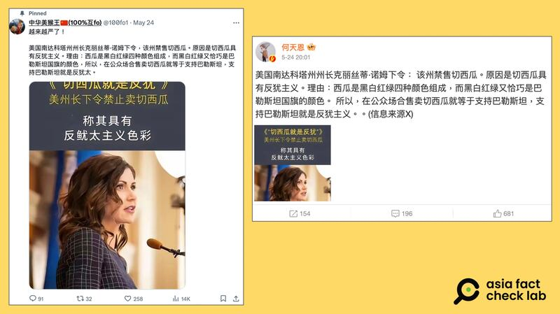

# 事實查覈｜美州長禁售西瓜切片，因其顏色具反猶色彩？

作者：莊敬

2024.06.01 16:35 EDT

## 查覈結果：錯誤

## 一分鐘完讀：

近日，一些中文社媒賬號稱美國南達科他州州長諾姆（Kristi Noem）下令，在該州禁售切開的西瓜，只因爲西瓜切片顏色與巴勒斯坦國旗相似，具有反猶色彩。經查覈，這條錯誤信息發源於X等英文社交媒體平臺，已經被路透社等多家新聞機構發佈認定爲虛假，但仍在中文社媒環境中不斷傳播。

## 深度分析：

在微博上擁有296萬粉絲的博主" [何天恩](https://m.weibo.cn/detail/5037646826444075)"5月24日發文:"美國南達科塔州州長克麗絲蒂.諾姆下令:該州禁售切西瓜。原因是切西瓜具有反猶主義。理由:西瓜是黑白紅綠四種顏色組成,而黑白紅綠又恰巧是巴勒斯坦國旗的顏色。所以,在公衆場合售賣切西瓜就等於支持巴勒斯坦,支持巴勒斯坦就是反猶主義。 "

這則帖子並附上一張圖，在諾姆（Kristi Noem）的照片上方搭配簡體中文：“《切西瓜就是反猶》美州長下令禁止賣切西瓜，稱其具有反魷太（按：原文有錯，應爲猶太）主義色彩”。

同天,X平臺帳號 ["中華美猴王](https://twitter.com/100fo1/status/1793893896281583808)"也發佈了一模一樣的內容,甚至附圖上的錯字也一樣。

微博、X平臺上的中文帳號發文，稱美國南達科他州州長諾姆下令，該州禁賣切西瓜，因切西瓜具有反猶色彩。（圖取自微博、X）

## 外媒已查覈 中文帳號仍傳播

經查,5月中,部分X平臺英文帳號開始傳播諾姆下令禁售切片西瓜的消息。當時也一度傳進中文社媒,在微博上擁有396萬粉絲的"大V"用戶" [小凡好攝](https://weibo.com/1659893422/OeoaHuiaL?type=repost)"5月15日發文,表示有美國博主稱南達科他州的州長禁止銷售西瓜,但也有其他博主反駁了此消息。

根據《今日美國》、路透社等媒體針對此事發布的查覈報告，諾姆的發言人表示，網傳消息並非事實。此外，也沒有任何相關的官方聲明、主流媒體報道此事。兩家媒體機構的查覈結果，都判定這個說法爲錯誤。

然而，即使已經有權威機構闢謠，“何天恩”、“中華美猴王”等中文帳號仍在社媒上傳播不實信息。

*亞洲事實查覈實驗室(Asia Fact Check Lab)針對當今複雜媒體環境以及新興傳播生態而成立。我們本於新聞專業主義,提供專業查覈報告及與信息環境相關的傳播觀察、深度報道,幫助讀者對公共議題獲得多元而全面的認識。讀者若對任何媒體及社交軟件傳播的信息有疑問,歡迎以電郵*  [*afcl@rfa.org*](mailto:afcl@rfa.org)  *寄給亞洲事實查覈實驗室,由我們爲您查證覈實。* *亞洲事實查覈實驗室在X、臉書、IG開張了,歡迎讀者追蹤、分享、轉發。X這邊請進:中文*  [*@asiafactcheckcn*](https://twitter.com/asiafactcheckcn)  *;英文:*  [*@AFCL\_eng*](https://twitter.com/AFCL_eng)  *、*  [*FB在這裏*](https://www.facebook.com/asiafactchecklabcn)  *、*  [*IG也別忘了*](https://www.instagram.com/asiafactchecklab/)  *。*

[Original Source](https://www.rfa.org/mandarin/shishi-hecha/hc-06012024163519.html)