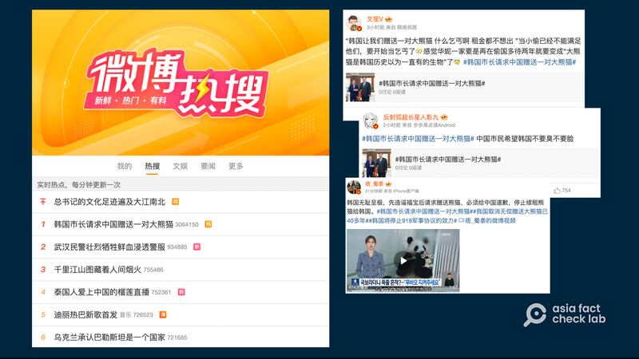
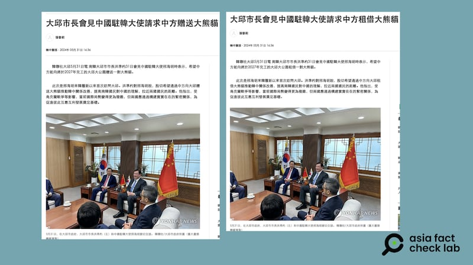

# 事實查覈｜韓國市長請求中國“贈送”一對大熊貓？

作者：莊敬

2024.06.03 13:51 EDT

## 查覈結果：錯誤

## 一分鐘完讀：

《觀察者網》、《俄羅斯衛星通訊社》等多家媒體近日報道，《韓聯社》消息稱，韓國大邱市長請求中國贈送一對大熊貓。相關話題在6月3日午間登上微博熱搜第一位，引發熱烈討論，不少轉發的博主、網民批評韓國“要求過分”、“無恥至極”。

經查，《韓聯社》確實在5月31日報道《大邱市長會見中國駐韓大使請求中方贈送大熊貓》，但已作出修正，將內容改爲“要求中方租借大熊貓”。亞洲事實查覈實驗室向大邱市查證，對方回覆，該市從未要求中方“贈送”大熊貓，而是請求租借。

## 深度分析：

《 [觀察者網](https://archive.ph/9kR43)》、《 [香港新聞網](http://www.hkcna.hk/h5/docDetail.jsp?id=100692621&channel=2810)》、《 [星島日報](https://std.stheadline.com/realtime/article/2002558/%E5%8D%B3%E6%99%82-%E4%B8%AD%E5%9C%8B-%E7%86%8A%E8%B2%93%E5%A4%96%E4%BA%A4%EF%B8%B1%E9%9F%93%E5%9C%8B%E5%A4%A7%E9%82%B1%E5%B8%82%E9%95%B7%E7%9B%BC%E4%B8%AD%E6%96%B9%E8%B4%88%E9%80%81%E5%A4%A7%E7%86%8A%E8%B2%93)》、《 [俄羅斯衛星通訊社](https://big5.sputniknews.cn/20240603/1059495907.html)》等媒體近日報道,韓國大邱市長請求中國贈送一對大熊貓。內容引用《韓聯社》 報道,指中國駐韓國大使邢海明5月31日訪問大邱廣域市會見洪準杓市長,洪準杓表示,希望中方能向將於2027年完工的"大邱大公園"贈送一對大熊貓。

6月3日中午,"韓國市長請求中國贈送一對大熊貓"話題登上中國社交媒體平臺微博的熱搜榜第一位。部分轉發的"大V"博主批評韓國"無恥至極"、"什麼乞丐啊,租金都不想出"。其中不少網民提到,1982年後,鑑於大熊貓生態環境惡化導致其數量急劇減少, [中國政府宣佈停止向外國無償贈送熊貓](https://m.chinanews.com/wap/detail/cht/zwsp/ft8858691.shtml),"熊貓外交"的形式也由"贈送"變爲"租借"。

“韓國市長請求中國贈送一對大熊貓”話題登上微博熱搜，部分中國網民批評韓國的要求。（圖取自微博）

## 韓媒已將“贈送”改爲“租借”

經查,《 [韓聯社](https://archive.ph/w27JK)》確實在5月31日刊出報道《大邱市長會見中國駐韓大使請求中方贈送大熊貓》。但亞洲事實查覈實驗室記者在6月3日下午再次點開報道鏈接時,發現《韓聯社》已將內容改爲" [請求中方租借大熊貓](https://cb.yna.co.kr/gate/big5/cn.yna.co.kr/view/ACK20240531003300881?section=china-relationship/index)"。

《韓聯社》原本報道大邱市長請求中方贈送大熊貓，之後將“贈送”（圖左）改爲“租借”（圖右）。（圖取自《韓聯社》）

亞洲事實查覈實驗室以電郵向大邱市查證，對方說明，大邱市從未請求（中國）贈送熊貓，而是請求租借。而“贈送”的說法只是《韓聯社》的錯誤報道，就他們瞭解，《韓聯社》已修正錯誤報道。

中國駐韓國大使館5月31日針對邢海明會見洪準杓所發佈的 [新聞稿](http://kr.china-embassy.gov.cn/tpxw/202405/t20240531_11368536.htm)指出,"大邱日前開建大邱大公園,大邱市民熱切期盼能'請來'中國國寶大熊貓。"

*亞洲事實查覈實驗室(Asia Fact Check Lab)針對當今複雜媒體環境以及新興傳播生態而成立。我們本於新聞專業主義,提供專業查覈報告及與信息環境相關的傳播觀察、深度報道,幫助讀者對公共議題獲得多元而全面的認識。讀者若對任何媒體及社交軟件傳播的信息有疑問,歡迎以電郵*  [*afcl@rfa.org*](mailto:afcl@rfa.org)  *寄給亞洲事實查覈實驗室,由我們爲您查證覈實。* *亞洲事實查覈實驗室在X、臉書、IG開張了,歡迎讀者追蹤、分享、轉發。X這邊請進:中文*  [*@asiafactcheckcn*](https://twitter.com/asiafactcheckcn)  *;英文:*  [*@AFCL\_eng*](https://twitter.com/AFCL_eng)  *、*  [*FB在這裏*](https://www.facebook.com/asiafactchecklabcn)  *、*  [*IG也別忘了*](https://www.instagram.com/asiafactchecklab/)  *。*

[Original Source](https://www.rfa.org/mandarin/shishi-hecha/hc-06032024134544.html)