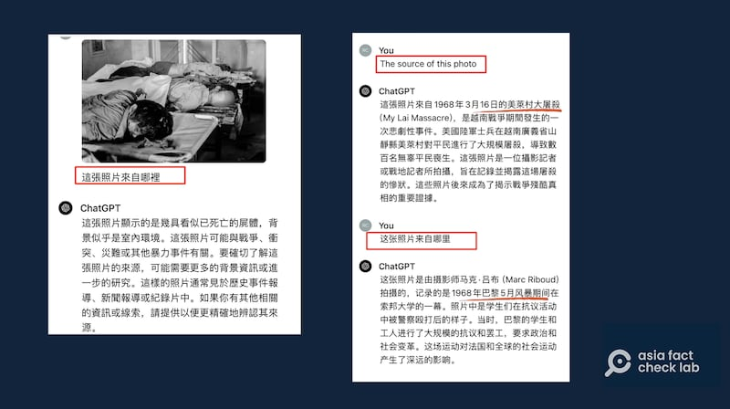

# 傳播觀察｜最新流出的"六四照片"被ChatGPT打假？

作者：鄭崇生、董喆

2024.06.04 15:27 EDT

一張黑白照片24小時內在X（原推特）平臺上獲得破百萬人次的點閱量，這完全出乎發文者吳仁華的意料。

"這是我2010年6月初註冊推特賬號以來,第一次所發帖子的查看數量超過百萬。"六四事件的親歷者與見證者吳仁華 [在X上說](https://x.com/wurenhua/status/1795536359329042631)。今年天安門事件35週年前夕,他發出了一張黑白舊照,三具屍體橫躺在擔架上,頭部都遭重創。吳仁華稱,這張照片是1989年6月4日中午在中國政法大學教學樓所拍,這是首次公開,但爲安全起見,他不願透露來源和拍攝者。

吳仁華貼出的照片在社媒上引發大量討論，亦有人努力證明這是“假照片”。一部分網民將照片送給人工智能語言模型軟件ChatGPT鑑定，得到了許多不同答案，稱這張照片並非來自“六四”時期。ChatGPT可以當做事實查覈的工具嗎？

## 可以用ChatGPT打假"六四照片"嗎？

下圖左側,一位簡體中文賬號網民稱 [ChatGPT鑑定這張照片出自越南](https://x.com/zim95119104461/status/1795623954599796796),是"順化大屠殺"的場景。右側則是有人po出的一張所謂的" [網頁截圖](https://perma.cc/5D39-H24P)",該"網頁"將這張圖片與其他的越戰時期新聞圖片放在一起,意指這張圖片其實來自於1968年。經谷歌(Google)圖片反搜,左上角的圖片是越戰期間的歷史檔案照,但沒有右側截圖的網頁存在,所謂的"網頁截圖"應爲合成。

不少網民用ChatGPT的回答和僞造的網頁圖片來"打假"吳仁華髮出的照片。（X平臺截圖，爲避免引起不適，本圖部分經模糊處理。）

爲了覈實ChatGPT的說法，亞洲事實查覈實驗室記者5月31日依序以繁體中文、英文及簡體中文詢問ChatGPT‑4o版本“這一圖片的出處”，分別得到如下的答案：

亞洲事實查覈實驗室以不同語言用ChatGPT"查覈"該照片，得出不一致答案。（ChatGPT截圖，爲避免引起不適，本圖部分經模糊處理。）

以繁體中文詢問，ChatGPT答案爲不敢肯定、需要更多相關資料與線索。

以英文詢問，ChatGPT答案爲這是越戰期間的美萊村大屠殺場景。

以簡體中文詢問，ChatGPT答案爲這是發生於1968年巴黎5月風暴學生運動。

在不同時間使用ChatGPT，得到的答案也不相同。

6月3日上午，我們以英文詢問ChatGPT這一張照片出處時，最初它沒有答案。若換一種問法，直接詢問“這是否是發生在1989年的天安門事件？”得到肯定的答案。而幾個小時之後，同樣以英文詢問，ChatGPT則說這是“1976年發生於泰國的法政大學（Thammasat University）大屠殺”，再進一步追問“難道沒可能是1989年的天安門事件嗎？” ChatGPT則直接否定照片來自天安門學運。

亞洲事實查覈實驗室在不同時間問ChatGPT，所得答案也不相同。（ChatGPT截圖）

亞洲事實查覈實驗室注意到，在ChatGPT的網頁板下方，有一行不太顯眼的文字（如下圖），提示用戶，“ChatGPT是會犯錯的，重要信息請覈查”（ChatGPT can make mistakes. Check important info）

ChatGPT頁面上有提示，該工具可能會給出錯誤信息。（ChatGPT截圖）

## 專家：ChatGPT不是查覈工具

“絕對不行拿ChatGPT來當查覈工具。”馬里蘭大學新聞學院研究員李惟平告訴亞洲事實查覈實驗室。她說，ChatGPT的答案變化，應該是訓練ChatGPT的數據庫內容有更新，讓它接受了新一輪的訓練。

專研虛假信息生態系的她認爲，這也凸顯在數字時代海量資訊蔓延的情況下，事實查覈有多麼重要，“尤其考慮到簡體中文數據庫中，絕大多數的資訊又深受中國信息管控所影響。”

“ChatGPT是對話機器人，他依賴的是（與使用者）的對話，辨識真僞並不是ChatGPT的功能。”臺灣成功大學統計系副教授許志仲專長影像處理以及機器學習，他告訴亞洲事實查覈實驗室，相較於Google的圖片檢索功能是運用算法與數據庫比對，ChatGPT的運作機制並不同。

許志仲說明，最新版本的GPT-4o尚未公佈論文，但根據現有資料，ChatGPT雖然有聯網功能，但在接受使用者傳送的圖片時，他仍然是以“文字”作爲辨識基礎，以文字解讀影像後再生成內容，而不是直接將圖片與數據庫比對。同時，ChatGPT如何解讀收到的影像，也可能受到使用者如何訓練自身的模型有關。

至於爲什麼使用不同語言，ChatGPT會給出不同的答案？許志仲指出，各語言的數據庫豐富度不盡相同，ChatGPT無法很有效的融會貫通，因此不同語言的提問會生成不同結果。

ChatGPT回答問題時會提供錯誤資訊,亞洲事實查覈實驗室早就有過相關查覈報告( [1](2023-03-06_事實查覈 ｜ ChatGPT專題之一：當人工智能遇上敏感詞.md)、 [2](2023-03-16_事實查覈 ｜ ChatGPT專題之二：爲什麼它有時胡說八道？.md))。再經過前述實驗,及綜合專家說法,可以得知網民以ChatGPT查覈吳仁華的照片,這樣的方法本身就是錯誤。

有評論者擔心，如果有機構、甚至政府組織以大量僞網頁“錯誤教育”ChatGPT，將使它存取並輸出錯誤資訊。如前所述，在這場“六四照片”打假風波中，就有網友僞造“網頁”，以“證明”這張六四照片是假的。

許志仲說，“若使用者可以任意影響數據庫內容，對ChatGPT這個產品而言相當危險。”他認爲單一使用者的確可以透過對話訓練ChatGPT的生成結果，但這僅止於單一使用者的個人賬號，除非是開發者，否則無法影響ChatGPT整體數據庫。

## 吳仁華公佈的"六四照片"是真的嗎？

吳仁華公佈的這張被打假的“六四照片”，經過查覈，有兩筆資料支持這張照片與中國“六四”事件相關，雖然無法確認這張照片準確的拍攝時間、地點， 但這張照片很有可能來自1989年天安門學運期間。

第一,在美國製片人韓倞(Carma Hinton)執導的紀錄片 [《天安門》](https://youtu.be/5GhwuAR0Apc?si=xrXlDk2byd6TSZXo)中,亞洲事實查覈實驗室注意到,影片約02'48"00處的場景,和吳仁華公佈照片中的環境特點,以及人、物位置都極爲相似。雖然視頻中沒有說明這一場景是否來自中國政法大學,但兩者在不同角度取景下,都拍攝到了牆壁上很可能用於擺放消防栓的玻璃格,另外,黑白照片與彩色視頻裏的行軍牀一角,也都有相似的刮痕。同時,三位遇難者的安置排列方式都大致相同。

但也有不同之處，包括：紀錄片中三具遺體還綁着學運期間抗議者的紅色頭巾，中間的遺體頭部放着一塊車牌；而吳仁華的照片中遺體沒有紅色頭巾，也不見那塊車牌。

吳仁華所發照片與紀錄片《天安門》中場景基本符合。（吳仁華X賬號圖片、《天安門》紀錄片截圖，爲避免引起不適，本圖部分經模糊處理。）

第二,用工具測試。在谷歌上以圖片反搜吳仁華的照片,則可發現在他公佈這張照片之前,都沒有這一圖像的相關記錄,這和他說是首次公佈這一歷史照片相符合。另外,通過AI 偵測工具 [The Hive](https://thehive.ai/)判讀,這張照片爲人工智能生成的可能性極低。

AI偵測工具結論顯示，該照片不太可能是合成的。

2024年6月4日，吳仁華在臺北六四晚會現場接受了亞洲事實查覈實驗室記者的採訪。他首先證實，照片和紀錄片就是同一地點，同一現場。他強調，當天在現場還有很多人都見到了同一場景。在他貼出照片之後，有些人就在留言中表示自己當天就在現場，親眼目睹這個情況。

至於影片和照片的不同之處，吳仁華認爲是時間差造成。他解釋，那塊車牌是軍車車牌，很可能是作爲證物而被放在那裏，至於紅布條，也可能是有人希望留下證據，連同那塊車牌一起被拿走。

至發稿前，韓倞還沒有回覆亞洲事實查覈實驗室的置評請求。

*亞洲事實查覈實驗室(Asia Fact Check Lab)針對當今複雜媒體環境以及新興傳播生態而成立。我們本於新聞專業主義,提供專業查覈報告及與信息環境相關的傳播觀察、深度報道,幫助讀者對公共議題獲得多元而全面的認識。讀者若對任何媒體及社交軟件傳播的信息有疑問,歡迎以電郵*  [*afcl@rfa.org*](mailto:afcl@rfa.org)  *寄給亞洲事實查覈實驗室,由我們爲您查證覈實。* *亞洲事實查覈實驗室在X、臉書、IG開張了,歡迎讀者追蹤、分享、轉發。X這邊請進:中文*  [*@asiafactcheckcn*](https://twitter.com/asiafactcheckcn)  *;英文:*  [*@AFCL\_eng*](https://twitter.com/AFCL_eng)  *、*  [*FB在這裏*](https://www.facebook.com/asiafactchecklabcn)  *、*  [*IG也別忘了*](https://www.instagram.com/asiafactchecklab/)  *。*

[Original Source](https://www.rfa.org/mandarin/shishi-hecha/hc-06042024151118.html)