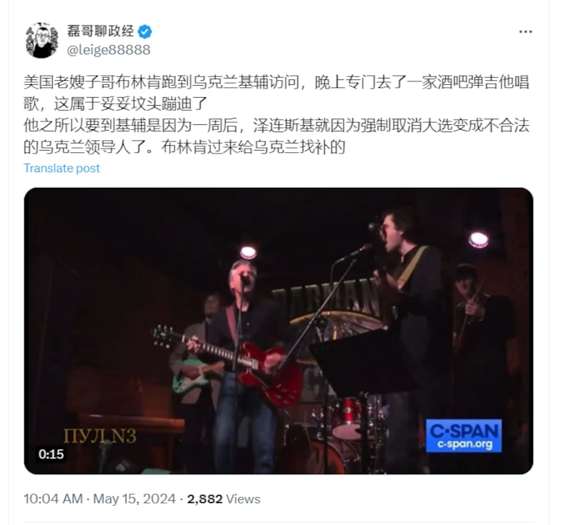
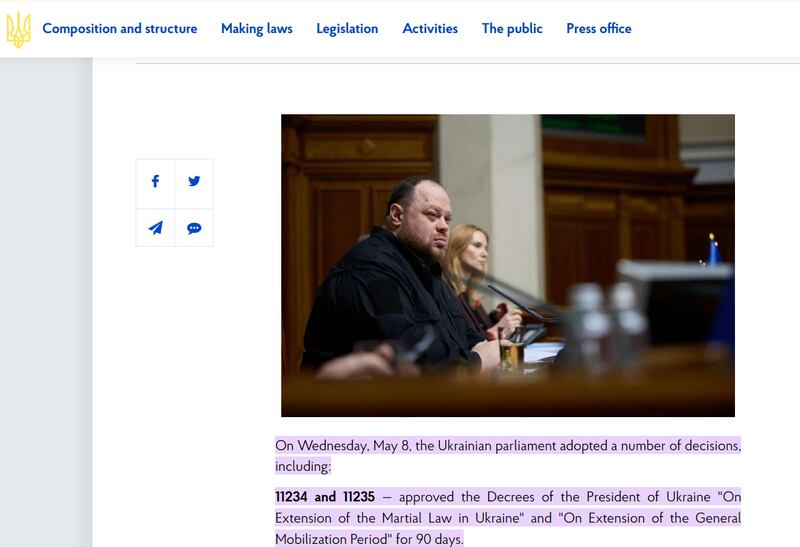

# 事實查覈｜澤連斯基總統身份“不合法”？美國支持“過期總統”？

作者：鄭崇生

2024.06.05 13:56 EDT

## 查覈結果：誤導

## 一分鐘完讀：

烏克蘭原訂5月20日舉行的總統大選取消，現任總統澤連斯基（Volodymyr Zelenskyy）任期延長。5月以來，中文社交媒體上出現了不少質疑澤連斯基領導身份合法性的敘事，還有人進一步批評美國支持他的“不合法”政府。

經查覈，烏克蘭法律規定，戒嚴期間禁止舉行任何選舉。該國去年底暫緩國會改選、近日暫緩總統大選的做法，都依法有據。“澤連斯基是不合法總統”的說法是誤導言論。

## 深度分析：

6月2日，烏克蘭總統弗拉基米爾·澤連斯基（Volodymyr Zelenskyy）出席在新加坡舉行的“香格里拉對話”（The Shangri-La Dialogue），這是世界知名的國防論壇，參與者包括政府官員和民間專家。他的這次亮相在中國社交網絡上引發討論，其中出現了不少對於他身份“合法性”的批評。澤連斯基的任期本應在5月20日屆滿，但烏克蘭國內選舉因俄烏戰事取消，他因而進入延任狀態。不少中國網民批評澤連斯基“不合法”、是“過期總統”。

這並不是質疑澤連斯基總統職務合法性的敘事首次出現。美國國務卿布林肯5月14日突訪基輔，表達對烏克蘭抵抗俄國侵略堅定支持時，就有X賬號”磊哥聊政經”聲稱，布林肯選擇這個時間點訪問基輔，是因爲澤連斯基要“強制取消大選、變成不合法領導人”，“布林肯過來給烏克蘭找補的”（把不足的補上） 。

X、微博上有不少中文用戶質疑澤連斯基總統身份的合法性，並批評美國對他的支持。（X截圖）

## 澤連斯基身份“不合法”的敘事源自俄羅斯

事實上,質疑澤連斯基合法性的言論最早來自 [俄國官方宣傳機構](https://en.sputniknews.africa/20240428/1066278948.html),今日俄羅斯(RT)的 [微博](https://weibo.com/6244553417/OfWIIrE4P?refer_flag=1001030103_)最近一次發文仍指,"5月20日,澤連斯基總統任期已經屆滿,不再是烏克蘭的合法總統"。烏克蘭部分獨立媒體也 [注意到](https://babel.ua/en/texts/104242-five-years-of-zelenskyy-s-presidency-will-expire-in-may-2024-some-analysts-and-enemies-say-he-will-lose-legitimacy-it-s-true-no-this-is-an-unconstitutional-delusion-babel-s-legal-and-anti-fake-analysi),一些親俄的烏克蘭評論人同樣拿"無法選舉的烏克蘭"對比"一直選、一直贏的俄羅斯總統普京",以批評澤連斯基。

烏克蘭的政治制度如何？ 澤連斯基可以自己決定延任嗎？亞洲事實查覈實驗室發現，原定今年3月舉行的烏克蘭總統大選延期，是因俄烏戰爭還在持續，全國依然處於戰時，《戒嚴法》生效。同樣，烏克蘭國會原本去年10月就該改選，也因爲相同原因而暫緩。

[烏克蘭《戒嚴法》](https://zakon.rada.gov.ua/laws/show/en/389-19?lang=uk#Text)第19條款規定,戒嚴時禁止舉行總統大選以及最高拉達(Rada,即烏克蘭語的國會)在內的選舉活動。

[烏克蘭《憲法》](https://hcj.gov.ua/sites/default/files/field/file/the_constitution_of_ukraine.pdf)(鏈接中爲英文版本)也對戰時議會的權力行使與選舉方式有明確規定。根據《憲法》第83條,如果烏克蘭最高議會在戒嚴或緊急狀態期間任期屆滿,其職權應延長至下一個任期,直到戒嚴或緊急狀態取消後,改選出新國會。

因此，根據烏克蘭法律，澤連斯基並不能以個人意志“強制取消”總統選舉，烏克蘭的政治體制在戰爭時期的運行，是有法律規定的。

烏克蘭國會在2023年11月底則達成跨黨派共識並簽署備忘錄,根據《 [烏克蘭真理報](https://www.pravda.com.ua/eng/news/2023/11/30/7431116/)》,烏克蘭國會各黨派同意,在俄烏戰爭結束及戒嚴終止後的6個月內,烏克蘭將舉行公平、公正的全國性選舉,包括國會改選與總統大選。

烏克蘭國會於五月初表決通過延長戒嚴令。（烏克蘭國會網站截圖）

今年5月8日,烏克蘭國會 [公佈](https://www.rada.gov.ua/en/news/News/top_news/249361.html#:~:text=On%20Wednesday%2C%20May%208%2C%20the,Mobilization%20Period%22%20for%2090%20days.)通過澤連斯基提出延長戒嚴令與動員令的請求。這是烏克蘭國會第11度表決同意澤連斯基根據《戒嚴法》宣佈戒嚴措施。目前,烏克蘭戒嚴令依然生效。

## 烏克蘭總統延任有前例

專注於報道東歐事務的組織"跨境新聞網絡(n-ost)"在一篇 [長文分析](https://n-ost.org/news/constitution-put-to-test-during-martial-law)中引述,前烏克蘭中央選舉委員會主席馬赫拉(Andrii Mahera)說,現在的烏克蘭處於戰時戒嚴狀態,而《憲法》108條也有規定,總統權力的行使是直到新任總統就任爲止。

另外，烏克蘭亦有總統延任先例，擔任過兩個任期的前總統庫奇馬（Leonid Kuchma）和前總統與尤申科（Viktor Yushchenko）都曾獲得延任，因當時選舉進入第二輪，結果比預期時間延後，這兩位總統的任期都超過了5年。

根據前述，烏克蘭在戒嚴時期不舉行國會及總統選舉是有法律依據的，所謂澤連斯基“強制取消”大選，變成“不合法領導人”的相關說法是誤導信息。

*亞洲事實查覈實驗室(Asia Fact Check Lab)針對當今複雜媒體環境以及新興傳播生態而成立。我們本於新聞專業主義,提供專業查覈報告及與信息環境相關的傳播觀察、深度報道,幫助讀者對公共議題獲得多元而全面的認識。讀者若對任何媒體及社交軟件傳播的信息有疑問,歡迎以電郵*  [*afcl@rfa.org*](mailto:afcl@rfa.org)  *寄給亞洲事實查覈實驗室,由我們爲您查證覈實。* *亞洲事實查覈實驗室在X、臉書、IG開張了,歡迎讀者追蹤、分享、轉發。X這邊請進:中文*  [*@asiafactcheckcn*](https://twitter.com/asiafactcheckcn)  *;英文:*  [*@AFCL\_eng*](https://twitter.com/AFCL_eng)  *、*  [*FB在這裏*](https://www.facebook.com/asiafactchecklabcn)  *、*  [*IG也別忘了*](https://www.instagram.com/asiafactchecklab/)  *。*

[Original Source](https://www.rfa.org/mandarin/shishi-hecha/hc-06052024135245.html)