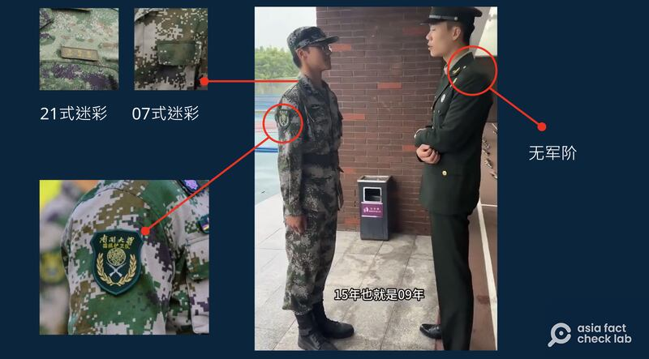

# 事實查覈｜臺灣小夥在大陸參加解放軍？

作者：董喆

2024.06.06 19:41 EDT

## 標籤：錯誤

## 一分鐘完讀：

近日，微博流傳一則視頻，一名身穿疑似解放軍迷彩軍服的男子稱自己來自臺灣，微博“大V”以此爲據，稱有臺灣小夥在中國大陸當兵。亞洲事實查覈實驗室找到原始影片出處並諮詢解放軍研究專家，確定身著迷彩服的人是中國大專院校的“國旗護衛隊”成員，並非解放軍士兵，網傳訊息錯誤。

## 深度分析：

微博軍事博主"衝鋒號角"擁有90多萬粉絲,他於5月26日轉發了 [一則影片](https://weibo.com/2343014623/5038426204668927),影片中一名身着解放軍軍常服的男子詢問身着迷彩服的年輕人來自哪裏,該年輕人回答"臺灣台北"。"衝鋒號角"根據此影片稱"臺灣的小夥在大陸當兵!馬上就可以派上用場了!"該視頻獲得六百多次點贊,並引發衆多網民討論,有網民評論稱"這位臺籍解放軍,以後是解放臺灣的主力",也有網民質疑稱,臺灣人在大陸當兵是否能通過"政審"?

亞洲事實查覈實驗室以影像反搜,找到此影片同樣爲中國搜狐賬號 ["生活幫"轉發](https://www.sohu.com/a/781796352_121826638/?pvid=000115_3w_a&fbclid=IwZXh0bgNhZW0CMTAAAR0hKsvkzyGcGNT3NJqJSRmDF_XrkX5ELKuSev9x4P4AO10-nBOChfSCp0Q_aem_ASr9wknCGEiHqKk0kASMuFMJeUqMjccAFv74NN-2L5t6KpqP5WMIUchdBYQcSXzIHXHp2gvaw22MlLKOqvLSTero),不過標題是"退役軍人在南開大學培訓國旗護衛隊,遇到一位來自臺灣的學生"。該帖中,該小夥的身份是學生而不是士兵。

爲了覈實哪一方的說法屬實，我們檢視影片細節，發現迷彩服男子的臂章上寫着“南開大學國旗護衛隊”字樣。

同時我們也諮詢了“中國人民解放軍基地及設施”互動地圖創建人、臺灣戰略模擬學會兼任研究員溫約瑟。他表示，影片中的小夥穿的是舊式07迷彩，但現役解放軍已經不用07式迷彩，而是21式迷彩。另外那位身着軍服的男子並沒有掛軍階，顯示已退役。

網傳"臺灣小夥大陸當兵"視頻截圖中的服裝細節比對分析 （新浪微博截圖）

溫約瑟解釋說,國旗護衛隊屬於社團性質,不是軍隊編制。南開大學學生工作部的微信公衆號"南開微學工"的 [文章](https://mp.weixin.qq.com/s/KcjHi49hBSAfv4cPWZ2Dcw)表明,國旗護衛隊是"準軍事化學生組織",並非正規軍,其工作是"負責校內日常升降旗,以及重大節日紀念日、校外活動升降旗和迎接外賓等儀仗司禮任務"。

因此“衝鋒號角”所發影片中主角爲南開大學國旗護衛隊成員，而非正規解放軍，以此證明臺灣人參加解放軍的說法有誤。

影片中男子除了介紹自己來自臺灣外，稱其父親爲臺灣人，母親爲重慶人，6歲開始在重慶生活，已經在大陸生活了15年。不過其身份屬於個人隱私，其發言和行動也屬個人自由，不在本次查覈範圍內。

*亞洲事實查覈實驗室（Asia Fact Check Lab）針對當今複雜媒體環境以及新興傳播生態而成立。我們本於新聞專業主義，提供專業查覈報告及與信息環境相關的傳播觀察、深度報道，幫助讀者對公共議題獲得多元而全面的認識。讀者若對任何媒體及社交軟件傳播的信息有疑問，歡迎以電郵afcl@rfa.org寄給亞洲事實查覈實驗室，由我們爲您查證覈實。*

*亞洲事實查覈實驗室在X、臉書、IG開張了,歡迎讀者追蹤、分享、轉發。X這邊請進:中文*  [*@asiafactcheckcn*](https://twitter.com/asiafactcheckcn)  *;英文:*  [*@AFCL\_eng*](https://twitter.com/AFCL_eng)  *、*  [*FB在這裏*](https://www.facebook.com/asiafactchecklabcn)  *、*  [*IG也別忘了*](https://www.instagram.com/asiafactchecklab/)  *。*

[Original Source](https://www.rfa.org/mandarin/shishi-hecha/hc-06062024193546.html)