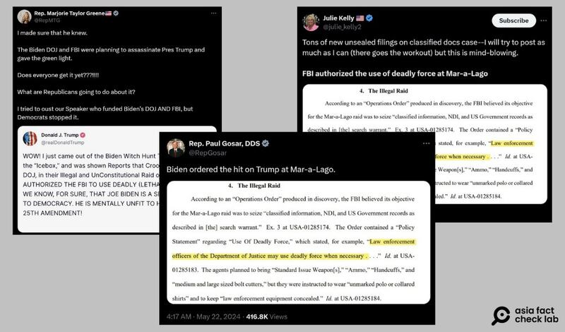
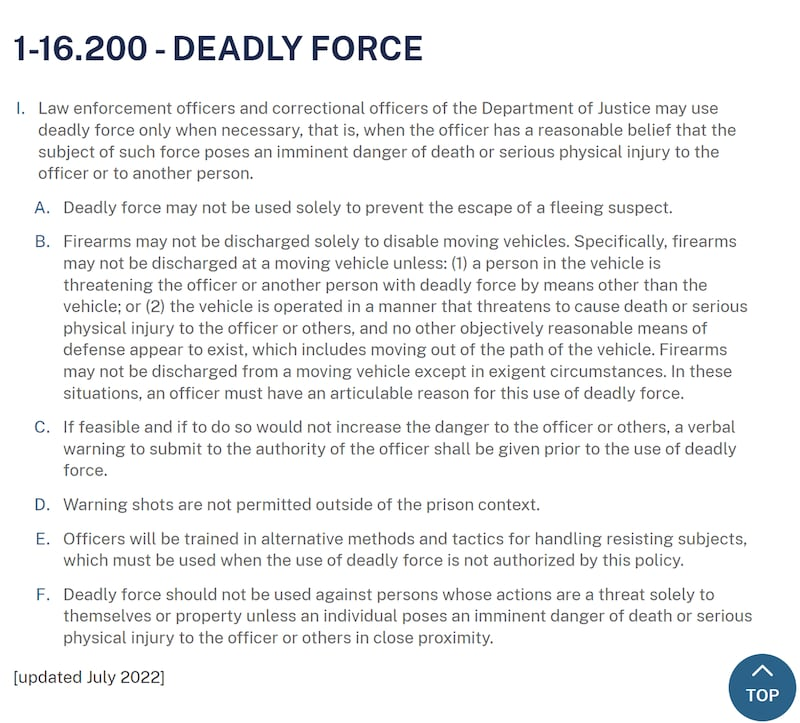
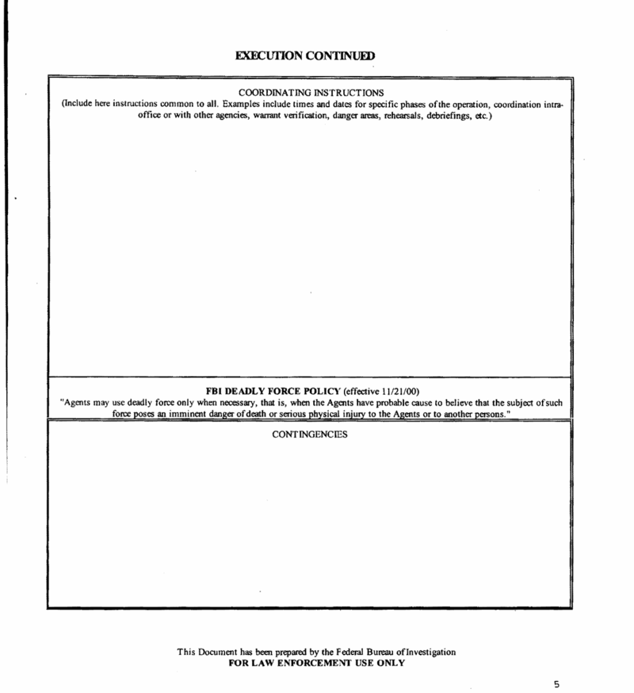
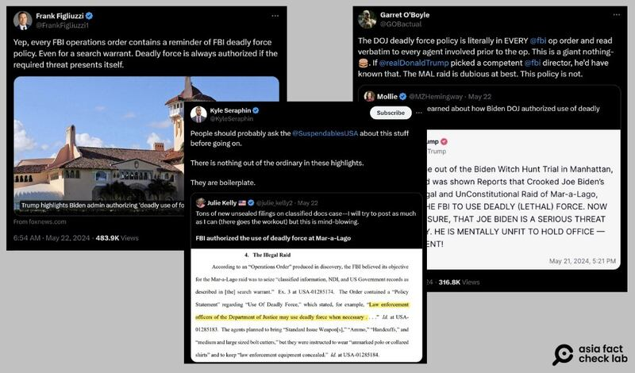

# 事實查覈｜2022年拜登曾計劃暗殺特朗普？

作者：艾倫

2024.06.07 18:16 EDT

## 查覈結果：錯誤

## 一分鐘完讀：

近期中國社交媒體微博上出現帖文，宣稱一名美國衆議員揭露聯邦調查局（FBI）曾在2022年計劃暗殺前總統特朗普。證據是拜登政府在調查特朗普“海湖莊園”的機密文件案時，授權聯邦調查局使用“致命性武力”。

亞洲事實查覈實驗室查覈了美國司法部公佈的行動命令政策規範，根據過去FBI釋出的空白文件及前FBI探員的說法，發現該說法錯誤解釋了專用詞彙，傳遞了不實信息。

## 深度分析：

5月22日,微博賬號 ["今日俄羅斯"](https://weibo.com/6244553417/OfsbbulXO?refer_flag=1001030103_)和 ["微天下"](https://weibo.com/1893801487/OfsfQa19v?refer_flag=1001030103_)發佈消息,稱美國衆議員格林(Marjorie Taylor Greene)指控拜登政府和聯邦調查局在2022年突襲海湖莊園時計劃暗殺特朗普。

微博用戶傳播"美議員稱2022年FBI計劃暗殺特朗普"的消息（新浪微博截圖）

這則帖文所稱的“海湖莊園事件”是指2022年8月8日，美國聯邦調查局派人前往特朗普在佛羅里達州的海湖莊園執行搜查，因爲特朗普涉嫌擅自保留國家軍事機密及非法銷燬美國聯邦政府文件。

格林5月22日在X上 [發文](https://x.com/RepMTG/status/1793035321451454482)稱,拜登政府批准司法部和聯邦調查局暗殺特朗普。她轉發了特朗普在社交媒體Truth Social的發文截圖,指控拜登授權聯邦調查局在搜查海湖莊園時使用致命性武器(authorized the FBI to use deadly force),並稱該次突襲既違法也違憲。

共和黨籍衆議員保羅·戈薩爾(Paul Gosar)也在同時間 [傳播](https://x.com/RepGosar/status/1793013319751684100)拜登下令暗殺特朗普(ordered the hit on Trump)的說法。

回溯這些傳言發現,其源頭來自於美國政治評論員朱莉凱莉(Julie Kelly)的 [推文](https://x.com/julie_kelly2/status/1792969008657948733),該文附上了一張特朗普律師所提出的動議(motion),稱海湖莊園的"違法突襲"給了執法部門在必要時使用"致命武器"的權力。

美共和黨議員及政治評論員稱"FBI和拜登計劃在海湖莊園暗殺特朗普"（X平臺截圖）

## 搜查令文件出現"致命性武器"符合規範

將網傳法律文件所提及的“致命武器”一詞以關鍵字搜尋，會發現FBI在搜查海湖莊園時的措辭與美國司法部（DOJ）提供的準則吻合。

[美國司法部武力使用規範](https://www.justice.gov/jm/1-16000-department-justice-policy-use-force#1-16.200)提到,"警方在搜索過程中,只有當有必要時可使用武力"(Law enforcement officers and correctional officers of the Department of Justice may use deadly force only when necessary),而網傳特朗普律師提出的動議文件上卻去掉了"只有"(only)一字。

美國司法部"致命性武力"使用規範（美國司法部官網截圖）

以關鍵字搜尋還會找到FBI於2004年發佈的空白行動命令表格。文件顯示，早在特朗普之前，“致命性武器”的說法就已經存在。

FBI於2004年發佈的空白行動命令表格（FBI官網截圖）

前FBI反間諜助理主任Frank Figliuzzi在X上 [發文](https://x.com/FrankFigliuzzi1/status/1793052687900049735)表示,每份聯邦調查局的行動命令都存在使用武力的規範提醒,就算是執行搜查令也一樣。如果任務存在一定威脅,武器經授權是可使用的。

前FBI探員Kyle Seraphin也發表 [相同看法](https://x.com/KyleSeraphin/status/1792981939718176818):"(搜查令裏)這些要點沒有任何異常之處,它們符合標準規範。"

曾質疑海湖莊園搜查令的正當性並稱該行動"非常可疑"的FBI探員Garret O'Boyle [也說](https://x.com/GOBactual/status/1793047272185377039),每份FBI的行動命令都會提及使用致命武器的政策規範,且探員執行任務前皆須讀過條文才可行動,這並不是什麼大問題。

三位在FBI工作過的探員皆發文指出，FBI針對海湖莊園行動的文件措辭沒有問題。

美國聯邦調查局公共事務處回應亞洲事實查覈實驗室時，除了再次強調搜查令一切符合規範，也提到拜登2023年初在德拉瓦州的住處遭到FBI搜索時，當時的行動命令裏也有提及“使用致命武器”的可能性，標準程序一視同仁。

相關英文謠言在英文世界已廣傳一段時間,且數家西方媒體如 [美聯社](https://apnews.com/article/fact-check-trump-fbi-maralago-search-672e97d19032de0947f108e4911f191e)、 [新聞週刊](https://www.newsweek.com/fact-check-fbi-donald-trump-assassination-steve-bannon-1903627)等皆已進行過查覈。

*亞洲事實查覈實驗室（Asia Fact Check Lab）針對當今複雜媒體環境以及新興傳播生態而成立。我們本於新聞專業主義，提供專業查覈報告及與信息環境相關的傳播觀察、深度報道，幫助讀者對公共議題獲得多元而全面的認識。讀者若對任何媒體及社交軟件傳播的信息有疑問，歡迎以電郵afcl@rfa.org寄給亞洲事實查覈實驗室，由我們爲您查證覈實。*

*亞洲事實查覈實驗室在X、臉書、IG開張了,歡迎讀者追蹤、分享、轉發。X這邊請進:中文*  [*@asiafactcheckcn*](https://twitter.com/asiafactcheckcn)  *;英文:*  [*@AFCL\_eng*](https://twitter.com/AFCL_eng)  *、*  [*FB在這裏*](https://www.facebook.com/asiafactchecklabcn)  *、*  [*IG也別忘了*](https://www.instagram.com/asiafactchecklab/)  *。*

[Original Source](https://www.rfa.org/mandarin/shishi-hecha/hc-06072024180548.html)