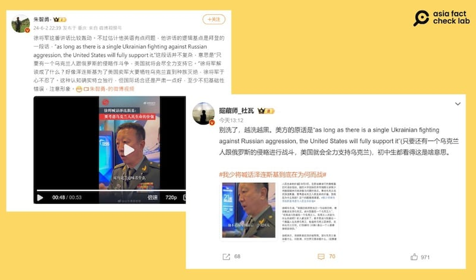

# 事實查覈｜拜登說過"會支持烏克蘭戰鬥到最後一個烏克蘭人"？

作者：艾倫

2024.06.10 18:16 EDT

## 查覈結果：沒有證據

## 一分鐘完讀：

5月31日至6月2日，在"香格里拉對話"進行期間，中國國防大學國際防務學院院長徐輝在接受媒體採訪時稱，美國總統拜登曾說："(美國)會支持烏克蘭，戰鬥到最後一個烏克蘭人" 。發言一出，引發中國新聞媒體及社媒的廣泛關注。

經查，不僅徐輝的說法缺乏證據，網上出現爲此事件"闢謠"的主流說法也有誤。

## 深度分析：

6月2日，在新加坡“香格里拉對話”會議現場，中國國防大學徐輝接受媒體採訪時說：“美國總統拜登說過一句話很恐怖，他說他會支持烏克蘭，戰鬥到最後一個烏克蘭人”。

“如果戰鬥到最後一個烏克蘭人，烏克蘭人民爲什麼而戰呢？你人都沒有了。他不是戰鬥到最後一個美國人在支持烏克蘭，他是給烏克蘭賣彈藥，支持烏克蘭打仗，打到哪怕（只剩下）最後一個人都要繼續賣彈藥。”

徐輝用所謂“拜登的說法”，喊話烏克蘭總統澤連斯基，讓他想想自己到底“爲什麼而戰”。

相關消息先是經 [新浪軍事](https://weibo.com/1499104401/OheTF6XdP?refer_flag=1001030103_)及 [觀察者網](https://archive.ph/SHFs3)等中國媒體轉載報道,臺灣媒體 [聯合報](https://web.archive.org/web/20240604040217/https:/udn.com/news/story/7331/8005656)也隨後發佈新聞。

數家兩岸媒體報道，中國國防大學學者徐輝在香格里拉喊話澤連斯基。（觀察者網、新浪網及聯合報官網截圖）

亞洲事實查覈實驗室以關鍵字搜尋,並沒有在白宮發言逐字稿或新聞媒體發現拜登曾發表過相關言論,但找到數家中國媒體如 [澎湃新聞](https://m.thepaper.cn/newsDetail_forward_17652796)、 [中國日報中文網](https://china.chinadaily.com.cn/a/202403/10/WS65ed599ea3109f7860dd4c37.html)、 [新華網](http://www.xinhuanet.com/2022-04/26/c_1128597073.htm)曾報道過類似說法。上述媒體引述過美國一本新聞雜誌《美國保守派》(American Conservative)的 [評論文章](https://www.theamericanconservative.com/washington-will-fight-russia-to-the-last-ukrainian/),標題爲"美國將同俄羅斯戰到最後一個烏克蘭人"(Washington Will Fight Russia to the Last Ukrainian)。

多家中國媒體曾在報道中引用《美國保守派》文章，該文章標題爲"美國將同俄羅斯戰到最後一個烏克蘭人"。（《美國保守派》、澎湃新聞、中國日報中文網及新華網截圖）

該評論認爲，美國及西方國家不應該鼓勵烏克蘭繼續和俄羅斯惡戰，而該尋求可行的和平方案，內文提到：“只要澤連斯基政府與莫斯科戰鬥到最後一個烏克蘭人，盟友就準備支持澤連斯基政府——這一直是西方對待基輔的策略。”（the allies are prepared to back the Zelensky government as long as it fights Moscow to the last Ukrainian—which has always been the West’s approach to Kiev.）

儘管該文章的措辭最接近徐輝引用的“拜登的言論”，但原評論文章內並無提及拜登曾說過同樣的話，徐輝及相關新聞報道也未提及來源爲何。

## 網民以謠言對抗謠言

徐輝說話當日,以"#我少將喊話澤連斯基到底在爲何而戰#"的主題標籤搜尋,會發現微博上不乏反駁徐輝觀點的文章,例如"大V"賬號 [掘藏師\_杜瓦](https://weibo.com/6148811736/OhgXG9G2W?refer_flag=1001030103_)及 [朱智勇](https://weibo.com/1214219230/Ohbfyf6X3)。

闢謠者引用的"拜登的原話"實也沒有根據（新浪微博截圖）

這些博主指出，拜登的原話爲“只要還有一個烏克蘭人跟俄羅斯的侵略戰鬥，美國就會全力支持烏克蘭”，（As long as there is a single Ukrainian fighting against Russian aggression, the United States will fully support it），他們以此批評徐輝的發言是錯誤翻譯及解讀拜登的原話，但並未提供任何出處。

在谷歌搜尋這句所謂"拜登的原話",僅出現一些 [X](https://x.com/xiaojingcanxue/status/1797435584006508619)及微博的 [社媒賬號](https://weibo.com/6120606636/5041202203986921)轉發過相關內容,不僅沒有標註出處,也找不到任何美國官方發佈或新聞媒體報道過的依據。

查詢拜登過往發言,他在2022年12月和澤連斯基開的 [共同記者](https://ua.usembassy.gov/remarks-by-president-biden-and-president-volodymyr-zelenskyy-of-ukraine-in-joint-press-conference/#:~:text=You're%20open%20to%20pursuing%20a%20just%20peace.,as%20long%20as%20it%20takes.)會上曾提到:"無論需要多久,美國致力於確保勇敢的烏克蘭人民能夠繼續抵抗俄羅斯的侵略。"(The United States is committed to ensuring that the brave Ukrainian people can continue — continue to defend their country against Russian aggression as long as it takes.)

2023年12月,拜登在立陶宛維爾紐斯大學發表 [公開講話](https://www.whitehouse.gov/briefing-room/speeches-remarks/2023/07/12/remarks-by-president-biden-on-supporting-ukraine-defending-democratic-values-and-taking-action-to-address-global-challenges-vilnius-lithuania/),內容提到:"我們對烏克蘭的承諾不會動搖。我們今天、明天以及未來都將堅持捍衛自由與民主,無論需要多久。"(Our commitment to Ukraine will not weaken. We will stand for liberty and freedom today, tomorrow, and for as long as it takes. )

比較後會發現，這兩次拜登的演講都有使用“as long as”的措辭，和網上所謂“闢謠”後的發言內容相似，但都並沒有提及“最後一個烏克蘭人”，因此網民用以反駁徐輝的話，同樣沒有證據可證明出自拜登。

亞洲事實查覈實驗室將徐輝的說法和網傳“拜登原話”向美國白宮國安會求證，副發言人回應時指出，“拜登從未發表過上述的兩個說法”。

*亞洲事實查覈實驗室（Asia Fact Check Lab）針對當今複雜媒體環境以及新興傳播生態而成立。我們本於新聞專業主義，提供專業查覈報告及與信息環境相關的傳播觀察、深度報道，幫助讀者對公共議題獲得多元而全面的認識。讀者若對任何媒體及社交軟件傳播的信息有疑問，歡迎以電郵afcl@rfa.org寄給亞洲事實查覈實驗室，由我們爲您查證覈實。*

*亞洲事實查覈實驗室在X、臉書、IG開張了,歡迎讀者追蹤、分享、轉發。X這邊請進:中文*  [*@asiafactcheckcn*](https://twitter.com/asiafactcheckcn)  *;英文:*  [*@AFCL\_eng*](https://twitter.com/AFCL_eng)  *、*  [*FB在這裏*](https://www.facebook.com/asiafactchecklabcn)  *、*  [*IG也別忘了*](https://www.instagram.com/asiafactchecklab/)  *。*

[Original Source](https://www.rfa.org/mandarin/shishi-hecha/hc-06102024180720.html)