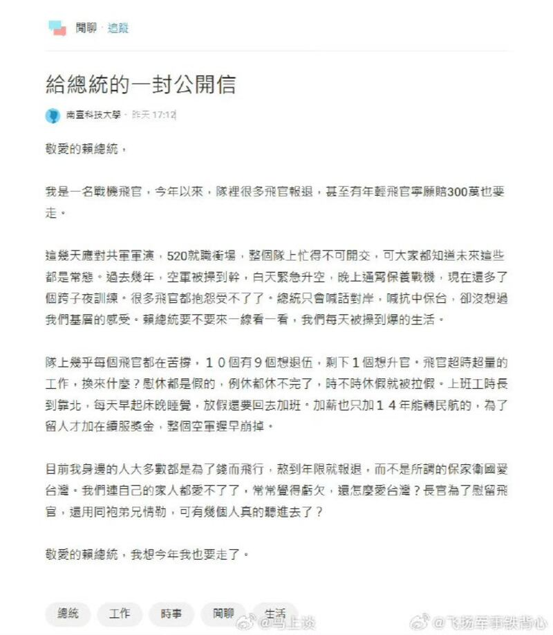
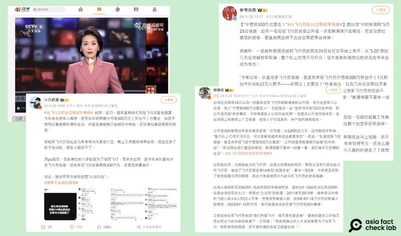
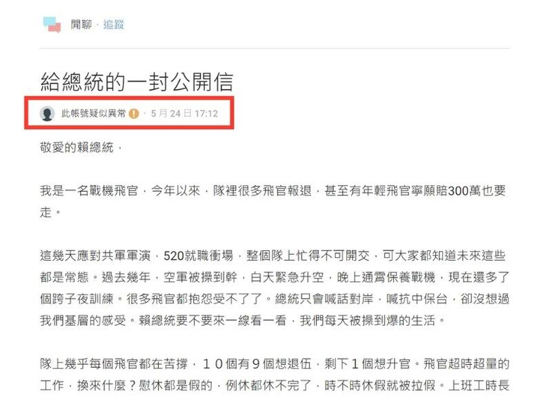

# 事實查覈｜臺灣空軍集體"報退"，飛行員"寧賠三百萬"也要走？

作者：艾倫

2024.06.11 16:06 EDT

## 查覈結果：缺乏證據

## 一分鐘完讀：

解放軍圍臺軍演期間，中文社交平臺上出現許多匿名批判臺灣軍隊的文章，其中引起較多討論的一篇是《給總統的一封公開信》，文章中作者自稱是空軍飛行員，抱怨民進黨政府堅持臺獨引來共軍擾臺，使得臺灣空軍任務繁重，今年以來已經有很多飛官報退，甚至有年輕飛官“寧願賠300萬也要走”。文章作者還稱軍中“10個有9個想退伍，剩下1個想升官”，空軍“遲早崩掉”，自己今年也要走了。

通過採訪軍事專家，查覈臺灣相關法規及判例，亞洲事實查覈實驗室發現該文所述有關賠償金、薪資福利等細節都與法規及現實案例有明顯差異，而發文者本身也是無法覈實身份的匿名信源，臺國防部質疑該帖爲“認知作戰”的不實信息。

## 深度分析：

5月24日,臺灣社交平臺Dcard上出現 [《給總統的一封公開信》](https://www.dcard.tw/f/talk/p/255644734),發佈者用戶名爲 "南臺科技大學" ,自稱 "一名戰機飛官" ,對臺灣空軍的工作壓力和待遇提出質疑,並稱今年他所在的隊裏很多飛官報退,他自己也想走。

《給總統的一封公開信》網頁截圖（臺灣社交平臺Dcard截圖）

該消息隨即不僅在臺灣媒體、社羣平臺廣傳,也傳到微博上。除了機構媒體如 [《參考消息》](https://weibo.com/2375086267/Og3zS5r5x?refer_flag=1001030103_)、 [央廣軍事](https://video.weibo.com/show?fid=1034:5038652070232113)外,微博"大V"如 [胡錫進](https://weibo.com/1989660417/Og66ADym2?refer_flag=1001030103_)、 [小凡好攝](https://weibo.com/1659893422/Og2lh10ws?refer_flag=1001030103_)等皆轉發了這一消息。

Dcard上"匿名飛官"的爆料文章被中國新聞媒體及自媒體博主轉傳（新浪博客截圖）

亞洲事實查覈實驗室對其“爆料”的軍隊相關事項進行了查證。

## 三百萬賠償金有根據嗎？

匿名文章第一段裏提到，今年已有許多飛官申請報退，其中不乏“寧賠三百萬臺幣也要離開”的年輕軍官。

文中提到“三百萬賠款”是否有依據？根據臺灣軍隊的制度，除少數“自費生”以外，軍校學生的食、衣、住、訓完全由公費支應，但相對的義務是服滿規定的役期，如果不滿最低役期就申請退伍，就必須賠還公費。

未滿役期退伍要賠還多少公費？臺灣國防部有一定的標準，但具體數字是依照軍兵種、服役期間和個人所受過的訓練種類各不相同。

亞洲事實查覈實驗室查閱臺灣行政法院的相關案例，從中可以看到賠償公費的具體數字。與空軍飛官比較相關的案例包括：

一、2021年8月,臺灣陸軍航空一名黃姓軍官,因被認定不適合繼續服役,提早八年退伍。依照規定他要 [賠還](https://judgment.judicial.gov.tw/FJUD/data.aspx?ty=JD&id=KSBA%2c109%2c%e8%a8%b4%2c75%2c20210831%2c1&ot=in)在陸軍官校、步校官分班、陸航飛行軍官班及陸航飛指部合格班所受的公費待遇津貼及訓練費用,共計臺幣974萬6827元。

二、另一件 [判例](https://judgment.judicial.gov.tw/FJUD/data.aspx?ty=JD&id=SCDA%2c111%2c%e7%b0%a1%2c1%2c20220512%2c3&ot=in)發生在2022年5月,一名楊姓空軍軍官申請提早退役,被判處應賠臺幣59萬3116元,比起其它案例金額極少。但細讀判決書會發現,她是軍校自費生,之後因爲飛行考覈未過改服地勤,所受飛行員訓練時數非常有限。在她申請退伍時並不是飛行員,再加上自費讀軍校,賠償金額和全公費生仍有差距,因此賠款較少。

陸軍退役少將郭力升接受亞洲事實查覈實驗室訪問時指出，賠償金額會因爲所駕駛機種不同，成本計算也大爲不同，因此並無標準答案。

“一般而言，只要完成飛行訓練班（教練機），獲頒飛行胸章（俗稱飛鷹），即是所謂的‘飛官’，但接下來還要區分機種，實施換裝訓練、戰術訓練、進階訓練等。”

也就是說，在不同時間、不同訓練下提前退伍的飛官，所受的公費待遇、津貼及訓練費用本就不同，適用的法律條文也不一定相同，算出來的賠償金額自然會有差異。

郭力升提到，以空軍爲例，機型包含各型戰鬥機、空運機、反潛機、預警機、電戰機、直升機等，而陸軍飛行員也區分攻擊、戰搜、通用、運輸等機種，不同機型所耗費成本都不相同，且飛機、設備還有折舊成本攤列，以及支援飛行訓練的消防、救護、戰管、氣象、修護、場站維護等人物力成本。

此外，飛官還有求生訓練、航空生理訓練等。郭力升估算，培養一位能執行作戰任務的飛官，其成本“絕對是上億”。

“三軍完成訓練的飛行人員，必須服完至少14年的基本役期，只要沒有服完，就得照章賠償公費，包含所支領的薪俸、服裝與訓練支出，而且是按照不同年資來計算，並不是人人都是賠償300萬可以走人，以我過去接觸的案例，未服完役期越長、賠償金額就越高。”郭力升說。

## 空軍必須服役滿14年才能加薪？

匿名文章裏也提到，空軍加薪也只加給“14年能轉民航的”，爲了留人才加“續服獎金”，並判斷“整個空軍遲早崩掉”。

查詢臺灣空軍官校的 [薪資福利網站](https://www.cafa.edu.tw/content/index.asp?Parser=1,9,111),會發現軍官的薪資包含本俸及各項加給,而各項加給包含專業加給、志願役加給、飛行加給及主管加給等。軍官的本俸待遇依照軍階不同所給付的薪資不同,並且"待遇調整以行政院覈定內容爲基準"。

郭力升指出，原文所說的“加薪”指的是服滿基本役期14年後，只要繼續留營續服現役，依照年資不同，每年可支領75-104萬不等的“續服獎金”，不能算是加薪，更不是唯一得到“加薪”的情況。

## 發文者是誰？

Dcard發文者賬號顯示該用戶使用的網名是"南臺科技大學",而根據臺媒 [ETtoday](https://www.ettoday.net/news/20240526/2746339.htm?from=fb_et_news_comment&fbclid=IwZXh0bgNhZW0CMTAAAR0hX5G4ayaaz8j0PSbd9soENkZTRkmforqlaZwviYSAye8No9kNGIpDI5o_aem_Ad80S8j2rQFKXAd8oKv9sUTuITOzRnvsT263PtY5u5g5j0IxlYii3KlXMhB-d5ExGsvkjhcHOigFu9rQzvtIbZ8K)報導,國安單位調查後發現,空軍現役飛官中"沒有人來自該大學"。

亞洲事實查覈實驗室5月27日再訪Dcard原文時，發現原文的賬號目前已被標示“異常”。

"匿名飛官"爆料文發文者目前已被平臺標註異常（Dcard截圖）

Dcard的回應提到，看板上文章發文者顯示爲“此賬號疑似異常”時，表示該賬號收到了系統的隨機抽選驗證，以避免賬號用不當手段完成驗證，或透過任何途徑取得他人的賬號。

Dcard團隊補充：“在收到使用者提交的驗證資料後，審覈團隊約需要 1 - 2 個工作天的時間進行審覈，若通過驗證即會恢復賬號使用權限。”

至6月7日截稿，該此賬號的異常狀態一直未消除。

## 國防部的回應

臺灣國防部在5月25日發佈新聞稿，稱該匿名公開信爲不實訊息，且“不排除是敵人認知作戰伎倆”。

空軍司令部強調，自109年起簽訂續服契約，每年簽約及離退人數均呈常態分佈，無異常現象。

因此，“公開信”中所述今年有“很多飛官報退”一事沒有依據。

*亞洲事實查覈實驗室（Asia Fact Check Lab）針對當今複雜媒體環境以及新興傳播生態而成立。我們本於新聞專業主義，提供專業查覈報告及與信息環境相關的傳播觀察、深度報道，幫助讀者對公共議題獲得多元而全面的認識。讀者若對任何媒體及社交軟件傳播的信息有疑問，歡迎以電郵afcl@rfa.org寄給亞洲事實查覈實驗室，由我們爲您查證覈實。*

*亞洲事實查覈實驗室在X、臉書、IG開張了,歡迎讀者追蹤、分享、轉發。X這邊請進:中文*  [*@asiafactcheckcn*](https://twitter.com/asiafactcheckcn)  *;英文:*  [*@AFCL\_eng*](https://twitter.com/AFCL_eng)  *、*  [*FB在這裏*](https://www.facebook.com/asiafactchecklabcn)  *、*  [*IG也別忘了*](https://www.instagram.com/asiafactchecklab/)  *。*

[Original Source](https://www.rfa.org/mandarin/shishi-hecha/hc-06112024155657.html)