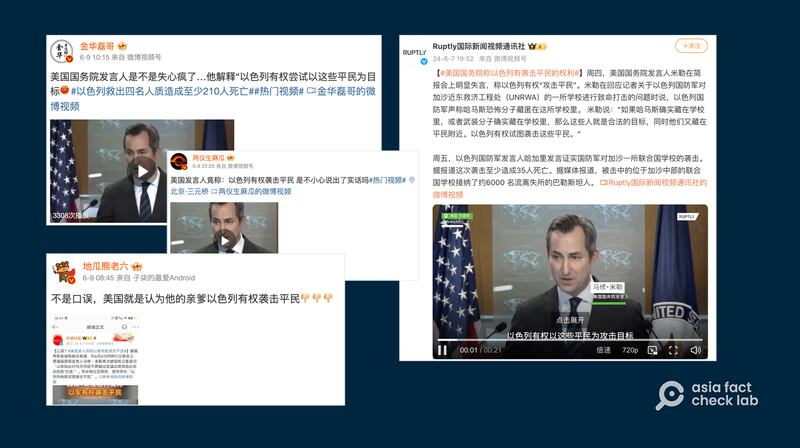
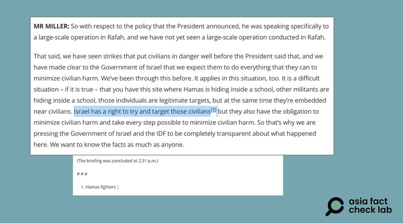

# 事實查覈｜美國發言人稱以色列有權攻擊平民？

作者：莊敬

2024.06.12 14:26 EDT

## 查覈結果：誤導

## 一分鐘完讀：

中英文社媒最近廣傳一則經剪輯的短視頻，內容是美國國務院發言人馬修∙米勒（Matthew Miller）在記者會上說：“以色列有權試圖以這些平民爲（攻擊）目標”，此言論引發媒體及社媒賬號大量轉發和抨擊。

經查，米勒確實在6月6日國務院記者會上講了這句話，但根據上下文，“平民”應爲“哈馬斯”的口誤。官方文字記錄已加註，說明米勒本意是指“哈馬斯武裝人員”而非平民。國務院也告訴亞洲事實查覈實驗室，米勒想說的是“哈馬斯”，不應忽視國務院在官方文字記錄上的註解。

## 深度分析：

近日,美國國務院發言人馬修.米勒在記者會上說:"以色列有權試圖以這些平民爲(攻擊)目標"的段視頻在中英文社交媒體上廣泛傳播,並引發熱議。轉發者包括俄羅斯媒體 ["Ruptly國際新聞視頻通訊社"](https://weibo.com/5108550554/OhVinoYTT)等,粉絲逾百萬的微博"大V"用戶 ["金華磊哥"](https://m.weibo.cn/detail/5043297795706241)還稱"美國國務院發言人是不是失心瘋了"。

多個微博賬號轉傳美國國務院發言人米勒稱“以色列有權試圖以這些平民爲（攻擊）目標”，但並未提及國務院已更正米勒口誤。圖取自新浪微博

經查,米勒在6月6日例行記者會上確實講了這句話。亞洲事實查覈實驗室在亞洲時間6月7日查詢國務院的 [記者會文字記錄](https://www.state.gov/briefings/department-press-briefing-june-06-2024/#post-563929-footnote-1),發現"target those civilians"這句話已加上注,註記爲"Hamas fighters",說明米勒本意是要說"哈馬斯武裝人員",而非平民。

而在說這句話之前，米勒說的是“美國已向以色列政府明確表示，希望他們盡一切努力減少平民傷害⋯⋯哈馬斯躲在學校裏，其他武裝人員躲在學校裏，這些人是合法的目標，但同時他們藏在平民附近。”

從米勒發言的前後文，可以知道他所指的“合法（攻擊）目標”爲哈馬斯武裝人員，但網傳短視頻僅剪輯米勒口誤的部分，並未呈現其完整說法，使他的話脫離了上下文。

美國國務院已在6月6日例行記者會文字記錄加註，表明發言人米勒本意指“哈馬斯武裝人員”，並非平民。圖取自美國國務院官網

事實上,在許多社媒賬號轉傳視頻之前,已有媒體注意到米勒的說法可能有問題,並詢問了美國國務院。根據土耳其媒體 [《安納杜魯新聞社》(Anadolu)](https://www.aa.com.tr/en/americas/us-says-israel-has-a-right-to-try-and-target-those-civilians-in-gaffe/3242592)於6月6日發佈(6月7日更新)的報道,國務院已說明米勒當時是口誤,本意是指"哈馬斯"而非平民。

然而，“Ruptly”“金華磊哥”等賬號轉傳時，卻未提及美國國務院已更正米勒口誤。“觀察者網”“看看新聞”等媒體轉發視頻時則有指出：“美國國務院隨後在文字實錄網頁上進行了‘勘誤’，辯稱米勒想表達的其實是‘以色列有權試圖襲擊哈馬斯武裝人員’。”

亞洲事實查覈實驗室詢問美國國務院，一名發言人回應，國務院發言人顯然是要說“哈馬斯”，也已在記者會文字記錄加註，忽略這一點是昧於事實的。

*亞洲事實查覈實驗室（Asia Fact Check Lab）針對當今複雜媒體環境以及新興傳播生態而成立。我們本於新聞專業主義，提供專業查覈報告及與信息環境相關的傳播觀察、深度報道，幫助讀者對公共議題獲得多元而全面的認識。讀者若對任何媒體及社交軟件傳播的信息有疑問，歡迎以電郵afcl@rfa.org寄給亞洲事實查覈實驗室，由我們爲您查證覈實。*

*亞洲事實查覈實驗室在X、臉書、IG開張了,歡迎讀者追蹤、分享、轉發。X這邊請進:中文*  [*@asiafactcheckcn*](https://twitter.com/asiafactcheckcn)  *;英文:*  [*@AFCL\_eng*](https://twitter.com/AFCL_eng)  *、*  [*FB在這裏*](https://www.facebook.com/asiafactchecklabcn)  *、*  [*IG也別忘了*](https://www.instagram.com/asiafactchecklab/)  *。*

[Original Source](https://www.rfa.org/mandarin/shishi-hecha/hc-06122024142130.html)