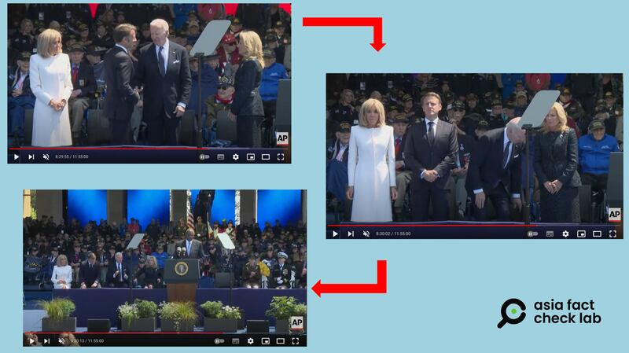
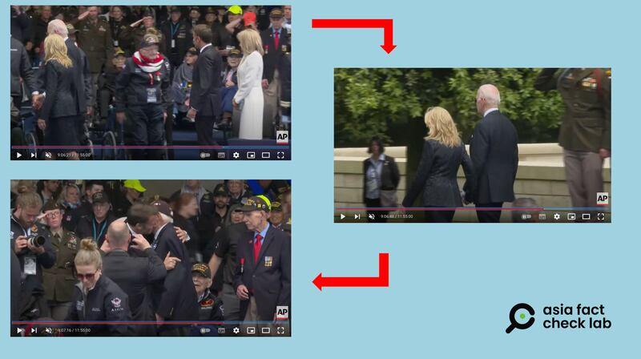

# 事實查覈｜拜登試圖坐在空氣上？

作者：董喆

2024.06.13 15:32 EDT

## 查覈結果：錯誤

## 一分鐘完讀：

6月6日，美國總統拜登在諾曼底參加紀念第二次世界大戰決勝戰役諾曼底登陸80週年的活動，X與微博上有多個賬號轉傳當時的影片，指拜登原本想要“坐在空氣上”，被夫人提醒後纔沒有坐下。中國外交官張和清亦轉貼此文“關心”拜登身體況狀。

亞洲事實查覈實驗室查證發現，儀式中拜登後方其實有座椅，且影片只截取了拜登坐下前的影像，事實上，隨後他與其他與會人員同時坐下，因此這是錯誤資訊。

## 深度分析：

近日,社交媒體X( [帖文1](https://twitter.com/Kunluntalk/status/1798703141338382378), [帖文2](https://twitter.com/Snofy8/status/1799292665454088338))和 [微博](https://weibo.com/6067139463/5042394537920687)上有多個賬號轉傳一則影片,影片中拜登彎腰伸手向後摸索,像是要找尋椅子坐下。發佈者評論稱"拜登今天的孱弱,就是美國當下的混滯",並稱"美國第一夫人,不得不掩嘴,輕輕的告訴拜登,你後面是空氣,沒有椅子… …"。

這些帖子及評論營造了拜登“神智不清”的形象，中國外交官張和清也轉傳了此則帖文，“關心”拜登身體健康。

亞洲事實查覈實驗室找到美聯社在YouTube上發佈的完整直播影片以及當日外電發表的活動照片，可以確認這段影片遭片面解讀，拜登身後的確有擺放椅子，並非空無一物，且拜登夫婦、法國總統馬克龍夫婦幾乎是同時坐下，但網傳影片剪掉了這部分。

根據美聯社直播影片" [80th anniversary of D-day live updates: Commemorative events underway across Europe](https://www.youtube.com/watch?v=QivRt_rD0TM&ab_channel=AssociatedPress)",在 [8:29:55秒處](https://www.youtube.com/live/QivRt_rD0TM?si=wubw7OuDt17ffUtb&t=30595),拜登先是與馬克龍握了手,接著8:30:59秒時拜登率先嚐試坐下,接著在8:30:08拜登夫婦與馬克龍夫婦一同坐下。

拜登在活動中從率先試圖坐下到最後四人一起坐下的過程。 （圖截取自 AP直播影片）

根據現場直播影片，臺上來賓幾乎同時坐下，只是拜登是四人中最早嘗試入座的人。

另外,微博賬號"臺灣那點事兒"稱,拜登"被妻子吉爾·拜登領下臺,獨留一臉茫然的法國總統馬克龍一人向諾曼底登陸老兵致敬"。但根據 [直播影片](https://www.youtube.com/live/QivRt_rD0TM?si=L5pQTbLZqzNGVLp4&t=32777)(9:06:17處),拜登夫婦先一步向老兵們致意並走下臺,接著馬克龍夫婦才接著與老兵們握手,並未獨留馬克龍一人。

拜登夫婦、馬克龍夫婦向老兵致意並相繼走下臺過程。（圖截取自 AP直播影片）

“臺灣那點事兒”僅剪輯拜登致意結束下臺後的片段並加以解讀，是在傳播誤導輿論的信息。

美國總統拜登因年事已高，其在公開場合的一舉一動頗受關注，其影音資料經常遭到剪輯加工和演繹，加深外界對拜登心智能力的疑慮。以下是亞洲事實查覈實驗室過去曾發佈的相關查覈報告：

[ [俄媒稱拜登"向隱形人致歉"，是真的嗎？Opens in new window](2023-04-19_事實查覈│俄媒稱拜登"向隱形人致歉"，是真的嗎？.md) ]

[ [拜登老糊塗又犯了？忘了兒孫有幾個人？Opens in new window](2024-03-26_事實查覈｜拜登老糊塗又犯了？忘了兒孫有幾人？.md) ]

[ [拜登稱自己在以色列出生？被質疑沒資格當美國總統？Opens in new window](2023-10-26_事實查覈｜拜登稱自己在以色列出生？被質疑沒資格當美國總統？.md) ]

[ [拜登競選演講後再次試圖"與鬼魂握手"？Opens in new window](2024-05-01_事實查覈 ｜ 拜登競選演講後再次試圖"與鬼魂握手"？.md) ]

[ [美國總統拜登又和"看不見的人"打招呼？Opens in new window](2023-07-28_事實查覈｜美國總統拜登又和"看不見的人"打招呼"？.md) ]

*亞洲事實查覈實驗室（Asia Fact Check Lab）針對當今複雜媒體環境以及新興傳播生態而成立。我們本於新聞專業主義，提供專業查覈報告及與信息環境相關的傳播觀察、深度報道，幫助讀者對公共議題獲得多元而全面的認識。讀者若對任何媒體及社交軟件傳播的信息有疑問，歡迎以電郵afcl@rfa.org寄給亞洲事實查覈實驗室，由我們爲您查證覈實。*

*亞洲事實查覈實驗室在X、臉書、IG開張了,歡迎讀者追蹤、分享、轉發。X這邊請進:中文*  [*@asiafactcheckcn*](https://twitter.com/asiafactcheckcn)  *;英文:*  [*@AFCL\_eng*](https://twitter.com/AFCL_eng)  *、*  [*FB在這裏*](https://www.facebook.com/asiafactchecklabcn)  *、*  [*IG也別忘了*](https://www.instagram.com/asiafactchecklab/)  *。*

[Original Source](https://www.rfa.org/mandarin/shishi-hecha/hc-06132024153247.html)